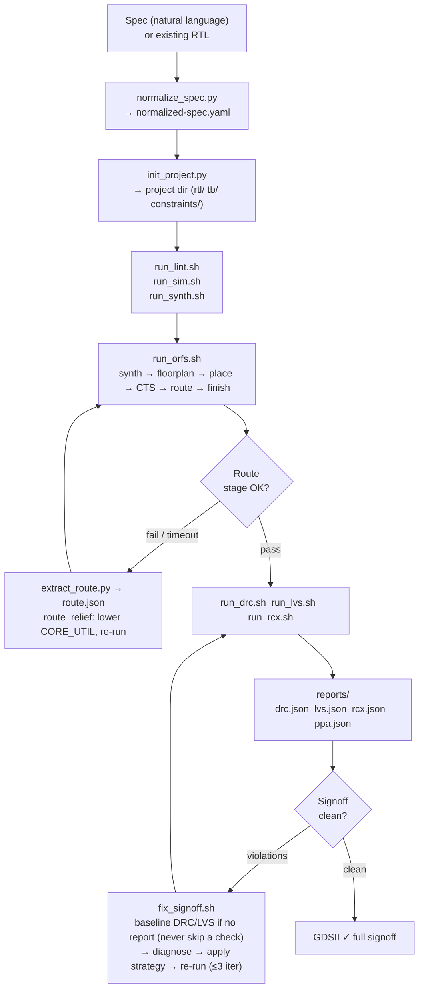
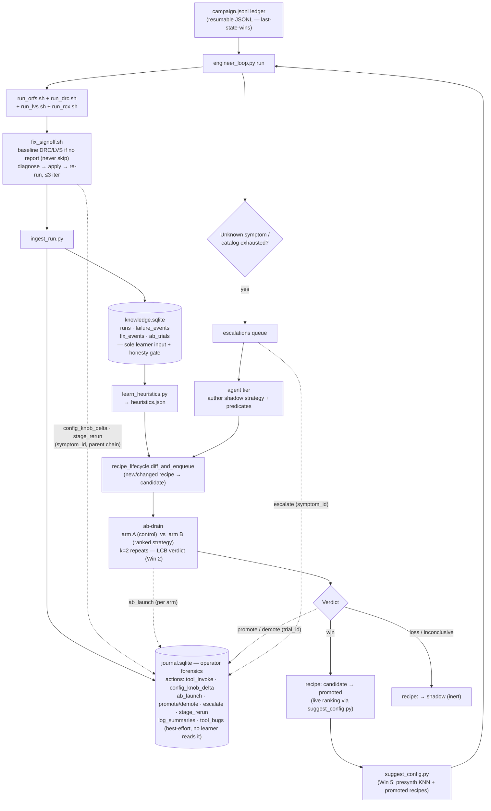

# agent-r2g

A Claude Code skill that drives an open-source RTL-to-GDS flow — from natural-language spec (or existing RTL) through synthesis, place-and-route, and full signoff (DRC, LVS, RCX) — using Yosys, OpenROAD-flow-scripts, KLayout, and OpenRCX.

Install the `r2g-skills` skills (`eda-install` to set up the toolchain, `rtl-acquire` to grow an RTL corpus at scale, `signoff-loop` for RTL→GDS + signoff, `def-graph` for graph datasets), then ask Claude: *"set up the EDA tools"* followed by *"synthesize this UART at 100 MHz on nangate45"* — it handles everything from provisioning to GDSII. Recent changes: see [CHANGELOG.md](CHANGELOG.md).

---

## Prerequisites

| Tool | Required | Purpose |
|------|----------|---------|
| Python 3.10+ | yes | skill scripts |
| Yosys | yes | synthesis |
| iverilog / vvp | yes | simulation |
| OpenROAD + ORFS | yes | place & route, RCX |
| Verilator | optional | faster lint |
| KLayout | optional | GDS viewer, DRC, LVS |
| Magic + Netgen | optional | sky130 DRC / LVS |
| OpenSTA | optional | standalone STA |
| sky130A PDK | optional | sky130 signoff |
| torch + torch_geometric + pandas | optional | PyG graph datasets (`run_graphs.sh`; venv on /proj, `R2G_GRAPH_PYTHON`) |

---

## Install the skill

```bash
git clone https://github.com/ShenShan123/agent-r2g.git
cd agent-r2g
bash r2g-skills/install.sh --user   # installs eda-install + rtl-acquire + signoff-loop + def-graph into ~/.claude/skills/
```

Restart Claude Code (or run `/reload`) after install.

**Other options:**

```bash
bash r2g-skills/install.sh --user            # global — available in every Claude Code session (default)
bash r2g-skills/install.sh --project .       # local  — scoped to the current project directory
bash r2g-skills/install.sh --link --user     # symlink — edits are picked up without reinstalling
bash r2g-skills/install.sh --force --user    # overwrite an existing install
bash r2g-skills/install.sh --uninstall       # remove all sub-skills
```

**Installing from the skill collection directory alone** (no full repo clone needed):

```bash
cd r2g-skills
./install.sh --user
```

---

## Configure the OpenROAD toolchain

The skill autodetects every tool on first use. No `source` or `export` is required if your tools land in standard locations. Use `check_env.sh` to see exactly what was found (see [Verify](#verify-the-setup)).

**Quick start — let the `eda-install` skill detect your machine and provision the toolchain:**

```bash
bash r2g-skills/bootstrap.sh --dry-run     # detect tools + PDK + torch venv → per-tier plan, install nothing
```

This is a shim to the dedicated **`eda-install`** sub-skill (`r2g-skills/eda-install/bootstrap.sh`) —
in a Claude Code session you can just say *"set up the EDA tools"*. It reports what's present vs
missing and, without root, automatically selects a **no-sudo path** (pre-built conda `litex-hub`
binaries + a torch venv on a big volume — never a full `$HOME`). Drop `--dry-run` to install the
missing tiers and auto-generate `references/env.local.sh`; add `--prefix /big/volume` to steer where
the PDK and venv land. The manual paths below remain available if you prefer to install by hand.

Choose the path that matches your situation.

---

### Path A — Shared EDA server with a pre-built toolchain (fastest)

If `/opt/openroad_tools_env.sh` exists (e.g. a shared EDA workstation), the skill sources it automatically. Jump straight to [Verify](#verify-the-setup).

---

### Path B — Build ORFS from source (recommended for a clean Linux install)

OpenROAD-flow-scripts builds its own `openroad` and `yosys`, so one clone gives you the whole flow.

**1. System packages** (run once as root — Debian / Ubuntu):

```bash
sudo apt update
sudo apt install build-essential cmake git python3 python3-pip \
     iverilog klayout tcl-dev libboost-dev flex bison
```

For RHEL / Fedora / CentOS, replace `apt` with `dnf` / `yum` and adjust package names accordingly.

**2. Clone and build ORFS** (~30 min on 8 cores):

```bash
git clone --recursive https://github.com/The-OpenROAD-Project/OpenROAD-flow-scripts \
    ~/OpenROAD-flow-scripts
cd ~/OpenROAD-flow-scripts
sudo ./etc/DependencyInstaller.sh   # installs remaining build deps
./build_openroad.sh --local         # builds openroad + yosys under tools/install/
```

After the build, the skill autodetects both binaries from `$ORFS_ROOT/tools/install/` if you set `ORFS_ROOT`. Do that in `env.local.sh` (one line):

```bash
cp ~/.claude/skills/signoff-loop/references/env.local.sh.template \
   ~/.claude/skills/signoff-loop/references/env.local.sh

# Add this one line to env.local.sh:
echo 'export ORFS_ROOT="$HOME/OpenROAD-flow-scripts"' \
  >> ~/.claude/skills/signoff-loop/references/env.local.sh
```

---

### Path C — OSS-CAD-Suite + separate OpenROAD binary

OSS-CAD-Suite provides pre-built Yosys, iverilog, and Verilator. Pair it with a pre-built OpenROAD binary (from the OpenROAD releases page or your distro).

```bash
# Download OSS-CAD-Suite (check https://github.com/YosysHQ/oss-cad-suite-build for latest tag)
curl -LO https://github.com/YosysHQ/oss-cad-suite-build/releases/latest/download/oss-cad-suite-linux-x64.tgz
tar -xf oss-cad-suite-linux-x64.tgz -C "$HOME"        # extracts to ~/oss-cad-suite

# Install OpenROAD binary (Debian / Ubuntu)
sudo apt install openroad

# Clone ORFS for the flow Makefile (no build needed here)
git clone --recursive https://github.com/The-OpenROAD-Project/OpenROAD-flow-scripts \
    ~/OpenROAD-flow-scripts
```

Then set all paths in `env.local.sh`:

```bash
export ORFS_ROOT="$HOME/OpenROAD-flow-scripts"
export YOSYS_EXE="$HOME/oss-cad-suite/bin/yosys"
export IVERILOG_EXE="$HOME/oss-cad-suite/bin/iverilog"
export VVP_EXE="$HOME/oss-cad-suite/bin/vvp"
export VERILATOR_EXE="$HOME/oss-cad-suite/bin/verilator"
export OPENROAD_EXE="/usr/bin/openroad"
export KLAYOUT_CMD="/usr/bin/klayout"
```

---

### `env.local.sh` — full reference

The file lives at `~/.claude/skills/signoff-loop/references/env.local.sh`. Copy it from the template and edit:

```bash
cp ~/.claude/skills/signoff-loop/references/env.local.sh.template \
   ~/.claude/skills/signoff-loop/references/env.local.sh
```

All keys are optional — uncomment only the lines that the autodetect gets wrong.

```bash
# ── ORFS checkout ─────────────────────────────────────────────────────────────
# Required. Must contain flow/Makefile. Set this and everything else is found.
export ORFS_ROOT="$HOME/OpenROAD-flow-scripts"

# ── Required tool binaries ────────────────────────────────────────────────────
# Autodetected from $ORFS_ROOT/tools/install/, $PATH, and well-known paths.
# Uncomment only if autodetect picks the wrong binary.
# export OPENROAD_EXE="$ORFS_ROOT/tools/install/OpenROAD/bin/openroad"
# export YOSYS_EXE="$ORFS_ROOT/tools/install/yosys/bin/yosys"
# export IVERILOG_EXE="/usr/bin/iverilog"
# export VVP_EXE="/usr/bin/vvp"

# ── Optional tool binaries ────────────────────────────────────────────────────
# export VERILATOR_EXE="/usr/local/bin/verilator"
# export KLAYOUT_CMD="/usr/bin/klayout"
# export MAGIC_EXE="/usr/bin/magic"
# export NETGEN_EXE="/usr/bin/netgen-lvs"
# export STA_EXE="/usr/local/bin/opensta"

# ── PDK root (sky130 DRC/LVS with Magic / Netgen only) ────────────────────────
# export PDK_ROOT="$HOME/pdks"     # must contain sky130A/
```

The file is sourced automatically by every flow script. Alternatively, point to a file anywhere on disk:

```bash
export R2G_ENV_FILE=/path/to/your-env.sh   # add to ~/.bashrc or ~/.zshrc
```

**Autodetected locations** (checked in order if the variable is not set):

| Variable | Checked paths (first hit wins) |
|----------|-------------------------------|
| `ORFS_ROOT` | `$HOME/OpenROAD-flow-scripts`, `/opt/OpenROAD-flow-scripts`, `/opt/EDA4AI/OpenROAD-flow-scripts`, sibling of skill dir |
| `OPENROAD_EXE` | `$ORFS_ROOT/tools/install/OpenROAD/bin/openroad`, `/usr/local/bin/openroad`, `/usr/bin/openroad` |
| `YOSYS_EXE` | `$ORFS_ROOT/tools/install/yosys/bin/yosys`, `/opt/pdk_klayout_openroad/oss-cad-suite/bin/yosys`, `/usr/local/bin/yosys`, `/usr/bin/yosys` |
| `IVERILOG_EXE` | `/opt/pdk_klayout_openroad/oss-cad-suite/bin/iverilog`, `/usr/bin/iverilog` |
| `VVP_EXE` | `/opt/pdk_klayout_openroad/oss-cad-suite/bin/vvp`, `/usr/bin/vvp` |
| `KLAYOUT_CMD` | `/usr/local/bin/klayout`, `/usr/bin/klayout` |
| `MAGIC_EXE` | `/usr/local/bin/magic`, `/usr/bin/magic` |
| `NETGEN_EXE` | `netgen-lvs` or `netgen` on `$PATH`, `/usr/bin/netgen-lvs`, `/usr/local/bin/netgen` |
| `STA_EXE` | `sta` or `opensta` on `$PATH`, `/usr/local/bin/opensta`, `/usr/bin/opensta` |
| `PDK_ROOT` | `/opt/pdks`, `$HOME/pdks`, `/usr/local/share/pdks` |

---

### Installing the signoff toolchain without sudo (Miniconda)

If `iverilog`/`vvp`, `magic`, `netgen`, or the sky130A PDK are missing and you do not have
root, install them at user level from the [litex-hub](https://anaconda.org/litex-hub) channel:

```bash
# 1. Miniconda (user-level, no sudo)
curl -sL -o /tmp/miniconda.sh https://repo.anaconda.com/miniconda/Miniconda3-latest-Linux-x86_64.sh
bash /tmp/miniconda.sh -b -p "$HOME/miniconda3"

# 2. Tools — note --override-channels (the conda 'defaults' channel now requires
#    interactive Terms-of-Service acceptance and will abort a non-interactive create).
"$HOME/miniconda3/bin/conda" create -y -n eda --override-channels \
    -c litex-hub -c conda-forge  magic netgen iverilog

# 3. sky130A PDK (~8GB extracted; put it on a volume with space, NOT a full $HOME).
#    The package installs the tree under <prefix>/share/pdk/sky130A. If $HOME is small,
#    extract the cached tarball to a big volume instead and point PDK_ROOT there:
"$HOME/miniconda3/bin/conda" install -y -n eda --override-channels \
    -c litex-hub -c conda-forge  open_pdks.sky130a
```

Then pin the paths in `references/env.local.sh`:

```bash
_eda="$HOME/miniconda3/envs/eda/bin"
export IVERILOG_EXE="$_eda/iverilog"
export VVP_EXE="$_eda/vvp"
export MAGIC_EXE="$_eda/magic"
export NETGEN_EXE="$_eda/netgen"
export PDK_ROOT="$HOME/miniconda3/envs/eda/share/pdk"   # or wherever sky130A/ lives
```

(Avoid `volare` for the PDK behind a SOCKS proxy: its `httpx` client needs the `socksio`
package and the GitHub release API rate-limits unauthenticated listing — the conda
`open_pdks.sky130a` package sidesteps both.)

---

### Verify the setup

```bash
bash ~/.claude/skills/signoff-loop/scripts/flow/check_env.sh
```

Expected output when all required tools are found:

```
[ORFS]
ok   ORFS_ROOT      /home/you/OpenROAD-flow-scripts
ok   FLOW_DIR       /home/you/OpenROAD-flow-scripts/flow
skip PDK_ROOT       (optional, not found)
skip SKY130A_DIR    (optional, not found)

[required tools]
ok   OPENROAD_EXE   /home/you/OpenROAD-flow-scripts/tools/install/OpenROAD/bin/openroad
ok   YOSYS_EXE      /home/you/OpenROAD-flow-scripts/tools/install/yosys/bin/yosys
ok   IVERILOG_EXE   /usr/bin/iverilog
ok   VVP_EXE        /usr/bin/vvp
ok   python3        /usr/bin/python3

[optional tools]
ok   KLAYOUT_CMD    /usr/bin/klayout
skip VERILATOR_EXE  (optional, not found)
skip MAGIC_EXE      (optional, not found)
skip NETGEN_EXE     (optional, not found)
skip STA_EXE        (optional, not found)
skip gtkwave        (optional, not found)

[platforms]
ok    nangate45
ok    sky130hd
ok    sky130hs
ok    asap7
ok    gf180
ok    ihp-sg13g2
```

**All required lines must show `ok` before running a flow.** Optional `skip` lines are fine — nangate45 (the default platform) only needs the required tools and KLayout.

Common fixes:

| Symptom | Fix |
|---------|-----|
| `MISS ORFS_ROOT` | Set `ORFS_ROOT` in `env.local.sh` pointing to your ORFS clone |
| `MISS OPENROAD_EXE` | Add `OPENROAD_EXE` to `env.local.sh`, or run `build_openroad.sh --local` first |
| `MISS YOSYS_EXE` | Same as OpenROAD — built together by `build_openroad.sh` |
| `MISS IVERILOG_EXE` | `sudo apt install iverilog` (or set `IVERILOG_EXE` in `env.local.sh`) |
| `MISS python3` | `sudo apt install python3` |
| Platforms list empty | `ORFS_ROOT` set but `flow/platforms/` not present — check ORFS clone is complete |

---

## First use

With tools verified, open any Claude Code session and ask something like:

> *"Take this RTL through to GDS on nangate45"*
> *"Synthesize this UART at 100 MHz"*
> *"Run DRC and LVS on my design"*
> *"Generate a simple arbiter and produce a GDS"*

Claude matches these requests to the `signoff-loop` skill and drives every stage — spec normalization, RTL generation, lint, simulation, synthesis, place-and-route, timing gate, and signoff. Optional ML dataset extraction (label/feature CSVs and training-ready PyG graphs) from the signed-off result is handled by the companion `def-graph` skill — which refuses to build a dataset on a design that is not signed off (the automatic signoff gate; `R2G_SIGNOFF_GATE=warn` overrides with the reasons recorded in the manifest). Corpus-scale RTL acquisition and synth-only netlist graphs are the `rtl-acquire` skill; its `scripts/promote/promote_candidates.py` promotes a synth-proven candidate into a ready-to-run signoff-loop full-flow project in one command.

The skill works from **existing RTL** (drop your file into `rtl/design.v`) or from a **natural-language spec** (Claude writes the RTL for you).

---

## EDA Flow

End-to-end pipeline from a natural-language spec (or existing RTL) to a fully signed-off GDSII:



Key scripts involved:

| Stage | Script | Output |
|-------|--------|--------|
| Normalize | `scripts/project/normalize_spec.py` | `input/normalized-spec.yaml` |
| Init | `scripts/project/init_project.py` | project directory scaffold |
| Lint / Sim / Synth | `scripts/flow/run_{lint,sim,synth}.sh` | `lint/` `sim/` `synth/` |
| Place & Route | `scripts/flow/run_orfs.sh` | `backend/RUN_*/results/6_final.{gds,odb}` |
| Route abort check | `scripts/extract/extract_route.py` | `reports/route.json` |
| Signoff | `scripts/flow/run_{drc,lvs,rcx}.sh` | `reports/{drc,lvs,rcx}.json` |
| PPA extract | `scripts/extract/extract_ppa.py` | `reports/ppa.json` |
| Timing gate | `scripts/reports/check_timing.py` | pass / minor-fix / escalate |
| Signoff fix | `scripts/flow/fix_signoff.sh` | `reports/fix_log.jsonl` |
| Dataset labels (Y) | `scripts/flow/run_labels.sh` | `labels/*.csv` (congestion · wirelength · timing · irdrop · RC parasitics from SPEF) + `reports/labels_stats.json` |
| Dataset features (X) | `scripts/flow/run_features.sh` | `features/*.csv` + `reports/features_stats.json` |
| PyG graph datasets | `scripts/flow/run_graphs.sh` | `dataset/{b..f}_graph.pt` (`HeteroData` by default; `R2G_GRAPH_KIND=homo` for the flat format), `netlist_graph.pt`, `graph_manifest.json` |

---

## Closed Learning Loop & `engineer_loop`

**Every run teaches the skill.** Two memory databases record all experience; `engineer_loop.py`
drives the full cycle unattended.

### Two memory databases

| Database | Role | Tracked in git |
|----------|------|---------------|
| `knowledge/knowledge.sqlite` | What *resulted* — `runs`, `failure_events`, `run_violations`, `fix_events`, `fix_trajectories`, `symptoms`, `lessons`, `config_lineage`, `ab_trials`, `recipe_status` | **yes** (ships pre-trained) |
| `knowledge/journal.sqlite` | What was *done* and why — the comprehensive decision + telemetry ledger: `actions` (`tool_invoke`, `config_knob_delta`, `stage_rerun`, `ab_launch`, `promote`/`demote`, `escalate` — symptom- and trial-linked), `log_summaries`, `tool_bugs` | no (local evidence) |

> The journal is **operator forensics only** — best-effort writes, gitignored, and read by **no** learner. `knowledge.sqlite` stays the sole learner input and the only honesty-gate source (the firewall). Decision-journaling (A/B launches, promotions/demotions, escalations, stage reruns, with `symptom_id`/`parent_action_id` linkage) lets `observe.py trace` answer "what was tried for symptom X, and how did it resolve?" forward of the change.

### Autonomous campaign driver

`scripts/loop/engineer_loop.py` drives the wheel unattended: pull design → flow → signoff fix →
ingest → learn → A/B gate → promote/demote → escalate unknowns.



### Recipe lifecycle states

```
shadow  ──(Gate A: learner enqueues)──►  candidate  ──(A/B win)──►  promoted
                                                     ◄──(A/B loss)── shadow
```

Gate A fires automatically every time `learn_heuristics.learn()` runs (batch or loop).
Gate B (seeding the dense-reward gradient) is an operator procedure — see `references/engineer-loop.md`.

### Loop-closure correctness (2026-06-24 audit)

An adversarial audit found the loop was **DEGRADED**: it recorded fixes and ran A/B trials but
**never promoted a nangate45 recipe** (`promoted` flat at 2, both sky130hd, across 8 waves). Root
cause: A/B arm dirs inherited the subject's *clean* `reports/`, so `process_one` marked each arm
clean **before the fixer ran** — both arms did byte-identical work and the verdict was wall-clock
noise. Eight fixes (TDD, two adversarial review rounds) closed it; the first **nangate45 promotion
ever** (`antenna_diode_repair`, a robust cost win) followed live. Key invariants now enforced:

- A/B arm copytree excludes `reports/`; a signoff `ab_arm` always runs `_run_fix` (arms genuinely diverge).
- The success-tie cost tiebreak is **variance-aware** (no win/loss flips on jitter; `se==0` = maximal confidence).
- Incomplete arms **escalate** instead of ingesting junk `orfs_status='unknown'` rows that poison verdicts.
- FLW-0024 die-resize recoveries are recorded as `fix_events` (visible to learning).
- `design_class` size band is stable across re-ingest (no candidate respawn).

Known follow-ups: the A/B arm router exercises only **DRC/LVS + route** recipes — **timing/place**
recipes (period_relax, core_util) are inert in A/B until the router is extended. Full detail:
`references/failure-patterns.md` ("Learning-Loop Closure Failures") and
`docs/superpowers/plans/r2g-loop-closure-audit-2026-06-23.md`.

### Paper-absorption wins (branch `feat/paper-absorption`)

Six capability improvements derived from published AI-EDA literature, all A/B-gated:

| Win | Feature | Default |
|-----|---------|---------|
| **Win 1** | `outcome_score` — dense reward with Violation-Reduction Rate term; replaces pass/fail binary | on |
| **Win 2** | Variance-aware (LCB, k=2) A/B verdict — one lucky run cannot promote a recipe | on |
| **Win 3** | r2g-bench held-out checkpoint — `eval_heuristics.py bench` measures recipe quality on unseen designs | on |
| **Win 4** | Vision-assisted DRC diagnosis — screenshot → Claude analysis → targeted fix | `R2G_VISION_DRC=1` |
| **Win 5** | Pre-synthesis KNN retrieval — `suggest_config.py` finds the k nearest neighbours by pre-route features | on |
| **Win 6** | Backend-aware synthesis retune — shadow recipe that lowers synth effort when route congests | shadow |

**Route relief (route-abort as a first-class signal):** `extract_route.py` gives the fix loop
visibility into detailed-route stage failures (congestion abort, wall-clock timeout). The
`route_relief` strategy lowers `CORE_UTILIZATION`, re-runs from floorplan, and clears the
congestion that would otherwise produce a silent backend abort. Validated on 18/25 sky130hd
route-congestion designs (route-fails 33→15 across the corpus).

CLI buttons:

```bash
# Fire A/B trials for pending candidates (drain the Gate A queue)
python3 scripts/loop/engineer_loop.py ab-drain \
    --ledger design_cases/_batch/ab.jsonl [--n-designs 2]

# Parallel A/B arm flows (cap NUM_CORES so N×cores ≈ host cores)
R2G_AB_WORKERS=4 python3 scripts/loop/engineer_loop.py ab-drain ...

# Force a grandfathered recipe into candidate for explicit re-validation
python3 scripts/loop/engineer_loop.py ab-enqueue \
    --symptom <sid> --design-class crypto/small \
    --platform sky130hd --strategy density_relief
```

---

## Repository layout

```
agent-r2g/
├── r2g-skills/                        # ★ The skill collection — install into ~/.claude/skills/
│   ├── install.sh                     #   Installs all three sub-skills (symlink/copy)
│   ├── bootstrap.sh                   #   Shim → eda-install/bootstrap.sh (one-command setup)
│   ├── eda-install/                   # SKILL 0 — detect + install + verify the EDA toolchain
│   │   ├── SKILL.md                   #     detect → plan → install → pin env.local.sh → verify
│   │   ├── bootstrap.sh               #     Orchestrator (--dry-run plans; --yes installs; no-sudo default)
│   │   └── scripts/{setup,flow}/      #     detect_env.sh · write_env_local.sh · _env.sh · check_env.sh
│   ├── signoff-loop/                  # SKILL 1 — RTL→GDS flow + signoff + self-improvement loop
│   │   ├── SKILL.md                   #   Claude Code entry point (metadata + workflow)
│   │   ├── scripts/
│   │   │   ├── flow/                  #   Stage runners: lint/sim/synth/orfs/drc/lvs/rcx + _env.sh
│   │   │   │   ├── fix_signoff.sh     #     Diagnose → apply strategy → re-run loop (≤3 iter)
│   │   │   │   └── orfs_hooks/        #     Tcl sourced into ORFS stages (PRE/POST_<STAGE>_TCL)
│   │   │   ├── extract/               #   Parse tool output → JSON (extract_ppa/drc/lvs/rcx/route)
│   │   │   │   ├── report_io.py       #     Shared JSON writer for the signoff extractors
│   │   │   │   └── presynth.py        #     Pre-synthesis KNN feature extractor (Win 5)
│   │   │   ├── project/               #   init / normalize / validate
│   │   │   ├── reports/               #   Timing gate, diagnosis, Fmax search, history
│   │   │   └── dashboard/             #   GDS preview + multi-project HTML dashboard
│   │   ├── knowledge/                 #   Cross-run memory (ships pre-trained, tracked in git)
│   │   │   ├── knowledge.sqlite       #     runs · failure_events · fix_events · ab_trials · …
│   │   │   ├── heuristics.json        #     Learned per-symptom repair recipes (Tier-3)
│   │   │   ├── ingest_run.py · learn_heuristics.py · ab_runner.py · suggest_config.py
│   │   │   └── escalations.py         #     Open escalation records for the agent tier
│   │   ├── references/                #   Failure patterns, engineer-loop runbook, PPA guide, …
│   │   ├── assets/                    #   config.mk / constraint.sdc templates + platform rule decks
│   │   └── tests/                     #   pytest suite (signoff-loop)
│   └── def-graph/                     # SKILL 2 — graph datasets from signed-off DEF/LEF/SPEF
│       ├── SKILL.md                   #   Labels → features → PyG graphs (b–f, HeteroData default)
│       ├── scripts/
│       │   ├── flow/                  #   run_labels/run_features/run_graphs + resolve_platform_paths + _env.sh
│       │   └── extract/
│       │       ├── techlib/           #     Per-platform tech/LEF/liberty/DEF parser
│       │       ├── labels/            #     Y: congestion · wirelength · timing · irdrop · RC parasitics
│       │       ├── features/          #     X: nodes_* · edges_* · metadata
│       │       └── graph/             #     PyG b–f variants + netlist graph (run_graphs.sh)
│       ├── references/                #   graph-dataset · feature-extraction · label-extraction
│       └── tests/                     #   pytest suite (def-graph)
├── .claude-plugin/plugin.json         #   Claude Code plugin manifest (name: r2g-skills)
├── tools/                             #   Batch orchestration helpers (not part of skill install)
│   ├── setup_rtl_designs.py           #     Scaffold design_cases/ from an RTL catalog
│   ├── batch_orfs_only.sh · batch_flow.sh · fix_orfs_failures.py
│   ├── mk_sky130_project.py           #     Source project → sky130hd materializer
│   └── verify_graph_dataset.py        #     Independent dataset verifier (def-graph)
└── CLAUDE.md                          #   Project instructions for this repo
```

Everything under `r2g-skills/` is what gets installed (as three skills, `eda-install` + `signoff-loop` + `def-graph`). Everything outside it (`tools/`, `rtl_designs*/`, `design_cases/`) is workspace used to validate the skills at scale.

---

## Manual CLI usage

The scripts work directly without Claude Code. Example for an existing counter RTL:

```bash
SKILL=~/.claude/skills/signoff-loop
PROJ=design_cases/my_counter

# Scaffold
python3 $SKILL/scripts/project/init_project.py my_counter
cp my_counter.v  $PROJ/rtl/design.v
cp tb_counter.v  $PROJ/tb/testbench.v
cp $SKILL/assets/config-template.mk       $PROJ/constraints/config.mk
cp $SKILL/assets/constraint-template.sdc  $PROJ/constraints/constraint.sdc
# edit DESIGN_NAME, VERILOG_FILES, clk_port_name to match your RTL

# Frontend
bash    $SKILL/scripts/flow/run_lint.sh  $PROJ/rtl/design.v  $PROJ/lint/lint.log
bash    $SKILL/scripts/flow/run_sim.sh   $PROJ/rtl/design.v  $PROJ/tb/testbench.v  $PROJ/sim
bash    $SKILL/scripts/flow/run_synth.sh $PROJ/rtl/design.v  my_counter  $PROJ/synth

# Backend (place & route → GDS)
bash    $SKILL/scripts/flow/run_orfs.sh  $PROJ  nangate45

# Timing gate — auto-fixes minor violations; stops for moderate/severe
python3 $SKILL/scripts/extract/extract_ppa.py   $PROJ  $PROJ/reports/ppa.json
python3 $SKILL/scripts/reports/check_timing.py  $PROJ

# (optional) Fmax search — fastest closing period via cheap place-stage probes
# Reports a predicted-signoff proxy in $PROJ/reports/fmax_search.json (--verify confirms with one full flow)
python3 $SKILL/scripts/reports/fmax_search.py   $PROJ  nangate45

# Signoff
bash    $SKILL/scripts/flow/run_drc.sh  $PROJ  nangate45
bash    $SKILL/scripts/flow/run_lvs.sh  $PROJ  nangate45
bash    $SKILL/scripts/flow/run_rcx.sh  $PROJ  nangate45

# (optional) ML dataset: label/feature CSVs + training-ready PyG graphs
# run_graphs.sh auto-runs the labels/features stages when their CSVs are stale.
# Needs a torch venv (install on /proj, never $HOME):
#   python3 -m venv /proj/<you>/pyenvs/r2g-graph
#   .../pip install torch --index-url https://download.pytorch.org/whl/cpu
#   .../pip install torch_geometric pandas
R2G_GRAPH_PYTHON=/proj/<you>/pyenvs/r2g-graph/bin/python \
bash    $SKILL/scripts/flow/run_graphs.sh  $PROJ  nangate45
# -> $PROJ/dataset/{b..f}_graph.pt (HeteroData by default; R2G_GRAPH_KIND=homo|both),
#    netlist_graph.pt, graph_manifest.json
```

A worked example: `r2g-skills/signoff-loop/assets/examples/simple-arbiter/`.

---

## Batch mode

`tools/` drives the skill across hundreds of designs in parallel. It is **not** installed with the skill — clone the full repo to use it.

```bash
# 1. Scaffold design_cases/ from an RTL catalog in rtl_designs/
python3 tools/setup_rtl_designs.py

# 2. Run ORFS across all projects (8-way parallel, 2 h per-stage timeout)
bash tools/batch_orfs_only.sh 8 7200

# 3. Classify failures and rewrite config.mk automatically
python3 tools/fix_orfs_failures.py

# 4. Retry failures
DESIGNS_LIST=failed.txt bash tools/batch_orfs_only.sh 8 7200
```

`fix_orfs_failures.py` handles six failure patterns: wrong top module, `SYNTH_MEMORY_MAX_BITS` overflow, IO pin overflow, place density overflow, PDN strap width, and stage timeout. Full catalog: `r2g-skills/signoff-loop/references/failure-patterns.md`.

---

## Platform support

| Platform | KLayout DRC | KLayout LVS | Magic DRC | Netgen LVS | OpenRCX |
|----------|-------------|-------------|-----------|------------|---------|
| `nangate45` | yes | yes | — | — | yes |
| `sky130hd` | yes | yes | yes | yes | yes |
| `sky130hs` | yes | yes | yes | yes | yes |
| `asap7` | yes | — | — | — | yes |
| `gf180` | yes | yes | — | — | yes |
| `ihp-sg13g2` | yes | yes | — | — | yes |

LVS gracefully skips for platforms without `.lylvs` rules (reports `status: "skipped"`).

On sky130, **Netgen LVS is the production path** (the bundled KLayout sky130 rule cannot
reconcile flat-transistor extraction). `run_netgen_lvs.sh` handles antenna-diode designs
automatically (Magic's diode X-subcircuit → D-device normalization) and classifies any
mismatch (`top_pin_mismatch` / `netgen_topology` / `generic`). Designs with port-to-port
`assign` feedthroughs additionally need the `buffer_port_feedthroughs.tcl` stage hook in
config.mk — see `r2g-skills/signoff-loop/SKILL.md` ("Netgen LVS") and
`references/failure-patterns.md` ("sky130 LVS").

---

## Validated scale

The skills have been validated on **682 RTL designs** spanning ICCAD benchmarks, RISC-V cores, BOOM/Chipyard, VTR, zipcpu, verilog-ethernet, wb2axip, and more. The test suite covers **1,390 tests** (pytest, as of 2026-07-16; run per-skill — `signoff-loop` 878, `def-graph` 420, `rtl-acquire` 63, `eda-install` 29), including an end-to-end synthetic corner-case suite that drives the real feature/label/graph extractors and asserts all five PyG graph views (b–f) against hand-derived ground truth. The five views are emitted as `HeteroData` by default (per-type node stores + `(src,relation,dst)` edge stores; `R2G_GRAPH_KIND=homo` for the legacy flat tensors); the verified homogeneous form remains the internal source of truth and the verifier reconstructs it independently to certify the conversion. The graph datasets carry a dedicated ground-truth harness (`tools/verify_graph_dataset.py --batch`) that verifies correctness across three dimensions — **topology** (all five views: node/edge counts, folding, block-positional order, fwd/rev edge interleaving — or hetero per-store alignment + reverse-relation symmetry), **feature statistics** (independent column re-derivation + stats-gate honesty + categorical vocab coverage), and **labels ↔ sign-off reports** (DRC/LVS clean-provenance gate, `ppa.json` geometry, the timing↔SDC clock-period transform, and RC/`C_total` vs an independent SPEF re-parse; an opt-in `--signoff-recheck` re-runs OpenROAD PDNSim to independently re-derive the IR-drop label). Every check is negative-control-tested — proven to fail on a deliberate corruption.

**ORFS backend (place & route → GDS):** 476 / 495 designs from the original `rtl_designs/` batch pass (96.2%); 19 remaining have understood root causes (megadesign synthesis budgets, missing netlists, zero-logic stubs).

| Pass | Outcome | Cumulative |
|------|---------|------------|
| Initial ORFS sweep | 402 / 495 pass | 81.2% |
| `fix_orfs_failures.py` + retries | +59 rescued | 93.1% |
| Long-tail (timeouts, macros, includes) | +15 rescued | **96.2%** (476 / 495) |

**Signoff (682-design corpus, 2026-06-03):**

| Check | Clean | Rate | Notes |
|-------|------:|-----:|-------|
| LVS | 607 / 674 | **90%** | 15 `fail` are KLayout-0.30.7 symmetric-matcher limits (layout correct, tool can't prove it); only 2 genuine defects (both wb2axip); 44 `incomplete` are comparer bugs or extraction timeouts, not layout errors |
| DRC | 675 / 682 honest-verdict | **99%** coverage | `clean_beol` (BEOL-only pass) counts as clean; 7 stuck designs are verified-intractable (≥465K cells, CONTACT-op hang) |
| RCX | 681 / 682 | **99.85%** | 1 intractable (boom_smallseboom) |

A curated 70-design subset (7 families including macro designs) achieves **100% ORFS + LVS + RCX pass rate**.

**sky130hd campaign (450 designs, ongoing as of 2026-06-17):**

| Wave | Designs done | Pass | Notes |
|------|------------:|-----:|-------|
| Wave 1 (50 designs, 2026-06-11) | 50 | 50 | All signoff-clean; 13 LVS residuals root-caused and fixed (8 antenna-diode X→D; 5 port-feedthrough hook) |
| Waves 2–5 (126 more, 2026-06-13) | 176 | 174 | 2 genuine route-congestion intractables (AES/DES on 5-layer sky130hd at min util) |
| Route-relief campaign (2026-06-17) | 25 route-fail | **18 cleared** | `route_relief` strategy (lower CORE_UTIL) cleared 18/25 route-congestion designs; route-fail count 33→15 across corpus |

274 sky130hd candidates remain queued in the resumable ledger (`tools/sky130_campaign.py status`).

**Knowledge store health (live, 2026-06-17):** `fail`-rows == `orfs-fail`-events (51/51 honesty
check); `ab_trials` non-empty (Gate A + Gate B both fired end-to-end); `density_relief` and
`route_relief` recipes both `candidate → promoted` via real A/B verdicts.

---

## License

See `LICENSE`.
