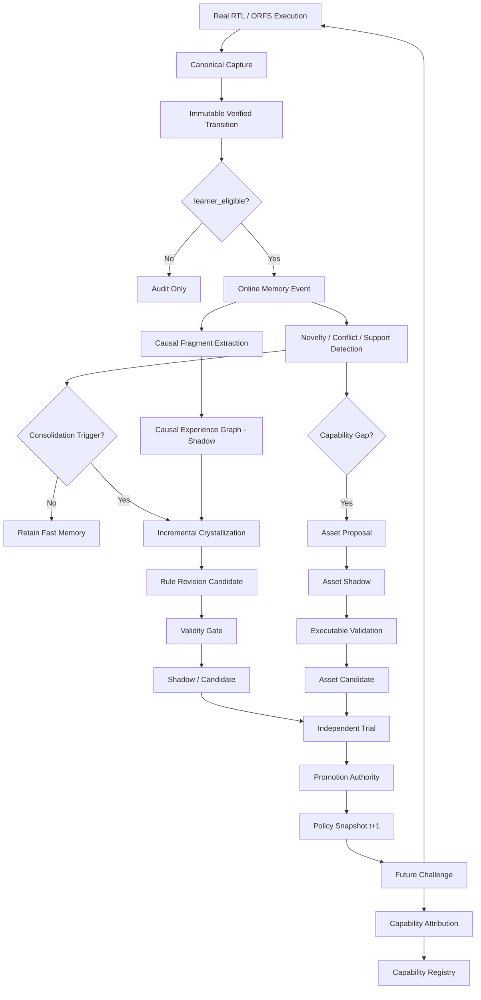

# TEHM / R2G 记忆系统升级技术方案

> **主题**：Causal Experience Graph → Online Memory Evolution → Experience Memory + Asset Memory → Verified Capability Evolution  
> **目标仓库**：`Zhang-D-Y/Typed-Executable-Hardware-Memory`  
> **基线提交**：`1bb1fab259221a541745fed86f0b02b90c039f3f`（2026-08-26）  
> **文档定位**：面向下一轮源码升级的工程设计与实验方案，不是论文结果声明。所有新增能力在获得真实执行、独立验证与 authority 之前均保持 `shadow/evaluation-only`。

---

## 0. 结论先行

当前 TEHM 已经从早期的“结构化经验数据库”发展成一套相当严格的 **verified experience + typed rule + lifecycle authority** 系统。下一阶段不建议继续以“增加更多 memory view / 加一个更复杂的相似度模型”为主，而应把系统升级为一条完整的能力进化链：

```text
Verified Execution
      ↓
Immutable Experience Memory
      ↓
Causal Experience Graph
      ↓
Mechanism-level Retrieval / Abstraction
      ↓
Online Gated Memory Evolution
      ↓
Experience Memory ↔ Asset Memory
      ↓
Policy / Action-Space Change
      ↓
Future Challenge + Oracle
      ↓
Capability Attribution
      ↓
Verified Capability Registry
```

建议把下一阶段的研究目标明确为：

> **R2G 不仅要记住过去成功过的修复，还要从经过 oracle 验证的执行中识别可迁移的 repair mechanism；在不污染 canonical / held-out evidence 的条件下在线演化这些机制；当已有 action space 不足时，通过 Asset Memory 形成新的可验证 repair asset；最后用可归因的行为变化证明 Memory 确实导致了 Capability Evolution。**

### 0.1 当前推进快照（2026-08-26）

已在不触碰 canonical / production authority 的前提下完成一条真实 RTL 的
C4/C5 shadow 链路：两个 learner-eligible training lineage 触发
`CapabilityGapReceipt`，模板按 manifest 的结构化 fix 槽位绑定，在两个 training
lineage 和一个 held-out lineage 上由 Icarus/vvp 独立执行 target + frozen
regression，最终只将 asset 置为 `candidate`。可复核报告为
`evidence/tehm-asset-gap-shadow-rtl-r1-dev/asset_gap_shadow_report.json`。

这不是 production capability promotion：报告明确记录
`canonical_memory_mutation=none`、`promotion_attempted=false`，held-out 不进入
learner memory。当前报告已补齐由证据推导的七项 asset authority receipt：schema、
static、independent verifier、compatibility、cross-lineage、regression-zero 和
rollback 均为 `true`，因此 `asset_promotion_eligible=true` 仅表示候选具备进入
独立 lifecycle 审查的资格；它仍保持 `candidate`，没有执行 promotion，也没有
production runtime 入口。下一步应在更多独立 lineage 和真实 ORFS 证据上复用同一
authority receipt，再决定是否实现显式、人工/独立 authority 驱动的 canonical import。
当前已补上该缺口的第一层：`assets.authority` 提供 content-bound
`AssetAuthorityReceipt`、`verify_asset_authority()` 和 strict `promote_asset()`，
会重新读取 registry asset 并校验 content digest、validation/binding/rollback
证据和七项 gate。当前第二层已落地：validation/binding/rollback payload 会以
split/lineage/verdict/digest 写入 append-only asset evidence ledger，并另存
content-bound receipt row；replay 必须逐行校验 digest、payload 与 receipt row，
再从 ledger 重新推导 gate。该 ledger 是 v4 的 additive extension，旧 v4 DB
在 authority seam 首次使用时幂等创建，不改变已发布 migration chain。真实 asset
shadow 报告仍不自动执行 promotion，更多独立 lineage/ORFS 证据和人工 authority
仍是 production 前置条件。
ledger schema 初始化不使用会隐式提交的 `executescript`；validation/binding/
rollback evidence rows 与 authority receipt row 通过同一 savepoint 原子写入，晚到
的 immutable-row 冲突会整体回滚，且不提交调用方已有事务。

在该 asset shadow 之上，当前又完成了一个 evaluation-only C1–C8 capability
attribution harness：基线、候选、ablation 均重新执行 Icarus/vvp，候选 policy 的
load receipt 与实际 runtime execution receipt 绑定。两个 training lineage、一个
disjoint held-out lineage 和一个异构 non-target 上的结果使 C1–C8 全部通过；但
capability 仍为 `candidate`，`capability_promotion_eligible=true` 只是独立审计
结论。该结论现在还必须由数据库绑定的 C1–C8（及 asset）evidence rows、candidate
policy snapshot 和实际 runtime-load receipt 重放验证；`promote_capability()` 不再
接受调用方内存布尔值作为 authority。`production_promotion_eligible=false`，不执行
任何 lifecycle 或 canonical mutation。报告为
`evidence/tehm-capability-attribution-rtl-r1-dev/rtl_capability_attribution_report.json`。

真实 ORFS fail→pass attribution 也已接入同一数据库绑定 authority contract：
`build_orfs_capability_attribution.py` 会把 C1–C8 分别写入不可变
`tehm_capability_evidence` rows，并绑定 candidate policy snapshot 与实际
evaluation-runtime load receipt；最新 load row 还必须带有实际 candidate runtime
execution receipt，再由 `verify_capability_authority()` 重放校验，避免只凭
snapshot lookup 满足 C3；C4 evidence ref 同时保存该 execution receipt ID，重放时
必须与最新 load row 一致。
其中 C8 的 `gain_without_memory` 不再由调用方布尔值提供：baseline policy 会作为
显式 `M_t+1 - ΔMemory` ablation 执行，并将其 runtime receipt 与 policy-load receipt
写入报告；只有从该回执重放出目标 lineage 未选择新 action、同时 candidate arm 选择
并通过 ORFS oracle，C8 才能成立。
当前 failpass-r2 cohort 的 C1–C8 capability authority receipt 为
`eligible=true`，但这仍是 evaluation-only；六项 rule promotion gate 未建立，
`promotion_attempted=false`，canonical memory 与 production lifecycle 均不变。

为避免把“没有做过实验”和“实验明确失败”混为一个 `false`，
`evaluate_promotion_gates()` 及 capability gate evaluator 现在为每一项同时输出
`gate_status`：`NOT_ESTABLISHED`、`FAIL` 或 `PASS`，并汇总
`not_established`、`failed` 与 `all_gates_established`。因此空的 authority 输入会
明确显示六项均为 `NOT_ESTABLISHED`；只有提供了对应证据但阈值未达标时才记为
`FAIL`。这仍不改变六项合取或 promotion 行为，只提高 authority receipt 的可审计性。

因果 authority 的 witness 防火墙也已进一步收紧：L2/L3 评估通过共享的
`causal.witness` resolver 解析直接 transition 或合法 intervention-pair 引用，
并要求 path 的每一个 source transition 都被同一 campaign 的 training
`learner_eligible` edge 完整覆盖。单个 edge 的部分交集、未知/重复/malformed
引用或跨 campaign 引用均不能支撑整条 path，结果只返回 fail-closed receipt，不改变
canonical memory 或 production lifecycle。

Asset Memory 的输入边界同步 fail-closed：promotion gate、asset schema、registry
load 对非 mapping、损坏 JSON、非对象 contract 或损坏 registry row 返回不可晋级
receipt/unknown asset，不把解析异常升级为 verifier 或 lifecycle authority。

当前 B4 candidate-trial lane 也已接通：`run_shadow_candidate_trial()` 将 preview
规则复制到内存 staging DB，在隔离副本中执行 `shadow → candidate` 和现有 A/B
trial adapter；Icarus/ORFS 通过 evaluator callback 接入。trial、六项 rule promotion
gate 与 source-digest 不变性都会写入 `CandidateTrialReceipt`，但即使 gate 全部
满足也不调用 production authority，`promotion_attempted=false`，canonical 与源
lifecycle 均保持不变。

Activation feedback 也已接入 online event log：`activation/update.py` 在 utility
更新时按 PASS、中性、FAIL/REGRESSION 分别写入 `SUPPORT_INCREASED`、
`UTILITY_DRIFT`、`RULE_HARMFUL`，并绑定 activation provenance 与 utility 前后
快照。evaluation/backend 路径默认标记为非 learner campaign；按 activation ID
幂等，不能因重试放大 support。

同时补齐了 online fast-memory 的触发、operation decision 与 shadow proposal 层：
`observe_transition()`
现在从显式 dataset membership、novelty、conflict、support 和 harmful outcome
推导受影响 effect group，并写入 hash-chained `CONSOLIDATION_TRIGGERED` receipt；
触发后以 `dry_run=True` 同时生成 affected-group 与完整 campaign rebuild 投影，
比较来源 transition witness，并写入 `RULE_REVISION_PROPOSED`。该 proposal 只表达
可审计的 shadow revision；纯函数决策层进一步区分 `RETAIN`、`ADD`、`MERGE`、
`REVISE`、`SPLIT` 和 `QUARANTINE`，但不写 `tehm_rules`、`tehm_rule_revisions`
或 lifecycle；
此处 `triggered` 仍仅表示满足 consolidation 条件，且 held-out/calibration 永远
返回 `NOT_LEARNER_ELIGIBLE`、不进入 learner consolidation。

三个核心升级按依赖关系排序：

1. **Experience Graph → Causal Experience Graph**：解决“为什么这条经验能迁移”。
2. **Batch Rebuild → Online Gated Evolution**：解决“什么时候应该学习、合并、修订、拆分或遗忘”。
3. **Experience Memory + Asset Memory → Capability Evolution**：解决“Memory 到底让 Agent 学会了什么以前不会的能力”。

这三个阶段必须串联，不应实现成三个互相独立的功能插件。

---

# 1. 当前最新版 TEHM 基线评估

## 1.1 当前已经具备的基础

基线提交 `1bb1fab` 中，以下基础不应推翻，应作为下一阶段的安全边界继续复用。

### 1.1.1 Schema v3 + canonical evidence substrate

当前 `memory/tehm/schema.sql` 已进入 `tehm-v3`，canonical substrate 已包含：

- `tehm_states`
- `tehm_transitions`
- `tehm_episodes`
- `tehm_episode_steps`
- `tehm_dataset_membership`
- `tehm_views`
- `tehm_rules`
- `tehm_rule_sources`
- `tehm_activations`
- `tehm_rule_status`
- `tehm_edges`
- `tehm_trials`
- `tehm_physical_effects`

其中最关键的新基础是 `tehm_dataset_membership`：

```text
transition
    ↓
campaign_id
split = training / calibration / heldout / ab
learner_eligible = 0 / 1
```

这意味着 **“证据可以保留”与“证据允许影响 learner”已经被数据平面显式分开**。后续 causal / online / capability 模块必须继续遵守这一防火墙。

### 1.1.2 Compatibility Profile 已进入 runtime contract

当前 `RepairContext` 已含：

```python
structural_graph: dict | None
compatibility_profile: str | None
```

RTL action 也已通过 `tehm/rtl/compatibility.py` 使用显式 compatibility profile，例如：

```text
rtl.fsm.single_guard.v1
rtl.sequential.reset_branch.v1
rtl.combinational.width_assignment.v1
rtl.fsm.case_reorder.v1
rtl.ast.literal_rewrite.v1
```

这是后续 causal mechanism abstraction 的重要入口：**causal path 不应跨结构不兼容 executor 被合并。**

### 1.1.3 Crystallization 已具备 dataset / compatibility-aware 行为

当前 `crystallize_all()` 已经：

1. 只加载指定 `campaign_id` 中 `learner_eligible=1` 的 transition；
2. 在 `primary_effect_key` 分组后，再按 `compatibility_profile` 拆分；
3. 对每组执行 role normalization + anti-unification + validity audit；
4. 保留已有 rule utility，而不是在 re-crystallization 时重置；
5. 对完整 rebuild 中消失或失效的 rule 执行 `retired / quarantined`。

这说明系统已经开始具备“规则不是永久 append-only”的雏形。

### 1.1.4 Production Authority 已明显强化

当前 promotion gate 为六项合取：

```text
rollback_verified
registry_verified
obligation_coverage
cross_lineage_te
harmful_rate
conformal_coverage
```

并且 production retrieval 默认只允许 `promoted` rule；`candidate` 只允许隔离评估显式 opt-in。

后续所有新模块都必须遵守：

> **Causal score、online confidence、asset synthesis score、capability score 都不是 authority。**

### 1.1.5 ORFS batch lane 已形成正确的数据平面边界

当前 batch lane 已经明确：

```text
真实 ORFS attempt
    ↓
external observation receipt
    ↓ full-oracle grading
eligible support only
    ↓
isolated staging
    ↓ independent authority receipt
canonical import
```

并且 batch runner 本身不能直接写 canonical。

这一结构非常适合直接扩展成 Online Memory 的 **Fast Evidence Lane**，而无需把 production DB 变成“每次交互即时自修改”的危险系统。

### 1.1.6 Physical Effect Memory + Typed Utility Contract 已提供 causal effect 的雏形

当前 physical memory 已经保存：

```text
(action, graph_context)
    → ΔWNS / ΔTNS / ΔArea / ΔPower / ...
```

并且 typed utility contract 已经把：

- action signature
- operation point
- hard oracle
- resource budgets
- OOD ceiling
- uncertainty interval
- proposal / abstain

显式分开。

这意味着后续 Causal Experience Graph **不必重新发明 effect evidence**，应复用 `tehm_physical_effects` 与 utility contract 的 action-bound evidence。

---

## 1.2 当前最重要的结构性缺口

### 缺口 A：`tehm_edges` 仍是 provenance / relation graph，不是 causal graph

目前典型关系仍接近：

```text
Transition --EXECUTED_FROM--> State
Transition --PRODUCED_STATE--> State
Transition --PART_OF_EPISODE--> Episode
```

它回答的是：

> “哪些对象之间有关联？”

但还不能可靠回答：

> “哪个 state condition 使 action 有效？”  
> “action 通过哪个 intermediate effect 消除了 failure？”  
> “这个 effect 是相关性、真实 intervention、A/B 对照，还是跨 lineage 重复验证？”

因此不能直接把 `tehm_edges` 改名为 causal graph。

### 缺口 B：Memory update 仍以 `rebuild() → crystallize_all()` 为中心

当前主入口仍是：

```text
capture
capture
capture
   ↓
rebuild()
   ↓
crystallize_all()
   ↓
full revalidation / retirement
```

虽然已有 rule retirement 和 utility-preserving re-crystallization，但核心仍是 batch-style consolidation。

真正的 online memory 需要：

```text
每个新 verified transition 到达
    ↓
判断 novelty / support / conflict / contradiction / risk
    ↓
只更新受影响的 mechanism group
    ↓
产生 shadow revision
    ↓
经过独立验证后才改变 runtime authority
```

### 缺口 C：规则增长 ≠ 能力进化

当前系统可以证明：

- rule 数增加；
- retrieval 命中；
- activation 成功；
- held-out replay 成功；
- harmful activation 受控。

但还没有一个正式对象回答：

```text
M_t 具备哪些已验证能力？
M_{t+1} 新增了什么？
这个新增能力是否真的由 memory change 导致？
如果移除 ΔM，新增能力是否消失？
```

也就是说，目前仍缺：

```text
Memory Change
   ↓
Policy / Asset Change
   ↓
Behavior Change
   ↓
Capability Gain
```

的可审计链路。

### 缺口 D：Experience Memory 仍基本局限在“已有 action family 的经验抽象”

当已有 `Action` / repair operator 根本无法覆盖某类 failure 时，当前 memory 无法自然表达：

> “不是我不会选，而是我的 action space 中没有正确工具。”

这就是 Experience Memory + Asset Memory 必须引入的原因。

---

## 1.3 backend seam 修复状态

当前 `contracts.RepairContext` 和 `query_planner.plan_query()` 已支持 `compatibility_profile`，但在基线提交的 `TehmMemoryBackend.retrieve()` 中，`MemoryQuery` 被重建为 `RepairContext` 时只恢复：

```text
design_id
platform
check
symptom_signature
```

没有恢复：

```text
compatibility_profile
structural_graph
```

基线版本的 backend seam 曾可能发生：

```text
build_query(context with compatibility_profile)
    ↓
MemoryQuery contains compatibility_profile
    ↓
backend.retrieve(query)
    ↓
reconstruct RepairContext
    ↓
compatibility_profile lost
```

而 `symbolic_filter` 对 concrete rule profile 在 query profile 缺失时会返回 `UNRESOLVED`。

### P0 已修复

`TehmMemoryBackend.retrieve()` 现直接调用
`retrieval.retrieve_query(conn, query)`，不再使用“query → context → 再 plan_query”
的 round-trip；因此 `structural_graph`、`compatibility_profile`、mechanism/causal
context 与 prior-action 字段会沿 backend seam 保持不变，并由 regression test 锁定。

已采用方案：

```python
retrieve_query(conn, query: MemoryQuery, ...)
```

让 retrieval pipeline 直接接受已经冻结的 `MemoryQuery`。

兼容性兜底方案（当前不再需要）：至少完整恢复：

```python
compatibility_profile=qp.get("compatibility_profile")
structural_graph=qp.get("structural_graph")
```

同一 savepoint/commit discipline 也已应用到 backend `rebuild()`：crystallization、
lifecycle enrollment 与 honesty audit 失败时整体回滚 derived projection，不影响外层
事务；因此该 P0 不再阻塞后续真实 ORFS campaign。

---

# 2. 下一代总体设计原则

## 2.1 Immutable Evidence First

`tehm_states / transitions / episodes / artifacts` 继续作为不可替代的原始证据层。

任何：

- causal abstraction
- rule revision
- mechanism merge
- capability promotion
- asset promotion

都不得覆盖原始 transition。

### 原则

```text
Raw evidence can be superseded by interpretation,
but must never be replaced by interpretation.
```

---

## 2.2 Causal Claim 与 Provenance Edge 必须分离

不能把：

```text
A occurred before B
```

直接当作：

```text
A caused B
```

因此建议保留：

```text
tehm_edges          # provenance / topology / relation
```

新增：

```text
tehm_causal_*       # explicit causal claims + evidence level
```

---

## 2.3 Online ≠ Immediate Production Mutation

Online memory 的定义不是：

```text
每次 PASS → 立刻改 active rule
```

而是：

```text
interaction-driven observation
→ immediate shadow update
→ triggered consolidation
→ independent validation
→ authority-controlled activation
```

因此建议采用：

```text
Fast Memory = online evidence / shadow hypothesis
Slow Memory = validated mechanism / rule / asset
```

---

## 2.4 Experience 与 Asset 必须使用不同 authority

Experience 是“发生过什么、什么机制可能有效”；Asset 是“系统拥有了什么可执行能力”。

不能因为一段经验表明某个新 operator 可能有用，就直接把该 operator 加入 production action space。

Asset 也必须：

```text
draft → shadow → candidate → promoted / demoted / quarantined / retired
```

---

## 2.5 Capability 必须是可验证对象，不是叙述性标签

“系统会修 reset bug”不是 capability evidence。

Capability 至少需要：

```text
failure mechanism
applicability predicates
action / asset set
verification obligations
budget
support / held-out support
memory version / policy snapshot
```

---

# 3. 第一阶段：Causal Experience Graph

# 3.1 目标

把当前：

```text
S_t --A_t--> S_{t+1}
```

升级为：

```text
State Condition
     ↓ ENABLES
Action / Intervention
     ↓ CHANGES
Intermediate Effect
     ↓ MEDIATES
Failure Mechanism State
     ↓ REMOVES / CREATES / PRESERVES
Oracle / Obligation Outcome
```

核心不再只是“case 相似”，而是“failure mechanism / effect path 相似”。

---

## 3.2 EDA 为什么特别适合做 causal memory

普通 Agent 的 causal memory 常依赖自然语言推断；R2G/TEHM 有更强的证据条件：

```text
真实 before state
真实 action
真实 after state
真实 RTL / netlist / graph
真实 simulator / signoff
真实 A/B trial
真实 rollback receipt
真实 PPA delta
```

所以可以把 action 视为明确 intervention：

\[
S_t \xrightarrow{do(A_t)} S_{t+1}
\]

但注意：**执行了 intervention 仍不自动等于已经识别了完整因果机制。**

---

## 3.3 Causal Evidence Level

建议所有 causal edge 必须携带 `evidence_level`。

### L0 — ASSOCIATION

只观察到共现：

```text
A 与 ΔO 共同出现
```

不能用于 production causal claim。

### L1 — EXECUTED_INTERVENTION

真实执行：

```text
do(A) → observed ΔO
```

有 transition + verifier，但没有 control arm。

### L2 — CONTROLLED_INTERVENTION

同一 target / comparable target 存在：

```text
control
vs
treatment
```

并且 toolchain / oracle / budget / source snapshot 受控。

### L3 — REPLICATED_EFFECT

相同 mechanism / action path 在多个独立 lineage 上重复出现。

要求至少记录：

```text
unique_lineages
unique_designs
unique_runs
```

### L4 — TRANSFER_SUPPORTED_MECHANISM

在训练之外的：

```text
held-out lineage / unseen design / disjoint failure instance
```

仍成立。

> **只有 L2+ 才建议在论文中使用较强的 causal / intervention-grounded 表述；L0/L1 应保守描述为 association / intervention evidence。**

---

## 3.4 建议的数据模型

### 3.4.1 `tehm_causal_nodes`

```sql
CREATE TABLE tehm_causal_nodes (
    causal_node_id        TEXT PRIMARY KEY,
    node_type             TEXT NOT NULL,
    owner_type            TEXT,
    owner_id              TEXT,
    payload_json          TEXT NOT NULL,
    payload_digest        TEXT NOT NULL,
    extractor_version     TEXT NOT NULL,
    created_at            TEXT NOT NULL
);
```

建议 `node_type`：

```text
STATE_CONDITION
ACTION
INTERMEDIATE_EFFECT
FAILURE_MECHANISM
ORACLE_OUTCOME
OBLIGATION
REGRESSION
PHYSICAL_EFFECT
ASSET
CAPABILITY
```

### 3.4.2 `tehm_causal_edges`

```sql
CREATE TABLE tehm_causal_edges (
    causal_edge_id        TEXT PRIMARY KEY,
    source_node_id        TEXT NOT NULL,
    relation_type         TEXT NOT NULL,
    target_node_id        TEXT NOT NULL,
    evidence_level        TEXT NOT NULL,
    support_json          TEXT NOT NULL,
    confidence_json       TEXT NOT NULL,
    evidence_refs_json    TEXT NOT NULL,
    campaign_id           TEXT,
    learner_eligible      INTEGER NOT NULL,
    created_at            TEXT NOT NULL
);
```

建议关系：

```text
ENABLES
BLOCKS
INTERVENES_ON
CHANGES
MEDIATES
REMOVES
CREATES
PRESERVES
CONTRADICTS
SUPPORTS
SPECIALIZES
GENERALIZES
```

### 3.4.3 `tehm_causal_paths`

路径本身也应可内容寻址：

```sql
CREATE TABLE tehm_causal_paths (
    path_id               TEXT PRIMARY KEY,
    mechanism_family      TEXT NOT NULL,
    compatibility_profile TEXT,
    ordered_nodes_json    TEXT NOT NULL,
    ordered_edges_json    TEXT NOT NULL,
    evidence_level        TEXT NOT NULL,
    support_json          TEXT NOT NULL,
    source_transitions_json TEXT NOT NULL,
    path_digest           TEXT NOT NULL,
    status                TEXT NOT NULL,
    created_at            TEXT NOT NULL,
    updated_at            TEXT NOT NULL
);
```

`status` 初期只允许：

```text
shadow
candidate
validated
retired
```

注意：**causal path status 不等于 production rule lifecycle。**

### 3.4.4 `tehm_intervention_pairs`

用于明确存 A/B 或对照证据：

```text
pair_id
control_transition_id
treatment_transition_id
target_scope
matched_context_digest
changed_action_digest
outcome_delta_json
oracle_equivalence_json
lineage_id
validity_status
```

---

## 3.5 Path Extraction：不要让 LLM 直接写 CAUSES

### RTL path

优先从可执行/结构化信息生成：

```text
RTL graph
+ parser facts
+ before/after AST delta
+ failure trace
+ action payload
+ simulator result
+ obligation result
```

例如：

```text
FAILURE_MECHANISM:
completion transition unreachable

STATE_CONDITION:
source_state = WAIT
candidate edge = WAIT→DONE
guard = req && !ack

ACTION:
GUARD_RESTORE

INTERMEDIATE_EFFECT:
edge enabled under legal handshake completion

OUTCOME:
target test PASS
regression PASS
```

### Flow / physical path

复用：

```text
tehm_physical_effects
utility contract
graph_context
action_signature
strict signoff
```

形成：

```text
STATE_CONDITION
high utilization + graph profile
    ↓
ACTION
DENSITY_RELIEF 50→45
    ↓
PHYSICAL_EFFECT
ΔWNS / ΔArea / ΔPower
    ↓
UTILITY CONTRACT
PASS / FAIL / ABSTAIN
```

这里尤其要保留“非单调性”和 harmful effect，而不是只构建成功 causal path。

---

## 3.6 Causal Path Builder 模块

新增：

```text
memory/tehm/causal/
├── __init__.py
├── schema.py
├── nodes.py
├── edges.py
├── path_builder.py
├── intervention.py
├── evidence_level.py
├── mechanism.py
├── matcher.py
├── attribution.py
└── receipts.py
```

建议 API：

```python
build_transition_causal_fragment(
    conn,
    transition_id: str,
) -> CausalFragment
```

```python
build_intervention_pair(
    control_transition_id: str,
    treatment_transition_id: str,
) -> InterventionReceipt
```

```python
consolidate_causal_path(
    fragments: list[CausalFragment],
) -> CausalPathCandidate
```

---

## 3.7 Retrieval Pipeline 升级

当前：

```text
plan_query
→ high_recall
→ symbolic_filter
→ rerank
```

建议：

```text
plan_query
    ↓
metadata high-recall
    ↓
state / compatibility match
    ↓
causal-path recall
    ↓
mechanism match
    ↓
symbolic applicability veto
    ↓
causal evidence weighting
    ↓
utility / confidence / risk rerank
```

### Query 扩展

`RepairContext` 建议增加：

```python
mechanism_signature: dict | None = None
failure_graph_digest: str | None = None
causal_context_digest: str | None = None
prior_action_digests: list[str] = field(default_factory=list)
```

`MemoryQuery.query_plan` 增加：

```text
mechanism_family
causal_path_features
required_effect
forbidden_effects
prior_attempts
```

### Score

建议第一版不要直接用 learned ranker：

\[
Score =
S_{meta}
\times S_{state}
\times S_{causal}
\times U
\times C_{evidence}
\times (1-R)
\]

其中：

```text
S_meta       = 现有 check / obligation / family
S_state      = compatibility + structural context
S_causal     = causal path / mechanism overlap
U            = rule utility
C_evidence   = causal evidence level + support
R            = regression / uncertainty / harmful risk
```

**symbolic veto 始终高于 score。**

---

## 3.8 与当前 `compatibility_profile` 的关系

`compatibility_profile` 不应该被 causal path 替代。

建议逻辑：

```text
Compatibility
    = “这个 executor / structural family 能不能在此处应用”

Causal Mechanism
    = “为什么这个 action 在这种结构中能消除这个 failure”
```

因此：

```text
profile mismatch → INAPPLICABLE
profile match + causal mismatch → low score / unresolved
profile match + causal path supported → candidate
```

---

## 3.9 第一阶段验收条件

第一阶段只做 **shadow causal memory**，不能改变 production retrieval。

必须满足：

1. 每条 causal edge 都可追溯到 canonical transition / trial / oracle；
2. L0/L1 不允许升级为强 causal claim；
3. held-out / calibration 数据可以形成审计节点，但 `learner_eligible=0` 时不能参与 consolidation；
4. causal graph rebuild 不改变 canonical transition count；
5. causal matcher 可以在固定 fixture 上区分：
   - structural-compatible but mechanism-mismatch；
   - mechanism-similar but compatibility-mismatch；
   - true compatible + mechanism match；
6. production default behavior与现有 v3 完全一致。

---

# 4. 第二阶段：从 Batch Rebuild 到 Online Gated Memory Evolution

# 4.1 核心思想

不要把 online evolution 实现为：

```text
新 transition
→ rebuild all
→ 直接改 active memory
```

而应该实现：

```text
Verified Transition
    ↓
Fast Shadow Observation
    ↓
Novelty / Conflict / Support / Risk Detection
    ↓
Affected Mechanism Group
    ↓
Incremental Consolidation Candidate
    ↓
Validation
    ↓
Shadow / Candidate Revision
    ↓
Independent Runtime Trial
    ↓
Authority
```

---

## 4.2 Fast Memory 与 Slow Memory

### Fast Memory

每个 canonical learner-eligible transition 到达后立即产生：

- transition event
- causal fragment
- mechanism signature
- novelty result
- conflict result
- affected rule IDs
- affected causal path IDs

触发 consolidation 时，fast lane 还产生一个只读的 `IncrementalCrystallizationReceipt`
（`mode=preview`）。它同时携带 affected projection、完整 rebuild 中对应的规则
ID 以及 `full_rebuild_equivalent`，作为后续显式 candidate revision 的输入；该步骤
不改变任何 canonical、rule 或 lifecycle 表。

但不改变 production authority。

### Slow Memory

只有触发条件满足才做 consolidation：

```text
SufficientSupport
OR NovelMechanism
OR RuleConflict
OR RepeatedFailure
OR HarmfulActivation
OR UtilityDrift
OR CapabilityGap
```

---

## 4.3 新增 Memory Event Log

新增：

```sql
CREATE TABLE tehm_memory_events (
    event_id              TEXT PRIMARY KEY,
    event_type            TEXT NOT NULL,
    source_type           TEXT NOT NULL,
    source_id             TEXT NOT NULL,
    campaign_id           TEXT,
    learner_eligible      INTEGER NOT NULL,
    payload_json          TEXT NOT NULL,
    previous_event_digest TEXT,
    event_digest          TEXT NOT NULL,
    created_at            TEXT NOT NULL
);
```

事件类型：

```text
TRANSITION_CAPTURED
CAUSAL_FRAGMENT_CREATED
NOVEL_MECHANISM
SUPPORT_INCREASED
RULE_CONFLICT
RULE_HARMFUL
UTILITY_DRIFT
CONSOLIDATION_TRIGGERED
RULE_REVISION_PROPOSED
ASSET_GAP_DETECTED
CAPABILITY_EVIDENCE_ADDED
```

建议沿用 Batch lane 的 hash-chain 思路，使 online memory evolution 本身可重放。

事件写入器不能只相信调用方传入的 `learner_eligible` 布尔值：对
`transition`、`causal_fragment` 和 `activation` source，必须反向解析其 canonical
transition witness，并确认该 transition 在同一 campaign 中满足
`split='training' AND learner_eligible=1`；链校验也应重复这一检查。

---

## 4.4 Online Memory Operation

系统必须支持的不只是 `ADD`：

```text
RETAIN
ADD
MERGE
SPECIALIZE
GENERALIZE
REVISE
SPLIT
DEMOTE
QUARANTINE
RETIRE
ROLLBACK
```

### 示例：Rule Split

当前规则：

```text
R:
GUARD_RESTORE → positive
```

新 evidence 发现：

```text
priority-sensitive FSM 中产生竞争路径
```

错误做法：

```text
utility.harmful += 1
```

更合理：

```text
R
├─ R1: non-overlap guard → applicable
└─ R2: priority-overlap → inapplicable / separate operator
```

这才是真正的 memory structure evolution。

---

## 4.5 Incremental Crystallization

当前 `crystallize_all()` 做全量 campaign rebuild。

建议保留它作为：

```text
full audit / freeze / reproduce / recovery path
```

另新增：

```python
preview_affected_groups(
    conn,
    transition_ids: list[str],
    campaign_id: str,
) -> IncrementalCrystallizationReceipt

crystallize_affected_groups(
    conn,
    transition_ids: list[str],
    campaign_id: str,
) -> IncrementalCrystallizationReceipt
```

`preview_affected_groups()` 必须保持只读：affected-group 与完整 campaign rebuild
都以 `dry_run=True` 执行，并按 episode-owned source transition 比较对应规则。
affected projection 还必须同时限定 `(primary_effect_key, compatibility_profile)`，
不能因为同一 effect key 把不兼容 executor 一并重建。
只有后续显式、隔离的 `crystallize_affected_groups()` 才能写入 candidate rule
和 revision；两条路径都不能自行授予 production authority。

增量 persist 必须作为一个 derived-state 原子操作执行：规则、memory event 和
revision 写入共用 SQLite savepoint，并在提交前重算
`raw-evidence-preservation-v1`。receipt 记录 raw evidence 前后 digest；如果
affected/full projection 不等价或 raw evidence 发生变化，整个 derived update
必须回滚，不能留下半个 rule/revision。该 savepoint 只保证派生状态的一致性，不
改变 promoted-only runtime 或任何 production authority gate。

内部：

```text
new transition
    ↓
primary_effect_key
    ↓
compatibility_profile
    ↓
mechanism_signature
    ↓
affected groups only
```

推荐 grouping key：

```text
primary_effect_key
| compatibility_profile
| mechanism_family
```

注意 mechanism 早期不成熟时，可以只作为 third-level candidate grouping，不能直接导致过度拆分。

---

## 4.6 Rule Lineage / Revision History

当前 rule_id 是 content-addressed definition；一旦 rule 结构改变，会变成新 rule。

需要显式表达：

```text
R_old
  ↓ SPECIALIZED_TO
R_new
```

新增：

```sql
CREATE TABLE tehm_rule_revisions (
    revision_id            TEXT PRIMARY KEY,
    parent_rule_id         TEXT,
    child_rule_id          TEXT NOT NULL,
    operation              TEXT NOT NULL,
    trigger_event_id       TEXT NOT NULL,
    evidence_refs_json     TEXT NOT NULL,
    validation_json        TEXT NOT NULL,
    created_at             TEXT NOT NULL
);
```

`operation`：

```text
MERGE / SPLIT / SPECIALIZE / GENERALIZE / REVISE
```

这样可以回答：

> “当前 promoted rule 是由哪些历史版本如何演化来的？”

---

## 4.7 Conflict Detection

新增：

```text
memory/tehm/evolution/conflict.py
```

冲突至少分：

### Definition Conflict

同一 mechanism / compatibility context：

```text
相似 precondition
→ 不同 action
```

### Outcome Conflict

```text
same rule
same mechanism
→ PASS in lineage A
→ REGRESSION in lineage B
```

### Effect Conflict

```text
same action signature
→ ΔWNS positive
→ ΔWNS negative
```

### Obligation Conflict

```text
target fixed
but non-target obligation broken
```

所有冲突进入 shadow revision，不自动覆盖 active rule。

---

## 4.8 Online Manager

新增：

```text
memory/tehm/evolution/
├── __init__.py
├── manager.py
├── events.py
├── novelty.py
├── conflict.py
├── triggers.py
├── incremental_crystallize.py
├── revision.py
├── consolidation.py
├── rollback.py
└── receipts.py
```

主 API：

```python
observe_transition(
    conn,
    transition_id,
    campaign_id,
) -> OnlineMemoryReceipt
```

推荐执行：

```python
1. verify dataset learner eligibility
2. create memory event
3. create causal fragment
4. evaluate novelty
5. evaluate conflict
6. find affected groups
7. evaluate consolidation trigger
8. if triggered: build shadow revision
9. run validity audit
10. update shadow/candidate only
11. never production-promote here

`novelty` 的已知路径查询也必须绑定目标 campaign 的
`split='training' AND learner_eligible=1` source transitions；不能因为全局存在
held-out/calibration shadow path 就把 learner-side mechanism 判为已知，从而抑制
`NOVEL_MECHANISM` 触发。
该 observation seam 现在以单一 savepoint 原子写入 causal fragment 与整条 event
chain；后续 novelty/conflict/preview 失败会回滚全部派生 rows，已有外层事务则由
调用方负责最终 commit，避免产生孤立的事件前缀或 causal nodes/edges。
```

---

## 4.9 与当前 Batch Lane 的正确接法

非常重要：

```text
external ORFS receipt
```

不能直接触发 online learner。

正确路径：

```text
external observation
    ↓
staging
    ↓
authority-gated canonical import
    ↓
tehm_dataset_membership learner_eligible=1
    ↓
ONLINE MEMORY EVENT
```

canonical import 的 authority case 集合必须非空、完全存在于当前 hash-chain，并且每个
被选 row 同时满足 Batch lane 的 `split=support`、`classification=ELIGIBLE_POSITIVE`
与 `learner_eligible=true`；未知 case、空选择或 held-out/不一致 row 一律 fail-closed。

该谓词是 `split='training' AND learner_eligible=1` 的合取，不允许 calibration、
held-out 或 A/B 通过错误的显式标记进入 learner。capture/assignment 在写入时拒绝
非 training 的 `learner_eligible=true`；为兼容旧库，所有 learner 查询入口仍重复检查
training split，遇到直接 SQL 造成的矛盾行也必须 fail-closed。

也就是说：

> **Online 指 canonical evidence 一旦合法进入 learner 后，memory management 可以 interaction-driven；不表示外部 observation 可以绕过 authority 即时训练。**

批量 support 的 staging import 与 canonical import 必须继续保持同一保存点语义：
每个 `capture()` 的 canonical rows/five views、对应 physical effect 以及整批导入
只在全部 receipt 通过后一起提交；任一晚到的 malformed receipt 或 derived write
异常都回滚整批。content-addressed artifact 若在失败前已经写出，只能是无引用
orphan，不能被任何 canonical row 采用。这是 external→staging→canonical 边界的
派生状态原子性，不等价于 promotion authority。

---

## 4.10 Anti-forgetting 原则

不要删除 raw episode 来“整理 memory”。

建议：

```text
Raw transition / episode: immutable
Derived causal path: versioned
Rule: versioned + lifecycle
Asset: versioned + lifecycle
Capability: versioned + evidence
```

`retired` 只代表：

> 不再拥有 runtime authority。

不代表：

> 删除证据。

物理效果写入同样遵守该边界：同一 transition 的
`PhysicalEffectMemory.record()` 重放必须是 content-equivalent 才能幂等返回；
PPA、delta 或 provenance 冲突必须 fail-closed，不能通过 `INSERT OR REPLACE` 静默
覆盖 raw physical evidence。缺失 graph context 只能由显式 enrichment 补齐，不能
清空既有绑定。

当前 full rebuild 的 stale-rule maintenance 已增加
`raw-evidence-preservation-v1` fingerprint guard：states、transitions、episodes、
episode steps、dataset membership、experience edges 与 physical effects 的内容在
lifecycle retirement 前后必须一致，否则 crystallization fail-closed。该 guard 仍
不把 derived rule/lifecycle row 当作 raw evidence，也不替代外部文件/ORFS rollback
receipt。

---

# 5. 第三阶段：Experience Memory + Asset Memory

# 5.1 为什么必须引入 Asset Memory

只有 Experience Memory 时，系统通常只能在固定 action space 内改进：

```text
已有 operator A/B/C
    ↓
memory 学会何时选 A/B/C
```

这最多证明：

```text
Selection Evolution
```

但真正的 Capability Expansion 需要：

```text
当前 action space 无法解决 failure F
    ↓
Memory 识别 capability gap
    ↓
形成新的 executable asset
    ↓
验证
    ↓
加入 action space
```

即：

\[
\mathcal{A}_t \subset \mathcal{A}_{t+1}
\]

---

## 5.2 R2G 中的 Asset 定义

Asset 不等同于 LLM 权重。

建议第一阶段只允许以下可审计类型：

```text
REPAIR_OPERATOR
RTL_REWRITE_TEMPLATE
FLOW_CONFIG_TRANSFORM
DIAGNOSTIC_EXTRACTOR
STRUCTURAL_PREDICATE
VERIFICATION_OBLIGATION
TOOL_ROUTING_POLICY
LOCALIZATION_PROCEDURE
EXECUTION_MACRO
AGENT_ROLE_PROFILE
```

例如：

```text
Asset:
rtl.priority_guard_repair.v1

Inputs:
FSM graph + overlap edges + failure trace

Action:
priority-aware guard rewrite

Required verifier:
target sim + priority regression + reset regression

Compatibility:
rtl.fsm.priority_overlap.v1
```

---

## 5.3 Asset Registry

新增：

```sql
CREATE TABLE tehm_assets (
    asset_id               TEXT PRIMARY KEY,
    asset_type             TEXT NOT NULL,
    name                   TEXT NOT NULL,
    version                TEXT NOT NULL,
    definition_json        TEXT NOT NULL,
    input_contract_json    TEXT NOT NULL,
    output_contract_json   TEXT NOT NULL,
    verifier_contract_json TEXT NOT NULL,
    compatibility_json     TEXT NOT NULL,
    provenance_json        TEXT NOT NULL,
    content_digest         TEXT NOT NULL,
    created_at             TEXT NOT NULL
);
```

生命周期：

```sql
CREATE TABLE tehm_asset_status (
    asset_id          TEXT NOT NULL,
    target_scope      TEXT NOT NULL,
    status            TEXT NOT NULL,
    status_version    INTEGER NOT NULL,
    provenance_json   TEXT NOT NULL,
    updated_at        TEXT NOT NULL,
    PRIMARY KEY(asset_id, target_scope)
);
```

状态：

```text
draft
shadow
candidate
promoted
demoted
quarantined
retired
```

注册入口只能创建 `observed_gap` 或 `candidate`，不能通过
`register_capability()` 直接授予 `verified/promoted` authority。同一
`(capability_id, evidence_type, evidence_id)` 的 evidence receipt 必须幂等；若
其 split、verdict 或 lineage 发生变化，系统应拒绝覆盖，以保持 capability 证据的
不可变 provenance。

---

## 5.4 Capability Gap Detector

新增：

```text
memory/tehm/assets/gap_detector.py
```

不能把“单次失败”直接判为 capability gap。

建议满足以下证据之一才产生 candidate gap：

### Repeated Unsupported Mechanism

```text
同一 mechanism
≥ 多个独立 lineage
且现有 promoted asset/rule 无 executable candidate
```

### Repeated Executable Failure

```text
有 candidate
可执行
但在相同 mechanism 上反复 FAIL
```

### Structural Coverage Gap

```text
compatibility profile 不存在任何 promoted asset
```

### Obligation Coverage Gap

```text
现有 action 可修 target
但无法满足关键 non-target obligation
```

输出：

```python
CapabilityGapReceipt(
    gap_id,
    mechanism_family,
    evidence_transitions,
    missing_asset_types,
    current_action_coverage,
    confidence,
)
```

---

## 5.5 Asset Synthesis 不直接进入 production

推荐流程：

```text
Capability Gap
    ↓
Asset Proposal
    ↓
static/schema validation
    ↓
shadow asset
    ↓
contained execution
    ↓
real oracle
    ↓
cross-lineage trial
    ↓
candidate
    ↓
asset promotion authority
```

### 重要原则

生成 Asset 的 LLM/agent **不能作为该 Asset 的唯一 verifier**。

Verifier 必须来自：

```text
compiler
simulator
formal/equivalence
signoff
regression suite
registered obligation
```

---

## 5.6 Experience Memory ↔ Asset Memory 双向闭环

```text
Experience Memory
      │
      ├─ identifies recurring mechanism
      ├─ identifies conflict
      ├─ identifies capability gap
      ↓
Asset Memory
      │
      ├─ new operator
      ├─ new predicate
      ├─ new verifier obligation
      └─ new tool procedure
      ↓
Future Executions
      ↓
New Verified Experience
      └──────────────→ Experience Memory
```

这条闭环比“memory → retrieval”更接近真正的自进化。

---

# 6. 最核心：Memory 如何导致 Capability Evolution

# 6.1 不再把 success-rate improvement 直接称为 capability evolution

建议明确区分三个层次。

### Level 1 — Selection Evolution

action space 不变，只是：

```text
选对已有策略的概率提高
```

### Level 2 — Strategy Evolution

action primitive 不变，但新增：

```text
新前提
新组合
新顺序
新条件化 policy
```

### Level 3 — Capability Expansion

出现新的 executable asset，导致原本不可解 mechanism 可解。

```text
A_t ⊂ A_t+1
```

论文和报告中必须区分三者。

---

## 6.2 Capability 正式定义

建议：

\[
c = \langle F, P, A, Q, B, E \rangle
\]

其中：

- `F`：failure mechanism / defect class
- `P`：applicability predicates / structural context
- `A`：required promoted rule / asset set
- `Q`：verification obligations
- `B`：budget contract
- `E`：verified evidence

示例：

```yaml
capability_id: cap.rtl.fsm.priority_guard_repair.v1
failure_mechanism:
  family: fsm_completion_blocked_by_priority_guard
applicability:
  compatibility_profile: rtl.fsm.priority_overlap.v1
required_assets:
  - asset:rtl.priority_guard_repair.v1
verification:
  - TARGET_FAILURE_REMOVED
  - PRESERVE_RESET_SEMANTICS
  - PRESERVE_PRIORITY_BEHAVIOR
budget:
  max_candidates: 3
evidence:
  train_lineages: 3
  heldout_lineages: 2
status: candidate
```

---

## 6.3 Capability Registry

新增：

```sql
CREATE TABLE tehm_capabilities (
    capability_id            TEXT PRIMARY KEY,
    mechanism_family         TEXT NOT NULL,
    applicability_json       TEXT NOT NULL,
    required_rules_json      TEXT NOT NULL,
    required_assets_json     TEXT NOT NULL,
    obligations_json         TEXT NOT NULL,
    budget_json              TEXT NOT NULL,
    status                   TEXT NOT NULL,
    version                  INTEGER NOT NULL,
    provenance_json          TEXT NOT NULL,
    created_at               TEXT NOT NULL,
    updated_at               TEXT NOT NULL
);
```

```sql
CREATE TABLE tehm_capability_evidence (
    capability_id        TEXT NOT NULL,
    evidence_type        TEXT NOT NULL,
    evidence_id          TEXT NOT NULL,
    split                TEXT NOT NULL,
    lineage_id           TEXT,
    verdict              TEXT NOT NULL,
    evidence_digest      TEXT NOT NULL,
    PRIMARY KEY(capability_id, evidence_type, evidence_id)
);
```

状态：

```text
observed_gap
candidate
verified
promoted
regressed
retired
```

---

## 6.4 Policy Snapshot：证明 memory 真正改变了行为

新增：

```sql
CREATE TABLE tehm_policy_snapshots (
    policy_snapshot_id      TEXT PRIMARY KEY,
    memory_snapshot_id      TEXT NOT NULL,
    promoted_rules_json     TEXT NOT NULL,
    promoted_assets_json    TEXT NOT NULL,
    retrieval_config_json   TEXT NOT NULL,
    routing_config_json     TEXT NOT NULL,
    policy_digest           TEXT NOT NULL,
    created_at              TEXT NOT NULL
);
```

每次 capability claim 必须绑定：

```text
M_t
Policy_t
C_t
```

与：

```text
M_t+1
Policy_t+1
C_t+1
```

---

## 6.5 Capability Evolution 的强证明链

建议正式要求：

### Gate C1 — Memory Delta Exists

```text
M_t != M_t+1
```

且记录：

```text
new/revised rule IDs
new/revised asset IDs
causal path delta
```

### Gate C2 — Policy Delta Exists

```text
policy_digest_t != policy_digest_t+1
```

### Gate C3 — Runtime Actually Loads New Policy

必须有 runtime receipt，不能只看 DB 内容。

### Gate C4 — Behavior Changes

例如：

```text
before: no candidate / wrong action

after: new rule/asset selected
```

### Gate C5 — Target Capability Gain

在原本 unresolved / failed mechanism 上：

```text
0/k → x/k
```

### Gate C6 — Held-out Transfer

在独立 lineage / unseen design 上仍成立。

### Gate C7 — No Regression

冻结 non-target / existing capability replay。

### Gate C8 — Memory Ablation Removes Gain

构造：

```text
Policy_t+1 with ΔMemory removed
```

如果 gain 消失，才能建立较强 attribution：

```text
Memory Change
→ Policy Change
→ Behavior Change
→ Capability Gain
```

---

# 7. 建议的 Schema v4

下一次 schema bump 建议一次性加入四组表：

```text
Causal
├─ tehm_causal_nodes
├─ tehm_causal_edges
├─ tehm_causal_paths
└─ tehm_intervention_pairs

Online Evolution
├─ tehm_memory_events
└─ tehm_rule_revisions

Asset Memory
├─ tehm_assets
└─ tehm_asset_status

Capability
├─ tehm_capabilities
├─ tehm_capability_evidence
└─ tehm_policy_snapshots
```

建议：

```text
DB_SCHEMA_VERSION = 4
SCHEMA_VERSION = tehm-v4
```

并严格实现 `v3 -> v4` forward-only migration。

---

# 8. 源码级改造清单

## 8.1 保留不动的核心边界

| 当前模块 | 策略 |
|---|---|
| `canonical/` | 保留，继续作为 immutable evidence authority |
| `artifact_store.py` | 保留 |
| `dataset membership` | 强制复用 |
| `validity.py` | 保留，后续可扩展 causal validity，但不替换 |
| `lifecycle/` | 保留 production authority |
| `promotion_gates.py` | 保留现有六门，新增能力先走独立 gate |
| `batch_lane.py` | 复用为 external→staging→canonical 数据入口 |
| `physical/memory.py` | 复用为 physical causal effect evidence |
| `utility_contracts.py` | 复用为 action/effect/budget policy |

六门 rule authority 现在由 `lifecycle/rule_authority.py` 承担独立的
evidence-ledger/replay seam；`promotion_gates.py` 仍只负责纯函数阈值判定，不能被
调用方的布尔 map 单独当作 production authority。

---

## 8.2 `contracts.py`

新增：

```python
class RepairContext:
    ...
    mechanism_signature: dict | None
    failure_graph_digest: str | None
    causal_context_digest: str | None
    prior_action_digests: list[str]
```

新增 backend-neutral：

```python
@dataclass
class CausalCandidateEvidence:
    path_id: str
    mechanism_family: str
    evidence_level: str
    score: float

@dataclass
class CapabilityGap:
    gap_id: str
    mechanism_family: str
    missing_assets: list[str]
```

---

## 8.3 `tehm_backend.py`

### P0：修复 query round-trip 丢字段

建议：

```python
backend.retrieve(query)
    ↓
retrieval.retrieve_query(conn, query)
```

不要重新 `plan_query()`。

### 新增接口（可以先不进入 `MemoryBackend` Protocol）

```python
observe_transition(...)
get_causal_paths(...)
get_capability_snapshot(...)
```

生产接口仍保持最小变化。

---

## 8.4 `canonical/capture.py`

`capture()` 完成 commit 后，不直接做 full consolidation。

实现约束：canonical rows 与五视图物化必须处于同一个 caller-safe savepoint；任一
视图物化失败时，states/transitions/episodes/membership/edges 以及已写入的视图行
全部回滚，不能留下“canonical 已提交但派生视图不完整”的半成品。若调用方已有外层
事务，只释放 capture 自身的 savepoint，不得回滚外层事务；content-addressed artifact
文件若在失败前已创建，只能作为无引用 orphan，不能被任何 canonical row 采用。

建议返回：

```text
CaptureReceipt
+ online_event_seed
```

由上层显式调用：

```python
evolution.observe_transition(receipt.transition_id)
```

不要让 canonical capture 隐式改变 rule lifecycle，以便保持可测试性与 authority 分层。

---

## 8.5 `crystallization/build_rules.py`

保留：

```python
crystallize_all()
```

用于：

```text
full rebuild
freeze
reproduce
integrity audit
```

新增：

```python
crystallize_groups(group_keys, campaign_id)
crystallize_affected_transitions(transition_ids, campaign_id)
```

并生成 `tehm_rule_revisions`。

实现约束：`tehm_rules` 与 `tehm_rule_sources` 的整次重建（包括 stale lifecycle
retirement）必须共享 caller-safe savepoint；任何后续 rule/source/retirement 失败都
回滚整个 derived projection，且不得回滚调用方外层事务。`commit=False` 仅由已有的
incremental/consolidation 外层事务使用。

---

## 8.6 `retrieval/`

建议：

```text
retrieval/
├── query_planner.py
├── recall.py
├── causal_recall.py          # NEW
├── mechanism_match.py        # NEW
├── symbolic_filter.py
├── rerank.py
└── pipeline.py
```

新 pipeline：

```python
query
→ metadata_recall
→ causal_recall
→ mechanism_match
→ symbolic_filter
→ rerank
```

第一版 causal score 应可解释，不建议立即训练 neural ranker。

---

## 8.7 `activation/update.py`

成功/失败 activation 后，canonical capture 会经 `observe_transition()` 产生
`CAUSAL_FRAGMENT_CREATED`；utility update 再产生：

```text
SUPPORT_INCREASED
UTILITY_DRIFT
RULE_HARMFUL
```

事件 payload 绑定 activation ID、campaign、learner eligibility 与 utility 前后快照，
同一 activation ID 幂等；evaluation/backend 默认不具备 learner eligibility。这些
事件只是 shadow feedback，不直接 promotion。
utility snapshot 与 feedback event 必须作为一个派生事务写入；若 event provenance
无法落库，utility counter 也必须回滚，不能留下缺失 evidence 的累计支持度。

特别是 harmful activation：

```text
created_regressions != []
```

应立即生成：

```text
RULE_HARMFUL
CONFLICT
```

供 online manager 触发 specialize / split / quarantine candidate。

---

## 8.8 `lifecycle/promotion_gates.py`

不要立刻修改现有六项 production conjunction。

建议新增独立函数：

```python
evaluate_causal_rule_evidence(...)
evaluate_asset_promotion_gates(...)
evaluate_capability_promotion_gates(...)
```

只有经过一轮完整实证后，再考虑将某些 causal / capability gate 纳入 production mandatory set。

---

# 9. 总体运行流程



---

# 10. 推荐实施顺序

## Phase A0 — Baseline Integration Repair（已完成）

目标：确保当前 v3 contract 不丢字段。

工作：

- 修复 `TehmMemoryBackend.retrieve()` query round-trip；✅
- 为 compatibility profile 端到端增加 regression test；✅
- 生成新的 source-bound development freeze；✅
- 固定 baseline snapshot / counts / current evidence receipts。

**这一阶段不改变研究功能。**

---

## Phase A1 — Causal Shadow Schema

新增：

```text
causal nodes
causal edges
causal paths
intervention pairs
```

只从既有 canonical evidence 重建，不影响 runtime。

验收：

```text
canonical memory unchanged
production behavior unchanged
causal objects deterministic
all evidence traceable
```

---

## Phase A2 — RTL Mechanism Extractor

优先从现有最强的 RTL/Icarus fixture 做：

```text
GUARD_STRENGTHEN
RESET_RESTORE
WIDTH_CORRECT
PRIORITY_REORDER
AST_REWRITE
```

每个 family 定义：

```text
mechanism schema
state conditions
intermediate effect
required obligations
negative compatibility cases
```

先不要从 flow/physical 开始，因为 RTL causal mechanism 更离散、更容易验证。

---

## Phase A3 — Causal Retrieval Evaluation Lane

production 仍 promoted-only + old retrieval。

隔离 evaluator 比较：

```text
R0: metadata retrieval
R1: + compatibility
R2: + causal path
```

看 mechanism-level held-out transfer。

当前已落地一条独立的 RTL evaluation lane：
`scripts/build_rtl_causal_retrieval_report.py` 从 v4 freeze 的 training transition
重建六组 shadow path，并在 derived DB 中执行四个 held-out lineage 的 R0/R1/R2
查询。R0 只匹配 transformation family，R1 增加 compatibility profile，R2 再要求
mechanism family 与 held-out effect key；另设同 metadata、但 module 不相容的
negative slice。2026-08-26 的冻结报告记录三组 positive recall@3 均为 `1.0`，
R0/R1 negative false transfer rate 均为 `1.0`，R2 为 `0.0`。这验证了当前
matcher 的结构细节 veto 与 held-out firewall，但不证明普适迁移收益，也不授予
任何 rule/capability promotion authority。报告和重放脚本位于
`evidence/tehm-causal-retrieval-rtl-r1-dev/`；source DB SHA 在报告中绑定，
`canonical_memory_mutation=none` 且 `promotion_attempted=false`。

---

## Phase B1 — Online Event Log

让每个合法 learner transition 产生 deterministic event。

不做任何 auto-consolidation。

---

## Phase B2 — Incremental Crystallization

新增 affected-group rebuild。

要求：

- 结果与 full rebuild 在同一 evidence set 上一致；
- utility 不丢；
- source witnesses 不丢；
- lifecycle 不被意外重置；
- stale rule 只在明确 revision receipt 下处理。

---

## Phase B3 — Novelty / Conflict / Trigger

实现 shadow-only decision：

```text
no-op
retain
recrystallize
specialize
split
quarantine_candidate
```

production authority 不改变。

当前已补齐一条可重放的 RTL B3 evidence lane：
`scripts/build_rtl_online_evolution_report.py` 在 v4 freeze derived DB 中执行一个
真实 Icarus learner transition 和一个 held-out transition。learner 侧会产生
novelty、conflict/support 触发和 `RULE_REVISION_PROPOSED`；held-out 侧固定返回
`NOT_LEARNER_ELIGIBLE`，不产生 consolidation trigger。之后显式调用 B2
`crystallize_affected_groups()`，验证 affected/full rebuild 等价、raw evidence
preservation 和 event-chain replay。2026-08-26 报告的四个关键结果均为真：
`training_triggered`、`heldout_not_triggered`、
`incremental_full_rebuild_equivalent`、`event_chain_valid`。事件验证现在沿
predecessor 指针重放而非依赖 `created_at` 排序，因此 deterministic replay 的同
时间戳不会伪造断链；这不改变 production authority。报告位于
`evidence/tehm-online-evolution-rtl-b3-dev/`，并明确保持
`canonical_memory_mutation=none`、`promotion_attempted=false`。

---

## Phase B4 — Online Candidate Trial

已实现 `run_shadow_candidate_trial()`：只允许 isolation/staging candidate 进入真实
Icarus / ORFS trial。

该 API 在内存 staging 副本中重建 preview、执行 `shadow → candidate`，再调用既有
A/B trial adapter；执行器由共享的 Icarus/ORFS evaluator callback 提供。它会返回
trial verdict、六项 gate 报告、candidate status version、staging digest 和源库
digest 不变性 receipt。所有 gate 均满足时也只表示“可交给显式 authority 审查”，不
自动 promotion；源连接的 canonical/rule/lifecycle 不能被该步骤修改。

隔离试验还必须写入显式 `isolated-rollback-receipt-v1`：它同时记录源库
digest 前后值、staging digest 前后值以及 `isolated_staging_discard` authority。
该 receipt 只证明 in-memory staging 被丢弃且源库未变化；它不能替代真实 RTL/ORFS
执行器对文件树恢复的 rollback receipt，后者仍必须由外部 trial authority 独立验证。

### ORFS Batch-0 preflight gate（2026-08-26）

在扩大 ORFS 经验采集前，先用新的 scratch root 对 `gcd` 的
`CORE_UTILIZATION 50→40` pair 做了真实全流程 smoke。2 CPU 与默认 6 CPU 均复现
baseline 的 GRT-0116 route congestion fail 和 u40 的 route/finish pass；但旧 smoke
的 executor 实际使用 `/opt/EDA4AI/OpenROAD-flow-scripts`，而 source freeze 指向
`/data1/zhangdy/Tools/OpenROAD-flow-scripts`，因此只能作为 diagnostic。修复
`ORFS_ROOT` 绑定后，`/data1` flow 与当前 `/usr/bin/openroad` 在 detailed_route
暴露 binary/flow assertion mismatch，并被 fail-closed 记录。即便暂不计该阻塞，
u40 在 strict signoff 仍为 `pass_with_caveats`（WNS `-0.573391 ns`、48 setup
violations），timing、strict exact-pass、DEF graph 和 complete artifact digest
仍未通过，7 条 Batch-0 lineage 的 `eligible_positive=0`。该结果只写入 external
observation（`learner_eligible=0`），canonical digest 保持不变；完整 receipt 见
`evidence/tehm-orfs-batch0-smoke-r2-dev/batch0_preflight_report.json`。
在提供匹配的 OpenROAD/Yosys toolchain、修正 timing/signoff contract 并让同一 pair
通过 graph → observe → staging 之前，不启动完整 14-arm 批跑。

本轮又把该约束落实为代码门：`preflight_orfs_toolchain()` 只接受 ORFS tree
内置的 OpenROAD/Yosys，或调用方显式传入的 `OPENROAD_EXE`/`YOSYS_EXE`；没有
内置工具且没有显式 override 时，在任何 EDA stage 前返回 `blocked`，不会再让
`_env.sh` 通过 PATH 静默选择宿主二进制。preflight receipt 记录 ORFS root、工具
来源、绝对路径、版本、SHA256 和 fingerprint；外部 override 标记为
`operator_bound_unverified`，不被自动宣称为兼容。成功 flow 的
`campaign-run-receipt.json` 必须绑定该 receipt，`assess_full_oracle()` 才会把
结果视为可能的 learner evidence；旧的无绑定 attempt 仅保留为 diagnostic。
此外，preflight 会对真实 Yosys 版本探测当前 ORFS
`read_liberty -unit_delay` 能力；已知不兼容版本在 synth 前直接 `blocked`，避免把
工具版本错误误记为设计失败或消耗完整 campaign 预算。
prepare 阶段同时把每个 before/after project 的 `config.mk`、`constraint.sdc` 和有序
RTL 字节流摘要写入 manifest 的 `input_bindings`。observe 会重新计算并逐项核对；
任何 post-prepare 输入变更（例如为了 timing sensitivity 临时改 SDC）即使没有破坏
ORFS 报告，也只能分类为 `INCOMPLETE_EXTERNAL_ONLY`，不得进入 learner 或 staging。
manifest 同时记录固定 `timing_contract`（SDC 中唯一 `clk_period` 的数值及摘要），
observe 对该 contract 做独立核对；缺失、重复或不一致的 timing target 不能被物理
报告掩盖，仍然 fail-closed。
为避免先运行后补 provenance，`prepare` 现在还要求 campaign 已经由 `--phase freeze`
生成 source-freeze manifest；缺失或路径失效会直接拒绝 batch preparation，不能以
`source_freeze_sha256=null` 绕过可复现性边界。
随后在同树打包 OpenROAD `26Q3-1510-g6cb3f2b704` / Yosys `0.68` 上完成了 SPI
`CORE_UTILIZATION 50→40` held-out pair：两个 arm 的 synthesis、route、finish、独立
equivalence、strict signoff、PPA 与 DEF graph 全部通过，产生 1 条
`ELIGIBLE_POSITIVE` external receipt；因 split=heldout，`learner_eligible=0`，staging
导入为 0，canonical digest 未变化。同期 JPEG before 的 `CTS-0080 Sink not found`
和 after 的 detailed-route timeout 作为 negative external evidence 保留。该结果只
证明 exact-toolchain/oracle 链路可运行，不构成 learner 训练或 promotion；机器可读
摘要见 `evidence/tehm-orfs-batch0-exact-r1/batch0_exact_pair_report.json`。下一步
仍需取得至少一条完整 support pair，再独立建立六项 rule promotion gate 后才可考虑
canonical import。

随后取得了第一条当前 exact toolchain 的完整 support pair：参数化 UART 在
`CORE_UTILIZATION 50→40` 下使用 ORFS 自带 AES SDC 模板重绑定得到固定 `2.8 ns`
timing contract；before/after 两个 arm 的 synthesis、route、finish、equivalence、
strict signoff、PPA、DEF graph、input binding 与 timing contract 均通过，形成
`ELIGIBLE_POSITIVE` support receipt 并导入隔离 staging。该 pair 的物理 utility
明确为 `HARMFUL`（面积 `+3119.8 µm²`、功耗 `+0.000052 W`、WNS `−0.127763 ns`），
因此 staging presence 不等价于有用 rule，也没有执行 canonical import。针对这条
receipt 生成的独立 authority report 从 observation receipts 派生出
`obligation_coverage=PASS`、`cross_lineage_te=FAIL` 与 `harmful_rate=FAIL`，
`rollback_verified`、`registry_verified`、`conformal_coverage` 为
`NOT_ESTABLISHED`，决定 `DENY_CANONICAL_IMPORT`，并保持
`promotion_attempted=false` 与 canonical digest 不变。完整报告见
`evidence/tehm-orfs-batch0-support-uart-r1/batch0_support_uart_report.json`。

authority receipt CLI 现在从选定的 external observation receipts 派生可用 gate
measurements；rollback、registry、conformal 等缺失项不会被隐式转换为 `False`，
从而在可重放结果中区分 `NOT_ESTABLISHED` 与真实阈值失败。该改动只改善审计语义，
不放宽六项合取或 canonical/production authority。

在同一 source-freeze 与 exact toolchain 下又完成了第二条 source-disjoint support
lineage：参数化 UART 与 `uart_no_param` 各自独立跑 `CORE_UTILIZATION 50→40`，四个
arm 均通过完整 ORFS、equivalence、strict signoff、PPA 与 DEF graph，并各自导入
campaign-local staging。两条 lineage 的物理 utility 均为 `HARMFUL`（面积
`+3119.8 µm²`、功耗约 `+0.000052 W`、WNS `−0.127763 ns`）；因此这次只把
`cross_lineage_te` 提升为 `PASS`，`harmful_rate` 仍为 `FAIL`，
`rollback_verified`、`registry_verified`、`conformal_coverage` 仍为
`NOT_ESTABLISHED`，authority 继续 `DENY_CANONICAL_IMPORT`，canonical digest
保持不变。完整机器可读证据见
`evidence/tehm-orfs-batch0-support-uart-dual-r1/dual_support_report.json`。

随后用这两条真实 pair 重放了 L2/L3 causal shadow；path 达到
`L3_REPLICATED_EFFECT`，并明确记录 2 个独立 design/lineage 与 2 个独立 run
witness。L3 gate 现在对缺失 run/design witness fail-closed，防止旧 transition
provenance 中 `unique_runs=[]` 仍被误判为 replicated effect；该 causal receipt
仍为 evaluation-only，不改变 rule 或 canonical authority，详见
`evidence/tehm-orfs-batch0-support-uart-dual-r1/causal_l3_replication_report.json`。

在 L3 之上新增只读的 `tehm.causal.evaluate_transfer_supported_mechanism()`，用于
严格评估 L4 held-out transfer。它先重放训练 path 的 L3 controlled replication，
再要求显式 held-out transition 满足 `split=heldout`、`learner_eligible=false`、
原始失败被移除后的 oracle PASS、无 regression、机制族/typed action/profile/effect 匹配，并拥有与训练
完全不重叠的 lineage/design witness；任一条件缺失即返回 fail-closed receipt。L4
receipt 不修改 causal path、canonical evidence、rule lifecycle 或 production
retrieval，且复用训练 transition、跨 campaign 或损坏 fragment witness 都会被拒绝。
该接口的 ORFS adapter 回归已验证两条独立训练 lineage 到独立 held-out lineage 的
边界，但仍是 evaluation-only，不构成 capability 或 rule promotion authority。

通过现有 rollback / registry / obligation / TE / harmful / conformal authority 后，才考虑现有 lifecycle promotion。

本轮进一步把这组六门从“调用方提供的 gate map”收紧为数据库绑定 authority：
`lifecycle/rule_authority.py` 使用 additive v4 ledger 保存每项 gate 的 immutable evidence，
并绑定当前 rule content digest、candidate `status_version` 以及真实 winning
`tehm_trials` row。`record_rule_authority()` 只从 ledger payload、当前 registry/status
和 trial row 推导 gate；`verify_rule_authority()` 在 promotion 前重新校验 digest、split、
lineage、阈值和 receipt row。没有 receipt 的 strict production trial 即使携带全 `True`
map 也 fail-closed，receipt 失效或 status version 过期时不会修改 lifecycle。该 seam 仍
不自动 promotion；它只为后续独立建立多 lineage、non-harmful、rollback/registry 与
calibration evidence 提供可重放的 authority 基础。

---

## Phase C1 — Capability Registry（先不做 Asset Synthesis）

先解决“什么叫能力”。

从已有 rule + action + held-out evidence 构建 capability candidate。

目的：先建立 measurement，不要一上来让 agent 自动生成工具。

---

## Phase C2 — Capability Attribution Harness

建立：

```text
M_t
M_t+1
M_t+1 - ΔM
```

三个条件的严格对照。

同时冻结：

```text
LLM
prompt
budget
toolchain
oracle
dataset
seed policy
```

---

## Phase C3 — Asset Registry

把当前手写 action family 先登记成资产：

```text
GUARD_STRENGTHEN
RESET_RESTORE
WIDTH_CORRECT
PRIORITY_REORDER
AST_REWRITE
DENSITY_RELIEF contract action
```

先做“资产可追踪”，再做“资产可生成”。

---

## Phase C4 — Asset Gap Detection

找：

```text
no applicable promoted asset
repeated mechanism failure
obligation gap
compatibility gap
```

只生成 gap receipt。

---

## Phase C5 — Shadow Asset Synthesis

只允许一个很窄的 asset type 开始，例如：

```text
RTL_REWRITE_TEMPLATE
```

不建议第一轮直接生成任意 Python/Tcl tool。

生成后：

```text
schema check
static check
sandbox compile
real sim
regression
held-out
```

通过后才 candidate。

---

# 11. 实验设计

# 11.1 RQ1：Causal Memory 是否比 Metadata / State-Aware Retrieval 更能迁移？

### Arms

```text
R0 Metadata
R1 Metadata + Compatibility
R2 Metadata + Compatibility + Causal Path
R3 Causal Path without Utility/Risk（诊断用）
```

### 固定

```text
same LLM
same candidate budget
same executor
same oracle
same rules/assets
same cases
```

### Metrics

- Mechanism Recall@K
- Rule Coverage
- Valid Applicable Candidate@K
- RR@1 / RR@3
- harmful activation rate
- obligation coverage
- unseen-lineage repair rate
- false causal transfer rate

### 关键 negative slice

必须包含：

```text
semantic / family similar
but causal mechanism different
```

否则无法证明 causal path 的价值。

---

# 11.2 RQ2：Online Evolution 是否优于 Batch Rebuild，且不会加速错误传播？

### Arms

```text
B0 Batch full rebuild
B1 Append-only online
B2 Always-consolidate online
B3 Gated online evolution
```

### Metrics

- time-to-absorb-new-mechanism（按 execution count，而不是墙钟时间）
- number of full rebuilds
- affected-group rebuild count
- memory churn
- rule revision count
- stale rule count
- harmful activation
- regression
- retained old capability
- memory size
- conflict resolution rate

### 关键判断

如果 B2 比 B3 更快但 harmful / regression 更高，正好可以证明 gated consolidation 的必要性。

---

# 11.3 RQ3：Memory 是否真正导致 Capability Evolution？

构造一个原始 policy 明确失败的 mechanism family：

```text
C_t: unresolved
```

然后：

```text
new experience
→ causal abstraction
→ online revision / asset
→ policy snapshot changes
→ held-out success
```

### 必需对照

```text
A: M_t
B: M_t+1
C: M_t+1 but remove ΔMemory
D: M_t+1 but disable new Asset
```

如果只有 B 成功，才能较强地归因：

```text
Experience + Asset evolution
→ capability gain
```

### Metrics

- capability acquisition rate
- capability retention
- held-out mechanism transfer
- regression rate
- capability ablation loss
- policy delta size
- new asset utilization
- candidate budget efficiency

---

# 11.4 RQ4：Experience Memory + Asset Memory 是否优于 Experience-only？

### Arms

```text
E0 No memory
E1 Experience retrieval only
E2 Experience + online rule evolution
E3 Experience + Asset Memory
```

选择一组明确需要新 operator / new rewrite template 的 task。

重点不是总体 pass rate，而是：

```text
之前 action space 中不存在的 solution
是否在 Asset Memory 引入后出现
```

---

# 12. Capability Promotion Gate 建议

不要立即把 capability 绑定到现有 rule promotion。

建立独立 gate：

```text
capability_definition_complete
policy_delta_verified
runtime_load_verified
target_gain_verified
heldout_transfer_verified
non_target_regression_zero
memory_ablation_attribution_verified
asset_authority_verified (if applicable)
```

只有全部通过：

```text
capability.status = promoted
```

工程上这些 gate 不能由调用方直接传入就视为 authority。应先由独立的
`record_capability_authority()` 把每个 gate 绑定到 `tehm_capability_evidence`，并
绑定 candidate `policy_snapshot` 与实际 runtime load receipt；`promote_capability()`
随后重新校验该数据库绑定 receipt、证据 split/verdict/digest 和 policy/runtime 绑定。
缺少任一 evidence row、使用非约定 split，或只提供内存中的布尔值，都必须
fail-closed，且失败尝试不得改变 capability lifecycle。
这些 gate evidence 与最终 `capability_authority` row 必须作为一个原子写入单元：
`record_capability_authority()` 使用 savepoint 写入整组 rows，任何不可变 evidence
冲突或晚到的写入异常都会回滚整组，避免出现“部分 gate 已落库但 authority receipt
缺失”的半提交状态；已有外层事务时由外层负责最终 commit。

---

# 13. 风险与防护

## 13.1 False Causality

风险：把 action 后发生的 effect 当成 action 导致。

控制：

```text
evidence level
A/B intervention pair
cross-lineage replication
held-out transfer
```

---

## 13.2 Endogenous Action Selection

Agent 选择 action 本身与 state 难度相关，会形成 confounding。

控制：

- 明确 logging selection policy；
- 固定 budget；
- 对关键 causal claim 做 controlled A/B；
- 不能仅用 observational success frequency。

---

## 13.3 Self-confirming Memory Loop

```text
memory 推荐 A
→ 只执行 A
→ memory 看到更多 A evidence
→ 更相信 A
```

控制：

- exploration/evaluation split；
- control arm；
- negative / abstain evidence 保留；
- calibration/heldout 不回灌 learner。

---

## 13.4 Memory Fragmentation

过多 specialize/split 会导致 rule explosion。

控制：

```text
minimum effective support
structural retention
mechanism hierarchy
revision cost
retirement
```

---

## 13.5 Asset Explosion

Agent 不应每遇到一个失败就造新 tool。

控制：

```text
repeated gap evidence
minimum independent lineages
existing asset coverage check
asset complexity budget
asset reuse requirement
```

---

## 13.6 Evaluation Leakage

严格延续 v3 firewall：

```text
training → learner eligible
calibration → model/policy calibration only
heldout → evaluation only
ab → promotion evidence only
```

任何 causal consolidation / asset synthesis 都不能消费 `learner_eligible=0` 证据形成 learner support。

---

# 14. 明确禁止的实现方式

以下实现方式建议直接列入工程约束：

1. **不要**把 `tehm_edges` 直接改名为 causal graph；
2. **不要**让 LLM 自由生成 `CAUSES` edge 而没有 executable evidence；
3. **不要**每次 PASS 后立即修改 promoted rule；
4. **不要**让 online manager 绕过 dataset membership；
5. **不要**让 external/staging observation 直接进入 learner；
6. **不要**让 parametric prediction 反向变成自己的 support；
7. **不要**把 causal score 当 promotion authority；
8. **不要**把新 Asset 的生成者同时作为唯一 verifier；
9. **不要**从 held-out task 自动生成新 rule/asset 后继续报告同一 held-out；
10. **不要**用“rule 数增加”证明 capability evolution；
11. **不要**用单次 PASS 证明 capability acquisition；
12. **不要**为了提高 proposal coverage 放宽 OOD / utility / oracle gate。

---

# 15. 推荐的目录结构

```text
memory/tehm/
├── canonical/                 # 保留：immutable evidence
├── crystallization/           # 保留 + incremental API
├── retrieval/                 # 增 causal recall
├── activation/                # 保留 + event emission
├── lifecycle/                 # 保留 production authority
├── physical/                  # 保留 physical effect evidence
│
├── causal/                    # NEW
│   ├── nodes.py
│   ├── edges.py
│   ├── path_builder.py
│   ├── intervention.py
│   ├── mechanism.py
│   ├── matcher.py
│   ├── evidence_level.py
│   └── receipts.py
│
├── evolution/                 # NEW
│   ├── manager.py
│   ├── events.py
│   ├── novelty.py
│   ├── conflict.py
│   ├── triggers.py
│   ├── consolidation.py
│   ├── revision.py
│   └── rollback.py
│
├── assets/                    # NEW
│   ├── registry.py
│   ├── schema.py
│   ├── lifecycle.py
│   ├── gap_detector.py
│   ├── synthesis.py
│   ├── validation.py
│   └── receipts.py
│
└── capability/                # NEW
    ├── schema.py
    ├── registry.py
    ├── attribution.py
    ├── policy_snapshot.py
    ├── promotion.py
    └── metrics.py
```

---

# 16. 推荐的第一轮实现范围

为了避免一次升级过大，第一轮只做以下内容：

## 必做

```text
[1] 修 backend query round-trip
[2] schema v4 causal shadow tables
[3] RTL causal fragment extractor
[4] causal-path evaluation-only retrieval
[5] online event log
[6] affected-group incremental crystallization
[7] rule revision receipt
[8] capability registry + policy snapshot
```

## 第二轮再做

```text
[9] capability gap detector
[10] asset registry
[11] one narrow RTL rewrite asset synthesis
[12] asset lifecycle / promotion
[13] Experience + Asset capability experiment
```

## 暂时不建议

```text
learned neural memory ranker
fully autonomous arbitrary tool generation
parametric view production promotion
unrestricted online self-modification
```

先把 causal / online / capability attribution 做扎实，研究价值更高，也更容易审计。

---

# 17. 最终系统的研究主线

完成上述升级后，TEHM/R2G 的核心不再是：

> “一种比 RAG 更结构化的 EDA memory。”

而可以成为：

> **A verified self-evolving EDA memory system that converts executable hardware interactions into intervention-grounded causal mechanisms, updates those mechanisms online under correctness and data-firewall constraints, expands its repair assets when recurring capability gaps are observed, and promotes capability changes only after attributable held-out verification.**

中文表述：

> **一种面向 EDA Agent 的可验证自进化记忆系统：它把真实硬件工具交互转换为有干预证据支撑的因果修复机制，在 correctness gate 与数据防火墙约束下在线演化这些机制；当重复出现能力缺口时，通过 Experience Memory 驱动 Asset Memory 扩展可执行修复资产；最终只有在 held-out、回归与 memory ablation 均证明行为能力发生可归因变化后，才确认 Capability Evolution。**

这条主线把四件事连在了一起：

```text
Experience
→ Causality
→ Online Evolution
→ Asset Expansion
→ Capability Evolution
```

而不是继续停留在：

```text
store
→ retrieve
→ prompt / action
```

---

# 18. 实施前 Checklist

## Baseline freeze

- [ ] 固定 commit `1bb1fab...`
- [x] 修复 query seam 后重新生成 freeze
- [x] 记录 schema / canonical SHA / counts
- [x] 保存现有 M1/M8 / LOCO / V2 selector evidence

## Causal

- [ ] schema v4 migration
- [ ] causal evidence-level enum
- [ ] deterministic path digest
- [ ] transition → causal fragment
- [ ] A/B → intervention pair
- [ ] held-out firewall test
- [ ] causal retrieval evaluation-only flag

## Online

- [ ] hash-chained memory events
- [ ] affected-group lookup
- [ ] incremental/full rebuild equivalence test
- [ ] rule revision lineage
- [ ] conflict detector
- [ ] no automatic production promotion

## Capability

- [ ] capability schema
- [ ] policy snapshot digest
- [ ] runtime load receipt
- [ ] memory ablation harness
- [ ] capability retention replay

## Asset

- [ ] asset registry
- [ ] asset compatibility contract
- [ ] independent verifier contract
- [ ] gap receipt
- [ ] shadow asset execution
- [ ] no self-promotion

---

# 19. 建议新增的测试文件

```text
memory/tests/test_backend_query_roundtrip_v4.py
memory/tests/test_causal_schema.py
memory/tests/test_causal_fragment_rtl.py
memory/tests/test_causal_intervention_pair.py
memory/tests/test_causal_firewall.py
memory/tests/test_causal_retrieval.py
memory/tests/test_online_event_chain.py
memory/tests/test_incremental_crystallization.py
memory/tests/test_rule_revision.py
memory/tests/test_online_conflict.py
memory/tests/test_capability_registry.py
memory/tests/test_policy_snapshot.py
memory/tests/test_capability_attribution.py
memory/tests/test_asset_registry.py
memory/tests/test_asset_gap_detector.py
memory/tests/test_asset_shadow_execution.py
```

最重要的 invariant tests：

```text
1. causal rebuild does not mutate canonical evidence
2. heldout/calibration cannot become learner support
3. incremental rebuild == full rebuild for affected groups
4. production retrieval remains promoted-only
5. asset candidate cannot become promoted without independent authority
6. capability cannot be promoted without ablation attribution
7. raw evidence survives all merge/split/retire operations
```

---

# 20. 最后的实施建议

当前 TEHM 的优势已经不是“memory 做得复杂”，而是已经建立了非常严格的 evidence / authority discipline。下一轮升级最重要的是不要为了追 CS 的 causal / online / self-evolving 概念而破坏这个优势。

推荐坚持下面这条约束：

\[
\boxed{
\text{Faster Learning}
\;\textbf{must not imply}\;
\text{Weaker Evidence}
}
\]

最终目标应是：

\[
\boxed{
\text{Verified Experience}
\rightarrow
\text{Causal Mechanism}
\rightarrow
\text{Gated Online Memory}
\rightarrow
\text{Asset / Policy Change}
\rightarrow
\text{Attributed Capability Gain}
}
\]

这比单独增强 retrieval、加入 vector DB，或者简单把 batch rebuild 改成“每轮自动 rebuild”更值得投入。

---

## Appendix A — 当前源码关键锚点

本方案基于提交：

```text
1bb1fab259221a541745fed86f0b02b90c039f3f
Advance TEHM authority and V2 selector evidence
```

重点核对文件：

```text
memory/README.md
memory/contracts.py
memory/tehm/schema.sql
memory/tehm_backend.py
memory/tehm/batch_lane.py
memory/tehm/crystallization/build_rules.py
memory/tehm/retrieval/query_planner.py
memory/tehm/retrieval/pipeline.py
memory/tehm/retrieval/symbolic_filter.py
memory/tehm/rtl/compatibility.py
memory/tehm/lifecycle/rule_status.py
memory/tehm/lifecycle/promotion_gates.py
memory/tehm/physical/utility_contracts.py
```

## Appendix B — 术语建议

为了后续论文和代码保持一致，建议固定：

```text
Canonical Experience      = immutable verified state/transition/episode
Causal Fragment           = one transition-derived mechanism fragment
Causal Path               = consolidated intervention/effect mechanism
Fast Memory               = online shadow observations/events
Slow Memory               = validated consolidated rules/mechanisms
Experience Memory         = verified trajectories + causal/procedural abstractions
Asset Memory              = executable operators/predicates/verifiers/procedures
Capability Gap            = repeated verified failure not covered by current promoted assets
Capability                = verified mechanism-specific behavior under predicates/budget/obligations
Capability Evolution      = attributable verified expansion or revision of capability set
```
