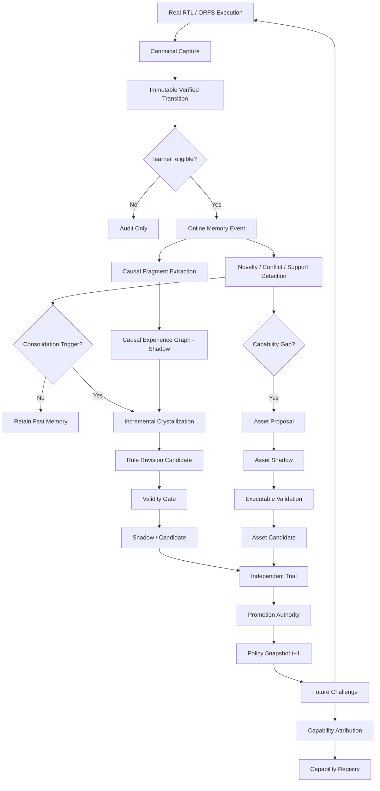

# TEHM / R2G 记忆系统升级技术方案

> **主题**：Causal Experience Graph → Online Memory Evolution → Experience Memory + Asset Memory → Verified Capability Evolution  
> **目标仓库**：`Zhang-D-Y/Typed-Executable-Hardware-Memory`  
> **基线提交**：`1bb1fab259221a541745fed86f0b02b90c039f3f`（2026-08-26）  
> **文档定位**：面向下一轮源码升级的工程设计与实验方案，不是论文结果声明。所有新增能力在获得真实执行、独立验证与 authority 之前均保持 `shadow/evaluation-only`。

---

## 0. 结论先行

当前 TEHM 已经从早期的“结构化经验数据库”发展成一套相当严格的 **verified experience + typed rule + lifecycle authority** 系统。下一阶段不建议继续以“增加更多 memory view / 加一个更复杂的相似度模型”为主，而应把系统升级为一条完整的能力进化链：

```text
Verified Execution
      ↓
Immutable Experience Memory
      ↓
Causal Experience Graph
      ↓
Mechanism-level Retrieval / Abstraction
      ↓
Online Gated Memory Evolution
      ↓
Experience Memory ↔ Asset Memory
      ↓
Policy / Action-Space Change
      ↓
Future Challenge + Oracle
      ↓
Capability Attribution
      ↓
Verified Capability Registry
```

建议把下一阶段的研究目标明确为：

> **R2G 不仅要记住过去成功过的修复，还要从经过 oracle 验证的执行中识别可迁移的 repair mechanism；在不污染 canonical / held-out evidence 的条件下在线演化这些机制；当已有 action space 不足时，通过 Asset Memory 形成新的可验证 repair asset；最后用可归因的行为变化证明 Memory 确实导致了 Capability Evolution。**

### 0.1 当前推进快照（2026-08-26）

已在不触碰 canonical / production authority 的前提下完成一条真实 RTL 的
C4/C5 shadow 链路：两个 learner-eligible training lineage 触发
`CapabilityGapReceipt`，模板按 manifest 的结构化 fix 槽位绑定，在两个 training
lineage 和一个 held-out lineage 上由 Icarus/vvp 独立执行 target + frozen
regression，最终只将 asset 置为 `candidate`。可复核报告为
`evidence/tehm-asset-gap-shadow-rtl-r1-dev/asset_gap_shadow_report.json`。

这不是 production capability promotion：报告明确记录
`canonical_memory_mutation=none`、`promotion_attempted=false`，held-out 不进入
learner memory。当前报告已补齐由证据推导的七项 asset authority receipt：schema、
static、independent verifier、compatibility、cross-lineage、regression-zero 和
rollback 均为 `true`，因此 `asset_promotion_eligible=true` 仅表示候选具备进入
独立 lifecycle 审查的资格；它仍保持 `candidate`，没有执行 promotion，也没有
production runtime 入口。下一步应在更多独立 lineage 和真实 ORFS 证据上复用同一
authority receipt，再决定是否实现显式、人工/独立 authority 驱动的 canonical import。
当前已补上该缺口的第一层：`assets.authority` 提供 content-bound
`AssetAuthorityReceipt`、`verify_asset_authority()` 和 strict `promote_asset()`，
会重新读取 registry asset 并校验 content digest、validation/binding/rollback
证据和七项 gate。当前第二层已落地：validation/binding/rollback payload 会以
split/lineage/verdict/digest 写入 append-only asset evidence ledger，并另存
content-bound receipt row；replay 必须逐行校验 digest、payload 与 receipt row，
再从 ledger 重新推导 gate。该 ledger 是 v4 的 additive extension，旧 v4 DB
在 authority seam 首次使用时幂等创建，不改变已发布 migration chain。真实 asset
shadow 报告仍不自动执行 promotion，更多独立 lineage/ORFS 证据和人工 authority
仍是 production 前置条件。
ledger schema 初始化不使用会隐式提交的 `executescript`；validation/binding/
rollback evidence rows 与 authority receipt row 通过同一 savepoint 原子写入，晚到
的 immutable-row 冲突会整体回滚，且不提交调用方已有事务。

在该 asset shadow 之上，当前又完成了一个 evaluation-only C1–C8 capability
attribution harness：基线、候选、ablation 均重新执行 Icarus/vvp，候选 policy 的
load receipt 与实际 runtime execution receipt 绑定。两个 training lineage、一个
disjoint held-out lineage 和一个异构 non-target 上的结果使 C1–C8 全部通过；但
capability 仍为 `candidate`，`capability_promotion_eligible=true` 只是独立审计
结论。该结论现在还必须由数据库绑定的 C1–C8（及 asset）evidence rows、candidate
policy snapshot 和实际 runtime-load receipt 重放验证；`promote_capability()` 不再
接受调用方内存布尔值作为 authority。`production_promotion_eligible=false`，不执行
任何 lifecycle 或 canonical mutation。报告为
`evidence/tehm-capability-attribution-rtl-r1-dev/rtl_capability_attribution_report.json`。

真实 ORFS fail→pass attribution 也已接入同一数据库绑定 authority contract：
`build_orfs_capability_attribution.py` 会把 C1–C8 分别写入不可变
`tehm_capability_evidence` rows，并绑定 candidate policy snapshot 与实际
evaluation-runtime load receipt；最新 load row 还必须带有实际 candidate runtime
execution receipt，再由 `verify_capability_authority()` 重放校验，避免只凭
snapshot lookup 满足 C3；C4 evidence ref 同时保存该 execution receipt ID，重放时
必须与最新 load row 一致。
其中 C8 的 `gain_without_memory` 不再由调用方布尔值提供：baseline policy 会作为
显式 `M_t+1 - ΔMemory` ablation 执行，并将其 runtime receipt 与 policy-load receipt
写入报告；只有从该回执重放出目标 lineage 未选择新 action、同时 candidate arm 选择
并通过 ORFS oracle，C8 才能成立。
当前 failpass-r2 cohort 的 C1–C8 capability authority receipt 为
`eligible=true`，但这仍是 evaluation-only；六项 rule promotion gate 未建立，
`promotion_attempted=false`，canonical memory 与 production lifecycle 均不变。

为避免把“没有做过实验”和“实验明确失败”混为一个 `false`，
`evaluate_promotion_gates()` 及 capability gate evaluator 现在为每一项同时输出
`gate_status`：`NOT_ESTABLISHED`、`FAIL` 或 `PASS`，并汇总
`not_established`、`failed` 与 `all_gates_established`。因此空的 authority 输入会
明确显示六项均为 `NOT_ESTABLISHED`；只有提供了对应证据但阈值未达标时才记为
`FAIL`。这仍不改变六项合取或 promotion 行为，只提高 authority receipt 的可审计性。

因果 authority 的 witness 防火墙也已进一步收紧：L2/L3 评估通过共享的
`causal.witness` resolver 解析直接 transition 或合法 intervention-pair 引用，
并要求 path 的每一个 source transition 都被同一 campaign 的 training
`learner_eligible` edge 完整覆盖。单个 edge 的部分交集、未知/重复/malformed
引用或跨 campaign 引用均不能支撑整条 path，结果只返回 fail-closed receipt，不改变
canonical memory 或 production lifecycle。

Asset Memory 的输入边界同步 fail-closed：promotion gate、asset schema、registry
load 对非 mapping、损坏 JSON、非对象 contract 或损坏 registry row 返回不可晋级
receipt/unknown asset，不把解析异常升级为 verifier 或 lifecycle authority。

当前 B4 candidate-trial lane 也已接通：`run_shadow_candidate_trial()` 将 preview
规则复制到内存 staging DB，在隔离副本中执行 `shadow → candidate` 和现有 A/B
trial adapter；Icarus/ORFS 通过 evaluator callback 接入。trial、六项 rule promotion
gate 与 source-digest 不变性都会写入 `CandidateTrialReceipt`，但即使 gate 全部
满足也不调用 production authority，`promotion_attempted=false`，canonical 与源
lifecycle 均保持不变。

Activation feedback 也已接入 online event log：`activation/update.py` 在 utility
更新时按 PASS、中性、FAIL/REGRESSION 分别写入 `SUPPORT_INCREASED`、
`UTILITY_DRIFT`、`RULE_HARMFUL`，并绑定 activation provenance 与 utility 前后
快照。evaluation/backend 路径默认标记为非 learner campaign；按 activation ID
幂等，不能因重试放大 support。

同时补齐了 online fast-memory 的触发、operation decision 与 shadow proposal 层：
`observe_transition()`
现在从显式 dataset membership、novelty、conflict、support 和 harmful outcome
推导受影响 effect group，并写入 hash-chained `CONSOLIDATION_TRIGGERED` receipt；
触发后以 `dry_run=True` 同时生成 affected-group 与完整 campaign rebuild 投影，
比较来源 transition witness，并写入 `RULE_REVISION_PROPOSED`。该 proposal 只表达
可审计的 shadow revision；纯函数决策层进一步区分 `RETAIN`、`ADD`、`MERGE`、
`REVISE`、`SPLIT` 和 `QUARANTINE`，但不写 `tehm_rules`、`tehm_rule_revisions`
或 lifecycle；
此处 `triggered` 仍仅表示满足 consolidation 条件，且 held-out/calibration 永远
返回 `NOT_LEARNER_ELIGIBLE`、不进入 learner consolidation。

三个核心升级按依赖关系排序：

1. **Experience Graph → Causal Experience Graph**：解决“为什么这条经验能迁移”。
2. **Batch Rebuild → Online Gated Evolution**：解决“什么时候应该学习、合并、修订、拆分或遗忘”。
3. **Experience Memory + Asset Memory → Capability Evolution**：解决“Memory 到底让 Agent 学会了什么以前不会的能力”。

这三个阶段必须串联，不应实现成三个互相独立的功能插件。

---

# 1. 当前最新版 TEHM 基线评估

## 1.1 当前已经具备的基础

基线提交 `1bb1fab` 中，以下基础不应推翻，应作为下一阶段的安全边界继续复用。

### 1.1.1 Schema v3 + canonical evidence substrate

当前 `memory/tehm/schema.sql` 已进入 `tehm-v3`，canonical substrate 已包含：

- `tehm_states`
- `tehm_transitions`
- `tehm_episodes`
- `tehm_episode_steps`
- `tehm_dataset_membership`
- `tehm_views`
- `tehm_rules`
- `tehm_rule_sources`
- `tehm_activations`
- `tehm_rule_status`
- `tehm_edges`
- `tehm_trials`
- `tehm_physical_effects`

其中最关键的新基础是 `tehm_dataset_membership`：

```text
transition
    ↓
campaign_id
split = training / calibration / heldout / ab
learner_eligible = 0 / 1
```

这意味着 **“证据可以保留”与“证据允许影响 learner”已经被数据平面显式分开**。后续 causal / online / capability 模块必须继续遵守这一防火墙。

### 1.1.2 Compatibility Profile 已进入 runtime contract

当前 `RepairContext` 已含：

```python
structural_graph: dict | None
compatibility_profile: str | None
```

RTL action 也已通过 `tehm/rtl/compatibility.py` 使用显式 compatibility profile，例如：

```text
rtl.fsm.single_guard.v1
rtl.sequential.reset_branch.v1
rtl.combinational.width_assignment.v1
rtl.fsm.case_reorder.v1
rtl.ast.literal_rewrite.v1
```

这是后续 causal mechanism abstraction 的重要入口：**causal path 不应跨结构不兼容 executor 被合并。**

### 1.1.3 Crystallization 已具备 dataset / compatibility-aware 行为

当前 `crystallize_all()` 已经：

1. 只加载指定 `campaign_id` 中 `learner_eligible=1` 的 transition；
2. 在 `primary_effect_key` 分组后，再按 `compatibility_profile` 拆分；
3. 对每组执行 role normalization + anti-unification + validity audit；
4. 保留已有 rule utility，而不是在 re-crystallization 时重置；
5. 对完整 rebuild 中消失或失效的 rule 执行 `retired / quarantined`。

这说明系统已经开始具备“规则不是永久 append-only”的雏形。

### 1.1.4 Production Authority 已明显强化

当前 promotion gate 为六项合取：

```text
rollback_verified
registry_verified
obligation_coverage
cross_lineage_te
harmful_rate
conformal_coverage
```

并且 production retrieval 默认只允许 `promoted` rule；`candidate` 只允许隔离评估显式 opt-in。

后续所有新模块都必须遵守：

> **Causal score、online confidence、asset synthesis score、capability score 都不是 authority。**

### 1.1.5 ORFS batch lane 已形成正确的数据平面边界

当前 batch lane 已经明确：

```text
真实 ORFS attempt
    ↓
external observation receipt
    ↓ full-oracle grading
eligible support only
    ↓
isolated staging
    ↓ independent authority receipt
canonical import
```

并且 batch runner 本身不能直接写 canonical。

这一结构非常适合直接扩展成 Online Memory 的 **Fast Evidence Lane**，而无需把 production DB 变成“每次交互即时自修改”的危险系统。

### 1.1.6 Physical Effect Memory + Typed Utility Contract 已提供 causal effect 的雏形

当前 physical memory 已经保存：

```text
(action, graph_context)
    → ΔWNS / ΔTNS / ΔArea / ΔPower / ...
```

并且 typed utility contract 已经把：

- action signature
- operation point
- hard oracle
- resource budgets
- OOD ceiling
- uncertainty interval
- proposal / abstain

显式分开。

这意味着后续 Causal Experience Graph **不必重新发明 effect evidence**，应复用 `tehm_physical_effects` 与 utility contract 的 action-bound evidence。

---

## 1.2 当前最重要的结构性缺口

### 缺口 A：`tehm_edges` 仍是 provenance / relation graph，不是 causal graph

目前典型关系仍接近：

```text
Transition --EXECUTED_FROM--> State
Transition --PRODUCED_STATE--> State
Transition --PART_OF_EPISODE--> Episode
```

它回答的是：

> “哪些对象之间有关联？”

但还不能可靠回答：

> “哪个 state condition 使 action 有效？”  
> “action 通过哪个 intermediate effect 消除了 failure？”  
> “这个 effect 是相关性、真实 intervention、A/B 对照，还是跨 lineage 重复验证？”

因此不能直接把 `tehm_edges` 改名为 causal graph。

### 缺口 B：Memory update 仍以 `rebuild() → crystallize_all()` 为中心

当前主入口仍是：

```text
capture
capture
capture
   ↓
rebuild()
   ↓
crystallize_all()
   ↓
full revalidation / retirement
```

虽然已有 rule retirement 和 utility-preserving re-crystallization，但核心仍是 batch-style consolidation。

真正的 online memory 需要：

```text
每个新 verified transition 到达
    ↓
判断 novelty / support / conflict / contradiction / risk
    ↓
只更新受影响的 mechanism group
    ↓
产生 shadow revision
    ↓
经过独立验证后才改变 runtime authority
```

### 缺口 C：规则增长 ≠ 能力进化

当前系统可以证明：

- rule 数增加；
- retrieval 命中；
- activation 成功；
- held-out replay 成功；
- harmful activation 受控。

但还没有一个正式对象回答：

```text
M_t 具备哪些已验证能力？
M_{t+1} 新增了什么？
这个新增能力是否真的由 memory change 导致？
如果移除 ΔM，新增能力是否消失？
```

也就是说，目前仍缺：

```text
Memory Change
   ↓
Policy / Asset Change
   ↓
Behavior Change
   ↓
Capability Gain
```

的可审计链路。

### 缺口 D：Experience Memory 仍基本局限在“已有 action family 的经验抽象”

当已有 `Action` / repair operator 根本无法覆盖某类 failure 时，当前 memory 无法自然表达：

> “不是我不会选，而是我的 action space 中没有正确工具。”

这就是 Experience Memory + Asset Memory 必须引入的原因。

---

## 1.3 backend seam 修复状态

当前 `contracts.RepairContext` 和 `query_planner.plan_query()` 已支持 `compatibility_profile`，但在基线提交的 `TehmMemoryBackend.retrieve()` 中，`MemoryQuery` 被重建为 `RepairContext` 时只恢复：

```text
design_id
platform
check
symptom_signature
```

没有恢复：

```text
compatibility_profile
structural_graph
```

基线版本的 backend seam 曾可能发生：

```text
build_query(context with compatibility_profile)
    ↓
MemoryQuery contains compatibility_profile
    ↓
backend.retrieve(query)
    ↓
reconstruct RepairContext
    ↓
compatibility_profile lost
```

而 `symbolic_filter` 对 concrete rule profile 在 query profile 缺失时会返回 `UNRESOLVED`。

### P0 已修复

`TehmMemoryBackend.retrieve()` 现直接调用
`retrieval.retrieve_query(conn, query)`，不再使用“query → context → 再 plan_query”
的 round-trip；因此 `structural_graph`、`compatibility_profile`、mechanism/causal
context 与 prior-action 字段会沿 backend seam 保持不变，并由 regression test 锁定。

已采用方案：

```python
retrieve_query(conn, query: MemoryQuery, ...)
```

让 retrieval pipeline 直接接受已经冻结的 `MemoryQuery`。

兼容性兜底方案（当前不再需要）：至少完整恢复：

```python
compatibility_profile=qp.get("compatibility_profile")
structural_graph=qp.get("structural_graph")
```

同一 savepoint/commit discipline 也已应用到 backend `rebuild()`：crystallization、
lifecycle enrollment 与 honesty audit 失败时整体回滚 derived projection，不影响外层
事务；因此该 P0 不再阻塞后续真实 ORFS campaign。

---

# 2. 下一代总体设计原则

## 2.1 Immutable Evidence First

`tehm_states / transitions / episodes / artifacts` 继续作为不可替代的原始证据层。

任何：

- causal abstraction
- rule revision
- mechanism merge
- capability promotion
- asset promotion

都不得覆盖原始 transition。

### 原则

```text
Raw evidence can be superseded by interpretation,
but must never be replaced by interpretation.
```

---

## 2.2 Causal Claim 与 Provenance Edge 必须分离

不能把：

```text
A occurred before B
```

直接当作：

```text
A caused B
```

因此建议保留：

```text
tehm_edges          # provenance / topology / relation
```

新增：

```text
tehm_causal_*       # explicit causal claims + evidence level
```

---

## 2.3 Online ≠ Immediate Production Mutation

Online memory 的定义不是：

```text
每次 PASS → 立刻改 active rule
```

而是：

```text
interaction-driven observation
→ immediate shadow update
→ triggered consolidation
→ independent validation
→ authority-controlled activation
```

因此建议采用：

```text
Fast Memory = online evidence / shadow hypothesis
Slow Memory = validated mechanism / rule / asset
```

---

## 2.4 Experience 与 Asset 必须使用不同 authority

Experience 是“发生过什么、什么机制可能有效”；Asset 是“系统拥有了什么可执行能力”。

不能因为一段经验表明某个新 operator 可能有用，就直接把该 operator 加入 production action space。

Asset 也必须：

```text
draft → shadow → candidate → promoted / demoted / quarantined / retired
```

---

## 2.5 Capability 必须是可验证对象，不是叙述性标签

“系统会修 reset bug”不是 capability evidence。

Capability 至少需要：

```text
failure mechanism
applicability predicates
action / asset set
verification obligations
budget
support / held-out support
memory version / policy snapshot
```

---

# 3. 第一阶段：Causal Experience Graph

# 3.1 目标

把当前：

```text
S_t --A_t--> S_{t+1}
```

升级为：

```text
State Condition
     ↓ ENABLES
Action / Intervention
     ↓ CHANGES
Intermediate Effect
     ↓ MEDIATES
Failure Mechanism State
     ↓ REMOVES / CREATES / PRESERVES
Oracle / Obligation Outcome
```

核心不再只是“case 相似”，而是“failure mechanism / effect path 相似”。

---

## 3.2 EDA 为什么特别适合做 causal memory

普通 Agent 的 causal memory 常依赖自然语言推断；R2G/TEHM 有更强的证据条件：

```text
真实 before state
真实 action
真实 after state
真实 RTL / netlist / graph
真实 simulator / signoff
真实 A/B trial
真实 rollback receipt
真实 PPA delta
```

所以可以把 action 视为明确 intervention：

\[
S_t \xrightarrow{do(A_t)} S_{t+1}
\]

但注意：**执行了 intervention 仍不自动等于已经识别了完整因果机制。**

---

## 3.3 Causal Evidence Level

建议所有 causal edge 必须携带 `evidence_level`。

### L0 — ASSOCIATION

只观察到共现：

```text
A 与 ΔO 共同出现
```

不能用于 production causal claim。

### L1 — EXECUTED_INTERVENTION

真实执行：

```text
do(A) → observed ΔO
```

有 transition + verifier，但没有 control arm。

### L2 — CONTROLLED_INTERVENTION

同一 target / comparable target 存在：

```text
control
vs
treatment
```

并且 toolchain / oracle / budget / source snapshot 受控。

### L3 — REPLICATED_EFFECT

相同 mechanism / action path 在多个独立 lineage 上重复出现。

要求至少记录：

```text
unique_lineages
unique_designs
unique_runs
```

### L4 — TRANSFER_SUPPORTED_MECHANISM

在训练之外的：

```text
held-out lineage / unseen design / disjoint failure instance
```

仍成立。

> **只有 L2+ 才建议在论文中使用较强的 causal / intervention-grounded 表述；L0/L1 应保守描述为 association / intervention evidence。**

---

## 3.4 建议的数据模型

### 3.4.1 `tehm_causal_nodes`

```sql
CREATE TABLE tehm_causal_nodes (
    causal_node_id        TEXT PRIMARY KEY,
    node_type             TEXT NOT NULL,
    owner_type            TEXT,
    owner_id              TEXT,
    payload_json          TEXT NOT NULL,
    payload_digest        TEXT NOT NULL,
    extractor_version     TEXT NOT NULL,
    created_at            TEXT NOT NULL
);
```

建议 `node_type`：

```text
STATE_CONDITION
ACTION
INTERMEDIATE_EFFECT
FAILURE_MECHANISM
ORACLE_OUTCOME
OBLIGATION
REGRESSION
PHYSICAL_EFFECT
ASSET
CAPABILITY
```

### 3.4.2 `tehm_causal_edges`

```sql
CREATE TABLE tehm_causal_edges (
    causal_edge_id        TEXT PRIMARY KEY,
    source_node_id        TEXT NOT NULL,
    relation_type         TEXT NOT NULL,
    target_node_id        TEXT NOT NULL,
    evidence_level        TEXT NOT NULL,
    support_json          TEXT NOT NULL,
    confidence_json       TEXT NOT NULL,
    evidence_refs_json    TEXT NOT NULL,
    campaign_id           TEXT,
    learner_eligible      INTEGER NOT NULL,
    created_at            TEXT NOT NULL
);
```

建议关系：

```text
ENABLES
BLOCKS
INTERVENES_ON
CHANGES
MEDIATES
REMOVES
CREATES
PRESERVES
CONTRADICTS
SUPPORTS
SPECIALIZES
GENERALIZES
```

### 3.4.3 `tehm_causal_paths`

路径本身也应可内容寻址：

```sql
CREATE TABLE tehm_causal_paths (
    path_id               TEXT PRIMARY KEY,
    mechanism_family      TEXT NOT NULL,
    compatibility_profile TEXT,
    ordered_nodes_json    TEXT NOT NULL,
    ordered_edges_json    TEXT NOT NULL,
    evidence_level        TEXT NOT NULL,
    support_json          TEXT NOT NULL,
    source_transitions_json TEXT NOT NULL,
    path_digest           TEXT NOT NULL,
    status                TEXT NOT NULL,
    created_at            TEXT NOT NULL,
    updated_at            TEXT NOT NULL
);
```

`status` 初期只允许：

```text
shadow
candidate
validated
retired
```

注意：**causal path status 不等于 production rule lifecycle。**

### 3.4.4 `tehm_intervention_pairs`

用于明确存 A/B 或对照证据：

```text
pair_id
control_transition_id
treatment_transition_id
target_scope
matched_context_digest
changed_action_digest
outcome_delta_json
oracle_equivalence_json
lineage_id
validity_status
```

---

## 3.5 Path Extraction：不要让 LLM 直接写 CAUSES

### RTL path

优先从可执行/结构化信息生成：

```text
RTL graph
+ parser facts
+ before/after AST delta
+ failure trace
+ action payload
+ simulator result
+ obligation result
```

例如：

```text
FAILURE_MECHANISM:
completion transition unreachable

STATE_CONDITION:
source_state = WAIT
candidate edge = WAIT→DONE
guard = req && !ack

ACTION:
GUARD_RESTORE

INTERMEDIATE_EFFECT:
edge enabled under legal handshake completion

OUTCOME:
target test PASS
regression PASS
```

### Flow / physical path

复用：

```text
tehm_physical_effects
utility contract
graph_context
action_signature
strict signoff
```

形成：

```text
STATE_CONDITION
high utilization + graph profile
    ↓
ACTION
DENSITY_RELIEF 50→45
    ↓
PHYSICAL_EFFECT
ΔWNS / ΔArea / ΔPower
    ↓
UTILITY CONTRACT
PASS / FAIL / ABSTAIN
```

这里尤其要保留“非单调性”和 harmful effect，而不是只构建成功 causal path。

---

## 3.6 Causal Path Builder 模块

新增：

```text
memory/tehm/causal/
├── __init__.py
├── schema.py
├── nodes.py
├── edges.py
├── path_builder.py
├── intervention.py
├── evidence_level.py
├── mechanism.py
├── matcher.py
├── attribution.py
└── receipts.py
```

建议 API：

```python
build_transition_causal_fragment(
    conn,
    transition_id: str,
) -> CausalFragment
```

```python
build_intervention_pair(
    control_transition_id: str,
    treatment_transition_id: str,
) -> InterventionReceipt
```

```python
consolidate_causal_path(
    fragments: list[CausalFragment],
) -> CausalPathCandidate
```

---

## 3.7 Retrieval Pipeline 升级

当前：

```text
plan_query
→ high_recall
→ symbolic_filter
→ rerank
```

建议：

```text
plan_query
    ↓
metadata high-recall
    ↓
state / compatibility match
    ↓
causal-path recall
    ↓
mechanism match
    ↓
symbolic applicability veto
    ↓
causal evidence weighting
    ↓
utility / confidence / risk rerank
```

### Query 扩展

`RepairContext` 建议增加：

```python
mechanism_signature: dict | None = None
failure_graph_digest: str | None = None
causal_context_digest: str | None = None
prior_action_digests: list[str] = field(default_factory=list)
```

`MemoryQuery.query_plan` 增加：

```text
mechanism_family
causal_path_features
required_effect
forbidden_effects
prior_attempts
```

### Score

建议第一版不要直接用 learned ranker：

\[
Score =
S_{meta}
\times S_{state}
\times S_{causal}
\times U
\times C_{evidence}
\times (1-R)
\]

其中：

```text
S_meta       = 现有 check / obligation / family
S_state      = compatibility + structural context
S_causal     = causal path / mechanism overlap
U            = rule utility
C_evidence   = causal evidence level + support
R            = regression / uncertainty / harmful risk
```

当前 evaluation-only causal lane 将 `support` 进一步拆成可重放的
source-transition 与独立 lineage 覆盖，而不是接受调用方自报的 support 分数：

```text
source_component  = min(1, canonical_source_transition_count / 2)
lineage_component = min(1, distinct_canonical_source_state_lineages / 2)
C_support         = mean(source_component, lineage_component)
```

单一 source transition 的 `C_support=0.5`；至少两个 source transitions 且来自至少
两个独立 canonical lineage 才标记 `ESTABLISHED` 并得到 `C_support=1.0`。source
transition 缺失、重复、`fragment_count` 与实际 witness 不一致，或 canonical lineage
无法重放时，causal evaluator 必须 fail-closed。当前 shadow score 因此实现为
`S_causal × C_support × U × (1-R)`；该因子只用于 evaluation/shadow 排序，不能成为
production retrieval 或 promotion authority。

**symbolic veto 始终高于 score。**

---

## 3.8 与当前 `compatibility_profile` 的关系

`compatibility_profile` 不应该被 causal path 替代。

建议逻辑：

```text
Compatibility
    = “这个 executor / structural family 能不能在此处应用”

Causal Mechanism
    = “为什么这个 action 在这种结构中能消除这个 failure”
```

因此：

```text
profile mismatch → INAPPLICABLE
profile match + causal mismatch → low score / unresolved
profile match + causal path supported → candidate
```

---

## 3.9 第一阶段验收条件

第一阶段只做 **shadow causal memory**，不能改变 production retrieval。

必须满足：

1. 每条 causal edge 都可追溯到 canonical transition / trial / oracle；
2. L0/L1 不允许升级为强 causal claim；
3. held-out / calibration 数据可以形成审计节点，但 `learner_eligible=0` 时不能参与 consolidation；
4. causal graph rebuild 不改变 canonical transition count；
5. causal matcher 可以在固定 fixture 上区分：
   - structural-compatible but mechanism-mismatch；
   - mechanism-similar but compatibility-mismatch；
   - true compatible + mechanism match；
6. production default behavior与现有 v3 完全一致。

---

# 4. 第二阶段：从 Batch Rebuild 到 Online Gated Memory Evolution

# 4.1 核心思想

不要把 online evolution 实现为：

```text
新 transition
→ rebuild all
→ 直接改 active memory
```

而应该实现：

```text
Verified Transition
    ↓
Fast Shadow Observation
    ↓
Novelty / Conflict / Support / Risk Detection
    ↓
Affected Mechanism Group
    ↓
Incremental Consolidation Candidate
    ↓
Validation
    ↓
Shadow / Candidate Revision
    ↓
Independent Runtime Trial
    ↓
Authority
```

---

## 4.2 Fast Memory 与 Slow Memory

### Fast Memory

每个 canonical learner-eligible transition 到达后立即产生：

- transition event
- causal fragment
- mechanism signature
- novelty result
- conflict result
- affected rule IDs
- affected causal path IDs

触发 consolidation 时，fast lane 还产生一个只读的 `IncrementalCrystallizationReceipt`
（`mode=preview`）。它同时携带 affected projection、完整 rebuild 中对应的规则
ID 以及 `full_rebuild_equivalent`，作为后续显式 candidate revision 的输入；该步骤
不改变任何 canonical、rule 或 lifecycle 表。

但不改变 production authority。

### Slow Memory

只有触发条件满足才做 consolidation：

```text
SufficientSupport
OR NovelMechanism
OR RuleConflict
OR RepeatedFailure
OR HarmfulActivation
OR UtilityDrift
OR CapabilityGap
```

---

## 4.3 新增 Memory Event Log

新增：

```sql
CREATE TABLE tehm_memory_events (
    event_id              TEXT PRIMARY KEY,
    event_type            TEXT NOT NULL,
    source_type           TEXT NOT NULL,
    source_id             TEXT NOT NULL,
    campaign_id           TEXT,
    learner_eligible      INTEGER NOT NULL,
    payload_json          TEXT NOT NULL,
    previous_event_digest TEXT,
    event_digest          TEXT NOT NULL,
    created_at            TEXT NOT NULL
);
```

事件类型：

```text
TRANSITION_CAPTURED
CAUSAL_FRAGMENT_CREATED
NOVEL_MECHANISM
SUPPORT_INCREASED
RULE_CONFLICT
RULE_HARMFUL
UTILITY_DRIFT
CONSOLIDATION_TRIGGERED
RULE_REVISION_PROPOSED
ASSET_GAP_DETECTED
CAPABILITY_EVIDENCE_ADDED
```

建议沿用 Batch lane 的 hash-chain 思路，使 online memory evolution 本身可重放。

事件写入器不能只相信调用方传入的 `learner_eligible` 布尔值：对
`transition`、`causal_fragment` 和 `activation` source，必须反向解析其 canonical
transition witness，并确认该 transition 在同一 campaign 中满足
`split='training' AND learner_eligible=1`；链校验也应重复这一检查。

---

## 4.4 Online Memory Operation

系统必须支持的不只是 `ADD`：

```text
RETAIN
ADD
MERGE
SPECIALIZE
GENERALIZE
REVISE
SPLIT
DEMOTE
QUARANTINE
RETIRE
ROLLBACK
```

### 示例：Rule Split

当前规则：

```text
R:
GUARD_RESTORE → positive
```

新 evidence 发现：

```text
priority-sensitive FSM 中产生竞争路径
```

错误做法：

```text
utility.harmful += 1
```

更合理：

```text
R
├─ R1: non-overlap guard → applicable
└─ R2: priority-overlap → inapplicable / separate operator
```

这才是真正的 memory structure evolution。

---

## 4.5 Incremental Crystallization

当前 `crystallize_all()` 做全量 campaign rebuild。

建议保留它作为：

```text
full audit / freeze / reproduce / recovery path
```

另新增：

```python
preview_affected_groups(
    conn,
    transition_ids: list[str],
    campaign_id: str,
) -> IncrementalCrystallizationReceipt

crystallize_affected_groups(
    conn,
    transition_ids: list[str],
    campaign_id: str,
) -> IncrementalCrystallizationReceipt
```

`preview_affected_groups()` 必须保持只读：affected-group 与完整 campaign rebuild
都以 `dry_run=True` 执行，并按 episode-owned source transition 比较对应规则。
affected projection 还必须同时限定 `(primary_effect_key, compatibility_profile)`，
不能因为同一 effect key 把不兼容 executor 一并重建。
只有后续显式、隔离的 `crystallize_affected_groups()` 才能写入 candidate rule
和 revision；两条路径都不能自行授予 production authority。

增量 persist 必须作为一个 derived-state 原子操作执行：规则、memory event 和
revision 写入共用 SQLite savepoint，并在提交前重算
`raw-evidence-preservation-v1`。receipt 记录 raw evidence 前后 digest；如果
affected/full projection 不等价或 raw evidence 发生变化，整个 derived update
必须回滚，不能留下半个 rule/revision。该 savepoint 只保证派生状态的一致性，不
改变 promoted-only runtime 或任何 production authority gate。

内部：

```text
new transition
    ↓
primary_effect_key
    ↓
compatibility_profile
    ↓
mechanism_signature
    ↓
affected groups only
```

推荐 grouping key：

```text
primary_effect_key
| compatibility_profile
| mechanism_family
```

注意 mechanism 早期不成熟时，可以只作为 third-level candidate grouping，不能直接导致过度拆分。

---

## 4.6 Rule Lineage / Revision History

当前 rule_id 是 content-addressed definition；一旦 rule 结构改变，会变成新 rule。

需要显式表达：

```text
R_old
  ↓ SPECIALIZED_TO
R_new
```

新增：

```sql
CREATE TABLE tehm_rule_revisions (
    revision_id            TEXT PRIMARY KEY,
    parent_rule_id         TEXT,
    child_rule_id          TEXT NOT NULL,
    operation              TEXT NOT NULL,
    trigger_event_id       TEXT NOT NULL,
    evidence_refs_json     TEXT NOT NULL,
    validation_json        TEXT NOT NULL,
    created_at             TEXT NOT NULL
);
```

`operation`：

```text
MERGE / SPLIT / SPECIALIZE / GENERALIZE / REVISE
```

这样可以回答：

> “当前 promoted rule 是由哪些历史版本如何演化来的？”

---

## 4.7 Conflict Detection

新增：

```text
memory/tehm/evolution/conflict.py
```

冲突至少分：

### Definition Conflict

同一 mechanism / compatibility context：

```text
相似 precondition
→ 不同 action
```

### Outcome Conflict

```text
same rule
same mechanism
→ PASS in lineage A
→ REGRESSION in lineage B
```

### Effect Conflict

```text
same action signature
→ ΔWNS positive
→ ΔWNS negative
```

### Obligation Conflict

```text
target fixed
but non-target obligation broken
```

所有冲突进入 shadow revision，不自动覆盖 active rule。

---

## 4.8 Online Manager

新增：

```text
memory/tehm/evolution/
├── __init__.py
├── manager.py
├── events.py
├── novelty.py
├── conflict.py
├── triggers.py
├── incremental_crystallize.py
├── revision.py
├── consolidation.py
├── rollback.py
└── receipts.py
```

主 API：

```python
observe_transition(
    conn,
    transition_id,
    campaign_id,
) -> OnlineMemoryReceipt
```

推荐执行：

```python
1. verify dataset learner eligibility
2. create memory event
3. create causal fragment
4. evaluate novelty
5. evaluate conflict
6. find affected groups
7. evaluate consolidation trigger
8. if triggered: build shadow revision
9. run validity audit
10. update shadow/candidate only
11. never production-promote here

`novelty` 的已知路径查询也必须绑定目标 campaign 的
`split='training' AND learner_eligible=1` source transitions；不能因为全局存在
held-out/calibration shadow path 就把 learner-side mechanism 判为已知，从而抑制
`NOVEL_MECHANISM` 触发。
该 observation seam 现在以单一 savepoint 原子写入 causal fragment 与整条 event
chain；后续 novelty/conflict/preview 失败会回滚全部派生 rows，已有外层事务则由
调用方负责最终 commit，避免产生孤立的事件前缀或 causal nodes/edges。
```

---

## 4.9 与当前 Batch Lane 的正确接法

非常重要：

```text
external ORFS receipt
```

不能直接触发 online learner。

正确路径：

```text
external observation
    ↓
staging
    ↓
authority-gated canonical import
    ↓
tehm_dataset_membership learner_eligible=1
    ↓
ONLINE MEMORY EVENT
```

canonical import 的 authority case 集合必须非空、完全存在于当前 hash-chain，并且每个
被选 row 同时满足 Batch lane 的 `split=support`、`classification=ELIGIBLE_POSITIVE`
与 `learner_eligible=true`；未知 case、空选择或 held-out/不一致 row 一律 fail-closed。

该谓词是 `split='training' AND learner_eligible=1` 的合取，不允许 calibration、
held-out 或 A/B 通过错误的显式标记进入 learner。capture/assignment 在写入时拒绝
非 training 的 `learner_eligible=true`；为兼容旧库，所有 learner 查询入口仍重复检查
training split，遇到直接 SQL 造成的矛盾行也必须 fail-closed。

canonical import 的 staging 绑定不再停留在文件级 digest。authority builder 会对选中的
每个 case 在只读 staging 快照中重放 execution record、唯一 transition、training
membership、typed observation/verifier payload 和 physical effect，并把规范化后的
`case_id/record_id/transition_id` 集合固化为 `staging_witness_sha256`。消费 authority
时重新执行同一 witness replay；随后导入 savepoint 在释放前再次检查 observations 与
staging DB digest，以阻断文件内容在校验和写入之间发生的 TOCTOU 漂移。任何缺失、重复、
跨 campaign、非 training 或 payload/delta 不一致都 fail-closed，旧的无 witness allow
receipt 不能进入 canonical。

也就是说：

> **Online 指 canonical evidence 一旦合法进入 learner 后，memory management 可以 interaction-driven；不表示外部 observation 可以绕过 authority 即时训练。**

批量 support 的 staging import 与 canonical import 必须继续保持同一保存点语义：
每个 `capture()` 的 canonical rows/five views、对应 physical effect 以及整批导入
只在全部 receipt 通过后一起提交；任一晚到的 malformed receipt 或 derived write
异常都回滚整批。content-addressed artifact 若在失败前已经写出，只能是无引用
orphan，不能被任何 canonical row 采用。这是 external→staging→canonical 边界的
派生状态原子性，不等价于 promotion authority。

---

## 4.10 Anti-forgetting 原则

不要删除 raw episode 来“整理 memory”。

建议：

```text
Raw transition / episode: immutable
Derived causal path: versioned
Rule: versioned + lifecycle
Asset: versioned + lifecycle
Capability: versioned + evidence
```

`retired` 只代表：

> 不再拥有 runtime authority。

不代表：

> 删除证据。

物理效果写入同样遵守该边界：同一 transition 的
`PhysicalEffectMemory.record()` 重放必须是 content-equivalent 才能幂等返回；
PPA、delta 或 provenance 冲突必须 fail-closed，不能通过 `INSERT OR REPLACE` 静默
覆盖 raw physical evidence。缺失 graph context 只能由显式 enrichment 补齐，不能
清空既有绑定。

当前 full rebuild 的 stale-rule maintenance 已增加
`raw-evidence-preservation-v1` fingerprint guard：states、transitions、episodes、
episode steps、dataset membership、experience edges 与 physical effects 的内容在
lifecycle retirement 前后必须一致，否则 crystallization fail-closed。该 guard 仍
不把 derived rule/lifecycle row 当作 raw evidence，也不替代外部文件/ORFS rollback
receipt。

---

# 5. 第三阶段：Experience Memory + Asset Memory

# 5.1 为什么必须引入 Asset Memory

只有 Experience Memory 时，系统通常只能在固定 action space 内改进：

```text
已有 operator A/B/C
    ↓
memory 学会何时选 A/B/C
```

这最多证明：

```text
Selection Evolution
```

但真正的 Capability Expansion 需要：

```text
当前 action space 无法解决 failure F
    ↓
Memory 识别 capability gap
    ↓
形成新的 executable asset
    ↓
验证
    ↓
加入 action space
```

即：

\[
\mathcal{A}_t \subset \mathcal{A}_{t+1}
\]

---

## 5.2 R2G 中的 Asset 定义

Asset 不等同于 LLM 权重。

建议第一阶段只允许以下可审计类型：

```text
REPAIR_OPERATOR
RTL_REWRITE_TEMPLATE
FLOW_CONFIG_TRANSFORM
DIAGNOSTIC_EXTRACTOR
STRUCTURAL_PREDICATE
VERIFICATION_OBLIGATION
TOOL_ROUTING_POLICY
LOCALIZATION_PROCEDURE
EXECUTION_MACRO
AGENT_ROLE_PROFILE
```

例如：

```text
Asset:
rtl.priority_guard_repair.v1

Inputs:
FSM graph + overlap edges + failure trace

Action:
priority-aware guard rewrite

Required verifier:
target sim + priority regression + reset regression

Compatibility:
rtl.fsm.priority_overlap.v1
```

---

## 5.3 Asset Registry

新增：

```sql
CREATE TABLE tehm_assets (
    asset_id               TEXT PRIMARY KEY,
    asset_type             TEXT NOT NULL,
    name                   TEXT NOT NULL,
    version                TEXT NOT NULL,
    definition_json        TEXT NOT NULL,
    input_contract_json    TEXT NOT NULL,
    output_contract_json   TEXT NOT NULL,
    verifier_contract_json TEXT NOT NULL,
    compatibility_json     TEXT NOT NULL,
    provenance_json        TEXT NOT NULL,
    content_digest         TEXT NOT NULL,
    created_at             TEXT NOT NULL
);
```

生命周期：

```sql
CREATE TABLE tehm_asset_status (
    asset_id          TEXT NOT NULL,
    target_scope      TEXT NOT NULL,
    status            TEXT NOT NULL,
    status_version    INTEGER NOT NULL,
    provenance_json   TEXT NOT NULL,
    updated_at        TEXT NOT NULL,
    PRIMARY KEY(asset_id, target_scope)
);
```

状态：

```text
draft
shadow
candidate
promoted
demoted
quarantined
retired
```

注册入口只能创建 `observed_gap` 或 `candidate`，不能通过
`register_capability()` 直接授予 `verified/promoted` authority。同一
`(capability_id, evidence_type, evidence_id)` 的 evidence receipt 必须幂等；若
其 split、verdict 或 lineage 发生变化，系统应拒绝覆盖，以保持 capability 证据的
不可变 provenance。

---

## 5.4 Capability Gap Detector

新增：

```text
memory/tehm/assets/gap_detector.py
```

不能把“单次失败”直接判为 capability gap。

建议满足以下证据之一才产生 candidate gap：

### Repeated Unsupported Mechanism

```text
同一 mechanism
≥ 多个独立 lineage
且现有 promoted asset/rule 无 executable candidate
```

### Repeated Executable Failure

```text
有 candidate
可执行
但在相同 mechanism 上反复 FAIL
```

### Structural Coverage Gap

```text
compatibility profile 不存在任何 promoted asset
```

### Obligation Coverage Gap

```text
现有 action 可修 target
但无法满足关键 non-target obligation
```

输出：

```python
CapabilityGapReceipt(
    gap_id,
    mechanism_family,
    evidence_transitions,
    missing_asset_types,
    current_action_coverage,
    confidence,
)
```

---

## 5.5 Asset Synthesis 不直接进入 production

推荐流程：

```text
Capability Gap
    ↓
Asset Proposal
    ↓
static/schema validation
    ↓
shadow asset
    ↓
contained execution
    ↓
real oracle
    ↓
cross-lineage trial
    ↓
candidate
    ↓
asset promotion authority
```

### 重要原则

生成 Asset 的 LLM/agent **不能作为该 Asset 的唯一 verifier**。

Verifier 必须来自：

```text
compiler
simulator
formal/equivalence
signoff
regression suite
registered obligation
```

---

## 5.6 Experience Memory ↔ Asset Memory 双向闭环

```text
Experience Memory
      │
      ├─ identifies recurring mechanism
      ├─ identifies conflict
      ├─ identifies capability gap
      ↓
Asset Memory
      │
      ├─ new operator
      ├─ new predicate
      ├─ new verifier obligation
      └─ new tool procedure
      ↓
Future Executions
      ↓
New Verified Experience
      └──────────────→ Experience Memory
```

这条闭环比“memory → retrieval”更接近真正的自进化。

---

# 6. 最核心：Memory 如何导致 Capability Evolution

# 6.1 不再把 success-rate improvement 直接称为 capability evolution

建议明确区分三个层次。

### Level 1 — Selection Evolution

action space 不变，只是：

```text
选对已有策略的概率提高
```

### Level 2 — Strategy Evolution

action primitive 不变，但新增：

```text
新前提
新组合
新顺序
新条件化 policy
```

### Level 3 — Capability Expansion

出现新的 executable asset，导致原本不可解 mechanism 可解。

```text
A_t ⊂ A_t+1
```

论文和报告中必须区分三者。

---

## 6.2 Capability 正式定义

建议：

\[
c = \langle F, P, A, Q, B, E \rangle
\]

其中：

- `F`：failure mechanism / defect class
- `P`：applicability predicates / structural context
- `A`：required promoted rule / asset set
- `Q`：verification obligations
- `B`：budget contract
- `E`：verified evidence

示例：

```yaml
capability_id: cap.rtl.fsm.priority_guard_repair.v1
failure_mechanism:
  family: fsm_completion_blocked_by_priority_guard
applicability:
  compatibility_profile: rtl.fsm.priority_overlap.v1
required_assets:
  - asset:rtl.priority_guard_repair.v1
verification:
  - TARGET_FAILURE_REMOVED
  - PRESERVE_RESET_SEMANTICS
  - PRESERVE_PRIORITY_BEHAVIOR
budget:
  max_candidates: 3
evidence:
  train_lineages: 3
  heldout_lineages: 2
status: candidate
```

---

## 6.3 Capability Registry

新增：

```sql
CREATE TABLE tehm_capabilities (
    capability_id            TEXT PRIMARY KEY,
    mechanism_family         TEXT NOT NULL,
    applicability_json       TEXT NOT NULL,
    required_rules_json      TEXT NOT NULL,
    required_assets_json     TEXT NOT NULL,
    obligations_json         TEXT NOT NULL,
    budget_json              TEXT NOT NULL,
    status                   TEXT NOT NULL,
    version                  INTEGER NOT NULL,
    provenance_json          TEXT NOT NULL,
    created_at               TEXT NOT NULL,
    updated_at               TEXT NOT NULL
);
```

```sql
CREATE TABLE tehm_capability_evidence (
    capability_id        TEXT NOT NULL,
    evidence_type        TEXT NOT NULL,
    evidence_id          TEXT NOT NULL,
    split                TEXT NOT NULL,
    lineage_id           TEXT,
    verdict              TEXT NOT NULL,
    evidence_digest      TEXT NOT NULL,
    PRIMARY KEY(capability_id, evidence_type, evidence_id)
);
```

状态：

```text
observed_gap
candidate
verified
promoted
regressed
retired
```

---

## 6.4 Policy Snapshot：证明 memory 真正改变了行为

新增：

```sql
CREATE TABLE tehm_policy_snapshots (
    policy_snapshot_id      TEXT PRIMARY KEY,
    memory_snapshot_id      TEXT NOT NULL,
    promoted_rules_json     TEXT NOT NULL,
    promoted_assets_json    TEXT NOT NULL,
    retrieval_config_json   TEXT NOT NULL,
    routing_config_json     TEXT NOT NULL,
    policy_digest           TEXT NOT NULL,
    created_at              TEXT NOT NULL
);
```

每次 capability claim 必须绑定：

```text
M_t
Policy_t
C_t
```

与：

```text
M_t+1
Policy_t+1
C_t+1
```

---

## 6.5 Capability Evolution 的强证明链

建议正式要求：

### Gate C1 — Memory Delta Exists

```text
M_t != M_t+1
```

且记录：

```text
new/revised rule IDs
new/revised asset IDs
causal path delta
```

### Gate C2 — Policy Delta Exists

```text
policy_digest_t != policy_digest_t+1
```

### Gate C3 — Runtime Actually Loads New Policy

必须有 runtime receipt，不能只看 DB 内容。

### Gate C4 — Behavior Changes

例如：

```text
before: no candidate / wrong action

after: new rule/asset selected
```

### Gate C5 — Target Capability Gain

在原本 unresolved / failed mechanism 上：

```text
0/k → x/k
```

### Gate C6 — Held-out Transfer

在独立 lineage / unseen design 上仍成立。

### Gate C7 — No Regression

冻结 non-target / existing capability replay。

### Gate C8 — Memory Ablation Removes Gain

构造：

```text
Policy_t+1 with ΔMemory removed
```

如果 gain 消失，才能建立较强 attribution：

```text
Memory Change
→ Policy Change
→ Behavior Change
→ Capability Gain
```

### 6.6 Retention replay evidence ledger（2026-08-27 implementation）

`evaluate_capability_retention()` 继续作为外部报告的纯 evaluator，但不能单独
满足 C6/C7 的 authority 证据。数据库绑定路径必须调用
`record_capability_retention()`，将 replay 绑定到 capability 内容、candidate
policy snapshot/digest、成功的 runtime load receipt，以及 `heldout` 或 `ab`
split 下的独立 `lineage_id`。它以内容寻址 receipt ID 写入
`tehm_capability_retention_receipts`，并在同一 savepoint 写入
`tehm_capability_evidence(evidence_type=capability_retention)`；失败回放同样
记录为 `retained=0`，但不改变 capability lifecycle 或 production policy。

`verify_capability_retention()` 在消费前重新校验 snapshot/load 内容 digest、
ledger payload、registry evidence 和纯 evaluator 结果。training split、缺失
lineage、stale/tampered load receipt、直接 SQL 修改均 fail-closed。该表是
schema-v4 的 additive extension：fresh schema 直接创建，既有 v4 store 在首次
调用时惰性创建，以保持已发布的 v1→v4 migration chain 不变。外部 ORFS retention
脚本仍保持 read-only，只输出可重放报告字段，不能把 replay 写入 learner support。
当 C7 authority evidence 显式携带 `retention_receipt_id` 时，
`record_capability_authority()` 与 `verify_capability_authority()` 会重新加载并
验证该 ledger receipt；因此 retention 可以成为 no-regression authority 证据，
而不会绕过现有 C1–C8 evidence split contract。未提供该字段的历史 fixture 仍按
旧通用 C7 evidence 兼容，但不应被解释为已完成 retention replay。外部 ORFS
retention builder 默认仍为只读报告；只有显式指定独立的
`--retention-ledger-db`，才会把 replay 写入 source DB 的隔离副本并立即验证
receipt。该路径用于把真实 ORFS replay 接入 authority-grade 证据链，但仍禁止写回
canonical/learner 数据库或 production policy。

为避免将单条 retention 当成批量稳定性结论，后续 held-out ORFS 回放统一使用
`scripts/build_orfs_capability_retention_batch.py`。该入口在第一条 replay 前校验所有
case 的 project、typed action、唯一 `lineage_id` 以及 training/held-out firewall；聚合
时任何失败都留在分母，独立 lineage 数不足则输出 `NOT_ESTABLISHED`。因此它适合累积
C7 证据，但不会自动进入 canonical 或 production；只有显式隔离 ledger 中的每条 receipt
都可验证、且后续 capability authority 的其他 gates 全部建立，才可交给独立 authority
审查。批处理在隔离 ledger 中同时生成内容寻址的 `capability_gate:C7` 聚合 evidence；
C7 引用可携带多个 retention receipt ID，authority 消费时逐条重放并拒绝任一失效项，
不把聚合摘要当作新的事实来源。

---

# 7. 建议的 Schema v4

下一次 schema bump 建议一次性加入四组表：

```text
Causal
├─ tehm_causal_nodes
├─ tehm_causal_edges
├─ tehm_causal_paths
└─ tehm_intervention_pairs

Online Evolution
├─ tehm_memory_events
└─ tehm_rule_revisions

Asset Memory
├─ tehm_assets
└─ tehm_asset_status

Capability
├─ tehm_capabilities
├─ tehm_capability_evidence
└─ tehm_policy_snapshots
```

建议：

```text
DB_SCHEMA_VERSION = 4
SCHEMA_VERSION = tehm-v4
```

并严格实现 `v3 -> v4` forward-only migration。

---

# 8. 源码级改造清单

## 8.1 保留不动的核心边界

| 当前模块 | 策略 |
|---|---|
| `canonical/` | 保留，继续作为 immutable evidence authority |
| `artifact_store.py` | 保留 |
| `dataset membership` | 强制复用 |
| `validity.py` | 保留，后续可扩展 causal validity，但不替换 |
| `lifecycle/` | 保留 production authority |
| `promotion_gates.py` | 保留现有六门，新增能力先走独立 gate |
| `batch_lane.py` | 复用为 external→staging→canonical 数据入口 |
| `physical/memory.py` | 复用为 physical causal effect evidence |
| `utility_contracts.py` | 复用为 action/effect/budget policy |

六门 rule authority 现在由 `lifecycle/rule_authority.py` 承担独立的
evidence-ledger/replay seam；`promotion_gates.py` 仍只负责纯函数阈值判定，不能被
调用方的布尔 map 单独当作 production authority。

---

## 8.2 `contracts.py`

新增：

```python
class RepairContext:
    ...
    mechanism_signature: dict | None
    failure_graph_digest: str | None
    causal_context_digest: str | None
    prior_action_digests: list[str]
```

新增 backend-neutral：

```python
@dataclass
class CausalCandidateEvidence:
    path_id: str
    mechanism_family: str
    evidence_level: str
    score: float

@dataclass
class CapabilityGap:
    gap_id: str
    mechanism_family: str
    missing_assets: list[str]
```

---

## 8.3 `tehm_backend.py`

### P0：修复 query round-trip 丢字段

建议：

```python
backend.retrieve(query)
    ↓
retrieval.retrieve_query(conn, query)
```

不要重新 `plan_query()`。

### 新增接口（可以先不进入 `MemoryBackend` Protocol）

```python
observe_transition(...)
get_causal_paths(...)
get_capability_snapshot(...)
```

生产接口仍保持最小变化。

---

## 8.4 `canonical/capture.py`

`capture()` 完成 commit 后，不直接做 full consolidation。

实现约束：canonical rows 与五视图物化必须处于同一个 caller-safe savepoint；任一
视图物化失败时，states/transitions/episodes/membership/edges 以及已写入的视图行
全部回滚，不能留下“canonical 已提交但派生视图不完整”的半成品。若调用方已有外层
事务，只释放 capture 自身的 savepoint，不得回滚外层事务；content-addressed artifact
文件若在失败前已创建，只能作为无引用 orphan，不能被任何 canonical row 采用。

建议返回：

```text
CaptureReceipt
+ online_event_seed
```

由上层显式调用：

```python
evolution.observe_transition(receipt.transition_id)
```

不要让 canonical capture 隐式改变 rule lifecycle，以便保持可测试性与 authority 分层。

---

## 8.5 `crystallization/build_rules.py`

保留：

```python
crystallize_all()
```

用于：

```text
full rebuild
freeze
reproduce
integrity audit
```

新增：

```python
crystallize_groups(group_keys, campaign_id)
crystallize_affected_transitions(transition_ids, campaign_id)
```

并生成 `tehm_rule_revisions`。

实现约束：`tehm_rules` 与 `tehm_rule_sources` 的整次重建（包括 stale lifecycle
retirement）必须共享 caller-safe savepoint；任何后续 rule/source/retirement 失败都
回滚整个 derived projection，且不得回滚调用方外层事务。`commit=False` 仅由已有的
incremental/consolidation 外层事务使用。

---

## 8.6 `retrieval/`

建议：

```text
retrieval/
├── query_planner.py
├── recall.py
├── causal_recall.py          # NEW
├── mechanism_match.py        # NEW
├── symbolic_filter.py
├── rerank.py
└── pipeline.py
```

新 pipeline：

```python
query
→ metadata_recall
→ causal_recall
→ mechanism_match
→ symbolic_filter
→ rerank
```

第一版 causal score 应可解释，不建议立即训练 neural ranker。

---

## 8.7 `activation/update.py`

成功/失败 activation 后，canonical capture 会经 `observe_transition()` 产生
`CAUSAL_FRAGMENT_CREATED`；utility update 再产生：

```text
SUPPORT_INCREASED
UTILITY_DRIFT
RULE_HARMFUL
```

事件 payload 绑定 activation ID、campaign、learner eligibility 与 utility 前后快照，
同一 activation ID 幂等；evaluation/backend 默认不具备 learner eligibility。这些
事件只是 shadow feedback，不直接 promotion。
utility snapshot 与 feedback event 必须作为一个派生事务写入；若 event provenance
无法落库，utility counter 也必须回滚，不能留下缺失 evidence 的累计支持度。

特别是 harmful activation：

```text
created_regressions != []
```

应立即生成：

```text
RULE_HARMFUL
CONFLICT
```

供 online manager 触发 specialize / split / quarantine candidate。

---

## 8.8 `lifecycle/promotion_gates.py`

不要立刻修改现有六项 production conjunction。

建议新增独立函数：

```python
evaluate_causal_rule_evidence(...)
evaluate_asset_promotion_gates(...)
evaluate_capability_promotion_gates(...)
```

只有经过一轮完整实证后，再考虑将某些 causal / capability gate 纳入 production mandatory set。

---

# 9. 总体运行流程



---

# 10. 推荐实施顺序

## Phase A0 — Baseline Integration Repair（已完成）

目标：确保当前 v3 contract 不丢字段。

工作：

- 修复 `TehmMemoryBackend.retrieve()` query round-trip；✅
- 为 compatibility profile 端到端增加 regression test；✅
- 生成新的 source-bound development freeze；✅
- 固定 baseline snapshot / counts / current evidence receipts。

**这一阶段不改变研究功能。**

---

## Phase A1 — Causal Shadow Schema

新增：

```text
causal nodes
causal edges
causal paths
intervention pairs
```

只从既有 canonical evidence 重建，不影响 runtime。

验收：

```text
canonical memory unchanged
production behavior unchanged
causal objects deterministic
all evidence traceable
```

---

## Phase A2 — RTL Mechanism Extractor

优先从现有最强的 RTL/Icarus fixture 做：

```text
GUARD_STRENGTHEN
RESET_RESTORE
WIDTH_CORRECT
PRIORITY_REORDER
AST_REWRITE
```

每个 family 定义：

```text
mechanism schema
state conditions
intermediate effect
required obligations
negative compatibility cases
```

先不要从 flow/physical 开始，因为 RTL causal mechanism 更离散、更容易验证。

---

## Phase A3 — Causal Retrieval Evaluation Lane

production 仍 promoted-only + old retrieval。

隔离 evaluator 比较：

```text
R0: metadata retrieval
R1: + compatibility
R2: + causal path
```

看 mechanism-level held-out transfer。

当前已落地一条独立的 RTL evaluation lane：
`scripts/build_rtl_causal_retrieval_report.py` 从 v4 freeze 的 training transition
重建六组 shadow path，并在 derived DB 中执行四个 held-out lineage 的 R0/R1/R2
查询。R0 只匹配 transformation family，R1 增加 compatibility profile，R2 再要求
mechanism family 与 held-out effect key；另设同 metadata、但 module 不相容的
negative slice。2026-08-27 的冻结报告记录三组 positive recall@3 均为 `1.0`，
R0/R1 negative false transfer rate 均为 `1.0`，R2 为 `0.0`。这验证了当前
matcher 的结构细节 veto 与 held-out firewall，但不证明普适迁移收益，也不授予
任何 rule/capability promotion authority。报告和重放脚本位于
`evidence/tehm-causal-retrieval-rtl-r1-dev/`；source DB SHA 在报告中绑定，
`canonical_memory_mutation=none` 且 `promotion_attempted=false`。

该 A3 v4 报告还记录每条 path 的 `evidence_support_score`、source count 和 lineage
count；单源训练 path 保持 `NOT_ESTABLISHED`，不会被误写成跨 lineage 机制证据。
该字段与 `evidence_level`、utility/risk 分开记录，便于后续在真实 ORFS 多 lineage
试验中替换为预注册阈值，而不改变 production 边界。

---

## Phase B1 — Online Event Log

让每个合法 learner transition 产生 deterministic event。

不做任何 auto-consolidation。

---

## Phase B2 — Incremental Crystallization

新增 affected-group rebuild。

要求：

- 结果与 full rebuild 在同一 evidence set 上一致；
- utility 不丢；
- source witnesses 不丢；
- lifecycle 不被意外重置；
- stale rule 只在明确 revision receipt 下处理。

---

## Phase B3 — Novelty / Conflict / Trigger

实现 shadow-only decision：

```text
no-op
retain
recrystallize
specialize
split
quarantine_candidate
```

production authority 不改变。

当前已补齐一条可重放的 RTL B3 evidence lane：
`scripts/build_rtl_online_evolution_report.py` 在 v4 freeze derived DB 中执行一个
真实 Icarus learner transition 和一个 held-out transition。learner 侧会产生
novelty、conflict/support 触发和 `RULE_REVISION_PROPOSED`；held-out 侧固定返回
`NOT_LEARNER_ELIGIBLE`，不产生 consolidation trigger。之后显式调用 B2
`crystallize_affected_groups()`，验证 affected/full rebuild 等价、raw evidence
preservation 和 event-chain replay。2026-08-26 报告的四个关键结果均为真：
`training_triggered`、`heldout_not_triggered`、
`incremental_full_rebuild_equivalent`、`event_chain_valid`。事件验证现在沿
predecessor 指针重放而非依赖 `created_at` 排序，因此 deterministic replay 的同
时间戳不会伪造断链；这不改变 production authority。报告位于
`evidence/tehm-online-evolution-rtl-b3-dev/`，并明确保持
`canonical_memory_mutation=none`、`promotion_attempted=false`。

---

## Phase B4 — Online Candidate Trial

已实现 `run_shadow_candidate_trial()`：只允许 isolation/staging candidate 进入真实
Icarus / ORFS trial。

该 API 在内存 staging 副本中重建 preview、执行 `shadow → candidate`，再调用既有
A/B trial adapter；执行器由共享的 Icarus/ORFS evaluator callback 提供。它会返回
trial verdict、六项 gate 报告、candidate status version、staging digest 和源库
digest 不变性 receipt。所有 gate 均满足时也只表示“可交给显式 authority 审查”，不
自动 promotion；源连接的 canonical/rule/lifecycle 不能被该步骤修改。

隔离试验还必须写入显式 `isolated-rollback-receipt-v1`：它同时记录源库
digest 前后值、staging digest 前后值以及 `isolated_staging_discard` authority。
该 receipt 只证明 in-memory staging 被丢弃且源库未变化；它不能替代真实 RTL/ORFS
执行器对文件树恢复的 rollback receipt，后者仍必须由外部 trial authority 独立验证。

### ORFS Batch-0 preflight gate（2026-08-26）

在扩大 ORFS 经验采集前，先用新的 scratch root 对 `gcd` 的
`CORE_UTILIZATION 50→40` pair 做了真实全流程 smoke。2 CPU 与默认 6 CPU 均复现
baseline 的 GRT-0116 route congestion fail 和 u40 的 route/finish pass；但旧 smoke
的 executor 实际使用 `/opt/EDA4AI/OpenROAD-flow-scripts`，而 source freeze 指向
`/data1/zhangdy/Tools/OpenROAD-flow-scripts`，因此只能作为 diagnostic。修复
`ORFS_ROOT` 绑定后，`/data1` flow 与当前 `/usr/bin/openroad` 在 detailed_route
暴露 binary/flow assertion mismatch，并被 fail-closed 记录。即便暂不计该阻塞，
u40 在 strict signoff 仍为 `pass_with_caveats`（WNS `-0.573391 ns`、48 setup
violations），timing、strict exact-pass、DEF graph 和 complete artifact digest
仍未通过，7 条 Batch-0 lineage 的 `eligible_positive=0`。该结果只写入 external
observation（`learner_eligible=0`），canonical digest 保持不变；完整 receipt 见
`evidence/tehm-orfs-batch0-smoke-r2-dev/batch0_preflight_report.json`。
在提供匹配的 OpenROAD/Yosys toolchain、修正 timing/signoff contract 并让同一 pair
通过 graph → observe → staging 之前，不启动完整 14-arm 批跑。

### 2026-08-27 bounded action-family preflight

在 exact packaged toolchain（OpenROAD `26Q3-1510-g6cb3f2b704` / Yosys `0.68`）上，
只运行 `sky130hs/gcd` 的 `ROUTING_CAPACITY_RECOVERY` 单 pair（base→
`ROUTING_LAYER_ADJUSTMENT=0.05`），没有启动 14-arm campaign。两个 arm 的 ORFS
`flow_rc=0`，route report clean，source DEF graph context complete；但该 pair 的
obligation 只有 route `1/3`，timing WNS `-0.256353 ns` 且 DRC/LVS report 缺失，
因此 `oracle_complete=false`，utility 为 `NEUTRAL`，只属于 diagnostic/calibration
观察，不是 support 或 capability evidence。

为防止这类 route-only 成功污染 learner，campaign capture 现在在写入 membership
时强制检查 `verification.oracle_complete`：完整 oracle 才能进入 training/
`learner_eligible=1`；不完整 pair 仍写入隔离 calibration、`learner_eligible=0`，
并在 manifest/report 中显式记录 `oracle_complete`、split 与 admission。该门不改变
canonical promotion policy，也不把 diagnostic observation 当作正向机制效果。
如果同一 transition 在旧 campaign 中已经存在 `training/learner_eligible=1`，而
当前证据仍不完整，strict capture 会 fail-closed 拒绝追加新的 calibration row；由于
membership 是不可变审计事实，系统要求新建隔离 staging 或先完成旧证据审计，不能
用第二条 membership 覆盖矛盾状态。

针对 add-designs 批次，prepare 现在还必须先经过独立的 `--phase freeze`。该
source-freeze 绑定本次 campaign 的 designs/platforms/families/index 参数、ORFS
config/SDC/RTL 字节摘要、TEHM 执行源码摘要和 toolchain fingerprint；prepare 会
重放摘要并把每个 pair 的 `input_bindings` 与 `timing_contract` 写入 manifest。
freeze 后任何输入或源码漂移都会在 materialize 前 fail-closed；capture/observe
再次核对 binding，避免“先改 SDC/RTL、后沿用旧成功结果”进入 learner。source-freeze
只建立 provenance，不改变 canonical promotion policy。

本轮又把该约束落实为代码门：`preflight_orfs_toolchain()` 只接受 ORFS tree
内置的 OpenROAD/Yosys，或调用方显式传入的 `OPENROAD_EXE`/`YOSYS_EXE`；没有
内置工具且没有显式 override 时，在任何 EDA stage 前返回 `blocked`，不会再让
`_env.sh` 通过 PATH 静默选择宿主二进制。preflight receipt 记录 ORFS root、工具
来源、绝对路径、版本、SHA256 和 fingerprint；外部 override 标记为
`operator_bound_unverified`，不被自动宣称为兼容。成功 flow 的
`campaign-run-receipt.json` 必须绑定该 receipt，`assess_full_oracle()` 才会把
结果视为可能的 learner evidence；旧的无绑定 attempt 仅保留为 diagnostic。
此外，preflight 会对真实 Yosys 版本探测当前 ORFS
`read_liberty -unit_delay` 能力；已知不兼容版本在 synth 前直接 `blocked`，避免把
工具版本错误误记为设计失败或消耗完整 campaign 预算。
prepare 阶段同时把每个 before/after project 的 `config.mk`、`constraint.sdc` 和有序
RTL 字节流摘要写入 manifest 的 `input_bindings`。observe 会重新计算并逐项核对；
任何 post-prepare 输入变更（例如为了 timing sensitivity 临时改 SDC）即使没有破坏
ORFS 报告，也只能分类为 `INCOMPLETE_EXTERNAL_ONLY`，不得进入 learner 或 staging。
manifest 同时记录固定 `timing_contract`（SDC 中唯一 `clk_period` 的数值及摘要），
observe 对该 contract 做独立核对；缺失、重复或不一致的 timing target 不能被物理
报告掩盖，仍然 fail-closed。
为避免先运行后补 provenance，`prepare` 现在还要求 campaign 已经由 `--phase freeze`
生成 source-freeze manifest；缺失或路径失效会直接拒绝 batch preparation，不能以
`source_freeze_sha256=null` 绕过可复现性边界。
Batch-0 的同一边界已经延伸到后续 phase：`run`、`equivalence`、`signoff`、`graph`、
`observe` 以及 staging/report 入口会重放 source spec、TEHM 执行源码、ORFS 依赖
面和 toolchain fingerprint；`observe` 还会逐 pair 重检 materialized config/SDC/RTL
binding 与 timing contract。长批次中任一 flow 依赖或输入发生漂移，phase 直接
fail-closed，而不是沿用旧报告生成新的 external receipt。该校验只强化 provenance，
不改变 staging-only 与 canonical promotion 边界。
随后在同树打包 OpenROAD `26Q3-1510-g6cb3f2b704` / Yosys `0.68` 上完成了 SPI
`CORE_UTILIZATION 50→40` held-out pair：两个 arm 的 synthesis、route、finish、独立
equivalence、strict signoff、PPA 与 DEF graph 全部通过，产生 1 条
`ELIGIBLE_POSITIVE` external receipt；因 split=heldout，`learner_eligible=0`，staging
导入为 0，canonical digest 未变化。同期 JPEG before 的 `CTS-0080 Sink not found`
和 after 的 detailed-route timeout 作为 negative external evidence 保留。该结果只
证明 exact-toolchain/oracle 链路可运行，不构成 learner 训练或 promotion；机器可读
摘要见 `evidence/tehm-orfs-batch0-exact-r1/batch0_exact_pair_report.json`。下一步
仍需取得至少一条完整 support pair，再独立建立六项 rule promotion gate 后才可考虑
canonical import。

### 2026-08-27 `riscv32i` support replay（exact toolchain，负证据）

为继续推进而不扩大实验面，本轮只选择 source-disjoint support lineage
`sky130hs:riscv32i:u50->u40`，在同一 source-freeze 与 packaged ORFS tree 上完成
两个 arm 的全流程。synth/floorplan/place/CTS/route/finish 均为 `0`，route/DRC clean、
RCX complete，独立 RTL equivalence `PASS`；但两臂 LVS 都是 Netgen
`netgen_topology` mismatch，setup timing 仍为 severe（before
`WNS/TNS=-0.498750/-345.517 ns`，after `-0.249082/-102.761 ns`），strict signoff
两臂均 `FAIL`，def-graph 因 strict gate 被 `invalid`。实际 PPA 显示 density relief
使面积增加 `43247 µm²`、功耗增加 `0.0002427 W`，因此 utility=`HARMFUL`。

该 pair 的 receipt 虽保留了完整 ORFS/PPA/等价物证，但 pair completeness 仍缺
`timing/lvs/graph`；7 条 manifest observation 全部分类为
`INCOMPLETE_EXTERNAL_ONLY`，没有 learner-eligible/support admission，staging 导入
为 `0`，canonical digest 与 transition count 均未改变，`promotion_attempted=false`。
这组结果确认了 exact-toolchain 运行和 fail-closed admission，同时给出下一项可执行
工作：修复 LVS/topology 与 timing contract，恢复有效 graph features；只有在至少两条
独立 lineage 得到 non-harmful 且完整 oracle 的 support cohort 后，才再次评估六项
authority gate。机器可读摘要见
`evidence/tehm-orfs-batch0-riscv32i-replay-r1/replay_report.json`。

完整 oracle 还显式要求 `reports/strict_signoff.json` 的聚合 `status=pass`。单独的
`drc.json`、`lvs.json`、`rcx.json` 组件报告不能替代同一 bounded checker run 的严格
签核收据；缺失或失败时必须保持 `INCOMPLETE_EXTERNAL_ONLY`，不得进入 learner 或
staging。该收紧由 `tehm.batch_lane.REQUIRED_ORACLES` 与回归测试共同约束，避免“手工
拼齐组件报告”绕过 strict gate。

随后取得了第一条当前 exact toolchain 的完整 support pair：参数化 UART 在
`CORE_UTILIZATION 50→40` 下使用 ORFS 自带 AES SDC 模板重绑定得到固定 `2.8 ns`
timing contract；before/after 两个 arm 的 synthesis、route、finish、equivalence、
strict signoff、PPA、DEF graph、input binding 与 timing contract 均通过，形成
`ELIGIBLE_POSITIVE` support receipt 并导入隔离 staging。该 pair 的物理 utility
明确为 `HARMFUL`（面积 `+3119.8 µm²`、功耗 `+0.000052 W`、WNS `−0.127763 ns`），
因此 staging presence 不等价于有用 rule，也没有执行 canonical import。针对这条
receipt 生成的独立 authority report 从 observation receipts 派生出
`obligation_coverage=PASS`、`cross_lineage_te=FAIL` 与 `harmful_rate=FAIL`，
`rollback_verified`、`registry_verified`、`conformal_coverage` 为
`NOT_ESTABLISHED`，决定 `DENY_CANONICAL_IMPORT`，并保持
`promotion_attempted=false` 与 canonical digest 不变。完整报告见
`evidence/tehm-orfs-batch0-support-uart-r1/batch0_support_uart_report.json`。

authority receipt CLI 现在从选定的 external observation receipts 派生可用 gate
measurements；rollback、registry、conformal 等缺失项不会被隐式转换为 `False`，
从而在可重放结果中区分 `NOT_ESTABLISHED` 与真实阈值失败。该改动只改善审计语义，
不放宽六项合取或 canonical/production authority。

在同一 source-freeze 与 exact toolchain 下又完成了第二条 source-disjoint support
lineage：参数化 UART 与 `uart_no_param` 各自独立跑 `CORE_UTILIZATION 50→40`，四个
arm 均通过完整 ORFS、equivalence、strict signoff、PPA 与 DEF graph，并各自导入
campaign-local staging。两条 lineage 的物理 utility 均为 `HARMFUL`（面积
`+3119.8 µm²`、功耗约 `+0.000052 W`、WNS `−0.127763 ns`）；因此这次只把
`cross_lineage_te` 提升为 `PASS`，`harmful_rate` 仍为 `FAIL`，
`rollback_verified`、`registry_verified`、`conformal_coverage` 仍为
`NOT_ESTABLISHED`，authority 继续 `DENY_CANONICAL_IMPORT`，canonical digest
保持不变。完整机器可读证据见
`evidence/tehm-orfs-batch0-support-uart-dual-r1/dual_support_report.json`。

随后用这两条真实 pair 重放了 L2/L3 causal shadow；path 达到
`L3_REPLICATED_EFFECT`，并明确记录 2 个独立 design/lineage 与 2 个独立 run
witness。L3 gate 现在对缺失 run/design witness fail-closed，防止旧 transition
provenance 中 `unique_runs=[]` 仍被误判为 replicated effect；该 causal receipt
仍为 evaluation-only，不改变 rule 或 canonical authority，详见
`evidence/tehm-orfs-batch0-support-uart-dual-r1/causal_l3_replication_report.json`。

在 L3 之上新增只读的 `tehm.causal.evaluate_transfer_supported_mechanism()`，用于
严格评估 L4 held-out transfer。它先重放训练 path 的 L3 controlled replication，
再要求显式 held-out transition 满足 `split=heldout`、`learner_eligible=false`、
原始失败被移除后的 oracle PASS、无 regression、机制族/typed action/profile/effect 匹配，并拥有与训练
完全不重叠的 lineage/design witness；任一条件缺失即返回 fail-closed receipt。L4
receipt 不修改 causal path、canonical evidence、rule lifecycle 或 production
retrieval，且复用训练 transition、跨 campaign 或损坏 fragment witness 都会被拒绝。
该接口的 ORFS adapter 回归已验证两条独立训练 lineage 到独立 held-out lineage 的
边界，但仍是 evaluation-only，不构成 capability 或 rule promotion authority。

通过现有 rollback / registry / obligation / TE / harmful / conformal authority 后，才考虑现有 lifecycle promotion。

本轮进一步把这组六门从“调用方提供的 gate map”收紧为数据库绑定 authority：
`lifecycle/rule_authority.py` 使用 additive v4 ledger 保存每项 gate 的 immutable evidence，
并绑定当前 rule content digest、candidate `status_version` 以及真实 winning
`tehm_trials` row。`record_rule_authority()` 只从 ledger payload、当前 registry/status
和 trial row 推导 gate；`verify_rule_authority()` 在 promotion 前重新校验 digest、split、
lineage、阈值和 receipt row。没有 receipt 的 strict production trial 即使携带全 `True`
map 也 fail-closed，receipt 失效或 status version 过期时不会修改 lifecycle。该 seam 仍
不自动 promotion；它只为后续独立建立多 lineage、non-harmful、rollback/registry 与
calibration evidence 提供可重放的 authority 基础。

### 2026-08-27 hierarchical power connectivity repair（diagnostic-only）

对上一节 `sky130hs:riscv32i:u50->u40` 的 Netgen 拓扑错配做了定向复现。错配并非
顶层 VDD/VSS 的排列问题，而是 `6_final.v` 保留的两个 RTL-generated child module
没有 power ports；对 child 内标准单元补脚后，VDD/VSS 变成每个 child 的隐式局部网，
于是 Netgen 看到 `6128 vs 6132` nets。新增
`r2g-skills/signoff-loop/scripts/flow/normalize_power_connectivity.py`，由
`propagate_hierarchical_power_ports()` 在派生 schematic 中闭合 powered module 的
`inout VDD/VSS`，并在父实例上增加 named `.VDD(VDD), .VSS(VSS)` 连接；不改 RTL、ODB
或 layout，且用 receipt 绑定输入/输出 digest。

在兼容的 packaged OpenROAD 26Q3/RCX 工具链上重跑两臂后，
`riscv32i_before_u50`（5878 devices、6128 nets）与 `riscv32i_after_u40`
（5932 devices、6196 nets）均得到 DRC `clean`、LVS `clean`（Netgen
`Circuits match uniquely`）和 RCX `complete`；独立 RTL equivalence 仍为 `PASS`。
这确认原 LVS blocker 是层级电源闭合问题，而不是顶层端口顺序。两臂 strict signoff
仍为 `FAIL`，但原因已收敛为 aggregate timing gate：setup WNS 分别为
`-0.498750 ns` 与 `-0.249082 ns`。`CORE_UTILIZATION 50->40` 的 utility 仍为
`HARMFUL`，因此不构成 support cohort、graph validity 或 capability gain。

该 probe 仅是 diagnostic evidence，`learner_eligible=false`、不进入 staging 或
canonical。默认 `_env.sh` 选择的 OpenROAD/RCX 仍报 database schema `0.139 > 0.98`
（packaged writer/RCX 才是本次可复现组合）；若 writer 失败，`6_final.v` fallback
还缺少 layout 中 route 插入的 5 个 antenna-diode instances。下一步应固定兼容工具链
指纹，先解决 timing contract 并重新生成有效 def-graph；只有取得至少两条独立 lineage
的 non-harmful、完整 strict-oracle support 后，才重新计算六项 authority gate。机器可读
摘要见 `evidence/tehm-orfs-batch0-riscv32i-replay-r1/{replay_report.json,power_connectivity_probe.json}`。

### 2026-08-27 current exact-toolchain support cohort（staging-only）

为落实上节的“至少两条 non-harmful、完整 strict-oracle lineage”条件，
`run_orfs_add_designs_campaign.py` 已补齐自定义 RTL 的 top/clock 绑定，并将 add-designs
的默认执行顺序收紧为 `run → equivalence → strict signoff → graph → capture`。
`capture_pairs(..., require_full_oracle=True)` 会在写入 staging 前重新执行
`assess_full_oracle()`，把 synthesis、equivalence、route、finish、timing、DRC、LVS、
strict signoff、PPA、DEF graph、toolchain、artifact digest、input binding 和 timing
contract 逐项绑定到 transition verifier；缺项保持 calibration/external-only。

在 packaged OpenROAD 26Q3/Yosys 0.68、sky130hs 下完成两条 source-disjoint RTL
lineage：`selector_crc16` 与 `selector_uart16` 各执行
`ROUTING_CAPACITY_RECOVERY default→0.05`。四个 arm 的 full-oracle checks 均为
`PASS`，两个 pair 的面积、功耗、TNS、WNS delta 均为零，utility=`NEUTRAL`，形成两条
完整且非 harmful 的 staging support lineage。`selector_fifo16` 的
`DENSITY_RELIEF 50→40` 则作为完整但 `HARMFUL` 的 negative control 排除。

新增只读脚本 `memory/scripts/audit_orfs_support_cohort.py` 生成
`evidence/tehm-orfs-current-support-routing-r1/support_cohort_audit.json`。该审计从
各 campaign staging DB 的 persisted full-oracle receipt 独立推导 support cohort 和
六项 gate 状态：`obligation_coverage=PASS`、`harmful_rate=PASS`，而
`rollback_verified`、`registry_verified`、`cross_lineage_te` 与
`conformal_coverage` 仍为 `NOT_ESTABLISHED`。故当前仍为
`DENY_CANONICAL_IMPORT`，`promotion_attempted=false`，canonical digest 不变。
这一步只证明“可建立非 harmful support cohort”，不把 training staging 直接升级为
rule authority 或 production runtime；下一步是用独立 held-out transfer、rollback/
registry receipt 与 calibration conformal evidence 补齐剩余 gate，再交由独立
authority 审核。

为使下一步 held-out 评估可重放，本轮补充 `scripts/evaluate_causal_transfer.py` CLI。
它对冻结 v4 DB 使用 immutable/read-only 连接，输出数据库 digest 与
`database_unchanged=true`，并固定 `promotion_eligible=false`。传入
`--require-full-oracle` 时，L4 evaluator 逐侧要求完整且精确的 14 项 ORFS checks：
`synthesis/equivalence/route/finish/timing/drc/lvs/strict_signoff/ppa/graph/`
`artifact_digest/input_binding/timing_contract/toolchain_binding`；仅有一个
`oracle_complete=true` 或删减后的 checks map 不再被接受。held-out 缺失、非
fail→pass、lineage/design 不相交或 full-oracle 不完整均返回 fail-closed receipt，
不写 causal path、canonical evidence、rule lifecycle 或 production runtime。当前
高利用率 `selector_alu16` 试跑的 placement/route 失败仅作为 incomplete external
evidence，未进入 staging/learner，也未改变当前 routing support cohort 的六项 gate。
本轮从 v4 快照重建了带 distinct run witness 的 L3 path，并对独立 `shift32`
held-out pair 执行 `require_full_oracle=true` 的重放；因 exact 14-check ORFS
contract 不完整，receipt 明确为 `heldout_transfer_witness_failed`，不会升级为
ORFS L4。机器可读负证据位于
`evidence/tehm-orfs-l4-transfer-r2/transfer_replay_report.json`。

L4 transfer receipt 另由 `tehm.causal.record_causal_transfer()` 写入 additive
`tehm_causal_transfer_receipts` shadow ledger；receipt 绑定 path digest、训练/held-out
campaign、transition witness 与 full-oracle contract。消费前必须调用
`verify_causal_transfer()`，它会重新校验 path provenance、ledger row digest 并重跑
纯 evaluator；失败尝试也只作为 `eligible=false` 的可审计负证据，不能改变 causal
path、canonical evidence、rule lifecycle 或 production policy。验证器同时校验
receipt 顶层投影字段与签名 payload，防止只篡改 `eligible`/`reason` 等便捷字段就绕过
replay。Capability C6 evidence 可选绑定一个或多个该 ledger receipt；若绑定，则
authority 必须逐条重放并确认 `verified=true`、L4 与声明 lineage 一致，否则只产生
不可晋级的 authority 尝试。旧 generic C6 fixture 未提供绑定字段时仍兼容，但不应
被解释为 causal-transfer ledger 已建立。这样在获得真实
source-disjoint fail→pass held-out 之前，不会因为一次现场 L4 计算就误把
`cross_lineage_te` 计为 PASS。

为支持多条 source-disjoint held-out 的可重放积累，新增
`scripts/evaluate_causal_transfer_batch.py`。该入口在第一次 evaluator 调用前整体
校验 case、transition 与 lineage 的唯一性；所有失败案例均保留在分母，source DB
以 immutable 方式读取。只有显式指定新建的 `--ledger-db` 时，才会把 source DB 备份
到隔离库，在同一外层事务中写入并 replay 验证每条 transfer ledger receipt；source
哈希必须保持不变。批量状态仍是 evaluation-only，固定
`promotion_eligible=false`/`promotion_attempted=false`，输出的 receipt IDs 可供
C6 authority 显式绑定。ORFS 必须传 `--require-full-oracle`，因此 generic PASS 不能
替代 14 项完整 ORFS held-out 证据。

为让真实 ORFS held-out 证据能够进入上述 transfer evaluator，而不被误写成 training，
`run_orfs_add_designs_campaign.py` 现在支持显式 `--dataset-split`（并将非默认角色写入
source-freeze request）。`capture_pairs()` 同时接受 manifest 的 item-level split：
完整 pair 只有在 `training` split 才能得到 `learner_eligible=1`；`heldout`、
`calibration` 和 `ab` 即使 full oracle 通过，也只写入同一隔离 staging DB 的 audit
membership。请求 training 但 oracle 不完整时仍强制降级为 calibration。这样可以在同一可
重放数据库中保留 training causal path 与独立 held-out transition，随后运行 L4 batch
evaluator；修改 manifest split 不能绕过 source-freeze request 校验。该入口仍不写
canonical memory、不触发 online consolidation，也不改变 production runtime。
与此一致，ORFS causal shadow 和 controlled-replication builder 只允许
`split='training'`；held-out/calibration/A-B 只能作为 staging audit 输入，经 L4
transfer evaluator 重放，不能通过 `--split` 参数直接生成 learner causal path。

### 2026-08-27 ORFS held-out fail→pass r3（仍未满足 L4）

在独立 source-freeze `tehm-heldout-fifo-density-r9` 上，以 packaged
OpenROAD 26Q3/Yosys 0.68 顺序执行 `selector_fifo16` 的
`CORE_UTILIZATION 85→75`。before arm 在 route（`flow_rc=2`）失败，after arm
完整通过 14 项 ORFS checks，因而本轮得到一条可审计的真实 ORFS fail→pass 观测。
但 exact L4 contract 要求 before/after 两侧都具备完整 14-check witness；该
before arm 缺少 route/finish/timing/DRC/LVS/strict-signoff/PPA/graph/artifact
等九项，故 capture 保留为 `heldout` audit row（`learner_eligible=false`、
`oracle_complete=false`），不进入 causal learner、canonical memory 或
production runtime。机器可读摘要见
`evidence/tehm-orfs-l4-transfer-r3/orfs_l4_transfer_report.json`。

本次积累还修复了 diversity runner 的同设计调度竞态：同一逻辑
`platform + DESIGN_NAME` 的 before/after 现在串行执行，不同设计仍可并行；
`pytest` 在当前环境不可用，但 py_compile、git diff 检查及 workspace-key
smoke 均通过。下一步不是放宽 full-oracle，而是保留这类失败分母，并设计
“完整且可判定的 before failure”语义（例如独立 semantic oracle 与物理
14-check 解耦），或取得两侧均完成但原始目标失败被明确记录的 ORFS witness，
再运行 L4 batch evaluator 和六项 authority gate。

### 2026-08-27 ORFS semantic fail→pass r4（L4 transfer 已建立，authority 仍拒绝）

针对 r3 的结构性缺口，本轮加入 source-frozen、可执行的
`orfs-semantic-oracle-v1`：当前预注册契约为 `CORE_UTILIZATION <= 45`（training）
与 `CORE_UTILIZATION <= 65`（held-out）。evaluator 直接解析每个 materialized
project 的 `constraints/config.mk`，把配置字节摘要、观测值、verdict 和 pair digest
写入 verifier receipt；调用方不能传入或覆盖布尔 failure。物理 ORFS 的完整 14 项
检查仍独立保留，semantic receipt 只补充“before 可判定失败”的 witness。controlled
replication 的 no-op control 也会重新执行同一 semantic oracle，避免复制 treatment
receipt 造成 baseline 自相矛盾。

在此前 exact packaged toolchain 的真实 ORFS arms 上，UART 与 `uart_no_param` 两条
独立 training lineage 形成 L2/L3 controlled path：path
`causal_path_69ab879fe338f882`、`replicated_effect_supported`，两条 treatment 均为
semantic `50 FAIL → 40 PASS`，并保留独立 run witness。随后把独立 held-out
`selector_fifo16` 的真实 `70 FAIL → 60 PASS` pair（两侧 physical 14-check 全部通过、
`learner_eligible=false`）放入同一隔离 staging DB，运行
`evaluate_causal_transfer_batch.py --require-full-oracle`。batch 为 `PASS`，ledger
receipt `causal_transfer_d05027ca9063d25f1c5f` replay verified，L4
`transfer_supported_mechanism` 且 mechanism/effect/lineage binding 全部通过；source DB
哈希保持不变，canonical memory、rule lifecycle 和 production runtime 均未写入。
机器可读摘要见 `evidence/tehm-orfs-l4-transfer-r4/`。

这只是机制可迁移性的 evidence，不是有用性或晋级结果：training 与 held-out 的
`DENSITY_RELIEF` 物理 utility 均为 `HARMFUL`（面积/功耗上升、WNS 变差），所以该
cohort 不能贡献 non-harmful support，也不能填充六项 authority gate；当前仍应保持
`DENY_CANONICAL_IMPORT`、`promotion_attempted=false`。下一步应在不改变 semantic 与
14-check 契约的前提下寻找至少两条 non-harmful、完整 strict-signoff 的 support lineage，
再独立补齐 rollback、registry、cross-lineage TE 与 conformal coverage，最后才允许
authority 复核；任何 L4 PASS 仍只能停留在 shadow/ledger。

### 2026-08-27 ORFS routing semantic fail→pass r5（L4 跨 lineage 扩展，仍为 shadow）

为避免把“routing knob 已写入配置”误当成调用方声明，本轮扩展
`orfs-semantic-oracle-v1` 的 source-bound 合约，新增
`config_presence(ROUTING_LAYER_ADJUSTMENT, expected_present=true)`。evaluator 直接
读取 materialized `constraints/config.mk`：default before 的 key 缺失为 semantic
`FAIL`，routing after 的 key 存在为 `PASS`；缺失 key、空值和 malformed 合约均
fail-closed。语义 receipt 绑定 config SHA、观测值和 pair digest，物理 ORFS 14 项
仍由独立 full-oracle 保持硬门。

在 exact packaged ORFS toolchain 上，复用已冻结且 physical-complete 的
`selector_crc16` 与 `selector_uart16` routing arms，构造两条 source-disjoint training
lineage，并以显式 no-op control 重放，得到
`ROUTING_CAPACITY_RECOVERY` 的 `L3_REPLICATED_EFFECT` path
`causal_path_54ba6f410c35d0b2`。独立 held-out `selector_arbiter8` pair 只进入
`split=heldout`、`learner_eligible=false` 的隔离 staging；两侧 exact 14-check
physical oracle 均完整，semantic witness 为 `FAIL → PASS`，utility=`NEUTRAL`。
`evaluate_causal_transfer_batch.py --require-full-oracle` 返回
`batch_status=PASS`、`L4_TRANSFER_SUPPORTED_MECHANISM`，机制/效果/lineage binding
与 isolated ledger replay 均通过，且 source DB hash 未变化。机器可读证据见
`evidence/tehm-orfs-l4-transfer-routing-r5/`。

该结果只建立了 routing mechanism 的真实跨 lineage transfer evidence，不是
authority 或 usefulness 结论：没有把 held-out 写入 learner/canonical/runtime，
`promotion_attempted=false` 仍保持。六项 gate（尤其 rollback、registry、
obligation coverage、cross-lineage TE、harmful-rate、conformal coverage）仍需由
独立 authority receipt 逐项重放；Parametric 继续 shadow-only。

为避免 L4 报告被再次手写成 gate 布尔值，`lifecycle.rule_authority` 新增
`build_causal_transfer_evidence()` 与 `record_rule_authority(...,
causal_transfer_receipt_ids=...)` seam。它只从同一 shadow DB 的
`tehm_causal_transfer_receipts` 加载 receipt，调用 `verify_causal_transfer()` 重放 path、
transition、split、lineage 和 L4 level，并要求至少两条 training lineage 加一条
独立 held-out lineage；验证后的 payload 才能形成 `cross_lineage_te` authority row。
在 authority 调用中，receipt 还必须与当前 rule 的 mechanism family、held-out action
domain、rule source transition 及 training campaign 一致，避免将一张通用的 L4 receipt
复用到无关 candidate。
若同时提供手工 cross-lineage rows、receipt 缺失/篡改、或 replay 不是 L4，整个
authority attempt fail-closed；`verify_rule_authority()` 消费时再次重放该 ledger row。
这一步只把真实 L4 transfer 接入 authority evidence 链，不替代 rollback、registry、
obligation、harmful-rate、conformal gates，也不触发 canonical/lifecycle/runtime
变更。回归覆盖位于 `memory/tests/test_causal_transfer.py`。

同一 authority seam 现在新增 `build_trial_authority_evidence()`：它从指定
`tehm_trials` row 重放对应 `tehm_activations` 的 rollback receipt、obligation
coverage、candidate registry/status 和 produced-transition 中明确记录的 utility
verdict，生成可直接交给
`record_rule_authority()` 的 evidence rows。pair JSON、activation row、rule/status
或 trial UUID 任一不一致都会 fail-closed；没有显式 utility 只保持
`harmful_rate=NOT_ESTABLISHED`，不会把 target PASS 当作 harmless，也不会生成
conformal/cross-lineage 证据。该 projector 只建立数据库绑定的已测量 gates，不改变
canonical、runtime 或 promotion 行为，回归位于 `memory/tests/test_rule_authority.py`。

本轮进一步将 projector 接入真实 ORFS 的 strict lifecycle seam：
`run_pending_orfs_trials(..., production_authority=True)` 在
`record_external_trial()` 之后从同一数据库重放 trial/activation witness，保存
`RuleAuthorityReceipt`，并把该 receipt 传给
`apply_production_trial_verdict()`；因此 ORFS runner 不再只是把 gate map 作为参数
传入，而是实际消费数据库绑定 authority。旧的 `promotion_gate_inputs` 在 strict
模式下仅保留为诊断快照；`promotion_authority_evidence` 只允许独立
harmful/conformal payload rows，cross-lineage 必须使用
`causal_transfer_receipt_ids`。崩溃恢复与 route evidence reconciliation 也重放同一
receipt。projector 失败时只记录不完整 receipt 和诊断错误，strict wrapper 仍拒绝
promotion；兼容模式不变。回归覆盖位于
`memory/tests/test_orfs_trial.py::test_strict_orfs_trial_projects_db_authority_and_ignores_gate_booleans`。
trial binding digest 只覆盖实际 arm/pair 测量及其结果，后续追加的
`registry_authority`、gate summary 和 reconciliation metadata 作为派生审计字段排除在
witness digest 外；因此 authority receipt 在正常的结果落库或崩溃恢复后仍可重放，
而 pair/测量篡改仍会被拒绝。

---

## Phase C1 — Capability Registry（先不做 Asset Synthesis）

先解决“什么叫能力”。

从已有 rule + action + held-out evidence 构建 capability candidate。

目的：先建立 measurement，不要一上来让 agent 自动生成工具。

---

## Phase C2 — Capability Attribution Harness

建立：

```text
M_t
M_t+1
M_t+1 - ΔM
```

三个条件的严格对照。

同时冻结：

```text
LLM
prompt
budget
toolchain
oracle
dataset
seed policy
```

---

## Phase C3 — Asset Registry

把当前手写 action family 先登记成资产：

```text
GUARD_STRENGTHEN
RESET_RESTORE
WIDTH_CORRECT
PRIORITY_REORDER
AST_REWRITE
DENSITY_RELIEF contract action
```

先做“资产可追踪”，再做“资产可生成”。

---

## Phase C4 — Asset Gap Detection

找：

```text
no applicable promoted asset
repeated mechanism failure
obligation gap
compatibility gap
```

只生成 gap receipt。

当前实现的 provenance 边界已收紧：`detect_capability_gaps()` 不再直接解析
`tehm_assets.compatibility_json`，而是只消费经过 `assets.registry.get_asset()`
重算 content digest、ID 和全部 contract 的 promoted asset。JSON 语法正确但内容
被篡改的 status row 会被忽略并重新生成 gap；该 detector 仍只生成 receipt，不写
asset、capability 或 production lifecycle。

---

## Phase C5 — Shadow Asset Synthesis

只允许一个很窄的 asset type 开始，例如：

```text
RTL_REWRITE_TEMPLATE
```

不建议第一轮直接生成任意 Python/Tcl tool。

生成后：

```text
schema check
static check
sandbox compile
real sim
regression
held-out
```

通过后才 candidate。

---

# 11. 实验设计

# 11.1 RQ1：Causal Memory 是否比 Metadata / State-Aware Retrieval 更能迁移？

### Arms

```text
R0 Metadata
R1 Metadata + Compatibility
R2 Metadata + Compatibility + Causal Path
R3 Causal Path without Utility/Risk（诊断用）
```

### 固定

```text
same LLM
same candidate budget
same executor
same oracle
same rules/assets
same cases
```

### Metrics

- Mechanism Recall@K
- Rule Coverage
- Valid Applicable Candidate@K
- RR@1 / RR@3
- harmful activation rate
- obligation coverage
- unseen-lineage repair rate
- false causal transfer rate

### 关键 negative slice

必须包含：

```text
semantic / family similar
but causal mechanism different
```

否则无法证明 causal path 的价值。

---

# 11.2 RQ2：Online Evolution 是否优于 Batch Rebuild，且不会加速错误传播？

### Arms

```text
B0 Batch full rebuild
B1 Append-only online
B2 Always-consolidate online
B3 Gated online evolution
```

### Metrics

- time-to-absorb-new-mechanism（按 execution count，而不是墙钟时间）
- number of full rebuilds
- affected-group rebuild count
- memory churn
- rule revision count
- stale rule count
- harmful activation
- regression
- retained old capability
- memory size
- conflict resolution rate

### 关键判断

如果 B2 比 B3 更快但 harmful / regression 更高，正好可以证明 gated consolidation 的必要性。

---

# 11.3 RQ3：Memory 是否真正导致 Capability Evolution？

构造一个原始 policy 明确失败的 mechanism family：

```text
C_t: unresolved
```

然后：

```text
new experience
→ causal abstraction
→ online revision / asset
→ policy snapshot changes
→ held-out success
```

### 必需对照

```text
A: M_t
B: M_t+1
C: M_t+1 but remove ΔMemory
D: M_t+1 but disable new Asset
```

如果只有 B 成功，才能较强地归因：

```text
Experience + Asset evolution
→ capability gain
```

### Metrics

- capability acquisition rate
- capability retention
- held-out mechanism transfer
- regression rate
- capability ablation loss
- policy delta size
- new asset utilization
- candidate budget efficiency

---

# 11.4 RQ4：Experience Memory + Asset Memory 是否优于 Experience-only？

### Arms

```text
E0 No memory
E1 Experience retrieval only
E2 Experience + online rule evolution
E3 Experience + Asset Memory
```

选择一组明确需要新 operator / new rewrite template 的 task。

重点不是总体 pass rate，而是：

```text
之前 action space 中不存在的 solution
是否在 Asset Memory 引入后出现
```

---

# 12. Capability Promotion Gate 建议

不要立即把 capability 绑定到现有 rule promotion。

建立独立 gate：

```text
capability_definition_complete
policy_delta_verified
runtime_load_verified
target_gain_verified
heldout_transfer_verified
non_target_regression_zero
memory_ablation_attribution_verified
asset_authority_verified (if applicable)
```

只有全部通过：

```text
capability.status = promoted
```

工程上这些 gate 不能由调用方直接传入就视为 authority。应先由独立的
`record_capability_authority()` 把每个 gate 绑定到 `tehm_capability_evidence`，并
绑定 candidate `policy_snapshot` 与实际 runtime load receipt；`promote_capability()`
随后重新校验该数据库绑定 receipt、证据 split/verdict/digest 和 policy/runtime 绑定。
缺少任一 evidence row、使用非约定 split，或只提供内存中的布尔值，都必须
fail-closed，且失败尝试不得改变 capability lifecycle。
这些 gate evidence 与最终 `capability_authority` row 必须作为一个原子写入单元：
`record_capability_authority()` 使用 savepoint 写入整组 rows，任何不可变 evidence
冲突或晚到的写入异常都会回滚整组，避免出现“部分 gate 已落库但 authority receipt
缺失”的半提交状态；已有外层事务时由外层负责最终 commit。

---

# 13. 风险与防护

## 13.1 False Causality

风险：把 action 后发生的 effect 当成 action 导致。

控制：

```text
evidence level
A/B intervention pair
cross-lineage replication
held-out transfer
```

---

## 13.2 Endogenous Action Selection

Agent 选择 action 本身与 state 难度相关，会形成 confounding。

控制：

- 明确 logging selection policy；
- 固定 budget；
- 对关键 causal claim 做 controlled A/B；
- 不能仅用 observational success frequency。

---

## 13.3 Self-confirming Memory Loop

```text
memory 推荐 A
→ 只执行 A
→ memory 看到更多 A evidence
→ 更相信 A
```

控制：

- exploration/evaluation split；
- control arm；
- negative / abstain evidence 保留；
- calibration/heldout 不回灌 learner。

---

## 13.4 Memory Fragmentation

过多 specialize/split 会导致 rule explosion。

控制：

```text
minimum effective support
structural retention
mechanism hierarchy
revision cost
retirement
```

---

## 13.5 Asset Explosion

Agent 不应每遇到一个失败就造新 tool。

控制：

```text
repeated gap evidence
minimum independent lineages
existing asset coverage check
asset complexity budget
asset reuse requirement
```

---

## 13.6 Evaluation Leakage

严格延续 v3 firewall：

```text
training → learner eligible
calibration → model/policy calibration only
heldout → evaluation only
ab → promotion evidence only
```

任何 causal consolidation / asset synthesis 都不能消费 `learner_eligible=0` 证据形成 learner support。

---

# 14. 明确禁止的实现方式

以下实现方式建议直接列入工程约束：

1. **不要**把 `tehm_edges` 直接改名为 causal graph；
2. **不要**让 LLM 自由生成 `CAUSES` edge 而没有 executable evidence；
3. **不要**每次 PASS 后立即修改 promoted rule；
4. **不要**让 online manager 绕过 dataset membership；
5. **不要**让 external/staging observation 直接进入 learner；
6. **不要**让 parametric prediction 反向变成自己的 support；
7. **不要**把 causal score 当 promotion authority；
8. **不要**把新 Asset 的生成者同时作为唯一 verifier；
9. **不要**从 held-out task 自动生成新 rule/asset 后继续报告同一 held-out；
10. **不要**用“rule 数增加”证明 capability evolution；
11. **不要**用单次 PASS 证明 capability acquisition；
12. **不要**为了提高 proposal coverage 放宽 OOD / utility / oracle gate。

---

# 15. 推荐的目录结构

```text
memory/tehm/
├── canonical/                 # 保留：immutable evidence
├── crystallization/           # 保留 + incremental API
├── retrieval/                 # 增 causal recall
├── activation/                # 保留 + event emission
├── lifecycle/                 # 保留 production authority
├── physical/                  # 保留 physical effect evidence
│
├── causal/                    # NEW
│   ├── nodes.py
│   ├── edges.py
│   ├── path_builder.py
│   ├── intervention.py
│   ├── mechanism.py
│   ├── matcher.py
│   ├── evidence_level.py
│   └── receipts.py
│
├── evolution/                 # NEW
│   ├── manager.py
│   ├── events.py
│   ├── novelty.py
│   ├── conflict.py
│   ├── triggers.py
│   ├── consolidation.py
│   ├── revision.py
│   └── rollback.py
│
├── assets/                    # NEW
│   ├── registry.py
│   ├── schema.py
│   ├── lifecycle.py
│   ├── gap_detector.py
│   ├── synthesis.py
│   ├── validation.py
│   └── receipts.py
│
└── capability/                # NEW
    ├── schema.py
    ├── registry.py
    ├── attribution.py
    ├── policy_snapshot.py
    ├── promotion.py
    └── metrics.py
```

---

# 16. 推荐的第一轮实现范围

为了避免一次升级过大，第一轮只做以下内容：

## 必做

```text
[1] 修 backend query round-trip
[2] schema v4 causal shadow tables
[3] RTL causal fragment extractor
[4] causal-path evaluation-only retrieval
[5] online event log
[6] affected-group incremental crystallization
[7] rule revision receipt
[8] capability registry + policy snapshot
```

## 第二轮再做

```text
[9] capability gap detector
[10] asset registry
[11] one narrow RTL rewrite asset synthesis
[12] asset lifecycle / promotion
[13] Experience + Asset capability experiment
```

## 暂时不建议

```text
learned neural memory ranker
fully autonomous arbitrary tool generation
parametric view production promotion
unrestricted online self-modification
```

先把 causal / online / capability attribution 做扎实，研究价值更高，也更容易审计。

---

# 17. 最终系统的研究主线

完成上述升级后，TEHM/R2G 的核心不再是：

> “一种比 RAG 更结构化的 EDA memory。”

而可以成为：

> **A verified self-evolving EDA memory system that converts executable hardware interactions into intervention-grounded causal mechanisms, updates those mechanisms online under correctness and data-firewall constraints, expands its repair assets when recurring capability gaps are observed, and promotes capability changes only after attributable held-out verification.**

中文表述：

> **一种面向 EDA Agent 的可验证自进化记忆系统：它把真实硬件工具交互转换为有干预证据支撑的因果修复机制，在 correctness gate 与数据防火墙约束下在线演化这些机制；当重复出现能力缺口时，通过 Experience Memory 驱动 Asset Memory 扩展可执行修复资产；最终只有在 held-out、回归与 memory ablation 均证明行为能力发生可归因变化后，才确认 Capability Evolution。**

这条主线把四件事连在了一起：

```text
Experience
→ Causality
→ Online Evolution
→ Asset Expansion
→ Capability Evolution
```

而不是继续停留在：

```text
store
→ retrieve
→ prompt / action
```

---

# 18. 实施前 Checklist

## Baseline freeze

- [x] 固定历史 baseline commit `1bb1fab...`（当前可复现冻结由 v4 bundle commit 绑定）
- [x] 修复 query seam 后重新生成 freeze
- [x] 记录 schema / canonical SHA / counts
- [x] 保存现有 M1/M8 / LOCO / V2 selector evidence

## Causal

- [x] schema v4 migration（causal tables are additive/derived）
- [x] causal evidence-level enum
- [x] deterministic path digest
- [x] transition → causal fragment
- [x] A/B → intervention pair
- [x] held-out firewall test
- [x] causal retrieval evaluation-only flag

## Online

- [x] hash-chained memory events
- [x] affected-group lookup
- [x] incremental/full rebuild equivalence test
- [x] rule revision lineage
- [x] conflict detector
- [x] no automatic production promotion

## Capability

- [x] capability schema
- [x] policy snapshot digest
- [x] runtime load receipt
- [x] memory ablation harness
- [x] capability retention replay（纯 evaluator + DB-bound ledger/verification；仍需真实 held-out ORFS 批量证据）
- [x] capability retention batch orchestrator（manifest/firewall/lineage quota；仍不授予 authority）

## Asset

- [x] asset registry
- [x] asset compatibility contract
- [x] independent verifier contract
- [x] gap receipt
- [x] shadow asset execution
- [x] no self-promotion

---

# 19. 建议新增的测试文件

```text
memory/tests/test_backend_query_roundtrip_v4.py
memory/tests/test_causal_schema.py
memory/tests/test_causal_fragment_rtl.py
memory/tests/test_causal_intervention_pair.py
memory/tests/test_causal_firewall.py
memory/tests/test_causal_retrieval.py
memory/tests/test_online_event_chain.py
memory/tests/test_incremental_crystallization.py
memory/tests/test_rule_revision.py
memory/tests/test_online_conflict.py
memory/tests/test_capability_registry.py
memory/tests/test_policy_snapshot.py
memory/tests/test_capability_attribution.py
memory/tests/test_asset_registry.py
memory/tests/test_asset_gap_detector.py
memory/tests/test_asset_shadow_execution.py
```

最重要的 invariant tests：

```text
1. causal rebuild does not mutate canonical evidence
2. heldout/calibration cannot become learner support
3. incremental rebuild == full rebuild for affected groups
4. production retrieval remains promoted-only
5. asset candidate cannot become promoted without independent authority
6. capability cannot be promoted without ablation attribution
7. raw evidence survives all merge/split/retire operations
```

---

# 20. 最后的实施建议

当前 TEHM 的优势已经不是“memory 做得复杂”，而是已经建立了非常严格的 evidence / authority discipline。下一轮升级最重要的是不要为了追 CS 的 causal / online / self-evolving 概念而破坏这个优势。

推荐坚持下面这条约束：

\[
\boxed{
\text{Faster Learning}
\;\textbf{must not imply}\;
\text{Weaker Evidence}
}
\]

最终目标应是：

\[
\boxed{
\text{Verified Experience}
\rightarrow
\text{Causal Mechanism}
\rightarrow
\text{Gated Online Memory}
\rightarrow
\text{Asset / Policy Change}
\rightarrow
\text{Attributed Capability Gain}
}
\]

这比单独增强 retrieval、加入 vector DB，或者简单把 batch rebuild 改成“每轮自动 rebuild”更值得投入。

---

## Appendix A — 当前源码关键锚点

本方案基于提交：

```text
1bb1fab259221a541745fed86f0b02b90c039f3f
Advance TEHM authority and V2 selector evidence
```

重点核对文件：

```text
memory/README.md
memory/contracts.py
memory/tehm/schema.sql
memory/tehm_backend.py
memory/tehm/batch_lane.py
memory/tehm/crystallization/build_rules.py
memory/tehm/retrieval/query_planner.py
memory/tehm/retrieval/pipeline.py
memory/tehm/retrieval/symbolic_filter.py
memory/tehm/rtl/compatibility.py
memory/tehm/lifecycle/rule_status.py
memory/tehm/lifecycle/promotion_gates.py
memory/tehm/physical/utility_contracts.py
```

## Appendix B — 术语建议

为了后续论文和代码保持一致，建议固定：

```text
Canonical Experience      = immutable verified state/transition/episode
Causal Fragment           = one transition-derived mechanism fragment
Causal Path               = consolidated intervention/effect mechanism
Fast Memory               = online shadow observations/events
Slow Memory               = validated consolidated rules/mechanisms
Experience Memory         = verified trajectories + causal/procedural abstractions
Asset Memory              = executable operators/predicates/verifiers/procedures
Capability Gap            = repeated verified failure not covered by current promoted assets
Capability                = verified mechanism-specific behavior under predicates/budget/obligations
Capability Evolution      = attributable verified expansion or revision of capability set
```

### 2026-08-27 external observation → rule authority projection（仍不授予晋级）

当前 ORFS external/staging cohort 已经能够保留 hash-chained observation 和完整的
staging transition，但此前 `build_orfs_authority_receipt.py` 仍主要生成文件级 gate
map。为避免把调用方整理的布尔值误当成数据库 authority，新增
`tehm.lifecycle.build_external_observation_authority_evidence()`：

1. 先重放 observation JSONL 的 sequence、previous digest 和 receipt digest；
2. 以只读 SQLite 连接固定 staging 的一致性快照，并计算逻辑 DB dump digest（不受
   WAL checkpoint 版式影响）；
3. 对每个选定 case 要求 `ELIGIBLE_POSITIVE`、`calibration/heldout`、
   `learner_eligible=false`，并把 `record_id` 解析到 staging 中唯一的一条
   `tehm_transitions.provenance_json`；
4. 逐字段重放 action、observation delta、verifier、lineage/state 和 campaign
   membership，拒绝缺失、重复、篡改或 split firewall 冲突；
5. 只投影有明确 utility 的 `harmful_rate` 和 calibration conformal rows，payload
   同时绑定 observation digest、staging digest、receipt、transition、lineage 与
   split。rollback、registry、obligation、cross-lineage TE 仍必须来自各自独立的
   activation/trial/transfer ledger。

这些 rows 可以直接交给 `record_rule_authority()`；为避免调用方手工拼接证据平面，
同时提供 `record_rule_authority_from_external_observations()` 组合入口，因此
external/staging 证据终于
有了可重放的 rule-authority 入口；但是缺少其他 gate 时仍是
`NOT_ESTABLISHED`，不会写 canonical memory、修改 rule lifecycle 或进入 production
runtime。为使这条入口可实际消费 calibration/held-out，`batch_lane.py` 同时新增
`import_audit_to_staging()`：它只接收 calibration/held-out/A-B split，把完整或可解析的 external
record 捕获为 `learner_eligible=0` 的 audit transition，support row 会被跳过，且整批
导入使用 caller-safe savepoint 并验证 canonical digest 不变。回归测试覆盖：唯一
transition 绑定、calibration conformal 聚合、audit membership 防火墙以及把
`learner_eligible=true` 的篡改 observation fail-closed。下一步是对真实 held-out
transfer 与 rollback/registry receipt 运行同一投影并重算六门，而不是放宽 split 或
直接启用 Parametric。

对应的 operator CLI 为 `scripts/record_external_rule_authority.py`。它要求显式的
authority DB、candidate rule/trial、staging campaign 与 case IDs，输出完整的
DB-bound receipt；即使 receipt 不 eligible，也只记录不可晋级的 authority attempt，
不导入 canonical transition、不改变 lifecycle status。

当一项 rule 的 calibration、held-out 和 A/B 证据跨越多个 campaign-local staging DB
时，追加的 `build_external_observation_authority_evidence_batch()` 与
`record_rule_authority_from_external_observation_sources()` 提供唯一组合入口；
`scripts/record_external_rule_authority_batch.py` 消费
`external-authority-sources-v1` manifest。source 会按 campaign、路径和 case selection
稳定排序并逐一重放只读
observation/staging 快照，重复 case/receipt/record/transition 直接 fail-closed，
且严格路径会校验 external action domain/transformation family 与当前 rule。该组合
只完善 harmful/conformal evidence 的可重放性，仍不填补 rollback、registry 或
obligation gate，也不会写 canonical/lifecycle/runtime。

### 2026-08-28 online fast-memory affected-witness binding（仍为 shadow）

根据 4.2/4.8 的证据链要求，`OnlineMemoryReceipt` 不再只返回 effect key 和单一
`path_id`，而是携带确定性的 `mechanism_signature`、`affected_rule_ids` 和
`affected_path_ids`。signature 直接由已捕获 transition facts 计算；rule IDs 只来自
该 transition 的 episode-step source witness，避免通过 effect group 或 family 反向
猜规则。path IDs 只来自当前 observation 时已持久化、未 retired 且机制/profile 匹配的
path，并逐个重放 `source_transitions_json`、path provenance、training learner
membership 与 campaign 归属。任何 malformed、重复、缺失或跨 campaign witness 都
fail-closed；不会为了返回一个“看似相关”的 path 而放宽边界。

上述 typed witness 同时写入 causal fragment、novelty/conflict/harmful、consolidation
trigger 与 revision-preview 事件，且与 fragment/event chain 共用一个 SQLite
savepoint。因此晚到的 path replay 或 provenance 错误会回滚整次 online observation，
不留下孤立的事件前缀。该改动仍属于 fast-memory shadow lane：不创建或覆盖 canonical
rule，不改变 lifecycle，不进入 production runtime；后续若要由这些 witness 推动
crystallization，仍需单独的 authority receipt、held-out/rollback/registry/obligation
证据和显式隔离 persist。

为避免下游只解析事件 JSON，`ConsolidationTriggerReceipt` 与
`ConsolidationDecisionReceipt` 现在也携带相同的 mechanism/rule/path witness。trigger
函数从 canonical transition facts 计算 signature，并只接受 manager 已解析的
source-owned IDs；decision 直接复制 trigger witness，因而 proposal、CLI 和测试可在
不读取事件表的情况下保持同一 lineage。这里的 API 传播仍是 shadow evidence，不改变
任何 learner admission、canonical import 或 production authority。

rule witness 的实现也在 observation 边界重放 `tehm_rule_sources`：逐行解析
`source_substitution_json`，验证 source ID 属于对应 episode steps、rule 定义存在且
全部 source transition 都满足目标 campaign 的 `training ∧ learner_eligible`。若当前
transition 被 episode-step 关联却被 source map 遗漏，或 source 集合跨 campaign/损坏，
observation 直接 fail-closed 并回滚 savepoint；不会返回一个未经完整 provenance
证明的局部 affected rule ID。

### 2026-08-28 online observation replay snapshot（仍为 shadow）

补齐 fast-memory 的时间一致性边界：同一 `transition_id + campaign_id` 的 observation
 不能因稍后出现新的 causal path、rule 或 support 而被重新解释。首个
 `TRANSITION_CAPTURED` 事件现在绑定 `online-receipt-v1` 摘要（fragment IDs、typed
 witnesses、novelty/trigger/decision/preview）及不含 event-id 的预期事件序列。重试
时先验证 campaign hash-chain 的唯一连续后继，再重放 content-addressed fragment，
最后从摘要恢复原 receipt；不会追加第二条事件链。多个摘要、链断裂、fragment ID
漂移、摘要损坏或 learner membership 变化都会 fail-closed。该改动只固定 shadow
observation 的可重放语义，不扩大 learner admission，也不改变 canonical/lifecycle/
production authority。没有该摘要的历史 capture 链也会被拒绝继续追加，以免把旧的、
无法完整重放的派生结果静默解释成另一条 observation；这类数据必须先做显式迁移或
operator 清理。

### 2026-08-28 activation → produced-transition provenance binding（仍不授予晋级）

发现 activation pipeline 在调用 `capture_produced_transition()` 时使用了
`act:<rule>:<state>` 临时标识，而 `ActivationRecord` 实际使用包含 context 的
content-addressed `activation_id`。这会使 produced transition 的
`provenance_json.record_id` 无法与 `tehm_activations.activation_id` 做一对一数据库重放。
现已改为传入实际的 `ActivationRecord.activation_id`，并增加回归断言验证
`provenance_json.record_id == activation:<activation_id>`。这样 trial/authority 可以
稳定绑定 activation、produced transition 与后续 feedback event；该修复只补齐
provenance/lineage，不创建新的 authority evidence，不改变 canonical/lifecycle/runtime
边界，也不等价于任何 promotion gate 已建立。

### 2026-08-28 canonical-import authority selection binding（仍需独立 authority）

复核 `batch_lane.import_support_to_canonical()` 后发现，原有 authority 校验虽然绑定
了 observation/staging/canonical 文件哈希，却没有绑定 authority 实际批准的 `case_ids`
集合，也没有把 authority 的 campaign 与导入参数做一致性校验；同一证据文件内改选
另一 support case 可能绕过原始 selection。现已增加规范化 case-selection digest，并
要求 `gate_evaluation.eligible=true`、`all_gates_established=true`、
`promotion_attempted=false`、`canonical_memory_mutation=none` 及 campaign 一致。gate
evaluation 的逐项 `checks` 还必须与 authority 顶层六门完全一致，不能仅凭一个顶层
`eligible` 布尔值通过导入校验。
external observation JSONL 同时拒绝重复 `case_id`，避免一个逻辑 case 被重复导入。
该修复提高 authority receipt 的不可变重放边界，不创建 gate、不自动导入 canonical、
不改变 lifecycle/runtime authority；六项 gate 仍必须由独立证据建立。

### 2026-08-28 calibration staging immutable transition write

校准扩展脚本的 staging-only 外部 transition 也遵守 immutable evidence：重复导入先
逐字段比较，只有 content-equivalent replay 才幂等返回；action、provenance 或其它
transition payload 漂移会 fail-closed。该 helper 不再使用 `INSERT OR REPLACE`，并由
回归覆盖冲突重放；整批 external sample 与 physical effect 也共用 caller-safe
savepoint，晚到的 malformed sample 会回滚前缀写入。它仍只用于隔离 calibration，
不产生 canonical 或 learner support。

同一原则已延伸到 `lifecycle.trial_adapter.run_trial()` 的 UUID-less 兼容路径：
`trial_id` 现在参与 deterministic replay 校验，重试仅在完整证据字段相同时幂等返回，
冲突写入 fail-closed；trial evidence 不再依赖 `INSERT OR REPLACE` 静默覆盖。

### 2026-08-28 asset lifecycle status replay boundary

Asset content 本身已有 content-addressed digest，但此前同一
`(asset_id, target_scope, status)` 的重复写入仍可能在不增加
`status_version` 的情况下覆盖 `provenance_json`。这会让 stale/误绑定的 lifecycle
调用把同一状态解释成另一条证据。现在 `get_asset_status()` 对 status、正整数
`status_version`、provenance JSON 和更新时间做 fail-closed 校验；同状态重试只有在
provenance 完全相同时才幂等返回，冲突重放直接拒绝。状态转换写入后还会重新读取并比对
完整行，避免忽略写入被伪装成成功 receipt。gap detector 同时通过该校验读取 promoted
asset，格式损坏的状态行不会覆盖 capability gap。该修复只收紧 derived lifecycle
状态的可重放性，不新增 promotion gate，也不把普通 asset status 调用升级为
production authority。

### 2026-08-28 capability C1 content-bound memory delta

仅比较两个 caller 提供的 `memory_digest` 字符串不足以证明 capability evolution：
数据库文件可能因无关写入而变化，或者调用方根本没有指出哪一个记忆对象发生了变化。
现已增加 evaluation-only 的 `memory-delta-v1` receipt。strict capability campaign
必须绑定 baseline/candidate memory digest，并列出至少一个实际新增、删除或修订的
transition、rule、asset、causal path 或 capability ID；字段版本、digest 一致性、ID
类型/唯一性以及同一实体的 added/removed/revised 互斥关系均由 evaluator 重放校验。
ORFS、RTL 与 preflight attribution 入口均使用 strict C1，历史通用 fixture 仍保留
digest-only 兼容模式以支持迁移。该 receipt 只提高 C1 的 attribution 证据质量，不写
canonical memory、不改变 lifecycle，也不授权 production runtime。进入 capability
authority 时，该 receipt 会随 authority payload 保存并重新归一化校验；因此 C1 的
authority replay 也不能退化为只比较两个 opaque digest。

### 2026-08-28 rule lifecycle status replay boundary

`tehm_rule_status` 原先通过 `INSERT OR REPLACE` 写入：同一状态的重试会递增版本并可能
覆盖 provenance，状态转换还会走删除/重插入路径。现已改为 immutable replay 语义：同
状态调用只有在 provenance 完全一致时幂等返回原 `status_version`，冲突证据直接
fail-closed；新状态使用 INSERT/UPDATE 后重新读取并校验完整持久化行。`get_status()`
同时校验生命周期枚举、正整数版本、provenance JSON 与更新时间，损坏行不会被
authority、retrieval 或 runtime 当成有效状态。该修复只收紧 derived lifecycle 的
可重放性，不新增 promotion gate，也不改变 canonical memory 或 production runtime
边界。

### 2026-08-28 promoted rule crystallization boundary

普通 `crystallize_all()` 与 `crystallize_affected_groups()` 属于 derived candidate
projection，不能借同一 `rule_id` 改写已经 promoted 的 production rule。此前
`_persist_rule()` 在冲突时会更新 validity/risk/merge metadata，并删除后重插入
`tehm_rule_sources`；即使 rule ID 没变，也可能让 runtime 读取到未经 authority 批准的
新定义或 source witness。现在如果该 rule 在任一 scope 已 promoted，persist 会逐字段比较
定义、validity/risk、crystallizer/merge digest 以及完整 source witness 集合；完全相同的
重放直接 no-op，任一漂移都 fail-closed，并要求通过显式 shadow revision 与独立 authority
处理。utility、confidence 等既有可累积字段仍不由 crystallizer 覆盖。该边界只防止
derived rebuild 绕过 production authority，不新增 promotion gate，也不把 staging 或
canonical evidence 自动升级为 runtime 规则。

### 2026-08-28 capability lifecycle replay boundary

Capability registry 现在也遵守与 asset/rule lifecycle 相同的 fail-closed replay 约束。
`validate_capability_row()` 会校验 lifecycle status、正版本、provenance JSON 以及创建/更新时间；
`record_capability_evidence()` 对同一 evidence key 逐字段比较 split、verdict、lineage 和
digest，任何篡改不会被幂等路径吞掉。`register_capability()` 仍只能创建
`observed_gap/candidate`，但重放时返回数据库中真实的 lifecycle status，不能把已晋级
capability 报告为 candidate。`promote_capability()` 在 authority receipt 重放成功后采用
savepoint 写入并完整重读；已 promoted 状态只有在 authority provenance 完全一致时幂等，
冲突证据直接拒绝。该修复只保护 capability derived lifecycle，不新增 C1-C8 gate，也不
允许 capability 绕过 authority 进入 production policy。

### 2026-08-28 runtime retrieval lifecycle-row firewall

Runtime retrieval 的 lifecycle filter 不得把 `tehm_rule_status.status` 单列当作
authority。若复制的数据库中某行被篡改为 `promoted`，但其 `status_version`、
provenance JSON 或 `updated_at` 已损坏，直接 SQL 过滤会使该行进入
`build_index()`，进而影响 activation。现已将所有选中的 lifecycle rows 交给
`lifecycle.rule_status.get_status()` 复核；复核失败的 rule 以 rejected reason 记录，
不进入 retrieval index，因此 backend、production activation 和 runtime 都 fail-closed。

这是一项 derived-state replay/firewall 修复，不是新的 promotion gate。只有已经由
独立 authority 写入且整行可重放的 `promoted` 状态才有 runtime 读取资格；candidate、
shadow、损坏状态、Parametric shadow log 和 staging evidence 均不能借此进入
production。后续仍需真实 ORFS/RTL evidence 与六项 authority gate 来建立晋级，而不应
用此防火墙修复替代 promotion 证据。

### 2026-08-28 lifecycle consumers revalidate authority

除 `retrieval.index.build_index()` 外，所有会把 lifecycle rule 转成行为或能力判断的
下游也必须重放完整 status row。runtime consultation 在 retrieval receipt 与 rule
definition lookup 之间再次按 `promoted` 过滤，避免 demotion 后的 stale receipt 变成
live strategy；ORFS candidate/promoted trial lane 在生成 trial UUID、status version
和 lifecycle decision 前通过 `get_status()` 规范化并拒绝损坏行；capability-gap
detector 也通过同一 reader 判断 promoted rule family，避免损坏状态错误抑制 gap。

该修复覆盖的是 derived-state consumer firewall，不是 promotion gate，也不是新的
canonical 写入路径。所有未通过 lifecycle replay 的状态都 fail-closed；Parametric
shadow log、staging evidence、candidate/shadow 和 malformed rows 仍不能进入
production。真实 ORFS/RTL evidence、独立 rollback/registry/obligation/TE/harmful/
conformal gate 仍需单独建立。

### 2026-08-28 strict C1 policy-memory snapshot binding

`memory-delta-v1` 只证明调用方列出了一个可重放的 changed-object 集合；如果
`baseline_memory_digest`/`candidate_memory_digest` 仍是与 PolicySnapshot 无关的外部
标签，C1 仍可能把错误的 `M_t`、`M_t+1` 绑定到实际评估的 `Policy_t`、`Policy_t+1`。
现在 strict attribution 要求两个 digest 分别等于两条经过 content-digest 校验的
PolicySnapshot 的 `memory_snapshot_id`。receipt 保存
`policy-memory-binding-v1` witness，记录两条 policy ID、两侧 memory ID、计算出的
eligible/reasons；任一不一致都会使 C1 fail-closed。capability authority 记录该 witness
并在 replay 时重新读取、校验 baseline/candidate snapshot，不能只依赖 attribution
digest 或 candidate 单侧检查。非 strict 历史 fixture 仍保留兼容路径；该升级只收紧
evaluation/authority 证据，不写 canonical memory，不改变 promotion gates，也不允许
Parametric shadow 或 staging evidence 进入 production runtime。

### 2026-08-28 strict C3/C4 runtime-behavior witness

仅有 `loaded=true` 与调用方传入的 `candidate_behavior_digest` 仍不能完整证明
`Policy_t+1 → C_t+1`：两者可能来自不同执行。strict attribution 现在要求 candidate
policy/runtime 的最新 load receipt 嵌套一个 execution receipt ID 和由该执行计算的
`behavior_digest`，并保存 `policy-runtime-behavior-v1` witness；digest 缺失或不一致时
C4 fail-closed。capability authority 同时保存该 witness，并在 replay 时重新读取最新
load row、校验 snapshot/runtime、execution ID 和 behavior digest。ORFS/RTL evaluation
入口已把 candidate behavior digest 写入同一 load witness；preflight 与历史非 strict
fixture 仍只用于基础设施/兼容验证。该修复加强 C3/C4 的可归因证据，不写 canonical
memory，不改变 capability promotion gates，也不使 evaluation runtime 变成 production
runtime。

### 2026-08-28 policy/runtime receipt type firewall

PolicySnapshot 与 runtime-load receipt 的 content digest 不能只覆盖 JSON 字节，还要
先确认 identity 字段的类型和取值域。现在 policy validator 拒绝空或非字符串的
`memory_snapshot_id`、缺失/空的 `created_at`；load validator 拒绝非 0/1 的存储
`loaded`、非布尔 JSON `loaded` 以及空的 snapshot/runtime identity。这样复制数据库或
外部 row mapping 中的字符串化 `false`、空 snapshot 等不会被 `bool(...)` 强转成有效
的 C3 load。schema 约束仍是第一道防线，validator 是 authority/replay 读取时的第二道
防线；该修复只收紧 policy/runtime derived evidence，不写 canonical memory，不改变
promotion gate 或 production runtime 边界。

### 2026-08-28 strict C8 policy-ablation witness

仅比较 `gain_without_memory=false` 与 `gain_with_memory=true` 仍可能只是调用方布尔值，
不能证明确实执行了 `M_t+1 - ΔMemory`。strict attribution 现在要求 ablation 指定
baseline PolicySnapshot、baseline policy-load receipt、execution receipt 和 behavior
digest；该 load 必须在同一 runtime 中成功加载 baseline policy，嵌套 receipt 的 execution
ID/behavior digest 必须与 ablation 声明一致。`policy-ablation-v1` witness 会随 capability
authority 保存，并在 replay 时重新读取 baseline load row、校验 payload 与执行行为；任一
缺失或漂移都会使 C8 fail-closed。ORFS/RTL evaluation lane 已写入 baseline ablation
load witness；preflight/旧非 strict fixture 仍只用于兼容或未完成证据。该升级只加强
memory ablation 的 attribution，不写 canonical memory，不改变 promotion gate 或
production runtime 边界。

### 2026-08-28 learner eligibility type firewall

`learner_eligible` 是 dataset/evidence firewall 的 typed authority bit，不能在写入或
重放时用 `bool(value)` 宽松转换；否则字符串化的 `"false"` 会变成真值并进入 learner
support。现在 canonical capture、dataset assignment、online event append/replay 和
external observation reader 要求输入为真实布尔值；SQLite/derived row 读取只接受严格的
整数 `0/1`（或未序列化的布尔值），membership 还必须满足
`training ∧ learner_eligible`，非 training 的矛盾行只能按 audit-only 处理。online
manager、causal path/authority、revision 与 held-out transfer 均复用该读取校验，弱类型
或损坏 row fail-closed；external support 观察也不能凭 truthy 字符串进入 staging。
该修复只加强数据防火墙和重放确定性，不增加 promotion gate、不写 canonical memory，
也不改变 Parametric shadow 或 production runtime 边界。

### 2026-08-28 derived causal/retention boolean firewall

同一 typed-evidence 约束也覆盖 causal shadow 与 capability retention：
`CausalEdge`/`CausalFragment` 不再把调用方传入的字符串或整数 learner flag 通过
`bool(...)` 归一化后写入 edge/path，retention ledger 的 `retained`、独立 lineage 和
non-target regression 字段在 load/verify 时只接受严格的 `0/1` 或布尔值。损坏的
retention row 返回缺失并由 authority fail-closed，payload 中的字符串化布尔值会产生
显式 type-invalid reason。该修复加强 derived evidence 的 content/replay 防火墙，不
增加 C1-C8 或 rule promotion gate，不写 canonical memory，也不改变 production runtime
入口。

### 2026-08-28 staging/authority membership replay firewall

canonical import 前的 staging witness 与 external-authority projector 现在也使用同一
`normalize_stored_learner_bool()` 读取存储 membership。即使复制数据库绕过 SQLite
`CHECK` 写入字符串化的 `"false"`，training witness 不会再被 `bool(...)` 接受，held-out/
calibration authority row 也不会通过 `int(...)` 转换进入 gate evidence；两条路径均
fail-closed。该修复只收紧 canonical-import/authority replay 的 typed membership 边界，
不新增 promotion gate、不执行 promotion，也不改变 Parametric shadow-only 与
production runtime 约束。

### 2026-08-28 promotion gate finite-number replay firewall

六项 rule-promotion gate 的数值阈值与测量值现在均拒绝非有限数。`NaN` 或 `±∞` 不再
参与 coverage/rate 比较，避免通过 IEEE 比较语义伪造 obligation、TE、harmful-rate 或
conformal gate；operator threshold 的 malformed 值会在 gate evaluator 入口直接拒绝。
rule-authority replay 对损坏的 `status_version` 或 threshold 不再抛出未处理异常，而是
返回不可晋级的 fail-closed receipt，并保留具体 malformed reason。该修复只增强
authority receipt 的确定性与可审计性，不新增 gate、不写 canonical memory，也不改变
Parametric shadow-only 或 production runtime 边界。

同时，obligation/conformal coverage、TE 与 harmful-rate 等数值 evidence 不再把
`true/false` 作为 `1/0` 接受；布尔状态必须通过专用布尔字段表达。这样调用方无法用
一个状态位伪造完美 coverage 或零 harmful-rate，外部 ORFS authority projector 与 rule
authority replay 共同保持这一类型边界。

### 2026-08-28 policy-load 写入端类型闭环

`record_policy_load()` 现在与 `validate_policy_load_row()` 共享严格的布尔契约：
`loaded` 必须是实际 Python/JSON boolean，字符串化的 `"false"` 在写入前即被拒绝，
不会生成看似成功的 runtime-load receipt。这样 C3/C4 的 policy/runtime witness 在
写入端和 replay 端形成闭环；该修复不改变 capability gate 合取、不写 canonical memory，
也不允许 evaluation load 进入 production runtime。

### 2026-08-28 capability attribution policy-load reader closure

`evaluate_capability_attribution_from_db()` 与 capability authority replay 的 policy-load
读取路径现在先通过 `validate_policy_load_row()`，再按严格的存储值 `loaded == 1` 判断
C3/C4；不再对 SQLite 返回值调用宽松的 `bool(...)`。因此即使复制数据库在关闭约束后把
`loaded` 写成字符串化的 `"false"`，该行也只能产生 malformed/missing witness，不能成为
runtime-loaded 证据。这个读侧闭环与写入端类型契约及 retention/C8 load binding 保持一致，
只强化 derived authority replay，不增加 promotion gate、不写 canonical memory，也不改变
Parametric shadow-only 与 production runtime 边界。

### 2026-08-28 causal-transfer ledger type closure

L4 transfer 是跨 lineage 的 shadow evidence，不能因为 ledger 行可读就自动成为 authority。
现已收紧 `tehm_causal_transfer_receipts` 的写入、读取和 replay：
`require_full_oracle`/`eligible` 的请求与 JSON payload 必须是实际布尔值，SQLite 存储列只
接受严格 `0/1`；读取时同时校验 payload、顶层投影、transition-ID 列、receipt JSON canonical
形式、content digest 和 receipt ID。复制数据库把 `eligible` 或
`require_full_oracle` 改成字符串时，`load`/`verify` 返回 malformed、不可验证的 receipt，
不会把 L4 结果投影成 `cross_lineage_te=PASS`。该修复只强化 causal shadow ledger 的
replay 防火墙，不修改 causal path、canonical memory、rule lifecycle 或 production runtime。

### 2026-08-28 authority receipt storage type closure

rule 与 RTL asset authority receipt 的 replay reader 现在也验证持久化的 `eligible` 为
严格 SQLite `0/1`。复制数据库后写入字符串化的 `"false"` 会产生显式 malformed reason，
不会被 `bool(...)` 当作可晋级证据；同时 external-authority projector 将底层 learner
firewall 拒绝统一映射为 `external_authority:learner_firewall_violation`，避免错误层级
泄漏并保持审计契约稳定。该修复只加强派生 authority replay 与错误边界，不新增 gate、
不写 canonical memory，也不改变 Parametric shadow-only 或 production runtime 约束。

### 2026-08-28 online decision/preview replay type closure

fast-memory 的 `online-receipt-v1` replay 现在对 consolidation decision 与 incremental
preview 做结构化类型校验：`triggered`、`full_rebuild_equivalent` 和
`raw_evidence_preserved` 只接受真实布尔值，operation 必须属于受限 shadow operation
集合，ID/reason 列表必须是非空字符串列表，preview 必须明确保持 `mode=preview`。重放时
还会比较 snapshot 与 decision 的 trigger、operation、rule/path/effect witness，避免只改
一个顶层字段就重新解释历史 observation。该修复只加强 B1/B2/B3 fast-memory 的
deterministic replay，不触发 consolidation、canonical write、promotion 或 production
runtime。

### 2026-08-28 lifecycle status-version replay type closure

`lifecycle.rule_status.get_status()` 现在要求持久化的 `status_version` 为严格的
SQLite integer 且大于零，不再把复制数据库中的字符串化版本通过 `int(...)` 转成有效
状态。这样 trial staleness、registry authority 与 runtime retrieval 都会在版本列被
弱类型篡改时 fail-closed。该修复只收紧 lifecycle derived-state replay，不改变
promotion gate、canonical memory、Parametric shadow-only 或 production runtime 语义。

### 2026-08-28 ORFS retention runtime-load validation order closure

`build_orfs_capability_retention.py` 现在先通过
`validate_policy_load_row()` 校验不可变 runtime-load receipt 的存储类型、payload
与内容摘要，再检查 `loaded=1`；不再在 receipt 校验前用宽松 `bool(...)` 解释数据库
字段。该边界只影响 held-out capability-retention 的 fail-closed 审计，不改变
canonical memory、learner support、promotion 或 production runtime。

### 2026-08-28 calibration numeric evidence firewall

physical 与 Parametric calibration 现在只接受有限的真实数值作为 coverage、距离、
metric 和 regression threshold；布尔值、字符串化数字与 `NaN/±∞` 会直接 fail-closed，
不能被 `float(...)` 解释成 conformal 或 utility evidence。该修复只强化 calibration
shadow/evaluation 的输入边界，不改变 OOD 阈值、canonical memory、promotion 或
production runtime。

### 2026-08-28 causal transfer ID type closure

因果 transfer evaluator、transfer ledger 与 rule-authority receipt selection 现在只接受
非空字符串 ID，不再将整数或其他对象通过 `str(...)` 隐式转换后参与 path/transition
重放。非法 ID 会产生明确的 malformed receipt 或 fail-closed authority reason；该修复
只强化 shadow/evaluation evidence 的 provenance 解析，不改变 L4 级别、canonical memory、
promotion 或 production runtime 边界。

### 2026-08-28 verifier obligation-coverage type closure

`VerifierSnapshot` 现在只接受有限的数值型 `obligation_coverage`，明确拒绝布尔值、
字符串化数字和 `NaN/±∞`；因此 activation obligation witness 不能把状态位或非有限
值解释成完整覆盖率。该修复只收紧 canonical/activation verifier 的证据解析，不改变
obligation gate 阈值、canonical promotion、Parametric shadow-only 或 production runtime。

### 2026-08-28 authority evidence identity 与 ORFS recovery type closure

rule-authority evidence row 的 `evidence_id`、`split`、`verdict` 和可选
`lineage_id` 现在要求真实、非空字符串，不再在 authority ledger 入口通过 `str(...)`
隐式转换整数、布尔或其他对象。这样一条弱类型 witness 不会先被写入 receipt、再在
SQLite round-trip 后改变其身份；该错误会直接成为对应 gate 的 fail-closed reason。

ORFS trial 的 `mutate_lifecycle` 与 `production_authority` 调用参数也要求真实布尔值；
崩溃恢复和 route-evidence reconciliation 对持久化 authority marker、legacy gate map
及 arm success 只接受结构化类型。损坏的 marker 会强制走 DB-bound strict authority，
而不会回退到兼容 lifecycle；损坏的 gate map 不会触发未捕获的 `dict(...)` 转换异常。
这一步只强化 authority/recovery replay 的确定性，不新增 promotion gate、不写 canonical
memory，也不改变 Parametric shadow-only 或 production runtime 边界。

同时，六门 gate evaluator 的 numeric measurement path 现在在比较前显式拒绝布尔值；
即使绕过上游 projector 直接传入 `True/False`，也只能得到 measured `FAIL`，不能利用
Python 的 `bool` 是 `int` 子类这一语义伪造 coverage、TE 或零 harmful-rate。阈值校验与
receipt replay 的有限数值约束保持不变；该修复只收紧 authority evaluator，不改变 gate
阈值和生命周期行为。

另外，registry gate 的 `status_version` witness 现在也要求严格的正整数；不能利用
Python 中 `True == 1` 的比较规则把布尔值伪装成当前 candidate 版本。trial binding 对
调用方提供的 expected version 使用同一约束，类型错误会形成不可晋级 receipt，而不会
改变 lifecycle。该修复只强化 rule-authority 的版本绑定，不新增 gate、不写 canonical
memory，也不改变 Parametric shadow-only 或 production runtime 边界。

为保证这类 fail-closed 决策可审计，`_derive_gate_inputs()` 现在会在所有 gate 解析完成
后再写入 `details.errors`；后续发现的 registry/measurement malformed reason 不会只影响
内部 gate 值而从 receipt 的派生诊断中消失。

### 2026-08-28 authority replay reference 与 transfer membership closure

authority receipt 的 replay reader 现在与写入端使用同一套 evidence-reference 类型边界：
`evidence_id`、`split`、`verdict`、`evidence_digest` 必须是非空字符串，
`lineage_id` 只能是 `None` 或非空字符串；非法 split 在查询 immutable evidence row 之前
即停止。这样复制/篡改的 receipt 不会把整数 ID 通过 `str(...)` 转换后命中另一条证据，
也不会让缺失 digest 的 ref 借助数据库行被重新解释。该修复只影响 authority replay，
并将 malformed reference 记录为 gate-scoped reason。

causal transfer ledger replay 现在同时校验顶层 payload、嵌套 transfer receipt 和 SQLite
列中的 training/transfer transition-ID 向量：向量必须是规范化的字符串 ID、无重复且与
三处投影完全一致（负结果允许空 training vector，但 transfer vector 仍必须存在）。rule
binding 与 transfer evaluator 对训练 membership 也改为读取后调用
`normalize_stored_learner_bool()`，遇到复制数据库中的弱类型 learner flag 会产生
`training_firewall_violation` 或 rule-binding malformed reason，而不会依赖 SQL 的宽松
比较。上述变化继续停留在 causal/authority shadow ledger，不写 canonical memory、不
触发 promotion，也不改变 Parametric shadow-only 与 production runtime 边界。

### 2026-08-28 capability authority evidence-reference closure

Capability C1--C8 authority 的写入与 replay 现在也共享严格的 evidence-reference
边界：`evidence_id`、`split`、`verdict`、`evidence_digest` 和可选 `lineage_id` 必须是
非空字符串；C4 的 execution receipt、C6 的 causal-transfer receipt、C7 的 retention
receipt 及其 ID 向量拒绝整数、布尔、空值和重复项，并在查找 ledger row 之前 fail-closed。
receipt-ID 向量会规范化排序，顶层 ref、evidence row 和 authority payload 三处必须
一致，避免用 `str(...)` 将错误对象重新解释成另一条能力证据。该修复只加强 C1--C8
derived authority replay；authority、policy/runtime、memory-binding 和 required-asset
身份同样拒绝弱类型容器或隐式字符串化，损坏的 `gates`/`evidence_refs` 会返回
结构化 malformed reason 而不是在 replay 中抛出未捕获异常。该修复不改变 capability
gate 合取，不写 canonical memory，也不使 evaluation/runtime 或 Parametric shadow
进入 production。

### 2026-08-28 trial authority projector witness typing closure

`build_trial_authority_evidence()` 现在在读取 `tehm_trials` 与
`tehm_activations` 时拒绝弱类型的 trial/rule/scope/activation/lineage/produced-transition
身份，并只接受有限的真实数值型 obligation coverage；不会把整数、布尔、字符串化
数字或损坏的 SQLite 字段转换成可晋级 witness。外部 rule-action binding 同样拒绝
弱类型 domain、transformation family 与 compatibility profile。该修复只收紧
rollback/obligation/utility authority projector 的 replay 输入，不改变六项 gate 合取，
不写 canonical memory，也不使 shadow/evaluation 进入 production runtime。

### 2026-08-28 ORFS capability attribution input firewall

build_orfs_capability_attribution.py 的 evaluation-only runtime 与 pair 输入现在
也拒绝弱类型 lineage、target check、config、mechanism/runtime ID，以及 runtime
decision 的 lineage/action；pair action 的 transformation family 现在由 capability
family 绑定，而不是由 builder 固定写死；其 digest serializer 不再使用 default=str 把不支持的
对象隐式改写。这样 C1--C8 attribution receipt 的生成与
capability.authority replay 使用同一类 typed witness 约束。该脚本仍只在 derived
DB 中执行，held-out/non-target 不进入 learner snapshot，promotion_attempted=false
和 canonical_memory_mutation=none 边界保持不变。

### 2026-08-28 ORFS support-cohort L4 transfer projector

`audit_orfs_support_cohort.py` 现在可以在显式提供 shadow transfer ledger 与
receipt ID 时，使用 `verify_causal_transfer()` 重放 L4 witness，再将
`cross_lineage_te` 投影为 gate 状态。投影要求 receipt 为 replay-verified 的
`L4_TRANSFER_SUPPORTED_MECHANISM`，至少包含两条 training lineage 与一条独立
held-out lineage，并且 training lineage 必须属于当前 support cohort、held-out
lineage 必须与其不相交、path mechanism family 必须匹配 cohort；缺失输入仍为
`NOT_ESTABLISHED`，输入存在但损坏或不匹配则为 `FAIL`。lineage vector 也必须是
规范化的非空字符串列表，不能通过 `str()` 隐式转换。

该 projector 只读 shadow ledger，不写 authority/canonical/lifecycle/runtime；它只
解除“真实 L4 witness 已存在但 support audit 无法消费”的审计断点，rollback、
registry、obligation、harmful-rate 与 conformal gates 仍须各自独立证据。

### 2026-08-28 DB-bound rule-authority replay CLI

新增只读入口 `memory/scripts/replay_rule_authority.py`，用于在提交 authority
复核前从 `tehm_rule_authority_receipts` 重新组装指定 receipt，并调用
`verify_rule_authority()` 重放当前 rule digest、candidate status/version、trial/
activation witness、evidence ledger 与六项 gate。入口只接受严格的 SQLite `eligible`
`0/1`、canonical `receipt_json` 与非空 receipt identity；缺失、篡改或弱类型 storage
row 直接输出 `DENY_CANONICAL_IMPORT`，不会用文件级 gate summary 或字符串布尔值
替代 DB-bound witness。

报告同时记录 authority DB 前后 SHA-256、`database_unchanged`、逐项 gate status、
`promotion_attempted=false` 和 `canonical_memory_mutation=none`，因此可作为后续
rollback/registry/conformal evidence 汇聚前的独立 replay hand-off。该 CLI 不写
authority ledger、不改变 lifecycle status、不执行 promotion，也不使 Parametric
shadow 或 evaluation evidence 进入 production runtime；当前真实 r5 DB 没有
authority receipt 时会把六项 gate 保持为 `NOT_ESTABLISHED`，同时把
`authority_replay_status` 标为 `FAIL`，避免把“authority 输入缺失”误报为六项实测
失败。下一步仍需产生真实 trial/rollback/registry 与 calibration witness 后再复核
六门 gate。

### 2026-08-28 bounded ORFS calibration 与六门 gate 完整重放

为补齐上一节留下的 conformal/harmful 两个独立证据面，先修复了
`run_orfs_add_designs_campaign.py` 的 custom-RTL top 绑定：使用
`--rtl-override` 时，物料化 `config.mk` 的 `DESIGN_NAME` 现在绑定 RTL 实际 top，
而不是继续使用逻辑 design label。物料化 SDC 的 `current_design` 与 source freeze
也保持同一 top；`test_custom_rtl_top_is_bound_into_materialized_sdc` 覆盖了这一
输入绑定。修复前的 FIFO synth 失败保留在 scratch 目录，不能被当作 gate 失败或成功。

随后使用 ORFS 配套的 Yosys/OpenROAD（`/data2/quewk/r2g-repro/OpenROAD-flow-scripts`
下的 install binaries）分别完成 CRC、UART、FIFO 三条独立 calibration lineage 的
`base`/`ROUTING_LAYER_ADJUSTMENT=0.05` 双臂完整流程。三条 campaign 均为
`sky130hs`、`strict_clean`、`calibration` split，synthesis→finish、route、PPA、
timing 与 full-oracle capture 完成；每条的 before/after PPA delta 为零，utility
verdict 为 `NEUTRAL`，learner eligibility 保持 false。该零 delta 是当前 fixture 的
观测事实，不等同于 routing action 的经验收益。

新增只读脚本 `memory/scripts/build_orfs_calibration_evidence.py`，把上述 manifest
绑定到 authority snapshot 中的 `PhysicalEffectMemory.predict()`，再调用
`calibrate_exact_groups()`；脚本只输出外部 JSONL receipt 与 calibration report，
不写 authority DB/canonical memory。使用三条 manifest 运行后得到：

* 1 个精确 action group、3 个互不重叠 calibration lineage、4 个有数值观测的 PPA
  metric；每条 row 的 conformal coverage 为 `4/4`，grouped coverage 为 `1.0`，
  residual radii 均为 `0.0`；
* harmful-rate 为 `0.0`（三条 utility 均为 `NEUTRAL`），校准报告状态为
  `ready_for_shadow`，但报告仍标记 `shadow_only=true`、`promotion_eligible=false`；
* 三个外部 observation chain 的 receipt 与 staging DB、campaign membership、
  full-oracle transition 一一绑定，projector 只向 `harmful_rate` 与
  `conformal_coverage` 两个 gate 投影证据。

在 scratch authority DB
`/tmp/tehm-orfs/routing-semantic-train-r6/combined/authority_candidate_transfer.sqlite`
中，将三条 calibration source 与已重放的
`causal_transfer_578cf62d500c998fdb92`、真实 ORFS trial
`trial_ec7b510fd08cc887ecc0` 合并，生成 receipt
`rule_authority_7f0323cef40caee05a3a`（digest
`sha256:7f0323cef40caee05a3a36044479a10986e63149f5d53a4e4f1eb37327fbae53`）。
DB-bound replay 的结果为：

| gate | status |
| --- | --- |
| rollback_verified | PASS |
| registry_verified | PASS |
| obligation_coverage | PASS |
| cross_lineage_te | PASS |
| harmful_rate | PASS |
| conformal_coverage | PASS |

六门 gate 已全部建立，但 receipt 的 `eligible=false`，唯一 authority reason 是
`trial_verdict_not_win`：真实 ORFS A/B 两臂均完成且样本为 `A=1.0, B=1.0`，LCB
没有分离，trial verdict 为 `inconclusive`。只读 replay 报告的
`database_unchanged=true`、`promotion_attempted=false`、
`canonical_memory_mutation=none`；candidate 仍为 `candidate`/status version 2，
没有 canonical 或 production runtime 写入。这一结果说明六门 gate 与“trial 必须
胜出”是两个独立约束，不能因 gate 已 PASS 就越过最后的 A/B efficacy barrier。

下一步应固定当前 action/fixture 的 calibration digest 与 source receipts，扩展
至少一个真正产生可区分 PPA/utility 的 action point，并在同一 ORFS toolchain 下做
重复 A/B；只有当 trial LCB 分离、六门 gate 仍保持 PASS、且新的 receipt 通过 DB-bound
replay 时，才允许讨论 candidate→validated/promotion。Parametric 仍只能引用这些
外部 shadow 结果，不能写 canonical memory 或进入 production runtime。

### 2026-08-28 ORFS efficacy witness 与资源受限 A/B 执行器

上一节的 routing calibration 暴露了两个必须分开的事实。第一，`sky130hs` 的
platform `fastroute.tcl` 在 floorplan 阶段重新写入固定的 `0.2` layer adjustment，
因此 `ROUTING_LAYER_ADJUSTMENT=0.05` 在该平台上不是有效干预；此前三条
`A=B=1` 只能说明双臂完成，不能说明 routing rule 改变了 flow。第二，高利用率
subject 若同时启动两个 OpenROAD 进程，会把执行器推入 OOM/锁竞争，产生
infrastructure failure 而不是 efficacy 结论。

为取得隔离的真实 action point，在 scratch 中使用已有 `DENSITY_RELIEF` candidate
`rule_dcdcb203a5b1fae1`，将 `CORE_UTILIZATION=95` 作为 control、规则 binding
`$H0=30` 作为 treatment，并通过同一 ORFS toolchain 执行完整 A/B。control 在
`place` 阶段以 exit code 2 因 placement density 超过 1.0 失败；treatment 从
synthesis 到 finish 完成，route `clean`、violations `0`、timing `WNS=0.138271 ns`、
`TNS=0`。trial `trial_94ea979308b4b0250a13` 得到 `A=[0.0]`、`B=[1.0]`、
`verdict=win`，obligation coverage 为 `1.0`，source rollback 为 `verified=true`，
没有创建 regression。

`run_pending_orfs_trials()` 新增显式 `R2G_ORFS_SERIAL_AB=1` 路径：默认仍保持两臂
并行，资源受限的高-utilization trial 可选择串行而不改变 A/B、rollback 或 authority
投影语义；对应单元测试覆盖 status/lifecycle 结果。该路径只解决执行器资源隔离，
不把 stress witness 当作 field efficacy，也不把 runner 的环境成功当作 model gain。

该 trial 的 strict authority receipt 仍为 `eligible=false`，且仅有
`rollback_verified`、`registry_verified`、`obligation_coverage` 三门 PASS；
`cross_lineage_te`、`harmful_rate`、`conformal_coverage` 保持
`NOT_ESTABLISHED`。因此没有 candidate lifecycle mutation、canonical memory write 或
production runtime import。精简 receipt 摘要见
`evidence/tehm-orfs-density-efficacy-r1/`；后续应先为同一个 density action 建立
source-disjoint calibration/transfer cohort，再在至少两个非 stress held-out
lineage 上重复 A/B。routing rule 则必须先修正 platform hook 的可执行性，或在
preflight 将其判为 no-op/inapplicable，不能继续把被覆盖的 knob 当作可晋级 action。

### 2026-08-28 ORFS routing knob semantic preflight

为关闭上述 routing action 的可执行性缺口，新增只读模块
`memory/tehm/physical/orfs_preflight.py`，并在
`run_pending_orfs_trials()` 的每个 pair 执行前调用。对于包含
`ROUTING_LAYER_ADJUSTMENT` 的 `flow.CONFIG_DELTA`，preflight 按 ORFS 实际调用
路径选择 `config.mk` 中的 `FASTROUTE_TCL`，否则选择
`<ORFS_ROOT>/flow/platforms/<platform>/fastroute.tcl`；Tcl continuation 会先归一化，
但 receipt 哈希仍覆盖原始 hook 字节。只有直接消费
`$::env(ROUTING_LAYER_ADJUSTMENT)`/`$env(ROUTING_LAYER_ADJUSTMENT)` 的命令才标为
`EFFECTIVE`。硬编码 adjustment、没有消费 knob 的显式 hook 都标为
`NO_OP` + `INAPPLICABLE`；声明了 `ORFS_ROOT` 却无法读取 hook 时标为
`UNKNOWN`，同样 fail-closed。每个 action 保存 `hook_sha256`、解析命令与
`preflight_digest`，trial metrics 额外列出阻断原因。未声明 ORFS_ROOT 的兼容性 fake-flow
fixture 只得到 `NOT_CHECKED`，不被冒充为真实语义证据。

在当前 ORFS tree 中，`sky130hs` 与 `sky130hd` 的 hook 哈希均为
`a84110f70e0ff1540f4cfed6730d56b3011c6c06a6c897a4bd600522bb175dd3`，两者均固定执行
`... 0.2`，因此 routing adjustment candidate 现在会在启动 OpenROAD 前被判为 no-op；
`asap7` 的 hook 直接消费该环境变量，preflight 判为 `EFFECTIVE`。这个判定只改变
trial 的可执行性和审计结果，不写 canonical memory、authority receipt 或 production
runtime。新增 `test_orfs_preflight.py` 覆盖 hardcoded/env-driven/missing-hook/fixture
边界，`test_routing_hook_noop_is_blocked_before_real_flow` 证明 no-op action 不会调用
flow、保持 candidate status，并把原因写入 pair/trial evidence。

下一步是把 `EFFECTIVE` routing action 绑定到一个经过 source-disjoint calibration、
cross-lineage transfer、harmful-rate 与 conformal coverage 的新 cohort；只有真实 A/B
LCB 分离且六门 authority gate 仍为 PASS，才可重建 promotion receipt。对
`NO_OP`/`UNKNOWN` action 继续保持 shadow-only，不得把配置文件的表面差异当作能力增益。

### 2026-08-28 ORFS campaign capture preflight firewall

仅在 candidate trial 执行前阻断还不足以保护旧的 diversity/add-designs lane：该
lane 先完成 ORFS，再通过 `capture_pairs()` 把 external observation 导入 staging。
现已在 capture 入口复用同一个 `orfs-routing-preflight-v1`，按 manifest 绑定的
`ORFS_ROOT`、项目 `FASTROUTE_TCL` 与实际 platform hook 重新计算并保存
`execution_preflight`。`NO_OP` 或 `UNKNOWN` 会强制
`oracle_complete=false`、`dataset_split=calibration`、`learner_eligible=false`，
但保留 transition/physical observation 供审计；因此即使历史 presence oracle 或
14-check 物理结果通过，也不能把被平台覆盖的 knob 写成 learner support。没有声明
`ORFS_ROOT` 的旧 fake fixture 返回 `NOT_CHECKED`，不被误报为生产语义。

新增 `test_capture_quarantines_hardcoded_routing_hook_from_learner` 覆盖一个
physical-looking complete pair：`sky130hs` 固定 `0.2` hook 会在 capture 中被记录为
`NO_OP/INAPPLICABLE`，membership 被降级到 calibration，verifier 仍携带 hook digest
与阻断原因。该入口只改变 staging admission 与外部审计字段，不写 canonical memory、
authority/lifecycle 或 production runtime。下一步仍是在 `asap7` 的 `EFFECTIVE` hook
上重建 source-disjoint action cohort，再将其 calibration/held-out receipts 送入
六门 gate 的 DB-bound replay。

### 2026-08-28 authority/import replay preflight firewall

capture 入口的防火墙不能自动修复更早已经落盘的 legacy receipt，也不能阻止操作者
直接调用 staging/canonical import seam。现已在三处 learner 边界复用同一个持久化
receipt 校验：support staging import、canonical import 的 staging witness，以及
external authority projector。只要 action payload 含
`ROUTING_LAYER_ADJUSTMENT`，记录必须携带 `orfs-routing-preflight-v1` 的
`EFFECTIVE` receipt、`requested=true`、`enforced=true` 与匹配的 content digest；
缺失、`NOT_CHECKED`、`NO_OP`、`UNKNOWN`、版本错误或 digest 篡改均 fail-closed。

该校验只针对 routing action，不改变既有非 routing 记录的 transition ID 或 schema
兼容性。它不回写、不删除历史 staging 数据；历史 no-op row 仍可作为审计材料保留，
但不能再建立 harmful/conformal authority gate，也不能进入 learner support 或
canonical memory。下一步仍需在 `asap7` 的真实 `EFFECTIVE` hook 上重新 capture，
再进行 source-disjoint calibration、held-out transfer 与 A/B efficacy 重放。

### 2026-08-28 calibration builder preflight binding

`build_orfs_calibration_evidence.py` 现在在重建 external observation 之前重新解析
manifest 绑定的 `ORFS_ROOT`、before 项目的 config 与平台 hook，并把同一
`orfs-routing-preflight-v1` receipt 写回 record verifier。对于
`ROUTING_LAYER_ADJUSTMENT`，只有 `EFFECTIVE` 才能进入 calibration sample；
`NO_OP`、`UNKNOWN`、`NOT_CHECKED` 或不可读 hook 会在 calibration builder 阶段直接
失败，不等到 authority projector 才发现。这样 calibration digest、conformal row
和后续 authority replay 使用的是同一个已验证 action 语义，而不是仅由配置文件差异
推断的 action。非 routing action 保持原有 schema/兼容路径不变。

### 2026-08-29 signoff platform scope preflight

`EFFECTIVE` 只证明 action 到达了平台 hook，并不证明该平台拥有可闭合的完整
signoff oracle。实际尝试构造 `asap7` routing calibration 时，3 个 source-disjoint
design（`gcd`/`uart`/`fifo`）的 6 个 arm 全部在第一阶段前返回 `rc=65`：
`r2g-skills/signoff-loop/scripts/flow/run_orfs.sh` 的平台 scope gate 明确拒绝
`asap7`，原因是 community DRC 存在不可消除的 false-violation floor、没有 LVS
deck，且 authoritative Calibre deck 未安装。该失败只能记为
`design_or_tool/platform_scope` 负证据，不能进入 routing efficacy、calibration、
harmful-rate 或 conformal 分母。

为避免每次都启动 wrapper 后才得到同一确定性失败，campaign runner 新增
`orfs-signoff-platform-scope-v1` preflight。它动态读取 signoff-loop 追踪的
`platform_capability.py` 唯一 `UNSUPPORTED_PLATFORMS` 表，并把源文件 digest、平台
状态和阻断理由写入 `platform_scope_preflight.json`；`run`、`signoff`、graph 和
held-out A/B 入口均在 OpenROAD 前调用。该 preflight 只做产品 scope 判断，不替代
in-scope 平台的 DRC/LVS/RCX/timing strict oracle；后者仍须由 strict signoff receipt
独立证明。`R2G_ALLOW_UNSUPPORTED_PLATFORM=1` 仅保留给明确标记的 wrapper 诊断，不能
改变 learner/canonical/production admission。

因此下一步不是继续重跑 `asap7`，而是选择同时满足两个条件的平台与 action：
（1）routing hook 为 `EFFECTIVE`；（2）平台 scope 在签核门内，并能产出完整
DRC/LVS/RCX/timing/graph/toolchain receipts。若当前 ORFS tree 没有这样的 routing
平台，应先修复/安装受支持的 signoff deck 并重新 source-freeze；在此之前保留
`asap7` 结果为负证据，继续维护 Parametric shadow-only 边界。

### 2026-08-29 source-disjoint calibration cohort 与 safety gate 负证据

按上述依赖顺序没有继续重跑 `asap7`，而是在 authority 有历史 support 的
`sky130hs` 上建立了三条新的 source-disjoint custom RTL lineage：
`future_prospective_logic_v12/v13/v14`，执行 `DENSITY_RELIEF` 的
`CORE_UTILIZATION 50 -> 40`。六个 before/after arm 均完成 ORFS
（synthesis→finish、route、PPA、timing），三条 Yosys source-equivalence 均为
`PASS`，六个 strict-signoff 返回码均为 `0`，六个 graph extraction 均完成；capture
记录 `oracle_complete=true`，但因为是 `calibration` split，三条 membership 均为
`learner_eligible=false`。完整摘要保存在
`evidence/tehm-orfs-calibration-c50-r1/`，原始 EDA 树仍只在 scratch 中。

使用独立 staging support 组成的临时 authority snapshot 做 physical kNN 时，三条
query 都取得了三个 action-compatible strict-clean graph context，最近距离分别为
`0.401083/0.373894/0.0`，四个有限 PPA metric 的 empirical 与 lineage-grouped
coverage 都为 `1.0`。但 conformal safety gate 的结果是
`harmful_rate=1.0`：三条 row 都在当前 max-regression policy 下出现面积和/或时序
退化。因此 calibration 状态保持 `shadow_calibration_failed`，不能生成可供
Parametric runtime 读取的 ready policy，也不能投影为 harmful/conformal authority
PASS。该负结果是有效的 safety evidence，不是失败的模型训练结果；canonical memory、
authority ledger、lifecycle 和 production runtime 均未改变。

本轮还修复了 source-only/custom RTL 物料化时的模板辅助文件绑定：当模板
`PDN_TCL` 通过 `$(DESIGN_NAME)` 间接引用 `grid_*.tcl` 时，campaign source freeze
现在记录并绑定模板中的真实文件，避免新 top 下的缺文件被误判为 RTL 或模型失败。
对应回归测试覆盖 source freeze 与物料化 config。下一步应选择确实有可观测正向
utility（而非仅完成）的 action point，重新构造 training/calibration/held-out
分层；在 harmful-rate、conformal、cross-lineage 与 efficacy LCB 同时通过前，仍不
得进入 canonical 或 production。

### 2026-08-29 calibration positive-utility gate

复核上述 calibration 实现后发现，仅以 `harmful_rate=0` 和
`pareto_definition_validated=true` 作为 `ready_for_shadow` 条件仍会放行“所有
指标均为 `NEUTRAL`”的完成型 cohort。该状态只能证明 flow/oracle 可运行，不能证明
action 对任何独立 lineage 产生 utility。现将 `positive_utility` 加入
`calibrate_lineage_grouped()` 的 gate：至少一条 lineage-grouped observation 必须
满足 `pareto_safe`（无 harmful 回退且至少一个指标沿有利方向改善），报告同时记录
`positive_utility_rate` 与 `positive_utility_lineages`。全 neutral cohort 现在返回
`shadow_calibration_failed`；该修复不改变 conformal、lineage firewall 或
promotion gate，也不写 canonical memory/authority/runtime。已有全 neutral 的
routing calibration 仍仅作为负的 utility 证据，真正可复用的 shadow policy 必须
重新由含正向 utility 的 source-disjoint cohort 生成。

### 2026-08-29 grouped calibration → shadow policy bridge

`ready_for_shadow` calibration 报告与 predictor 所需的 `status=ready` policy 现在通过
唯一的 `materialize_shadow_policy()` 显式连接。materializer 强制单一 exact
platform/family/tier/action group、source-disjoint lineage、per-metric support、
conformal coverage、`harmful_rate=0` 和正向 utility；同时把 conformal radius 固化为
predictor 的 interval quantile/width。输出的 `status=ready` 只表示
`lineage_grouped_shadow` predictor 可消费，报告仍携带 `source_calibration_status`，并
固定 `shadow_only=true`、`promotion_eligible=false`、`canonical_memory_mutation=none`，
因此不会进入 authority、canonical memory 或 production runtime。只读 calibration
runner 通过 `--shadow-policy-output` 生成它并把 digest 留在外部报告；不带该选项时行为
保持不变。

v63–v68 的 6 条 sky130hs `CORE_UTILIZATION=40` source-disjoint positive cohort 已
在 scratch 中完成 policy recheck，实际 physical predictor 可读且 SQLite 前后计数不变。
尝试复用旧 v69–v74 shadow fixtures 时，当前 reader 在入口以
`tehm-v2`/`tehm-v4` schema mismatch fail-closed；这批旧 campaign 不是本轮有效结果。
下一步必须迁移或重建当前 schema 的 fixture，再按 source freeze → policy replay →
shadow observation → 六项 promotion gate 顺序推进，仍不得直接写 canonical/runtime。

### 2026-08-29 v2→v4 snapshot migration 与 replay fail-closed

新增 `memory/scripts/migrate_tehm_snapshot_v4.py`，使用只读 SQLite backup 将旧
TEHM 快照复制到新路径，再执行仓库正式 migration chain；输出报告逐表记录迁移前后
count/digest、源文件不变性和 `replay_required=true`，避免把 schema upgrade 误当作
证据修复。对旧 v69–v74 staging 的迁移副本已确认 `tehm-v4` 可被当前 reader 打开，
但完整 integrity replay 仍保留 H1 dangling-state 与 H7 obligation-status 问题。

因此以该副本重建 manifest/replay 身份后，六条 future shadow prepare 全部因
`replay_not_verified` abstain，canonical counters 前后一致，未执行 predictor、未写
shadow outcome、authority 或 canonical。下一步必须从完整 v4 staging/verification
fixture 重建有效 replay，再继续 policy replay → observation；迁移本身不得放宽任何
promotion gate。

### 2026-08-29 external calibration staging referential-integrity repair

复核上述“重建 v4 staging”路径时发现，`run_calibration_expansion.py` 的 external
sample importer 只写了 `tehm_transitions` 与 `tehm_physical_effects`，却把
`external_before:*`/`external_after:*` 作为不存在的 state 引用；这会让一个本来只是
staging 数据平面的问题在 replay 入口表现为 H1 失败。现已修复为：

1. 每个 external observation 先生成 deterministic、content-bound 的 before/after
   staging state，并以 immutable/idempotent 检查写入；
2. 每个 transition 同时写入显式 `calibration-expansion-v1` membership，固定
   `split=calibration`、`learner_eligible=0`，不把外部 support 隐式升级为 learner；
3. 任一 late failure 由同一 savepoint 回滚 states、transitions、effects 和
   membership，不能留下半个 staging pair。

在现有 v4 development freeze 的只读副本上重建 8 条历史 calibration support 后，
H1 从 dangling-state 变为 `17 complete transitions`，H1–H12/A1 审计全部通过；
staging DB digest 为 `8559894e9538e1fe87b31ae5cedd5310e6c1a2b504ac449edb393950af88331e`。
这只证明 staging referential-integrity 与 learner firewall 已闭合；该重建的 exact
calibration 仍为 `coverage_failed`（WNS per-metric coverage 不足），所以没有生成
新的 ready policy、observation outcome 或 promotion authority。下一步仍是用完整
source-bound v4 support 重新计算 policy，再生成 replay bundle 后进入 observation。

### 2026-08-29 strict-oracle eligibility firewall

前述 calibration expansion 虽然会生成 `strict_oracle_state.json`，但 sample builder
此前只检查 final DEF、PPA 与 graph context，仍可能把 strict-signoff 已报告 LVS/DRC
失败的 pair 当作 calibration row。该路径现在 fail-closed：每个 before/after project
必须有绑定最新 backend run 的 strict receipt，且 `strict_status=pass`、
`timing_status=clean`、无 timeout 与非零 oracle 返回码，pair 才能生成
`prospective_samples.json` 中的 calibration sample。

缺 receipt、strict failure（包括当前 v63–v68 与 v75–v80 的 LVS error）或 timing 非 clean
的 pair 会保留最小化的 `excluded_strict_oracle` evidence，并从 calibration 分母与
后续 conformal/support staging 中排除。该修复只收紧 external evidence admission，
不删除旧 scratch/evidence、不改变 canonical memory、authority 或 production runtime。
在回归测试中，缺失 receipt 的 pair 生成 0 个 sample；现有 calibration、migration 与
shadow 套件共 `37 passed`。下一步仍需先修复可支持平台的 LVS/signoff 闭环，再重跑
source-disjoint cohort；不能用 dirty ORFS flow 继续扩大 calibration。

### 2026-08-29 repaired sky130hs signoff 与 v81–v86 clean cohort

对 v81 的新 ORFS pair 做 targeted rerun 后确认，`.lyt` 几何修复已经消除了旧生成物
中的 portless-GDS failure，但当前 hierarchy power fallback 又把顶层 `VDD/VSS` 错当
作外部 pin，造成新的 top-pin mismatch。现将 derived schematic 的顶层 supply 保持为
内部 `wire`，只对真正的 child module 增加 `inout` 并向下连接；该修复不改源 RTL、ODB
或 layout。sky130hs geometry canary、power transform 回归均通过，v81 before/after
重新签核为 DRC/LVS/RCX/timing 全 clean/pass。

随后以修复后的工具链串行重跑 v81–v86：12/12 before/after strict receipts 为
`strict_status=pass`、`timing_status=clean`，6/6 pair 进入 sample builder。只读 staging
中将 v81–v83 作为 calibration、v84–v86 作为 held-out，H1–H12/A1 全部通过（H9/H11
在未提供 bundle/firewall 时为 not-applicable）；exact calibration aggregate coverage
为 `0.583333`，area/power/TNS/WNS 为 `0.333/0.333/1.0/0.667`，故仍为
`coverage_failed`，没有 ready policy 或 promotion authority。旧 v12/v13 pair 因缺少
strict-oracle envelope 被 `strict_eligible_samples` 明确排除，不能继续充当 calibration
分母。该 cohort 证明 signoff 与 admission firewall 已闭合，下一步应扩充更多
source-disjoint、strict-clean 且跨 lineage 的 support，再重算 conformal/utility；不得
用 dirty 或 legacy receipt 绕过该门。
