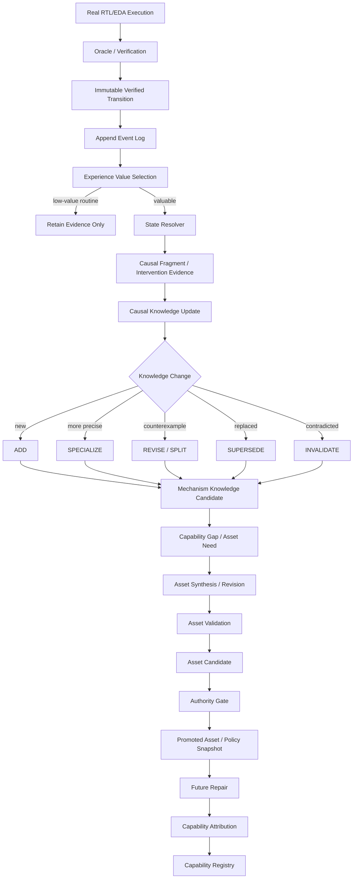
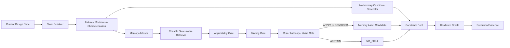
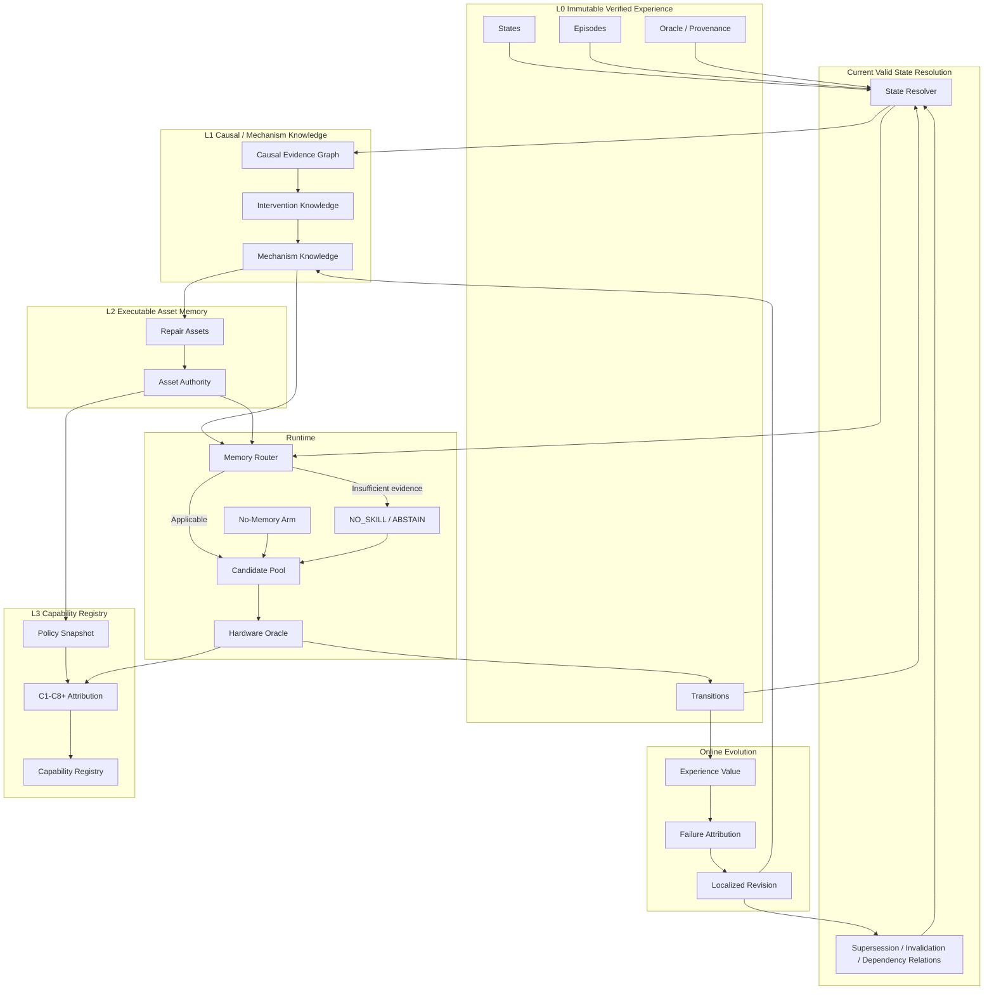

# TEHM / R2G 下一代记忆系统升级方案

> **目标分支**：`ShenShan123/r2g-skills` → `memory/Typed-Executable-Hardware-Memory`
> **源码审计基线**：`df57963512818e9eb7f4f6ef219354a7806f06a7`
> **HEAD 提交**：`Fail closed on incremental witness IDs`
> **审计日期**：2026-08-31
> **当前数据库 schema**：`tehm-v4`
> **文档定位**：面向当前源码的 **v4 → v5 实施级技术方案**，不是概念草案。

本方案将下一代 TEHM/R2G Memory 明确定义为：

```text
Immutable Execution / Evidence Log
        ↓
Current Valid State Resolution
        ↓
Intervention-grounded Causal / Mechanism Knowledge
        ↓
Online Revision / Supersession
        ↓
Experience Memory ↔ Executable Asset Memory
        ↓
Abstention-aware Authority Gate
        ↓
Policy / Behavior Change
        ↓
Capability Attribution & Registry
```

核心原则：

**Memory 不再等价于“历史经验集合”，而是由不可变执行证据推导出的、带有效性关系和 authority 的当前可用知识状态。**

**Memory 不应强迫 Agent 使用历史技能；Memory 必须先证明自己在当前状态下有资格影响搜索。**

---

# 0. Executive Summary

当前分支已经不再是早期的“Transition → Crystallization → Rule → Retrieval”版本。

源码中已经实际存在：

- `tehm-v4` canonical store；
- canonical `states / transitions / episodes`；
- dataset membership firewall；
- typed views；
- procedural rules 与独立 rule authority；
- causal shadow graph；
- causal evidence level `L0 → L4`；
- intervention pair；
- causal path consolidation；
- causal mechanism matcher；
- evaluation-only causal retrieval；
- online memory event chain；
- novelty / conflict / harmful trigger；
- incremental crystallization；
- rule revision lineage；
- raw-evidence anti-forgetting；
- isolated rollback；
- Asset Memory；
- Asset lifecycle / validation / authority；
- capability gap detector；
- Capability Registry；
- policy snapshots / policy-load receipts；
- C1–C8 capability attribution；
- strict memory-delta + runtime behavior + ablation binding。

因此，下一阶段不应该重新设计这些模块，而应该完成一次**语义升级和控制流升级**。

当前最关键的四个缺口是：

1. **有 revision，但没有 Current Valid State Resolution。**
   - 现在可以记录 parent→child revision；
   - 但系统没有一个一等的 resolver 来回答：当前哪个 rule/path/asset/knowledge claim 仍有效、哪个被 supersede、哪个仅在特定 scope 有效、哪个被反例 invalidated。
   - “历史存在”与“当前有效”仍没有统一语义。

2. **有 causal path，但还没有独立的 Mechanism Knowledge Layer。**
   - 当前 `tehm_causal_paths` 已保存机制路径；
   - 但它仍主要是由 transition 派生出的 shadow graph object；
   - Asset synthesis 目前从 capability gap + caller 提供的 action/template 构造；
   - 中间缺少可版本化、可 supersede、可引用的 `MechanismKnowledge / CausalKnowledgeClaim`。

3. **有 online trigger，但还不是 Experience Value Selection。**
   - 当前 trigger 主要是 `NOVEL_MECHANISM / SUFFICIENT_SUPPORT / RULE_CONFLICT / HARMFUL_ACTIVATION`；
   - 但没有区分 routine success、high-value counterexample、rare catastrophic failure、capability-gap evidence、causal-discriminating intervention、prediction surprise、memory interference。
   - 因此仍容易把“在线”理解成“更频繁地结晶”。

4. **Asset / Capability 已有，但 runtime 仍缺少 NO-SKILL 一等决策。**
   - 当前 production retrieval 仍以 promoted rule 为核心；
   - causal recall 明确 evaluation-only；
   - asset authority 与 capability attribution 已严格实现；
   - 但尚未形成 `no-memory candidate arm + memory advisor arm + explicit ABSTAIN / NO_SKILL`。

因此本方案提出：

> **不要把下一阶段定义成“给 TEHM 加更多 memory 功能”。**
>
> 应定义成：
>
> **从 Versioned Verified Hardware Experience Graph 升级为 Versioned Resolved Causal Experience & Capability Memory。**

---

# 1. 当前源码状态审计

## 1.1 当前分支与 schema

```text
repo: ShenShan123/r2g-skills
branch: memory/Typed-Executable-Hardware-Memory
HEAD: df57963512818e9eb7f4f6ef219354a7806f06a7
commit: Fail closed on incremental witness IDs
schema: tehm-v4
```

最新版进一步要求 incremental crystallization 的 `transition_ids`：

- 必须为非空 list/tuple；
- 元素必须为非空 string；
- 禁止重复；
- 不再自动 `str()` coercion；
- 不再静默去重。

这说明当前实现已经坚持：

> learner-derived write 的 evidence set 必须由调用方明确声明，不能由系统“帮忙修正”。

下一阶段的 State Resolution / Supersession / Value Selection 也应延续这一 fail-closed 风格。

## 1.2 Causal Shadow Memory

当前目录：

```text
memory/tehm/causal/
├── authority.py
├── edges.py
├── evidence_level.py
├── intervention.py
├── matcher.py
├── mechanism.py
├── nodes.py
├── orfs.py
├── path_builder.py
├── receipts.py
├── replication.py
├── rtl.py
├── transfer.py
├── transfer_ledger.py
└── witness.py
```

已支持：

```text
transition
   ↓
causal fragment
   ↓
causal nodes/edges
   ↓
intervention pair
   ↓
replication
   ↓
transfer evidence
   ↓
causal path
```

证据等级：

```text
L0_ASSOCIATION
L1_EXECUTED_INTERVENTION
L2_CONTROLLED_INTERVENTION
L3_REPLICATED_EFFECT
L4_TRANSFER_SUPPORTED_MECHANISM
```

当前 `causal/__init__.py` 明确把 causal memory 保持为 shadow / evaluation lane，不直接进入 production authority。这个边界应该继续保留。

## 1.3 Online Evolution

```text
memory/tehm/evolution/
├── anti_forgetting.py
├── candidate_trial.py
├── conflict.py
├── consolidation.py
├── events.py
├── incremental_crystallize.py
├── manager.py
├── novelty.py
├── receipts.py
├── revision.py
├── rollback.py
├── triggers.py
└── verification.py
```

当前控制流大致为：

```text
verified transition
       ↓
append event
       ↓
causal fragment
       ↓
novelty / conflict
       ↓
trigger
       ↓
preview affected group
       ↓
consolidation decision
       ↓
incremental crystallization / revision
       ↓
candidate trial / rollback
```

已经不是传统 batch-only memory，但仍偏向“结晶中心”。

## 1.4 Asset Memory

```text
memory/tehm/assets/
├── authority.py
├── gap_detector.py
├── lifecycle.py
├── receipts.py
├── registry.py
├── schema.py
├── synthesis.py
└── validation.py
```

当前已有 Asset Types：

```text
REPAIR_OPERATOR
RTL_REWRITE_TEMPLATE
FLOW_CONFIG_TRANSFORM
DIAGNOSTIC_EXTRACTOR
STRUCTURAL_PREDICATE
VERIFICATION_OBLIGATION
TOOL_ROUTING_POLICY
LOCALIZATION_PROCEDURE
EXECUTION_MACRO
AGENT_ROLE_PROFILE
```

lifecycle：

```text
draft → shadow → candidate → promoted → demoted / quarantined / retired
```

Asset authority 已有独立 evidence ledger / receipt，因此 Experience Memory + Asset Memory 的 Asset 底座已经真实存在。

## 1.5 Capability Layer

```text
memory/tehm/capability/
├── attribution.py
├── authority.py
├── delta.py
├── harness.py
├── policy_snapshot.py
├── registry.py
└── retention.py
```

当前 C1–C8 attribution：

```text
C1  verified memory delta
C2  policy delta
C3  runtime actually loads candidate policy
C4  behavior delta
C5  target gain
C6  held-out transfer
C7  no regression
C8  ablation removes the gain
```

因此 Capability Evolution 不需要从零开始，下一步要显式插入 `ΔCausalKnowledge` 与 `ΔAsset`。

---

# 2. 当前系统的真正缺口

## 2.1 revision lineage ≠ current valid state

当前存在：

```text
tehm_rules
tehm_rule_status
tehm_rule_revisions
tehm_causal_paths
tehm_assets
tehm_asset_status
tehm_capabilities
```

但缺少统一：

```text
Resolve(current_scope, current_memory_snapshot)
    → currently-valid memory state
```

例如：

```text
Rule R1
    ↓ SPECIALIZE
Rule R2
```

当前可以记录 revision，但并不等价于：

```text
R2 SUPERSEDES R1 in scope S
```

也不能表达 R1 在旧 scope 仍有效、R2 仅在新 scope 生效。

## 2.2 causal path ≠ mechanism knowledge state

当前 `tehm_causal_paths` 有：

```text
mechanism_family
compatibility_profile
ordered nodes/edges
evidence level
support
source transitions
status
```

但缺少：

```text
claim identity/version
positive applicability
negative applicability
supersedes/contradicts
validity scope
authority state
counterexample set
```

因此它更像 evidence-derived path，而不是一个可供 Asset synthesis / runtime reasoning 稳定引用的知识对象。

## 2.3 online ≠ value-aware learning

当前 trigger：

```text
NOVEL_MECHANISM
SUFFICIENT_SUPPORT
RULE_CONFLICT
HARMFUL_ACTIVATION
```

当前 operation：

```text
RETAIN
ADD
MERGE
SPECIALIZE
GENERALIZE
REVISE
SPLIT
DEMOTE
QUARANTINE
RETIRE
ROLLBACK
```

下一步要回答的是：

> 这条 evidence 的信息价值是什么？它应该改变哪一层 derived state？

而不是只问是否增量结晶。

## 2.4 Asset 缺少 Mechanism Knowledge 直接上游

当前 Asset synthesis 由：

```text
CapabilityGapReceipt
+ name
+ transformation_family
+ action_payload_template
+ compatibility_profile
+ verifier_obligations
```

构造 AssetProposal。

下一阶段应逐步变成：

```text
Resolved Mechanism Knowledge
+ Capability Gap
+ Asset Inventory
→ Asset Proposal
```

## 2.5 NO_SKILL 不是显式 policy object

需要区分：

```text
NO_CANDIDATE_FOUND
MEMORY_ABSTAIN
MEMORY_INAPPLICABLE
MEMORY_OOD
MEMORY_RISK_TOO_HIGH
BINDING_UNRESOLVED
CAUSAL_EVIDENCE_TOO_WEAK
NO_SKILL_SELECTED
```

`empty retrieval` 不等于 deliberate abstention。

---

# 3. 下一代 TEHM 目标定义

定义不可变执行证据：

\[
E_{0:t}
\]

定义 revision / supersession / dependency relations：

\[
R_{0:t}
\]

定义 authority evidence：

\[
A_{0:t}
\]

则当前 Memory State：

\[
\boxed{M_t = Resolve(E_{0:t},R_{0:t},A_{0:t})}
\]

即：

```text
History
+ Relations
+ Authority
    ↓
Resolver
    ↓
Current Valid Memory State
```

## 3.1 最终四层结构

```text
┌──────────────────────────────────────────────┐
│ L3 Capability Registry                      │
│ “Agent 已被验证具备什么能力？”             │
└──────────────────────▲───────────────────────┘
                       │
┌──────────────────────┴───────────────────────┐
│ L2 Executable Asset Memory                  │
│ “当前允许使用哪些 executable repair assets?”│
└──────────────────────▲───────────────────────┘
                       │
┌──────────────────────┴───────────────────────┐
│ L1 Causal / Mechanism Knowledge             │
│ “为什么失败？什么 intervention 会改变它？” │
└──────────────────────▲───────────────────────┘
                       │
┌──────────────────────┴───────────────────────┐
│ L0 Immutable Verified Experience            │
│ “实际发生过什么？”                         │
└──────────────────────────────────────────────┘
```

L1–L3 全部是 derived state；L0 是不可变事实层。

---

# 4. 总体控制流

## 4.1 memory formation



## 4.2 runtime



---

# 5. Phase S：Current Valid State Resolution

这是下一阶段最优先的改造。

## 5.1 新模块

```text
memory/tehm/state/
├── __init__.py
├── schema.py
├── relations.py
├── resolver.py
├── snapshot.py
├── receipts.py
└── validation.py
```

不要放进 `evolution/`：Online evolution 产生 relation；State Resolution 消费 relation，职责不同。

## 5.2 relation vocabulary

至少支持：

```text
DERIVED_FROM
DEPENDS_ON
SPECIALIZES
GENERALIZES
SUPERSEDES
INVALIDATES
CONTRADICTS
RETIRES
REPLACED_BY
SUPPORTED_BY
REFUTED_BY
```

`SPECIALIZES` 与 `SUPERSEDES` 不能混用。

### 示例

```json
{
  "relation": "SUPERSEDES",
  "source": "rule:R1",
  "target": "rule:R2",
  "scope": {
    "compatibility_profile": "rtl.fsm.single_guard.v1",
    "mechanism_family": "HANDSHAKE_COMPLETION"
  }
}
```

## 5.3 建议新增表

### `tehm_memory_relations`

```sql
CREATE TABLE tehm_memory_relations (
    relation_id          TEXT PRIMARY KEY,
    source_type          TEXT NOT NULL,
    source_id            TEXT NOT NULL,
    relation_type        TEXT NOT NULL,
    target_type          TEXT NOT NULL,
    target_id            TEXT NOT NULL,
    scope_json           TEXT NOT NULL,
    evidence_refs_json   TEXT NOT NULL,
    authority_ref        TEXT,
    relation_digest      TEXT NOT NULL UNIQUE,
    created_at           TEXT NOT NULL
);
```

### `tehm_state_resolution_snapshots`

```sql
CREATE TABLE tehm_state_resolution_snapshots (
    resolution_id            TEXT PRIMARY KEY,
    input_memory_digest      TEXT NOT NULL,
    scope_json               TEXT NOT NULL,
    active_rules_json        TEXT NOT NULL,
    active_paths_json        TEXT NOT NULL,
    active_knowledge_json    TEXT NOT NULL,
    active_assets_json       TEXT NOT NULL,
    active_capabilities_json TEXT NOT NULL,
    suppressed_json          TEXT NOT NULL,
    resolution_digest        TEXT NOT NULL UNIQUE,
    resolver_version         TEXT NOT NULL,
    created_at               TEXT NOT NULL
);
```

## 5.4 Resolver 数据结构

```python
@dataclass(frozen=True)
class ResolvedMemoryState:
    resolution_id: str
    input_memory_digest: str
    scope: dict
    active_rules: tuple[str, ...]
    active_causal_paths: tuple[str, ...]
    active_knowledge_claims: tuple[str, ...]
    active_assets: tuple[str, ...]
    active_capabilities: tuple[str, ...]
    suppressed: tuple[SuppressionReceipt, ...]
    unresolved_conflicts: tuple[str, ...]
```

```python
@dataclass(frozen=True)
class SuppressionReceipt:
    object_type: str
    object_id: str
    reason: str
    relation_id: str | None
    replacement_id: str | None
```

## 5.5 Resolver fail-closed 规则

以下必须 ABSTAIN：

```text
A SUPERSEDES B
B SUPERSEDES A
```

→ `CYCLE_CONFLICT`

```text
invalidation receipt digest damaged
```

→ `UNRESOLVED_AUTHORITY`

```text
same scope: two promoted assets contradict
```

→ `AMBIGUOUS_CURRENT_STATE`

---

# 6. Phase V：Experience Value Selection

当前 `evolution/triggers.py` 不应删除，但要增加 Value 层。

## 6.1 原则

**所有 verified execution 都进入 L0。**

Experience Value 只决定是否触发 derived-memory 更新，不决定是否保存事实。

```text
low value ≠ delete
low value = retain immutable evidence only
```

## 6.2 新模块

```text
memory/tehm/evolution/value.py
memory/tehm/evolution/value_receipts.py
```

## 6.3 Value 组成

\[
V(e)=w_nN+w_sS+w_gG+w_dD+w_uU+w_cC+w_iI-w_rR
\]

- `N` Novelty：new mechanism / structural profile / failure graph；
- `S` Severity：functional regression、formal counterexample、signoff failure 等；
- `G` Capability-gap relevance：没有 promoted rule/asset；
- `D` Causal discrimination：可区分 competing hypotheses；
- `U` Surprise：prediction 与 actual execution 不一致；
- `C` Counterexample value：攻击 promoted rule/asset/high-confidence causal claim；
- `I` Memory interference：memory FAIL，no-memory PASS；
- `R` Redundancy：大量同 mechanism/profile/action/outcome 重复。

## 6.4 第一版不用 RL critic

先使用可审计优先级：

```text
P0 CRITICAL
    promoted-memory counterexample
    memory interference
    catastrophic regression

P1 HIGH
    new capability gap
    new mechanism
    causal discrimination
    strong prediction surprise

P2 MEDIUM
    repeated failure
    new cross-lineage support

P3 LOW
    routine success
    redundant success
```

## 6.5 Receipt

```python
@dataclass(frozen=True)
class ExperienceValueReceipt:
    transition_id: str
    campaign_id: str
    novelty: float
    severity: float
    capability_gap: float
    causal_discrimination: float
    surprise: float
    counterexample: float
    memory_interference: float
    redundancy: float
    value_score: float
    priority: str
    update_layers: tuple[str, ...]
    reasons: tuple[str, ...]
```

`update_layers`：

```text
STATE
CAUSAL
RULE
ASSET
CAPABILITY
NONE
```

---

# 7. Phase C：Intervention-grounded Mechanism Knowledge

当前 causal L0–L4 证据基础应直接复用。

下一步不是再造一张 causal graph，而是增加：

```text
Causal Evidence Graph
        ↓
Mechanism Knowledge Layer
```

## 7.1 Evidence 与 Knowledge 分离

Evidence：

```text
transition
causal node/edge
intervention pair
replication receipt
transfer receipt
```

表示“观察到了什么”。

Knowledge Claim 表示“根据这些证据，当前认为哪些机制结论有效”。

## 7.2 新模块

```text
memory/tehm/knowledge/
├── __init__.py
├── schema.py
├── claims.py
├── builder.py
├── resolver.py
├── applicability.py
├── negative_context.py
├── authority.py
├── receipts.py
└── revision.py
```

## 7.3 MechanismKnowledge

```python
@dataclass(frozen=True)
class MechanismKnowledge:
    knowledge_id: str
    version: int
    mechanism_family: str
    compatibility_profile: str | None
    antecedent: dict
    intervention: dict
    mediated_effects: tuple[dict, ...]
    expected_outcome: dict
    positive_applicability: tuple[dict, ...]
    negative_applicability: tuple[dict, ...]
    preserved_obligations: tuple[str, ...]
    known_failure_modes: tuple[str, ...]
    causal_path_ids: tuple[str, ...]
    evidence_level: str
    support_lineages: tuple[str, ...]
    status: str
```

### 示例

```yaml
knowledge_id: mk_handshake_guard_restore_v3
mechanism_family: HANDSHAKE_COMPLETION
compatibility_profile: rtl.fsm.single_guard.v1
antecedent:
  failure: completion_not_observed
  target_state_reachable: true
mechanism:
  cause: over_restrictive_guard
  mediator: legal_transition_blocked
  effect: completion_state_unreachable_on_failing_trace
intervention:
  family: GUARD_RESTORE
positive_applicability:
  - single_guard
  - no_competing_priority_conflict
negative_applicability:
  - overlapping_priority_transitions
  - ambiguous_target_binding
obligations:
  - target_trace_pass
  - reset_semantics_preserved
  - priority_preserved
  - regression_pass
```

## 7.4 Knowledge Authority

状态建议：

```text
shadow
candidate
validated
superseded
invalidated
retired
```

不要把 `L4_TRANSFER_SUPPORTED_MECHANISM` 直接等价成 production knowledge。Evidence strength 与 authority 仍分离。

---

# 8. Phase O：Online Evolution → Localized State Revision

当前 `observe_transition()` 继续作为唯一入口。

目标改造：

```text
observe_transition
   ↓
verify L0 evidence
   ↓
ExperienceValue
   ↓
StateResolver
   ↓
FailureAttribution
   ↓
localized update plan
   ↓
shadow mutation
```

每条 evidence 明确 update target：

```text
UPDATE_NONE
UPDATE_STATE_RELATION
UPDATE_CAUSAL_KNOWLEDGE
UPDATE_RULE
UPDATE_ASSET
UPDATE_CAPABILITY
```

incremental crystallization 变成 `UPDATE_RULE` 的一个 primitive，而不是 online manager 的核心语义。

## 8.1 event vocabulary 扩展

```text
EXPERIENCE_VALUED
STATE_RESOLVED
KNOWLEDGE_CONFLICT
KNOWLEDGE_REVISION_PROPOSED
KNOWLEDGE_SUPERSEDED
KNOWLEDGE_INVALIDATED
ASSET_INTERFERENCE
ASSET_REVISION_PROPOSED
CAPABILITY_GAP_UPDATED
CAPABILITY_REGRESSION_OBSERVED
MEMORY_ABSTAINED
NO_SKILL_SELECTED
```

## 8.2 operation 扩展

在现有操作上增加：

```text
SUPERSEDE
INVALIDATE
REACTIVATE
```

注意：`SUPERSEDE` 是 relation，`RETIRE` 是 lifecycle；不能混为一类状态。

---

# 9. Phase F：Failure Attribution

下一阶段必须回答：

> 为什么 memory-guided repair 失败？

## 9.1 taxonomy

```text
STATE_RESOLUTION_FAILURE
RETRIEVAL_FAILURE
APPLICABILITY_FAILURE
CAUSAL_MODEL_FAILURE
BINDING_FAILURE
ASSET_EXECUTION_FAILURE
VERIFICATION_FAILURE
AUTHORITY_FAILURE
MEMORY_INTERFERENCE
CAPABILITY_REGRESSION
```

## 9.2 更新映射

### STATE_RESOLUTION_FAILURE

```text
stale rule active
superseded asset retrieved
conflict not detected
```

更新 `state relations / resolver`。

### RETRIEVAL_FAILURE

正确 knowledge/asset 存在且有效但没召回，更新 `index/query/rerank`，不要修改 asset。

### APPLICABILITY_FAILURE

更新 positive/negative predicates 与 abstention policy。

### CAUSAL_MODEL_FAILURE

binding 正确、action 正确执行，但 expected causal effect 未出现：更新 causal edge/path / mechanism knowledge。

### BINDING_FAILURE

mechanism 与 asset 正确但绑定错 signal/state：更新 binding contract / structural predicate。

### ASSET_EXECUTION_FAILURE

asset applicability 与 binding 正确，但 operator/template 实现错误：更新 asset definition。

### VERIFICATION_FAILURE

oracle/evidence 不完整：不允许 learner update。

### MEMORY_INTERFERENCE

定义：

```text
Memory arm = FAIL
No-memory arm = PASS
```

这是高价值负证据，应提高 abstention prior、negative applicability 与 asset risk。

## 9.3 Receipt

```python
@dataclass(frozen=True)
class MemoryFailureAttributionReceipt:
    activation_id: str | None
    transition_id: str | None
    failure_type: str
    blamed_objects: tuple[str, ...]
    excluded_causes: tuple[str, ...]
    evidence_refs: tuple[str, ...]
    confidence: float
    recommended_update_layers: tuple[str, ...]
```

---

# 10. Phase A：Conditioned Executable Repair Assets

不要把 Asset 定义为自然语言 skill prompt。

建议：

\[
Asset=\langle P^+,P^-,M,B,A,Q,V,R\rangle
\]

- `P+` positive applicability；
- `P-` negative applicability；
- `M` mechanism knowledge ref；
- `B` binding contract；
- `A` executable action；
- `Q` obligations；
- `V` verification contract；
- `R` risk/rollback。

## 10.1 schema 变化

现有 `tehm_assets` 继续保留 JSON contracts，建议 v5 增加：

```sql
ALTER TABLE tehm_assets
ADD COLUMN knowledge_refs_json TEXT NOT NULL DEFAULT '[]';
```

也可在 `input_contract_json` 冗余保存：

```json
{
  "mechanism_knowledge_ids": ["mk_xxx"],
  "positive_applicability": [],
  "negative_applicability": [],
  "minimum_causal_evidence": "L2_CONTROLLED_INTERVENTION"
}
```

## 10.2 synthesis 接口

由当前：

```python
build_rtl_asset_proposal(gap, name, transformation_family,
                         action_payload_template, compatibility_profile,
                         verifier_obligations)
```

升级为：

```python
build_rtl_asset_proposal(
    gap,
    mechanism_knowledge,
    asset_inventory,
    ...
)
```

strict mode 要求：

```text
knowledge exists
knowledge not superseded/invalidated
compatibility matches
negative applicability not triggered
minimum causal evidence satisfied
```

---

# 11. NO_SKILL：一等 Runtime Decision

定义 selector 输出：

```text
APPLY
CONSIDER
ABSTAIN
INAPPLICABLE
NO_SKILL
```

- `APPLY`：高 applicability + strong causal evidence + promoted asset + resolvable binding + acceptable risk；
- `CONSIDER`：允许 memory 贡献有限 candidate，不独占搜索；
- `ABSTAIN`：证据不足/OOD/conflict/state unresolved/causal confidence low；
- `INAPPLICABLE`：硬 veto；
- `NO_SKILL`：有意识选择 no-memory route。

Receipt：

```python
@dataclass(frozen=True)
class MemoryRoutingDecision:
    decision: str
    resolved_state_id: str
    selected_rule_ids: tuple[str, ...]
    selected_path_ids: tuple[str, ...]
    selected_asset_ids: tuple[str, ...]
    applicability: dict
    causal_support: dict
    risk: dict
    abstain_reasons: tuple[str, ...]
    no_memory_budget: int
    memory_budget: int
```

---

# 12. Memory 不控制 LLM 思维，只受控扩展 Candidate Pool

推荐：

```text
No-memory generator
     ↓
C1, C2

Memory Advisor
     ↓
C3

Causal Search
     ↓
C4

Candidate Pool
     ↓
hardware oracle
```

不推荐：

```text
Top-K skill text
   ↓
prompt
   ↓
LLM 被历史经验 anchor
```

## 12.1 默认 budget policy

假设总 candidate budget：

```text
n = 3
```

建议：

```text
NO_SKILL:
    3 no-memory

CONSIDER:
    2 no-memory
    1 memory candidate

APPLY:
    1 no-memory
    2 memory/causal candidates
```

第一版不要允许：

```text
3 / 3 candidates 全来自 memory
```

这样即使 memory 错，也保留 unbiased search arm。

---

# 13. Causal / State-aware Retrieval 的 production 迁移方式

当前 `retrieval/causal_recall.py` 明确 evaluation-only，这个设计是对的。

不要直接把它 import 进 production pipeline。

建议分三个升级阶段。

## R0 — 当前 production

```text
promoted rule retrieval
```

## R1 — shadow advisor

```text
production rule retrieval
+
evaluation-only causal advisor
```

causal advisor 不改 candidate pool，只记录：

```text
would_select
would_abstain
mechanism match
causal score
```

## R2 — candidate-pool advisor

只有 validated/resolved mechanism knowledge 才允许：

```text
max 1 memory candidate
```

仍不能改 lifecycle。

## R3 — production memory router

要求：

```text
resolved current state
validated/promoted mechanism knowledge
promoted asset
authority verified
NO_SKILL supported
```

之后才进入正式 policy。

---

# 14. Retrieval / Routing Score

最终不建议只依赖：

\[
Similarity \times Utility \times Confidence \times (1-Risk)
\]

建议：

\[
Score(a|S)=
S_{state}
\cdot S_{mechanism}
\cdot S_{causal}
\cdot A_{app}
\cdot C_{authority}
\cdot U
\cdot (1-R)
\]

其中任一 hard gate：

```text
state unresolved
applicability false
authority false
binding unresolved
negative applicability matched
```

都直接返回：

```text
ABSTAIN / INAPPLICABLE
```

而不是让低分对象继续进入 Top-K。

---

# 15. Experience Memory ↔ Asset Memory

## 15.1 Experience → Asset

```text
verified evidence
   ↓
Experience Value
   ↓
mechanism knowledge
   ↓
capability gap
   ↓
asset proposal
   ↓
validation
   ↓
candidate
   ↓
authority
   ↓
promoted asset
```

## 15.2 Asset → Experience

```text
asset execution
   ↓
oracle
   ↓
new transition
   ↓
failure attribution
   ↓
mechanism / asset revision
```

因此：

\[
Experience_t \leftrightarrow Asset_t
\]

不是一次性“从经验创建技能”，而是双向共同演化。

---

# 16. Capability Evolution：在现有 C1–C8 上插入 Knowledge Δ / Asset Δ

当前 C1–C8 不应推翻。

建议新增：

```text
KnowledgeDeltaReceipt
AssetDeltaReceipt
```

最终链：

```text
Verified Experience
        ↓
Causal Knowledge Δ
        ↓
Asset Δ
        ↓
Policy Δ
        ↓
Runtime Load
        ↓
Behavior Δ
        ↓
Previously-unsolved mechanism solved
        ↓
Held-out transfer
        ↓
No regression
        ↓
ΔMemory / ΔAsset ablation
        ↓
Capability Δ
```

这条链与当前 C1–C8 对应：

```text
C1  Memory Delta
     ├─ Experience Delta
     ├─ Knowledge Delta
     └─ Asset Delta

C2  Policy Delta
C3  Runtime Load
C4  Behavior Delta
C5  Target Gain
C6  Held-out Transfer
C7  No Regression
C8  Counterfactual Ablation
```

## 16.1 Capability Evolution 三等级

### Level 1 — Selection Evolution

action space 不变：

\[
\mathcal A_t = \mathcal A_{t+1}
\]

只是路由更准确。

### Level 2 — Strategy Evolution

原子 action 不变，但：

```text
condition
composition
ordering
parameterization
```

发生变化。

### Level 3 — Capability Expansion

新 asset/operator/tool 进入 action space：

\[
\mathcal A_t \subset \mathcal A_{t+1}
\]

论文声称“capability evolution”时，应明确是哪一层。

---

# 17. Capability Registry v5 建议

当前 `tehm_capabilities` 已有：

```text
mechanism_family
applicability
required_rules
required_assets
obligations
budget
status
version
provenance
```

建议 v5 增加：

```text
required_knowledge_json
capability_level
introduced_by_delta_id
```

SQL：

```sql
ALTER TABLE tehm_capabilities
ADD COLUMN required_knowledge_json TEXT NOT NULL DEFAULT '[]';

ALTER TABLE tehm_capabilities
ADD COLUMN capability_level TEXT;

ALTER TABLE tehm_capabilities
ADD COLUMN introduced_by_delta_id TEXT;
```

Capability supersession 不要重复加 `superseded_by` 列，统一使用 `tehm_memory_relations`。

---

# 18. Schema v5 迁移建议

不要修改已冻结 v4 schema history。

创建正式：

```text
v4 → v5 migration
```

## 18.1 新增表

```text
tehm_memory_relations
tehm_state_resolution_snapshots

tehm_mechanism_knowledge
tehm_mechanism_knowledge_status
tehm_mechanism_knowledge_evidence

tehm_experience_values
tehm_failure_attributions
tehm_memory_routing_receipts
```

## 18.2 保留现有表

全部保留：

```text
tehm_states
tehm_transitions
tehm_episodes
tehm_episode_steps
tehm_dataset_membership
tehm_views

tehm_rules
tehm_rule_sources
tehm_rule_status
tehm_rule_revisions
tehm_rule_authority_evidence
tehm_rule_authority_receipts

tehm_causal_nodes
tehm_causal_edges
tehm_causal_paths
tehm_intervention_pairs

tehm_memory_events

tehm_assets
tehm_asset_status
tehm_asset_authority_evidence
tehm_asset_authority_receipts

tehm_capabilities
tehm_capability_evidence
tehm_policy_snapshots
tehm_policy_load_receipts
```

## 18.3 建议的 `tehm_mechanism_knowledge`

```sql
CREATE TABLE tehm_mechanism_knowledge (
    knowledge_id               TEXT NOT NULL,
    version                    INTEGER NOT NULL,
    mechanism_family           TEXT NOT NULL,
    compatibility_profile      TEXT,
    antecedent_json            TEXT NOT NULL,
    intervention_json          TEXT NOT NULL,
    mediated_effects_json      TEXT NOT NULL,
    expected_outcome_json      TEXT NOT NULL,
    positive_applicability_json TEXT NOT NULL,
    negative_applicability_json TEXT NOT NULL,
    obligations_json           TEXT NOT NULL,
    known_failure_modes_json   TEXT NOT NULL,
    causal_path_ids_json       TEXT NOT NULL,
    content_digest             TEXT NOT NULL,
    created_at                 TEXT NOT NULL,
    PRIMARY KEY (knowledge_id, version)
);
```

## 18.4 `tehm_mechanism_knowledge_status`

```sql
CREATE TABLE tehm_mechanism_knowledge_status (
    knowledge_id     TEXT NOT NULL,
    version          INTEGER NOT NULL,
    target_scope     TEXT NOT NULL,
    status           TEXT NOT NULL,
    status_version   INTEGER NOT NULL,
    provenance_json  TEXT NOT NULL,
    updated_at       TEXT NOT NULL,
    PRIMARY KEY (knowledge_id, version, target_scope)
);
```

状态：

```text
shadow
candidate
validated
superseded
invalidated
retired
```

## 18.5 `tehm_experience_values`

```sql
CREATE TABLE tehm_experience_values (
    transition_id              TEXT NOT NULL,
    campaign_id                TEXT NOT NULL,
    novelty                    REAL NOT NULL,
    severity                   REAL NOT NULL,
    capability_gap             REAL NOT NULL,
    causal_discrimination      REAL NOT NULL,
    surprise                   REAL NOT NULL,
    counterexample             REAL NOT NULL,
    memory_interference        REAL NOT NULL,
    redundancy                 REAL NOT NULL,
    value_score                REAL NOT NULL,
    priority                   TEXT NOT NULL,
    update_layers_json         TEXT NOT NULL,
    receipt_json               TEXT NOT NULL,
    receipt_digest             TEXT NOT NULL,
    created_at                 TEXT NOT NULL,
    PRIMARY KEY (transition_id, campaign_id)
);
```

## 18.6 `tehm_failure_attributions`

```sql
CREATE TABLE tehm_failure_attributions (
    attribution_id             TEXT PRIMARY KEY,
    activation_id              TEXT,
    transition_id              TEXT,
    routing_receipt_id         TEXT,
    failure_type               TEXT NOT NULL,
    blamed_objects_json        TEXT NOT NULL,
    excluded_causes_json       TEXT NOT NULL,
    evidence_refs_json         TEXT NOT NULL,
    confidence                 REAL NOT NULL,
    update_layers_json         TEXT NOT NULL,
    attribution_digest         TEXT NOT NULL UNIQUE,
    created_at                 TEXT NOT NULL
);
```

---

# 19. 具体源码修改映射

## 19.1 新增目录/文件

```text
memory/tehm/state/
    __init__.py
    relations.py
    resolver.py
    receipts.py
    validation.py

memory/tehm/knowledge/
    __init__.py
    schema.py
    builder.py
    registry.py
    lifecycle.py
    authority.py
    revision.py
    receipts.py

memory/tehm/evolution/value.py
memory/tehm/evolution/attribution.py

memory/tehm/retrieval/memory_router.py
memory/tehm/retrieval/asset_selector.py
memory/tehm/retrieval/abstention.py
```

## 19.2 `memory/contracts.py`

当前已经有：

```text
RepairContext
MemoryQuery
CausalCandidateEvidence
CapabilityGap
MemoryCandidate
ActivationProposal
```

新增 backend-neutral contracts：

```text
ResolvedMemoryState
MemoryRoutingDecision
MechanismKnowledgeCandidate
AssetCandidate
NoSkillReceipt
```

当前 `CANDIDATE_SOURCES`：

```text
cold_start
legacy_memory
tehm_rule
```

只有当 Asset production authority 真正接通后，再扩展：

```text
tehm_asset
```

不要提前把 candidate source 放开。

## 19.3 `retrieval/query_planner.py`

当前已经正确携带：

```text
structural_graph
compatibility_profile
mechanism_signature
failure_graph_digest
causal_context_digest
prior_action_digests
```

下一步建议增加：

```text
resolved_state_id
active_knowledge_ids
memory_policy_mode
```

但 `active_knowledge_ids` 不应该由 caller 随意填，必须来自 resolver receipt。

## 19.4 `retrieval/pipeline.py`

当前 `retrieve_query()` 已修复 backend seam，不再二次重建 `RepairContext`，这个实现应保留。

不要直接把所有 v5 逻辑塞进 `retrieve_query()`。

新增 sibling：

```python
route_memory(...)
```

形成：

```text
retrieve_query()      = existing promoted rule lane
retrieve_causal_paths = evaluation causal lane
route_memory()        = future state/knowledge/asset router
```

这样便于 A/B。

## 19.5 `evolution/manager.py`

这是 v5 重构重点。

当前主语义：

```text
observe → causal fragment → novelty/conflict → trigger → preview → consolidate
```

未来：

```text
observe
→ verify
→ experience value
→ resolve state
→ causal/behavior attribution
→ update plan
→ execute selected shadow update primitive
```

`incremental_crystallize` 变成一个 primitive：

```text
if update_layer == RULE:
    crystallize_affected_groups(...)
```

而不是所有 high-value evidence 的默认去向。

## 19.6 `evolution/triggers.py`

保留当前四类原因，同时新增：

```text
HIGH_EXPERIENCE_VALUE
COUNTEREXAMPLE_TO_PROMOTED_MEMORY
MEMORY_INTERFERENCE
CAPABILITY_GAP
PREDICTION_SURPRISE
```

但 Value Receipt 与 Trigger Receipt 分开存，避免 trigger 本身变成不可解释黑盒分数。

## 19.7 `evolution/revision.py`

当前 `REVISION_OPERATIONS`：

```text
MERGE
SPLIT
SPECIALIZE
GENERALIZE
REVISE
```

继续保留。

不要仅把 `SUPERSEDE` 加进这个 enum 就结束。

正确模型：

```text
revision receipt:
parent R1 → child R2
operation SPECIALIZE

state relation:
R2 SUPERSEDES R1 under scope S
```

两类事实分开，方便审计。

## 19.8 `assets/synthesis.py`

当前 AssetProposal 已经是 parser-backed executable template，不是自然语言 skill，这是优势。

v5 重点不是重写 executor，而是强化 provenance：

```text
CapabilityGap
+ ResolvedMechanismKnowledge
+ AssetInventory
→ AssetProposal
```

strict mode 禁止：

```text
caller 直接指定一个 family/template 就声称来自 memory evolution
```

必须绑定 knowledge receipt。

## 19.9 `assets/gap_detector.py`

当前 detector 已经校验 promoted asset/rule reader，而不是只看 raw status column，这个 fail-closed 风格继续保留。

增加：

```text
resolved memory state
validated knowledge coverage
no-memory success cases
memory interference cases
negative applicability coverage
```

Gap 不再只意味着“缺 asset”，也可能意味着：

```text
knowledge gap
applicability gap
binding gap
asset gap
```

建议 Gap 类型：

```text
KNOWLEDGE_GAP
APPLICABILITY_GAP
BINDING_GAP
ASSET_GAP
CAPABILITY_GAP
```

## 19.10 `capability/attribution.py`

保留现有 C1–C8。

扩展 detail：

```text
knowledge_delta
asset_delta
state_resolution_id
memory_routing_receipt_ids
failure_attribution_receipt_ids
```

C1 的 strict memory delta 已经非常重要，v5 只扩充其对象类型，不改变原则。

---

# 20. NO_SKILL 的 Backend seam

最合适位置：

```text
TehmMemoryBackend.build_query()
       ↓
resolve_state()
       ↓
route_memory()
       ↓
MemoryRoutingDecision
       ↓
candidate generation
```

不要在 `propose_activation()` 才判断 NO_SKILL，因为此时 memory 已经影响 candidate selection。

建议 API：

```python
class TehmMemoryBackend:

    def resolve_state(
        self,
        context: RepairContext,
    ) -> ResolvedMemoryState:
        ...

    def route_memory(
        self,
        query: MemoryQuery,
        *,
        no_memory_budget: int,
        memory_budget: int,
    ) -> MemoryRoutingDecision:
        ...

    def retrieve_assets(
        self,
        decision: MemoryRoutingDecision,
    ) -> list[MemoryCandidate]:
        ...

    def record_memory_outcome(
        self,
        routing_receipt_id: str,
        execution_receipt: dict,
    ) -> MemoryFailureAttributionReceipt | None:
        ...
```

---

# 21. Production Invariants

任何升级不得破坏以下边界。

## I1 Immutable Evidence

```text
State / Transition / Episode
```

不能被 consolidation/revision 覆盖。

## I2 Dataset Firewall

```text
calibration / heldout / ab
```

不能成为 learner support。

## I3 Shadow Causal Evidence ≠ Production Authority

继续保留。

## I4 Asset Existence ≠ Promoted Asset

继续保留。

## I5 Capability Evidence ≠ Capability Authority

继续保留。

## I6 Supersession Proposal ≠ Production Replacement

candidate child 的 supersession proposal 不能自动取消 parent 的 production authority。

## I7 Resolver 只能消费 verified / authority-bound relation

未经 authority 的 relation 只能进入 shadow resolution，不能改变 production current state。

## I8 NO_SKILL Always Available

production memory policy 必须允许：

```text
NO_SKILL
```

不能强制 memory candidate 占预算。

## I9 Raw Evidence Never Deleted by Supersession

superseded 表示“不再当前生效”，不表示“历史不存在”。

## I10 Memory Advice Must Be Attributable

任何 memory candidate 必须带：

```text
routing receipt
resolved state
knowledge ref
asset/rule ref
authority receipt
```

否则只能算 no-memory/cold-start candidate。

---

# 22. 实验：State Resolution / Supersession

问题：

> 显式 supersession 能否减少 stale-memory activation？

对比：

```text
A Latest-row heuristic
B Lifecycle-only
C Revision-lineage-only
D Resolved State + Supersession
```

指标：

```text
current-state accuracy
stale activation rate
false-active rate
false-suppression rate
conflict detection rate
resolver abstention rate
```

关键 case：

```text
R1 valid
→ new counterexample
→ R2 specializes R1
```

要求：

```text
old evidence remains
R1 not deleted
R2 active in new scope
R1 preserved only where still valid
```

---

# 23. 实验：Experience Value Selection

对比：

```text
A Batch rebuild
B Append-all + always consolidate
C Current deterministic trigger
D Value-aware localized update
```

指标：

```text
adaptation latency
number of derived writes
memory churn
harmful activation
high-value failure retention
redundant success suppression
compute / oracle cost
```

重要 slice：

```text
promoted-memory counterexample
memory interference
new capability gap
routine repeated success
```

预期：D 不应简单拥有最多 rules，而应以更少 derived update 获得更低 harmful activation / 更快高价值吸收。

---

# 24. 实验：Intervention-grounded Causal Knowledge

对比：

```text
R0 metadata rule retrieval
R1 state-aware retrieval
R2 causal path retrieval
R3 resolved mechanism knowledge + applicability
```

指标：

```text
RR@1 / RR@3
mechanism match accuracy
wrong-mechanism rate
held-out design transfer
harmful activation
memory abstention quality
```

必须包含 symptom-similar / mechanism-different case，例如：

```text
completion failure
    ├─ guard blocked
    └─ reset semantics lost
```

目标不是“相似”，而是区分 causal mechanism。

---

# 25. 实验：NO_SKILL / Memory Interference

这是 v5 必做实验。

arms：

```text
A No-memory
B Always Top-K memory
C Applicability-gated memory
D Causal + applicability + NO_SKILL
```

指标：

```text
repair rate
memory-induced harm
abstention precision
abstention recall
candidate diversity
search entropy
candidate budget efficiency
```

定义核心指标：

\[
MemoryInterferenceRate =
P(NoMemory=PASS \land Memory=FAIL)
\]

还可定义：

\[
AbstentionUtility = P(NoMemory=PASS \mid Memory=ABSTAIN)
\]

如果 `AbstentionUtility` 高，说明 selector 学会了在自己不可靠时让路，而不是强制记忆介入。

建议同时记录：

```text
memory_candidate_count
no_memory_candidate_count
unique_action_families
unique_mechanism_hypotheses
```

用于测量 memory 是否过度压缩搜索空间。

---

# 26. 实验：Failure Attribution

构造可控故障：

```text
wrong retrieval
wrong applicability
wrong causal edge
wrong binding
bad asset implementation
bad oracle
stale superseded state
```

期待 attribution matrix 接近对角线：

| Injected fault | Expected attribution |
|---|---|
| hide correct asset from index | `RETRIEVAL_FAILURE` |
| remove negative predicate | `APPLICABILITY_FAILURE` |
| flip causal effect | `CAUSAL_MODEL_FAILURE` |
| bind wrong register/state | `BINDING_FAILURE` |
| corrupt rewrite operator | `ASSET_EXECUTION_FAILURE` |
| stale superseded rule active | `STATE_RESOLUTION_FAILURE` |
| no-memory PASS / memory FAIL | `MEMORY_INTERFERENCE` |
| corrupt oracle receipt | `VERIFICATION_FAILURE` |

不能只看 attribution accuracy，还要检查：

```text
wrong layer update rate
```

即 attribution 错误是否导致错误地修改 asset / causal knowledge / retrieval policy。

---

# 27. 实验：Asset Evolution

对比：

```text
A Rule only
B Textual skill / procedural prompt
C Executable asset without knowledge binding
D Knowledge-grounded executable asset
```

指标：

```text
wrong applicability rate
binding failure rate
asset execution failure rate
held-out transfer
regression
memory-induced harm
NO_SKILL quality
```

D 的优势应来自：

```text
mechanism grounding
negative applicability
binding proof
hardware oracle
```

而不是更长 prompt。

---

# 28. 实验：Capability Evolution

冻结：

```text
LLM weights
base prompt
toolset
candidate budget
oracle
dataset manifest
random seed protocol
```

只改变：

```text
memory / knowledge / asset state
```

严格链：

```text
M_t
↓
K_t → K_t+1
↓
A_t → A_t+1
↓
Policy_t → Policy_t+1
↓
Behavior changes
↓
previously unresolved mechanism improves
↓
held-out same-mechanism transfer
↓
non-target retained
↓
remove ΔMemory / ΔAsset
↓
gain disappears
```

## 28.1 Capability Acquisition

\[
CA =
\frac{|F_{unsolved}^{t} \cap F_{solved}^{t+1}|}
{|F_{unsolved}^{t}|}
\]

## 28.2 Capability Retention

\[
CR =
\frac{|C_t \cap C_{t+1}^{verified}|}
{|C_t|}
\]

## 28.3 Capability Transfer

在 unseen lineage / unseen design：

\[
CT = PassRate_{heldout}
\]

## 28.4 Memory-induced Harm

\[
MIH=P(NoMem=PASS \land Mem=FAIL)
\]

## 28.5 Capability Expansion Evidence

只有满足：

```text
new action/asset becomes available
AND
previously unresolved mechanism solved
AND
held-out transfer
AND
no regression
AND
ablation removes gain
```

才称 Level-3 Capability Expansion。

---

# 29. 推荐实施顺序

不要一次性接 production。

## P0 — Freeze 当前 v4

目标：

```text
freeze df579635
run current regression
store schema-v4 snapshot
record source/workspace/toolchain binding
```

这一步不改变语义。

## P1 — State Relation + Resolver

实现：

```text
tehm_memory_relations
state/resolver.py
state resolution receipt
```

只 evaluation/shadow。

验收：

```text
supersession
scope
cycle
conflict
corrupt relation
authority mismatch
```

全部 fail-closed。

## P2 — Experience Value

实现：

```text
value receipt
priority
update_layers
```

先不改变现有 trigger 结果。

并行记录：

```text
old trigger decision
new value decision
```

做 shadow comparison。

## P3 — Mechanism Knowledge

实现：

```text
causal path → knowledge claim
```

第一版建议：

```text
L0/L1 causal evidence → shadow claim only
L2+ → candidate knowledge allowed
L3/L4 → authority evaluation allowed
```

不要自动 promoted。

## P4 — Online Local Revision

`observe_transition()` 开始根据：

```text
value
failure attribution
resolved state
```

选择 update target。

`incremental_crystallization` 保留，但只是 RULE-layer primitive。

## P5 — NO_SKILL Router Shadow

只输出：

```text
would_apply
would_consider
would_abstain
would_no_skill
```

不改变实际 repair。

## P6 — Candidate Pool A/B

允许 Memory Advisor 最多贡献：

```text
1 candidate
```

保留 no-memory arm。

## P7 — Knowledge-grounded Asset

新 strict campaign 要求：

```text
MechanismKnowledge required
```

旧 fixture 保留 compatibility mode，防止一次性破坏 regression。

## P8 — Expanded Capability Attribution

C1–C8 增加：

```text
KnowledgeDelta
AssetDelta
RoutingReceipt
StateResolutionReceipt
```

## P9 — Production Gate

只有实验确认：

```text
harmful activation decreases
or
repair rate increases with controlled harm
and
NO_SKILL calibration acceptable
```

再考虑 production integration。

---

# 30. 第一轮最小闭环建议

不要先覆盖所有 Asset Type。

先限制：

```text
RTL_REWRITE_TEMPLATE
```

机制优先选已有 fixture / oracle 基础较强的：

```text
HANDSHAKE_COMPLETION
RESET_SEMANTIC_LOSS
WIDTH_CORRECTION
PRIORITY_CONFLICT
```

## Case A — Supersession

```text
broad guard repair
↓
priority counterexample
↓
specialize
↓
old rule/knowledge remains auditable
↓
new object active only in safe scope
```

## Case B — Memory Interference

```text
memory recommends guard asset
no-memory discovers priority reorder
```

目标：

```text
selector → ABSTAIN / NO_SKILL
```

## Case C — Causal Discrimination

两个 symptom 都是：

```text
completion failure
```

机制分别：

```text
guard blocked
reset lost
```

要求 causal matcher + knowledge resolver 正确分开。

## Case D — Capability Expansion

baseline：

```text
current promoted asset inventory cannot solve
```

经过：

```text
experience
→ mechanism knowledge
→ new asset
```

held-out PASS。

删除新增 asset / knowledge：

```text
gain disappears
```

---

# 31. 不建议做的事情

## 31.1 不把 causal path 文本直接塞 prompt

否则退化成：

```text
Procedural RAG
```

## 31.2 不让 Top-K 必须非空

必须允许：

```text
NO_SKILL
```

## 31.3 不把 online 等同于 always consolidate

online 的核心是：

```text
及时发现信息价值
及时定位变化层
及时更新 derived state
```

而不是每步重算规则。

## 31.4 不让 LLM 自己授予 causal authority

EDA 的优势是：

```text
real intervention
real tool execution
hardware oracle
```

Causal Knowledge 必须绑定 executable evidence。

## 31.5 不删除 superseded evidence

```text
superseded = not currently active
```

不等于：

```text
never happened
```

## 31.6 不让 capability claim 只依赖 pass-rate

继续坚持 C1–C8 attribution。

## 31.7 不把 Capability Registry 变成“技能列表”

Capability 是被行为证据证明的属性，不是 declarative skill inventory。

## 31.8 不把 Asset authority 与 Rule authority 混成一个 gate

Rule / Knowledge / Asset / Capability 应各有独立 authority seam。

---

# 32. 推荐 v5 目录结构

```text
memory/tehm/
├── canonical/
│   └── immutable evidence
│
├── state/
│   ├── relations.py
│   ├── resolver.py
│   ├── receipts.py
│   └── validation.py
│
├── causal/
│   └── existing intervention-grounded evidence graph
│
├── knowledge/
│   ├── builder.py
│   ├── registry.py
│   ├── lifecycle.py
│   ├── revision.py
│   └── authority.py
│
├── evolution/
│   ├── manager.py
│   ├── value.py
│   ├── attribution.py
│   ├── triggers.py
│   ├── incremental_crystallize.py
│   └── ...
│
├── assets/
│   └── existing asset memory
│
├── retrieval/
│   ├── pipeline.py
│   ├── causal_recall.py
│   ├── memory_router.py
│   ├── asset_selector.py
│   └── abstention.py
│
└── capability/
    └── existing attribution / authority
```

---

# 33. 最终系统语义

升级后，不建议再仅描述为：

> TEHM remembers successful repair experiences.

更准确：

> TEHM maintains an immutable log of verified hardware interactions and continuously derives a versioned, authority-gated current memory state from those interactions.

进一步：

> The derived state contains intervention-grounded mechanism knowledge and executable repair assets. New evidence may add, specialize, supersede, invalidate, or retire derived knowledge without rewriting the underlying execution history.

runtime：

> Memory is optional. The router may explicitly select NO_SKILL when applicability, causal support, binding, state resolution, or authority is insufficient.

能力：

> Capability evolution is claimed only when a verified memory/knowledge/asset delta causes a loaded policy change, a measurable behavioral change, recovery of a previously unresolved mechanism, held-out transfer, no regression, and a counterfactual ablation that removes the gain.

---

# 34. 最终目标架构



---

# 35. 一句话总结

下一代 TEHM 不应该继续沿着：

```text
更多历史
→ 更多规则
→ 更强检索
```

推进。

应该转为：

```text
Immutable Verified Evidence
        ↓
Resolve What Is Currently Valid
        ↓
Intervention-grounded Mechanism Knowledge
        ↓
Value-aware Online Revision / Supersession
        ↓
Conditioned Executable Assets
        ↓
Optional Memory Use / NO_SKILL
        ↓
Oracle-grounded Behavioral Attribution
        ↓
Verified Capability Evolution
```

这个方向保留当前 TEHM 最有价值的：

```text
fail-closed
storage ≠ authority
shadow ≠ production
real execution
hardware oracle
provenance
rollback
held-out transfer
counterfactual ablation
```

同时补上最关键的：

```text
current-state semantics
supersession
selective experience value
mechanism knowledge layer
localized failure attribution
memory abstention
experience ↔ asset co-evolution
```

最终 Memory 不再只是“给 Agent 提供历史经验的组件”，而成为：

\[
\boxed{
\text{A verified, state-resolved control plane for evolving EDA agent capability}
}
\]

---

# Appendix A. 建议新增数据结构

```text
ResolvedMemoryState
SuppressionReceipt
MemoryRelationReceipt

ExperienceValueReceipt

MechanismKnowledge
MechanismKnowledgeReceipt

MemoryFailureAttributionReceipt

MemoryRoutingDecision
NoSkillReceipt

KnowledgeDeltaReceipt
AssetDeltaReceipt
```

---

# Appendix B. 建议新增 relation 类型

```text
DERIVED_FROM
DEPENDS_ON
SPECIALIZES
GENERALIZES
SUPERSEDES
INVALIDATES
CONTRADICTS
RETIRES
REPLACED_BY
SUPPORTED_BY
REFUTED_BY
```

---

# Appendix C. 建议新增 event 类型

```text
EXPERIENCE_VALUED
STATE_RESOLVED
KNOWLEDGE_CREATED
KNOWLEDGE_CONFLICT
KNOWLEDGE_REVISION_PROPOSED
KNOWLEDGE_SUPERSEDED
KNOWLEDGE_INVALIDATED
ASSET_INTERFERENCE
ASSET_REVISION_PROPOSED
CAPABILITY_GAP_UPDATED
CAPABILITY_REGRESSION_OBSERVED
MEMORY_ABSTAINED
NO_SKILL_SELECTED
```

---

# Appendix D. 建议新增 failure attribution 类型

```text
STATE_RESOLUTION_FAILURE
RETRIEVAL_FAILURE
APPLICABILITY_FAILURE
CAUSAL_MODEL_FAILURE
BINDING_FAILURE
ASSET_EXECUTION_FAILURE
VERIFICATION_FAILURE
AUTHORITY_FAILURE
MEMORY_INTERFERENCE
CAPABILITY_REGRESSION
```

---

# Appendix E. 开发 Checklist

## E1 State Resolution

- [ ] 新增 `tehm_memory_relations`
- [ ] 新增 resolver
- [ ] scope-aware supersession
- [ ] invalidation
- [ ] contradiction
- [ ] cycle detection
- [ ] ambiguous-state fail closed
- [ ] resolution snapshot digest
- [ ] relation replay verification
- [ ] no raw evidence mutation

## E2 Experience Value

- [ ] deterministic value receipt
- [ ] counterexample detection
- [ ] memory interference
- [ ] capability-gap relevance
- [ ] causal discrimination
- [ ] prediction surprise
- [ ] redundancy
- [ ] shadow-only first

## E3 Mechanism Knowledge

- [ ] knowledge registry
- [ ] evidence refs
- [ ] causal path refs
- [ ] positive applicability
- [ ] negative applicability
- [ ] knowledge revision
- [ ] knowledge supersession
- [ ] knowledge authority
- [ ] current-state resolution

## E4 Online Evolution

- [ ] observer consumes value
- [ ] observer consumes state resolution
- [ ] failure attribution
- [ ] update-layer plan
- [ ] incremental crystallization becomes optional downstream action
- [ ] rule / knowledge / asset update separated
- [ ] no automatic production promotion

## E5 Asset

- [ ] mechanism knowledge binding
- [ ] positive/negative applicability
- [ ] binding contract
- [ ] minimum causal evidence
- [ ] risk contract
- [ ] rollback
- [ ] asset revision relation
- [ ] memory interference feedback

## E6 NO_SKILL

- [ ] explicit decision enum
- [ ] explicit receipt
- [ ] no-memory budget
- [ ] memory budget
- [ ] OOD abstention
- [ ] applicability abstention
- [ ] causal-evidence abstention
- [ ] unresolved-state abstention
- [ ] candidate diversity audit

## E7 Capability

- [ ] knowledge delta
- [ ] asset delta
- [ ] policy delta
- [ ] runtime load
- [ ] behavior delta
- [ ] target gain
- [ ] held-out transfer
- [ ] no regression
- [ ] memory/asset ablation
- [ ] retention
- [ ] supersession-aware capability state

---

# Appendix F. 推荐 PR 顺序

```text
PR-1  state relations + resolver (shadow only)

PR-2  experience value receipt
      + no behavior change

PR-3  failure attribution receipt
      + memory interference detector

PR-4  mechanism knowledge registry
      built from existing causal paths

PR-5  online manager localized update plan

PR-6  NO_SKILL / memory router shadow mode

PR-7  candidate-pool A/B:
      no-memory vs always-memory vs gated-memory

PR-8  asset synthesis requires mechanism knowledge

PR-9  C1-C8 attribution includes KΔ and AΔ

PR-10 production authority evaluation
      only after empirical evidence
```

---

# Appendix G. 当前模块兼容性结论

| 当前模块 | 结论 | v5 动作 |
|---|---|---|
| `canonical/*` | 强保留 | 继续作为不可变事实层 |
| `causal/*` | 强保留 | 作为 intervention-grounded evidence substrate |
| `retrieval/causal_recall.py` | 保留 | shadow → advisor；暂不直接 production |
| `evolution/events.py` | 保留 | 扩展 event vocabulary |
| `evolution/manager.py` | 重构重点 | crystallization-centric → localized revision |
| `evolution/triggers.py` | 保留并扩展 | 接 Experience Value / interference |
| `evolution/incremental_crystallize.py` | 保留 | 变成 rule-layer update primitive |
| `evolution/revision.py` | 保留 | revision 与 supersession relation 分离 |
| `assets/*` | 强保留 | 增加 mechanism knowledge binding |
| `assets/gap_detector.py` | 保留并扩展 | resolved state + interference-aware |
| `capability/*` | 强保留 | 加 KΔ / AΔ / resolved-state witness |
| `retrieval/query_planner.py` | 强保留 | 已具备 causal query fields |
| `retrieval/pipeline.py` | 保留 | existing rule lane + sibling router |
| `tehm_backend.py` | 扩展 | 增 `resolve_state()` / `route_memory()` |
| `schema.sql` | 冻结 v4 | 正式 migration 到 v5 |

---

# Appendix H. 建议的研究问题

不建议仅问：

> Can memory improve RTL repair?

建议提升为：

> **When should an EDA agent trust, revise, supersede, or abstain from its memory, and how can such memory changes be causally attributed to verified capability evolution?**

对应：

```text
RQ1
Can state resolution and supersession prevent stale or misleading memory use?

RQ2
Can intervention-grounded mechanism knowledge transfer better than
similarity-based procedural memory?

RQ3
Can value-aware online revision adapt memory without uncontrolled
consolidation and regression?

RQ4
Can changes in mechanism knowledge and executable assets be causally
attributed to new, retained, and transferred EDA repair capability?
```

这四个 RQ 可以把 Memory 从附属模块提升成：

```text
EDA Agent runtime evolution mechanism
```

同时仍不需要用模型权重更新来解释能力变化。
