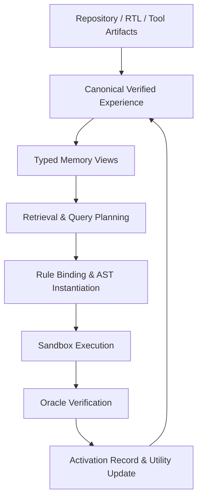
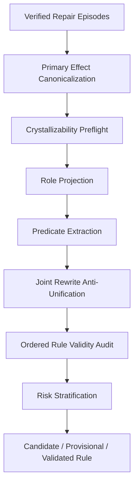
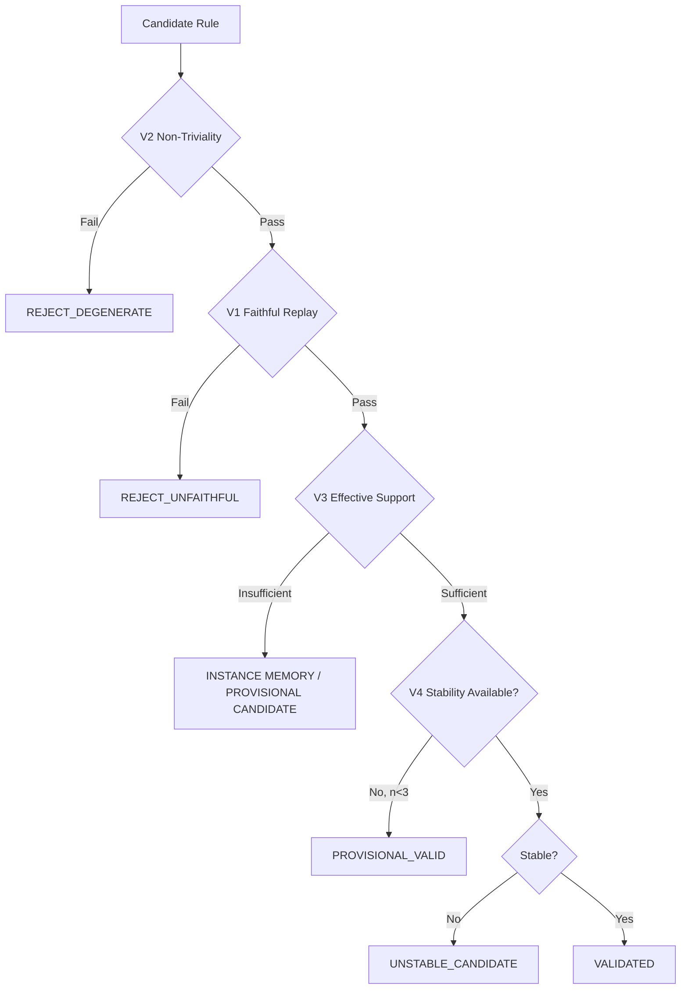
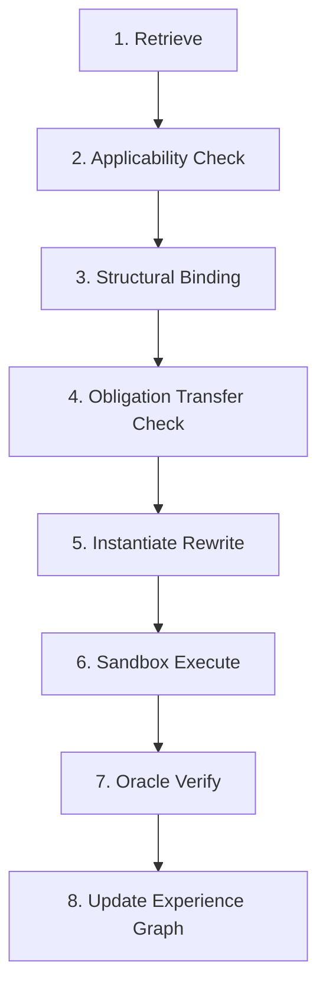

# Typed Executable Hardware Memory  
## 基于 R2G 模型与执行基座的完整 Memory Plane 替换实施方案

> 本文档总结并固化此前关于 RTL 修复智能体记忆机制的全部讨论，目标是把“记忆应该以什么形式存在、如何从修复经历中形成记忆、如何检索、如何转化为可执行修复动作、如何验证与维护”收敛成一套可以直接进入原型开发和论文写作的完整方案。

> **文档状态：终极目标架构 + R2G 完整替换版**  
> 原始方案定义的“三层 + 五视图”、Canonical Verified Experience、\(\phi\) 投影、
> Procedural Crystallization、Rule Validity、Activation-time 三轴和八步使用闭环保持不变。
> 本版新增并固化：如何在 `ShenShan123/r2g-skills` 中完整替换 legacy memory mechanism，
> 同时保留原版 R2G memory 作为独立 baseline。
>
> **代码分析基线**  
> Repository: `ShenShan123/r2g-skills`  
> Branch: `main`  
> Analyzed commit: `339441162fe4503b030d9d4bae2aa6dfadf1a805`
>
> **实验定位**  
> R2G 只作为共同的模型、Agent、工具、执行器、sandbox、oracle、A/B runner 和 rollback 基座；
> R2G 原始 symptom-indexed memory 与 TEHM 是两套相互隔离、不可混用的 Memory Backend。
> 工作路径就在/data1/zhangdy/r2g-skills/memory下。

---

## 0. 一句话结论

最终的记忆不应是文本摘要库、成功补丁库或单一向量数据库，而应是：

\[
\boxed{\textbf{Versioned Verified Hardware Experience Graph}}
\]

即**版本化的可验证硬件经验图**。

其中：

- 最小事实原子是 **Verified State Transition**；
- 多步修复过程组织为 **Repair Episode Graph**；
- 多个相关 episode 通过结晶算法形成 **Crystallized Procedural Rule**；
- Semantic、Diagnostic、Episodic、Procedural、Parametric 五种记忆不是五套平行系统，而是同一份 canonical experience 的五种派生视图；
- embedding、文本摘要和 fingerprint 只是检索索引，不是记忆本体；
- 历史记忆只能提出修复假设，不能直接决定修改，任何动作都必须重新通过 applicability、executability、verifiability 与 oracle gate。

整个系统的核心研究问题不再只是：

> 应该怎样存储 memory？

而是：

\[
\boxed{
\textbf{How does verified RTL repair experience become reusable procedural knowledge?}
}
\]

---

# 1. 研究动机：为什么自然语言记忆不适合 RTL 修复

## 1.1 已有负结果不是“记忆无效”，而是“表示形式错误”

此前实验中出现：

\[
\text{no-memory}
>
\text{textual memory / bug-class memory / oracle retrieval}
\]

这不一定说明 RTL 修复无法从历史经验中受益，更可能说明：

\[
\boxed{
\text{Natural-language memory is the wrong abstraction for RTL repair experience.}
}
\]

文本记忆存在典型的**粒度悖论**。

### 过于抽象

例如：

> 对 FSM 错误，应检查状态转移条件、默认分支和时序赋值。

优点是可迁移，但几乎不能直接指导当前设计中的具体动作。

### 过于具体

例如：

> 将 `state <= IDLE` 修改为 `state <= WAIT_ACK`。

在原 case 上可执行，但换一个模块后会因以下变化失效：

- 信号名不同；
- 层级不同；
- FSM 编码不同；
- protocol context 不同；
- bug mechanism 仅表面相似。

因此：

\[
\text{Specificity}\uparrow
\Rightarrow
\text{Actionability}\uparrow,\quad
\text{Transferability}\downarrow
\]

\[
\text{Abstraction}\uparrow
\Rightarrow
\text{Transferability}\uparrow,\quad
\text{Actionability}\downarrow
\]

真正需要解决的不是“写一条更好的经验总结”，而是建立：

\[
\boxed{
\text{Specific Evidence}
\rightarrow
\text{Reusable Mechanism}
\rightarrow
\text{Target-specific Instantiation}
}
\]

---

## 1.2 RTL repair 不是一次 patch，而是一条状态演化轨迹

一个真实修复通常是：

\[
S_0
\xrightarrow{A_0}
S_1
\xrightarrow{A_1}
S_2
\xrightarrow{A_2}
\cdots
\xrightarrow{A_n}
S_{\text{pass}}
\]

例如：

1. 第一个 patch 去除了原 failure；
2. 但输出提前一拍；
3. 第二个 patch 修复时序；
4. 又引入 reset regression；
5. 第三个 patch 才使全部 oracle 通过。

因此：

\[
\boxed{
\text{Final Patch} \neq \text{Repair Experience}
}
\]

真正的经验应该包含：

- 当前 failure state；
- 每一步 action；
- action 后 observation delta；
- 原 failure 是否被移除；
- 是否出现新 failure；
- 是否引入 regression；
- 最终是否达到 verified repair。

---

# 2. 理论基础：从记忆积累到可验证压缩

## 2.1 记忆条目并不独立

表面上，不同 RTL 修复 episode 来自不同设计和代码，但它们可能共享：

- 相同 failure mechanism；
- 相同 temporal signature；
- 相同 graph rewrite；
- 相同 verification obligation；
- 相同 risk pattern；
- 相同 repair trajectory suffix。

因此多个 episode 可能由同一潜在机制生成：

\[
z
\rightarrow
\{e_1,e_2,\ldots,e_n\}
\]

其中 \(z\) 可以是：

- premature state transition；
- handshake completion violation；
- off-by-one counter boundary；
- reset semantic loss；
- signedness mismatch；
- priority ordering defect。

---

## 2.2 Crystallization 是验证约束下的经验压缩

原始存储长度：

\[
L_{\mathrm{raw}}
=
\sum_i L(e_i)
\]

结晶后：

\[
L_{\mathrm{crystal}}
=
L(r)
+
\sum_i
\left[
L(\theta_i)+L(\epsilon_i)
\right]
\]

其中：

- \(r\)：共享规则；
- \(\theta_i\)：规则在第 \(i\) 个 episode 上的绑定；
- \(\epsilon_i\)：未被规则解释的残差和例外。

压缩增益：

\[
G_{\mathrm{comp}}
=
L_{\mathrm{raw}}
-
L_{\mathrm{crystal}}
\]

因此 crystallization 可以定义为：

\[
\boxed{
\text{Crystallization}
=
\text{Verification-Constrained Experience Compression}
}
\]

但压缩本身不是智能的充分条件。真正有价值的压缩必须：

1. 能重放历史；
2. 能预测 action effect；
3. 能展开成可执行动作；
4. 能在新设计上重新验证。

更准确地说：

\[
\boxed{
\text{EDA Agent Intelligence}
=
\text{Verified Predictive Compression}
+
\text{Goal-Directed Action}
}
\]

---

## 2.3 有效抽象带

规则可能走向两个极端：

### 欠泛化：实例记忆

规则几乎保留原 patch：

\[
L(r)\approx L(e_i)
\]

### 过泛化：万能通配

例如：

```text
Replace $X with $Y
```

描述很短，却没有稳定 applicability、effect 和 safety。

因此有效规则必须处在：

\[
\boxed{
\text{Instance Memorization}
\leftarrow
\text{Valid Abstraction Band}
\rightarrow
\text{Wildcard Collapse}
}
\]

这正是 Rule Validity Gate 的理论基础。

---

# 3. 总体架构：三层 + 五视图

## 3.1 三层架构



三层分别是：

### Layer 1：Canonical Experience Substrate

保存真实发生过的状态、动作和验证证据，是唯一 source of truth。

### Layer 2：Typed Memory Views

从 canonical experience 派生五种记忆视图。

### Layer 3：Retrieval–Activation–Verification Loop

把历史经验转化为当前设计上的候选动作，并重新验证。

---

## 3.2 五种记忆视图

### 1. Semantic Memory：设计世界模型

形式：

\[
G_D=(V_D,E_D)
\]

包含：

- module hierarchy；
- AST/CDFG；
- FSM topology；
- clock/reset domain；
- fan-in/fan-out cone；
- signal role；
- protocol role；
- width/signedness；
- assertion / test observation。

第一版只需实现局部：

\[
G_D^{local}
\]

即 repair cone 内的局部设计语义图。

### 2. Diagnostic Memory：故障签名

形式：

\[
F=
\langle
trigger,
first\ divergence,
temporal\ signature,
observable\ symptom,
structural\ locus
\rangle
\]

主要来源：

- counterexample；
- waveform；
- assertion trace；
- differential simulation；
- first-divergence analysis；
- causal cone。

### 3. Episodic Memory：修复轨迹

形式：

\[
\tau=
S_0
\xrightarrow{A_0,V_0}
S_1
\xrightarrow{A_1,V_1}
\cdots
\xrightarrow{A_n,V_n}
S_{n+1}
\]

它保留：

- success branch；
- partial improvement；
- neutral action；
- harmful action；
- newly exposed failure；
- terminal verified repair。

### 4. Procedural Memory：可执行修复规则

形式：

\[
r=
\langle
L,R,P_h,P_c,Q,\Pi,\Gamma,U,\mathcal R,\nu_{\mathcal P}
\rangle
\]

是主要可迁移记忆。

### 5. Parametric Memory：隐式能力偏置

包括：

- steering vector；
- adapter；
- learned behavioral prior；
- learned ranker。

第一阶段不实现，只保留数据接口。

---

# 4. 记忆的最终存储形式

## 4.1 最小原子：Verified State Transition

定义：

\[
e_t=
\langle
S_t,A_t,S_{t+1},O_t,V_t
\rangle
\]

其中：

- \(S_t\)：动作前状态；
- \(A_t\)：真实执行的 action；
- \(S_{t+1}\)：动作后状态；
- \(O_t\)：工具观察变化；
- \(V_t\)：验证结论与证据层级。

示例：

```yaml
transition_id: transition_0017

before_state:
  repository_commit: abc123
  rtl_slice: state_before/rtl_slice.v
  local_design_graph: state_before/graph.json
  predicate_snapshot: state_before/predicates.json
  failure_signature: state_before/failure.json
  waveform: state_before/trace.vcd

action:
  ast_edit: action/edit.json
  patch_diff: action/patch.diff
  transformation_family: STRENGTHEN_TRANSITION_GUARD

after_state:
  repository_commit: def456
  local_design_graph: state_after/graph.json
  failure_signature: state_after/failure.json

observation_delta:
  original_failure: REMOVED
  first_divergence:
    before: 18
    after: null
  failing_tests:
    before: 3
    after: 0
  created_regressions: []
  newly_observed_failures: []

verification:
  verdict: PASS
  oracle_type: REGRESSION
  confidence_tier: R
  obligation_coverage: 1.0
  evidence_refs:
    - regression_report.json
```

---

## 4.2 中间层：Repair Episode Graph

多个 transition 组成 episode：

```yaml
episode_id: episode_0008
initial_state: state_0001
terminal_state: state_0004

path:
  - transition_0017
  - transition_0018
  - transition_0019

terminal_status: VERIFIED_REPAIR

trajectory_summary:
  steps: 3
  positive_transitions: 2
  neutral_transitions: 0
  harmful_transitions: 1
  oracle_calls: 8
```

全局上不是 list，而是 graph，因为一个状态可能产生多个候选 action branch。

---

## 4.3 上层：Crystallized Procedural Rule

```yaml
rule_id: rule_0007
status: PROVISIONAL_VALID

before_pattern:
  type: FSM_TRANSITION
  source_state: $SRC
  target_state: $DST
  guard: $COND

after_pattern:
  type: FSM_TRANSITION
  source_state: $SRC
  target_state: $DST
  guard:
    and:
      - $COND
      - $ACK

hard_preconditions:
  - is_fsm_state($SRC)
  - is_fsm_state($DST)
  - controls_transition($ACK, $TRANSITION)
  - same_clock_domain($ACK, $STATE_REG)

context_predicates:
  single_clock_domain:
    support: 0.83
    coverage: 1.00
  synchronous_reset:
    support: 0.67
    coverage: 0.75

verification_obligations:
  - original_failure_removed
  - frozen_regression_preserved
  - handshake_completion_precedes_transition
  - reset_semantics_preserved

provenance:
  source_episodes:
    - episode_0008
    - episode_0013
    - episode_0021
  unique_instances: 3
  unique_lineages: 2
  source_substitutions:
    episode_0008:
      $SRC: SEND
      $DST: IDLE
      $ACK: tx_done
    episode_0013:
      $SRC: WRITE
      $DST: DONE
      $ACK: mem_ack

validity:
  non_triviality: PASS
  faithful_replay: PASS
  effective_support: PASS
  stability: N/A

utility:
  activations: 5
  positive: 4
  neutral: 0
  harmful: 1

risk_profiles:
  - type: OUTPUT_TIMING_SHIFT
    support: 1
    status: CONTEXT_DEPENDENT

predicate_schema_version: predicate-v0.1
anti_unification_version: joint-au-v0.1
```

---

## 4.4 全局组织：Experience Graph

节点：

- `DESIGN_STATE`
- `TRANSITION`
- `EPISODE`
- `FAILURE_SIGNATURE`
- `PROCEDURAL_RULE`
- `PREDICATE`
- `ORACLE`
- `ARTIFACT`
- `ACTIVATION`

边：

- `EXECUTED_FROM`
- `PRODUCED_STATE`
- `PART_OF_EPISODE`
- `DERIVED_FROM`
- `GENERALIZES`
- `SPECIALIZES`
- `COMPOSES_WITH`
- `REQUIRES`
- `CONFLICTS_WITH`
- `SHARES_RISK`
- `VERIFIED_BY`
- `ACTIVATED_ON`
- `CREATED_REGRESSION`

---

# 5. \(\phi\)：从经验到知识的核心抽象函数

\[
\boxed{
\phi:
\text{Canonical Experience}
\rightarrow
\text{Typed Memory View}
}
\]

不同视图有不同 \(\phi\)。

## 5.1 Diagnostic 抽象

\[
\phi_D:(O_t,V_t)\rightarrow F_t
\]

实现：

- trace slicing；
- first divergence；
- expected/actual delta；
- causal cone；
- temporal signature。

## 5.2 Episodic 抽象

\[
\phi_E:\{e_0,\ldots,e_n\}\rightarrow\tau
\]

把 transition 按 repository state 和 action dependency 组织成 episode graph。

## 5.3 Procedural Crystallization

\[
\boxed{
\phi_P:\{e_1,\ldots,e_n\}\rightarrow r
}
\]

这是主要算法贡献。

---

# 6. Procedural Crystallization 完整流程



## 6.1 Step 1：Episode Normalization

\[
e_i=
\langle
G_i,
F_i^{-},
A_i,
F_i^{+},
V_i^{-},
V_i^{+}
\rangle
\]

## 6.2 Step 2：Primary Effect Canonicalization

不能只使用 \(\Delta V\)。

定义：

\[
K_{\mathrm{primary}}
=
\operatorname{Canon}
(
\Delta V_{\mathrm{target/preserve}},
\Delta F,
\Delta C
)
\]

其中：

### Oracle role delta

```yaml
TARGET:
  before: FAIL
  after: PASS

PRESERVE:
  pass_to_pass_count: 37
```

### Failure delta

```yaml
first_divergence:
  before: 18
  after: null

failing_tests:
  before: 3
  after: 0
```

### Coarse structural delta

```yaml
edit_family: STRENGTHEN_GUARD
register_boundary_changed: false
dependency_cone_changed: true
```

`CREATED_REGRESSION` 和 `NEWLY_OBSERVED_FAILURE` 不作为普通 primary key，而进入 risk stratification。

## 6.3 Step 3：Crystallizability Preflight

先回答：数据中是否存在可结晶重复结构？

\[
SingletonRate
=
\frac{\#\{g:|g|=1\}}{\#groups}
\]

\[
CC_{\mathrm{raw}}
=
\frac{\sum_{|g|\ge2}|g|}{N}
\]

\[
CC_{\mathrm{lineage}}
=
\frac{
\#\{e:e\text{ belongs to a group with }\ge2\text{ lineages}\}
}{
N
}
\]

输出 group support profile：

| Group | Raw episodes | Unique instances | Unique lineages | Families |
|---|---:|---:|---:|---:|

## 6.4 Step 4：Role Projection

接口：

```python
RoleProjector(LocalDesignGraph) -> RoleMap
```

角色来自统一 Local Design Graph，而不是信号名分类器。

第一版支持：

- `STATE_REG`
- `NEXT_STATE`
- `TRANSITION_GUARD`
- `REQUEST`
- `ACK`
- `VALID`
- `READY`
- `RESET`
- `COUNTER`
- `COUNTER_BOUND`
- `DATA_PATH`
- `CONTROL_PATH`

不确定时返回 `UNKNOWN`。

## 6.5 Step 5：PredicateExtractor

角色和 predicate 共享同一个 feature extractor：

\[
G_D\xrightarrow{\psi}\mathcal F
\]

\[
RoleMap=f_{\mathrm{role}}(\mathcal F)
\]

\[
PredicateSnapshot=f_{\mathrm{predicate}}(\mathcal F)
\]

接口：

```python
def extract_predicates(
    graph: LocalDesignGraph,
    schema: PredicateSchema,
) -> PredicateSnapshot:
    ...
```

三值逻辑：

```python
TruthValue = TRUE | FALSE | UNKNOWN
```

必须满足：

\[
UNKNOWN\neq FALSE
\]

支持度：

\[
support(p)=\frac{n_T}{n_T+n_F}
\]

覆盖率：

\[
coverage(p)=\frac{n_T+n_F}{n_T+n_F+n_U}
\]

## 6.6 Step 6：Joint Rewrite Anti-Unification

不能分别 anti-unify \(L\) 和 \(R\)。

统一表示：

\[
Rewrite(L,R)
\]

接口：

```python
def anti_unify_rewrites(
    examples: Sequence[RoleNormalizedRewrite],
    config: AntiUnifyConfig,
) -> AntiUnifyResult:
    ...
```

返回：

```python
@dataclass
class AntiUnifyResult:
    before_pattern: AstNode
    after_pattern: AstNode
    source_substitutions: dict[EpisodeId, Substitution]
    hole_constraints: list[HoleConstraint]
    abstraction_metrics: AbstractionMetrics
    merge_trace: list[MergeStep]
    algorithm_version: str
```

四条 invariant：

1. `UNKNOWN != FALSE`
2. before/after 共享 hole namespace
3. 保存 crystallization-time witness
4. 固定输入和版本得到 deterministic result

合并顺序：

1. 计算 pairwise AU cost；
2. 选择最低 cost pair；
3. tie-break：episode ID，再 commit hash；
4. 合并；
5. 重算 cost；
6. 保存完整 merge trace。

---

# 7. Rule Validity：结晶时审计

核心理论结构：

\[
\boxed{
\text{Rule Validity}
\perp
(
\text{Applicability},
\text{Executability},
\text{Verifiability}
)
}
\]

Rule Validity 回答：

> 经验是否被正确结晶？

后三者回答：

> 已结晶经验能否在新设计上安全迁移？

## 7.1 有序 Validity 状态机

\[
\boxed{
V2\rightarrow V1\rightarrow V3\rightarrow V4
}
\]



## 7.2 V2：Non-Triviality

先排除：

- instance memorization；
- wildcard degeneration。

综合指标：

- abstraction coverage；
- hole ratio；
- structural retention。

规则必须落在有效抽象带：

\[
A(r)\in\mathcal B_{\mathrm{valid}}
\]

## 7.3 V1：Derivation-Faithful Replay

只使用 anti-unification 生成的 witness：

\[
\Theta_i^{AU}
\]

检查：

\[
r[\Theta_i^{AU}]\approx A_i
\]

禁止重新搜索“最有利 binding”。

## 7.4 V3：Effective Support

报告：

- raw support；
- unique attempts；
- unique bug instances；
- unique RTL lineages；
- unique mechanism families。

同一 bug 的多个 seed 只能用于算法 sanity，不能支撑 cross-lineage transfer claim。

## 7.5 V4：Stability

当 \(n\ge3\) 时：

\[
r_{-i}
=
\phi_P(\mathcal G\setminus e_i)
\]

检查是否能解释 held-out source episode。

当 \(n<3\)：

```text
V4 = N/A
```

不是 `FAIL`。

---

# 8. Risk Stratification

必须区分：

## 8.1 Created Regression

\[
PASS\rightarrow FAIL
\]

说明 patch 引入新错误。

## 8.2 Newly Observed Failure

\[
N/A\rightarrow FAIL
\]

可能来自：

- 新增 oracle；
- 验证范围扩大；
- 原 failure 消失后暴露深层错误。

规则 risk profile：

```yaml
risk_profiles:
  - risk: RESET_REGRESSION
    support: 2
    contexts:
      reset_style: ASYNC
      output_from_state: true

  - risk: OUTPUT_TIMING_SHIFT
    support: 1
    status: CONTEXT_DEPENDENT
```

第一版不自动把 \(P_c\) promotion 为 \(P_h\)，只记录 activation context。

---

# 9. 检索：如何找到这种形式的记忆

## 9.1 检索对象

不是：

\[
\text{Text Query}\rightarrow\text{Text Chunk}
\]

而是：

\[
\boxed{
\text{Current Repair State}
\rightarrow
\text{Similar Historical States / Rules / Sub-trajectories}
}
\]

## 9.2 Stage 0：Query Planning

输出：

```yaml
query_plan:
  diagnostic_view: high
  semantic_view: medium
  episodic_view: medium
  procedural_view: high

dominant_dimensions:
  temporal: high
  structural: high
  width_type: low
```

## 9.3 Stage 1：High-Recall Retrieval

索引：

- failure fingerprint；
- structural fingerprint；
- temporal fingerprint；
- repair-history fingerprint；
- rule predicate index；
- graph neighborhood index。

可以使用 ANN/embedding，但只是高召回索引。

## 9.4 Stage 2：Hard Symbolic Filtering

执行：

\[
P_h(S_q)
\]

输出：

- `APPLICABLE`
- `INAPPLICABLE`
- `UNRESOLVED`

关键 hard predicate 为 `UNKNOWN` 时不能默认通过。

## 9.5 Stage 3：Utility Reranking

第一版：

\[
Score=
Similarity
\times Utility
\times Confidence
\times RiskPenalty
\]

以后训练：

\[
f_\theta(q,r)
\rightarrow
P(\text{positive transition}\mid q,r)
\]

neural ranker 不能覆盖 symbolic veto。

---

# 10. 记忆使用：八步 Activation Pipeline



## Step 1：Retrieve

召回：

\[
\mathcal R_q=\{r_1,\ldots,r_k\}
\]

## Step 2：Applicability Check

检查：

\[
P_h^r(S_q)
\]

## Step 3：Structural Binding

\[
\theta_L:\Theta\rightarrow Entities(G_q)
\]

例如：

```yaml
$SRC: SEND
$DST: IDLE
$ACK: tx_done
$STATE_REG: state_q
$TRANSITION: ast_node_143
```

## Step 4：Obligation Transfer Check

对每条 \(q\in Q\)：

- `BOUND`
- `SYNTHESIZABLE`
- `UNAVAILABLE`

计算：

\[
OC=
\frac{
\#\text{successfully bound and checked obligations}
}{
|Q|
}
\]

若 obligation 不可迁移，不能静默跳过，必须降低 activation confidence。

## Step 5：Instantiate Rewrite

生成结构化 AST rewrite：

```json
{
  "target_ast": "node_143",
  "operation": "replace_guard",
  "before": "req",
  "after": "req && tx_done"
}
```

## Step 6：Sandbox Execute

在隔离 worktree 中：

- 执行 AST rewrite；
- 生成 RTL；
- format；
- parse；
- compile。

## Step 7：Verify

执行可用 \(Q\)：

- target test；
- frozen regression；
- SVA；
- simulation differential；
- formal equivalence；
- sequential miter；
- lint/compile。

输出：

```yaml
verdict: PASS
oracle_tier: REGRESSION
obligation_coverage: 0.75
created_regressions: 0
newly_observed_failures: 1
```

## Step 8：Update

更新：

- utility；
- risk；
- activation history；
- confidence；
- new transition；
- episode graph；
- repository state。

---

# 11. Activation-time 三轴模型

对于 \((r,S_q)\)，分别判断：

## Applicable

是否满足 \(P_h\)。

## Executable

是否能：

- bind；
- instantiate；
- 生成良构 AST；
- compile。

## Verifiable

是否：

- obligation 能迁移；
- oracle 可执行；
- obligation coverage 足够；
- verdict strength 可说明。

三者不能合并为一个简单 success/fail。

---

# 12. 验证证据分层

定义：

\[
V_t=
(
verdict,
oracle\ type,
scope,
confidence,
evidence
)
\]

建议等级：

| Tier | 证据类型 | 可声称内容 |
|---|---|---|
| F | formal equivalence / property proof | 在给定 property/assumption 下形式化成立 |
| R | frozen regression / differential simulation | 在当前回归范围内未观察到错误 |
| T | target test only | 当前目标 failure 被修复 |
| H | compile / lint / heuristic | 仅结构或语法层面通过 |

Rule confidence 与 Activation confidence 分开：

\[
\Gamma=
(
\Gamma_{\mathrm{rule}},
\Gamma_{\mathrm{activation}}
)
\]

---

# 13. 核心指标

## 13.1 Rule Coverage

### Retrieval Coverage

\[
RC_{\mathrm{ret}}
=
\frac{
\#\text{bugs with retrieved candidates}
}{
N
}
\]

### Executable Rule Coverage

\[
RC_{\mathrm{exec}}
=
\frac{
\#\text{bugs with at least one executable rule}
}{
N
}
\]

## 13.2 Applicability Yield

\[
AY=
\frac{
N_{\mathrm{symbolically\ applicable}}
}{
N_{\mathrm{retrieved}}
}
\]

## 13.3 Binding Success Rate

\[
BSR=
\frac{
N_{\mathrm{successful\ bindings}}
}{
N_{\mathrm{applicable}}
}
\]

## 13.4 Instantiation Validity Rate

\[
IVR=
\frac{
N_{\mathrm{well\text{-}formed\ executable\ patches}}
}{
N_{\mathrm{successful\ bindings}}
}
\]

## 13.5 Repair Utility

\[
RU=
\frac{
N_{\mathrm{positive\ transitions}}
}{
N_{\mathrm{executed\ activations}}
}
\]

## 13.6 Harmful Activation Rate

\[
HAR=
\frac{
N_{\mathrm{memory\text{-}induced\ regressions}}
}{
N_{\mathrm{executed\ activations}}
}
\]

## 13.7 Obligation Coverage

\[
OC=
\frac{
N_{\mathrm{checked\ obligations}}
}{
N_{\mathrm{required\ obligations}}
}
\]

## 13.8 Transfer Efficiency

\[
TE=
\frac{
N_{\mathrm{cross\text{-}lineage\ successful\ reuse}}
}{
N_{\mathrm{cross\text{-}lineage\ activations}}
}
\]

## 13.9 漏斗

\[
\boxed{
RC_{\mathrm{ret}}
\rightarrow
AY
\rightarrow
BSR
\rightarrow
IVR
\rightarrow
RU
}
\]

同时报告：

\[
RC_{\mathrm{exec}},HAR,OC,TE
\]

---

# 14. 压缩与熵相关指标

## 14.1 Verified Compression Gain

\[
VCG=
1-
\frac{
DL_{\mathrm{crystal}}
}{
DL_{\mathrm{raw}}
}
\]

只统计通过 Validity Gate 的规则。

## 14.2 Action Entropy Reduction

\[
\Delta H_A
=
H(A\mid S)
-
H(A\mid S,\mathcal R)
\]

## 14.3 Transition Entropy Reduction

\[
\Delta H_T
=
H(S'\mid S,A)
-
H(S'\mid S,A,\mathcal R)
\]

第一版可用代理量：

- candidate action 数量；
- top-rule concentration；
- effect prediction accuracy；
- action outcome distribution。

---

---

# 15. R2G Memory Plane 替换目标与代码基线

## 15.1 最终定位

本项目不是在 R2G 原 memory 上叠加一个新模块，而是执行：

\[
\boxed{
\text{保留 R2G Agent / Model / Tool / Verifier Plane}
+
\text{完整替换 R2G Memory Plane}
}
\]

形成两个严格隔离的实验系统：

\[
\boxed{
\text{R2G-Legacy Memory}
\quad\text{vs.}\quad
\text{TEHM Memory Replacement}
}
\]

两组共享：

- 相同 LLM；
- 相同 Agent 主循环；
- 相同 prompt 主体；
- 相同工具接口；
- 相同工具版本；
- 相同 sandbox/worktree；
- 相同候选预算；
- 相同 token、工具调用与 wall-clock budget；
- 相同 ORFS、DRC、LVS、timing、RCX；
- RTL 阶段相同 Icarus、Yosys、formal/simulation oracle；
- 相同 benchmark、split、seed 和任务顺序；
- 相同 rollback 与 crash recovery。

两组唯一的核心自变量是：

\[
\boxed{\text{Memory Architecture}}
\]

---

## 15.2 R2G Legacy Memory 当前实现

当前 R2G memory 的主要链路为：

```text
reports/*.json
stage_log.jsonl
diagnosis.json
fix_log.jsonl
        │
        ▼
ingest_run.py
        │
        ├── runs / failure_events / run_violations
        └── fix_events
                │
                ▼
learn_heuristics.py
        │
        ├── fix_trajectories
        └── heuristics.json
                │
                ▼
symptom_id → strategy statistics
                │
                ▼
suggest_config.py / diagnose_signoff_fix.py
                │
                ▼
recipe_status
shadow / candidate / promoted
                │
                ▼
ab_runner.py + engineer_loop.py
```

其核心记忆单位是：

```text
symptom_id
→ strategy ID
→ attempts / successes / failures / reduction
→ priority ranking
```

当前 `symptom_id` 由：

```text
{check, class, curated TRUE-only predicates}
```

哈希得到。该机制具有稳定、轻量、可跨设计聚合的优势，但不能完整表达：

- 状态前后变化；
- 结构角色；
- `FALSE` 与 `UNKNOWN`；
- 参数化 rewrite；
- verification obligations；
- source substitution witness；
- rule crystallization validity；
- applicability、executability、verifiability 的独立结果；
- 多规则关系、组合与风险。

---

## 15.3 为什么必须完整替换而不是增强

若将 TEHM 放在 legacy memory 上方，会产生以下混淆：

1. **收益不可归因**  
   无法判断增益来自 legacy symptom ranking，还是来自 TEHM。

2. **authority 不唯一**  
   同一次决策可能同时受到 `heuristics.json`、`recipe_status` 和 TEHM rule 的影响。

3. **负结果不可解释**  
   TEHM 失败时，无法区分是结晶失败，还是 legacy 路由先把错误候选排到前面。

4. **baseline 被污染**  
   若 legacy learner 读取 TEHM activation 结果，baseline 会逐渐吸收实验方法的收益。

5. **无法回答核心研究问题**

真正要回答的是：

\[
\boxed{
\textbf{
Under the same executable EDA agent,
does Typed Executable Hardware Memory outperform
symptom-indexed statistical memory?
}
}
\]

因此实验必须保证：

\[
Memory_{\mathrm{legacy}}
\cap
Memory_{\mathrm{tehm}}
=
\varnothing
\]

---

# 16. 替换边界：保留什么，替换什么

## 16.1 保留为共同基座的组件

这些组件不是 memory authority，可以继续复用：

| 组件 | 保留原因 | TEHM 使用方式 |
|---|---|---|
| `scripts/loop/engineer_loop.py` | 已实现 resumable campaign、sandbox、crash recovery | 作为统一执行调度器 |
| `scripts/flow/run_orfs.sh` 等 | 已实现真实 EDA flow | 执行实例化后的 action |
| DRC/LVS/timing/RCX extractors | executable oracle | 生成 \(V_t\) 和 obligation result |
| `fix_signoff.sh` | 真实修改和重新检查 | 作为 flow/signoff action executor |
| A/B arm clone 与 judge 算法 | 公平实测基础设施 | 提取为 backend-neutral trial executor |
| ledger | 执行状态，不是长期知识 | 保存 execution authority |
| rollback / config restore | 安全恢复 | 执行失败或 gate fail 后回滚 |
| tool-version capture | provenance | 写入 canonical episode |
| `journal_db.py` 的 append-only instrumentation 设计 | 原始审计证据 | 两个 arm 使用独立 journal 文件 |
| `knowledge_sync.py` 的 deterministic NDJSON 思路 | 可合并基础设施 | 为 TEHM 重写独立 bundle exporter |

---

## 16.2 Legacy arm 独占的组件

以下模块和数据只属于 baseline：

- `symptom.py` 作为 universal memory index；
- `fix_trajectories` 作为主要 episode abstraction；
- `heuristics.json`；
- `learn_heuristics.py` 的 legacy recipe aggregation；
- `fix_model.py` 的 Beta strategy ranking；
- `recipe_status`；
- legacy `ab_trials`；
- `search_failures.py` / prose lessons 参与 runtime suggestion；
- legacy learned branch of `suggest_config.py`；
- legacy learned branch of `diagnose_signoff_fix.py`。

TEHM arm 不得读取这些对象作为 memory authority。

---

## 16.3 TEHM arm 独占的组件

TEHM arm 使用：

- `tehm.sqlite`；
- content-addressed artifact store；
- canonical states；
- verified transitions；
- repair episode graph；
- five typed views；
- effect groups；
- crystallized rules；
- validity profiles；
- rule lifecycle；
- activation records；
- TEHM A/B trial records；
- TEHM retrieval index；
- TEHM deterministic bundle。

---

## 16.4 可共享与不可共享的数据

### 可以共享

- frozen source repository snapshot；
- benchmark cases；
- frozen offline training episode bundle；
- model checkpoint / API model；
- tool versions；
- executable verifier；
- budget；
- seed；
- evaluation code；
- raw immutable task definitions。

### 不可共享

- memory DB；
- retrieval cache；
- strategy/rule utility；
- promotion status；
- activation records；
- learned ranking；
- rule store；
- negative evidence；
- A/B verdict history；
- online training outcomes。

---

# 17. Memory Backend 抽象层

## 17.1 统一接口

新增：

```text
r2g-skills/signoff-loop/memory/
├── interface.py
├── factory.py
├── none_backend.py
├── legacy_backend.py
└── tehm/
```

核心接口：

```python
from typing import Protocol, Sequence

class MemoryBackend(Protocol):
    name: str

    def ingest_execution(
        self,
        record: "ExecutionRecord",
    ) -> "IngestReceipt":
        ...

    def build_query(
        self,
        context: "RepairContext",
    ) -> "MemoryQuery":
        ...

    def retrieve(
        self,
        query: "MemoryQuery",
        *,
        limit: int,
    ) -> Sequence["MemoryCandidate"]:
        ...

    def propose_activation(
        self,
        candidate: "MemoryCandidate",
        context: "RepairContext",
    ) -> "ActivationProposal":
        ...

    def record_activation(
        self,
        result: "ActivationResult",
    ) -> None:
        ...

    def rebuild(
        self,
        *,
        frozen_source: bool = False,
    ) -> "BuildReport":
        ...

    def snapshot(self) -> "MemorySnapshot":
        ...
```

---

## 17.2 三个 backend

```text
R2G_MEMORY_BACKEND=none
R2G_MEMORY_BACKEND=legacy
R2G_MEMORY_BACKEND=tehm
```

### `none`

- 不检索历史经验；
- 仍记录 execution evidence；
- 用作 no-memory baseline。

### `legacy`

- 调用原始 symptom / trajectory / heuristic / recipe lifecycle；
- 算法语义不得变化；
- 用于复现原 R2G baseline。

### `tehm`

- 完全绕过 legacy learner、ranking 和 lifecycle；
- 使用三层 + 五视图架构。

---

## 17.3 Backend 选择必须在进程启动时锁定

禁止一次 run 中切换 backend。

```python
backend_name = os.environ.get("R2G_MEMORY_BACKEND", "legacy")
backend = MemoryBackendFactory.open(
    backend_name,
    experiment_root=...,
    read_only_eval=...,
)
```

写入 ledger：

```json
{
  "memory_backend": "tehm",
  "memory_snapshot_id": "tehm-snapshot-...",
  "memory_schema_version": "tehm-v3"
}
```

任何 resume 必须验证 backend 和 snapshot 未变化。

---

## 17.4 Fail-closed 规则

- TEHM DB 不可读：不得静默回退 legacy；
- TEHM retrieval 报错：记录 `memory_unavailable`，走 no-memory/static cold-start，而非读取 legacy；
- legacy arm 不得读取 `tehm.sqlite`；
- backend 选择不一致时，resume 拒绝运行；
- evaluation arm 中 memory 必须只读冻结，除非协议明确是 online evaluation。

---

# 18. 仓库与分支组织

## 18.1 冻结 baseline

在当前分析提交上建立不可变 baseline：

```text
tag: r2g-legacy-memory-baseline-3394411
```

保留：

- 原始代码；
- 原始 schema；
- 原始 knowledge bundle；
- 原始 tests；
- 原始 heuristic snapshot。

该 tag 只允许安全修复，不允许修改 legacy memory 算法语义。

---

## 18.2 开发分支

```text
feature/tehm-memory-replacement
```

建议目录：

```text
r2g-skills/signoff-loop/memory/
├── interface.py
├── factory.py
├── contracts.py
├── none_backend.py
├── legacy_backend.py
└── tehm/
    ├── __init__.py
    ├── config.py
    ├── ids.py
    ├── db.py
    ├── schema.sql
    ├── migrations.py
    ├── artifact_store.py
    │
    ├── canonical/
    │   ├── state.py
    │   ├── transition.py
    │   ├── episode.py
    │   ├── verifier.py
    │   └── capture.py
    │
    ├── views/
    │   ├── base.py
    │   ├── semantic.py
    │   ├── diagnostic.py
    │   ├── episodic.py
    │   ├── procedural.py
    │   ├── parametric_stub.py
    │   └── materialize.py
    │
    ├── graph/
    │   ├── local_design_graph.py
    │   ├── feature_extractor.py
    │   ├── roles.py
    │   └── predicates.py
    │
    ├── crystallization/
    │   ├── normalize.py
    │   ├── effects.py
    │   ├── preflight.py
    │   ├── role_normalize.py
    │   ├── anti_unify.py
    │   ├── synthesize_skill.py
    │   ├── validity.py
    │   └── risk.py
    │
    ├── retrieval/
    │   ├── query_planner.py
    │   ├── index.py
    │   ├── recall.py
    │   ├── symbolic_filter.py
    │   ├── rerank.py
    │   └── result.py
    │
    ├── activation/
    │   ├── applicability.py
    │   ├── binding.py
    │   ├── obligation_transfer.py
    │   ├── instantiate.py
    │   ├── execute_adapter.py
    │   ├── verify.py
    │   └── update.py
    │
    ├── lifecycle/
    │   ├── rule_status.py
    │   ├── trial_adapter.py
    │   ├── authority.py
    │   └── rollback.py
    │
    ├── sync/
    │   ├── export.py
    │   ├── import_.py
    │   ├── merge.py
    │   └── manifest.py
    │
    ├── metrics/
    │   ├── funnel.py
    │   ├── compression.py
    │   ├── transfer.py
    │   └── report.py
    │
    └── schemas/
        ├── episode_v1.json
        ├── transition_v1.json
        ├── rule_v1.json
        ├── activation_v1.json
        ├── predicate_v1.yaml
        ├── role_v1.yaml
        └── obligation_v1.yaml
```

---

# 19. 独立物理存储与数据模型

## 19.1 严格分库

建议实验目录：

```text
experiments/
├── legacy/
│   ├── seed_0/
│   │   ├── knowledge.sqlite
│   │   ├── journal.sqlite
│   │   └── artifacts/
│   └── ...
├── tehm/
│   ├── seed_0/
│   │   ├── tehm.sqlite
│   │   ├── journal.sqlite
│   │   ├── artifacts/
│   │   └── indexes/
│   └── ...
└── none/
```

禁止同一个 SQLite 同时存 legacy 和 TEHM authority。

---

## 19.2 TEHM 核心表

### `tehm_states`

```sql
CREATE TABLE tehm_states (
    state_id                  TEXT PRIMARY KEY,
    domain                    TEXT NOT NULL,
    project_id                TEXT,
    design_id                 TEXT,
    lineage_id                TEXT,
    repository_ref            TEXT,
    source_digest             TEXT,
    context_graph_digest      TEXT,
    verifier_snapshot_json    TEXT,
    artifact_manifest_json    TEXT,
    created_at                TEXT NOT NULL,
    schema_version            TEXT NOT NULL
);
```

### `tehm_transitions`

```sql
CREATE TABLE tehm_transitions (
    transition_id             TEXT PRIMARY KEY,
    source_state_id           TEXT NOT NULL,
    target_state_id           TEXT NOT NULL,
    action_domain             TEXT NOT NULL,
    action_json               TEXT NOT NULL,
    observation_delta_json    TEXT NOT NULL,
    verifier_json             TEXT NOT NULL,
    primary_effect_key        TEXT,
    outcome                   TEXT NOT NULL,
    created_regressions_json  TEXT,
    newly_observed_json       TEXT,
    provenance_json           TEXT NOT NULL,
    schema_version            TEXT NOT NULL
);
```

### `tehm_episodes`

```sql
CREATE TABLE tehm_episodes (
    episode_id                TEXT PRIMARY KEY,
    domain                    TEXT NOT NULL,
    initial_state_id          TEXT NOT NULL,
    terminal_state_id         TEXT,
    terminal_status           TEXT,
    mechanism_family          TEXT,
    lineage_id                TEXT,
    trajectory_summary_json   TEXT,
    provenance_json           TEXT NOT NULL,
    schema_version            TEXT NOT NULL
);
```

### `tehm_episode_steps`

```sql
CREATE TABLE tehm_episode_steps (
    episode_id       TEXT NOT NULL,
    step_index       INTEGER NOT NULL,
    transition_id    TEXT NOT NULL,
    branch_id        TEXT DEFAULT 'main',
    PRIMARY KEY (episode_id, branch_id, step_index)
);
```

---

## 19.3 五视图必须是 first-class materialized object

```sql
CREATE TABLE tehm_views (
    owner_type          TEXT NOT NULL,
    owner_id            TEXT NOT NULL,
    view_type           TEXT NOT NULL,
    schema_version      TEXT NOT NULL,
    extractor_version   TEXT NOT NULL,
    payload_json        TEXT NOT NULL,
    payload_digest      TEXT NOT NULL,
    source_refs_json    TEXT,
    materialized_at     TEXT NOT NULL,
    PRIMARY KEY (
        owner_type,
        owner_id,
        view_type,
        schema_version,
        extractor_version
    )
);
```

其中：

```text
owner_type = state | transition | episode | rule | activation
view_type  = semantic | diagnostic | episodic | procedural | parametric
```

该表保证：

- canonical episode 不被 \(\phi\) 更新覆盖；
- extractor 升级可重建视图；
- 新旧 view 可并存比较；
- 五视图不是埋在某个大 JSON 中的附属字段。

---

## 19.4 Rule 相关表

```sql
CREATE TABLE tehm_rules (
    rule_id                    TEXT PRIMARY KEY,
    domain                     TEXT NOT NULL,
    before_pattern_json        TEXT NOT NULL,
    after_pattern_json         TEXT NOT NULL,
    hard_preconditions_json    TEXT NOT NULL,
    context_profile_json       TEXT NOT NULL,
    obligations_json           TEXT NOT NULL,
    validity_status            TEXT NOT NULL,
    validity_profile_json      TEXT NOT NULL,
    confidence_json            TEXT NOT NULL,
    utility_json               TEXT NOT NULL,
    risk_profile_json          TEXT NOT NULL,
    predicate_schema_version   TEXT NOT NULL,
    role_schema_version        TEXT NOT NULL,
    crystallizer_version       TEXT NOT NULL,
    merge_trace_digest         TEXT NOT NULL,
    created_at                 TEXT NOT NULL,
    updated_at                 TEXT NOT NULL
);
```

```sql
CREATE TABLE tehm_rule_sources (
    rule_id                   TEXT NOT NULL,
    episode_id                TEXT NOT NULL,
    source_substitution_json  TEXT NOT NULL,
    evidence_profile_json     TEXT NOT NULL,
    lineage_id                TEXT,
    PRIMARY KEY (rule_id, episode_id)
);
```

实验数据角色不写回 canonical transition，而由独立的
`tehm_dataset_membership(transition_id, campaign_id, split, learner_eligible,
frozen_snapshot_digest)` 表记录。`crystallize` 必须显式指定 campaign，并且只
读取该 campaign 中 `learner_eligible=1` 的 transition；held-out/A-B 证据可以保留
用于审计，但不能通过默认查询进入 learner support。

---

## 19.5 Activation 与 runtime authority

```sql
CREATE TABLE tehm_activations (
    activation_id              TEXT PRIMARY KEY,
    rule_id                    TEXT NOT NULL,
    target_state_id            TEXT NOT NULL,
    query_plan_json            TEXT,
    retrieval_receipt_json     TEXT NOT NULL,
    applicability_status       TEXT NOT NULL,
    predicate_snapshot_id      TEXT,
    binding_status             TEXT,
    binding_json               TEXT,
    executability_status       TEXT,
    obligation_transfer_json   TEXT,
    obligation_coverage        REAL,
    verification_status        TEXT,
    verifier_json              TEXT,
    outcome                    TEXT,
    created_regressions_json   TEXT,
    produced_transition_id     TEXT,
    rollback_receipt_json      TEXT,
    trial_uuid                 TEXT,
    created_at                 TEXT NOT NULL
);
```

---

## 19.6 Rule lifecycle 独立于 legacy recipe lifecycle

```sql
CREATE TABLE tehm_rule_status (
    rule_id          TEXT NOT NULL,
    target_scope     TEXT NOT NULL,
    status           TEXT NOT NULL,
    status_version   INTEGER NOT NULL,
    provenance_json  TEXT,
    updated_at       TEXT NOT NULL,
    PRIMARY KEY (rule_id, target_scope)
);
```

状态：

```text
shadow
candidate
promoted
demoted
quarantined
```

TEHM 不写 `recipe_status`。

---

## 19.7 Experience Graph 关系

```sql
CREATE TABLE tehm_edges (
    source_id       TEXT NOT NULL,
    relation_type   TEXT NOT NULL,
    target_id       TEXT NOT NULL,
    metadata_json   TEXT,
    PRIMARY KEY (source_id, relation_type, target_id)
);
```

关系包括：

```text
EXECUTED_FROM
PRODUCED_STATE
PART_OF_EPISODE
DERIVED_FROM
GENERALIZES
SPECIALIZES
COMPOSES_WITH
REQUIRES
CONFLICTS_WITH
SHARES_RISK
VERIFIED_BY
ACTIVATED_ON
CREATED_REGRESSION
```

---

## 19.8 重型 artifact 存储

使用 content-addressed store：

```text
artifacts/
└── sha256/
    ├── 00/
    ├── 01/
    └── ...
```

manifest：

```json
{
  "digest": "sha256:...",
  "kind": "vcd|rtl|ast|yosys_json|report|counterexample|diff",
  "producer": "icarus|yosys|openroad|klayout|tehm",
  "schema_version": "artifact-v1",
  "size": 12345,
  "relative_path": "sha256/ab/..."
}
```

数据库只保存 digest 和引用。

---

# 20. R2G 文件级替换矩阵

## 20.1 `knowledge/schema.sql`

### Legacy arm

保持不变。

### TEHM arm

不向该 schema 添加 TEHM authority，改为独立：

```text
memory/tehm/schema.sql
```

原因：

- 防止 baseline 污染；
- 便于独立 migration；
- 允许完全删除/重建 TEHM；
- 避免 `knowledge_sync.py` 无意导出 TEHM 数据。

---

## 20.2 `knowledge/knowledge_db.py`

### 保留

仅供 legacy backend。

### 新增

```text
memory/tehm/db.py
```

不得让 TEHM 调用 legacy `query_knowledge` 或 `heuristics.json` API。

---

## 20.3 `knowledge/journal_db.py`

提取 backend-neutral instrumentation adapter：

```python
record_memory_event(
    backend,
    event_type,
    payload,
)
```

但两个 backend 使用不同 journal 路径。

journal 永远不是 learner authority。

---

## 20.4 `knowledge/ingest_run.py`

当前职责包含：

- 读取 reports；
- 写 `runs`；
- 写 `failure_events`；
- 写 `fix_events`；
- 触发 legacy auto-learn。

修改为两部分：

```python
evidence = collect_execution_evidence(project, reports, logs)

backend.ingest_execution(evidence)
```

### Legacy backend

调用原始 ingest 逻辑，行为保持不变。

### TEHM backend

调用：

```python
tehm.capture.canonicalize(evidence)
tehm.capture.write_state_transition_episode(...)
```

TEHM 模式下禁止：

- 写入 legacy `fix_events` 作为 memory authority；
- 触发 `learn_heuristics.py`；
- 更新 `heuristics.json`；
- enqueue legacy recipe。

可选地为审计生成只读兼容报告，但不能被 runtime 读取。

---

## 20.5 `knowledge/learn_heuristics.py`

### Legacy

保持原样，是 baseline learner。

### TEHM

完全不调用。

新增：

```text
memory/tehm/crystallization/build_rules.py
```

其入口：

```bash
python -m memory.tehm.cli crystallize \
  --db tehm.sqlite \
  --snapshot frozen-training-v1
```

---

## 20.6 `knowledge/symptom.py`

### Legacy

继续作为 baseline universal index。

### TEHM

不作为 authority。

可在 Diagnostic View 中记录：

```text
legacy_symptom_id
```

作为兼容分析字段，但检索不得仅依赖它，也不得调用 legacy recipe。

TEHM 使用：

- failure signature；
- semantic graph；
- tri-valued predicates；
- repair-state signature；
- role-aligned structural pattern。

---

## 20.7 `knowledge/suggest_config.py`

改为 backend router：

```python
backend = open_memory_backend(...)
return backend.suggest_config(context)
```

legacy backend 调用原实现。

TEHM backend 调用：

```text
query plan
→ retrieve rule
→ symbolic filter
→ bind
→ instantiate typed config action
```

---

## 20.8 `scripts/reports/diagnose_signoff_fix.py`

将当前静态 catalog 与 learned ranking 拆开：

```text
diagnose facts
build cold-start catalog
memory backend proposal
final plan assembly
```

建议新增：

```python
def diagnose_context(...) -> RepairContext:
    ...

def cold_start_catalog(context) -> list[ActionProposal]:
    ...

def memory_candidates(context, backend) -> list[ActionProposal]:
    ...
```

### Legacy

保持当前 static catalog + learned recipe ranking。

### TEHM

- 不加载 `heuristics.json`；
- 不调用 `fix_model` learned score；
- 不调用 `recipe_lifecycle.filter_promoted`；
- 只接收 TEHM promoted rules；
- 若 Rule Coverage 为 0，可使用相同 static cold-start catalog，但必须标记：
  `source = cold_start`, 不能伪装为 memory hit。

为公平起见，static catalog 应作为两组共同的 base policy，memory 只控制历史经验增强部分。

---

## 20.9 `scripts/reports/fix_model.py`

legacy-only。

TEHM 新建：

```text
memory/tehm/retrieval/rerank.py
```

第一版使用透明 score：

\[
Score =
w_s Similarity
+
w_u Utility
+
w_c Confidence
-
w_r Risk
\]

或乘法形式，但必须在实验中固定。

---

## 20.10 `knowledge/recipe_lifecycle.py`

legacy-only。

TEHM 使用：

```text
memory/tehm/lifecycle/rule_status.py
```

Rule Validity 与 Runtime Lifecycle 严格分开：

```text
Candidate Rule
→ Validity Audit
→ Provisional / Validated Rule
→ shadow
→ candidate
→ A/B
→ promoted / demoted
```

---

## 20.11 `knowledge/ab_runner.py`

保留其 arm execution/judge 能力，但抽取为：

```python
class TrialSubject(Protocol):
    subject_id: str
    status_version: int

    def instantiate_arm_a(...): ...
    def instantiate_arm_b(...): ...
    def evaluate(...): ...
```

两个实现：

```text
LegacyRecipeTrialSubject
TEHMRuleTrialSubject
```

TEHM verdict 写入：

```text
tehm_trials
tehm_rule_status
```

而不是 legacy `ab_trials` / `recipe_status`。

---

## 20.12 `scripts/loop/engineer_loop.py`

保留：

- ledger；
- flow execution；
- signoff；
- sandbox；
- arm copy；
- timeout；
- orphan reclaim；
- rollback；
- escalation scheduling。

修改 memory 调用点：

```python
backend = open_memory_backend(entry["memory_backend"])

context = build_repair_context(...)
proposal = backend.retrieve_and_propose(context)

execution = execute_proposal(proposal)
result = verify_execution(execution)

backend.record_activation(result)
```

ledger 中必须记录：

```json
{
  "memory_backend": "tehm",
  "memory_snapshot_id": "...",
  "activation_id": "...",
  "rule_id": "...",
  "binding_digest": "...",
  "obligation_set_digest": "...",
  "rule_status_version": 7
}
```

resume 时全部校验。

---

## 20.13 `knowledge/search_failures.py` 与 `sync_lessons.py`

legacy-only runtime memory。

TEHM 可以生成 human-readable explanation，但：

- prose 不作为 source of truth；
- BM25 不参与 TEHM authoritative retrieval；
- 任何文本摘要只属于 explanation/index view。

---

## 20.14 `knowledge/honesty.py`

保留 legacy gates。

新增独立：

```text
memory/tehm/honesty.py
```

顶层 CI 同时运行：

```text
legacy honesty
TEHM honesty
cross-backend firewall honesty
```

---

## 20.15 `knowledge/knowledge_sync.py`

legacy-only bundle 不变。

新增：

```text
memory/tehm/sync/
```

使用 TEHM content IDs、rule IDs 和 artifact digests 定义 natural key。

禁止把 legacy 和 TEHM table 放进同一个 bundle manifest。

---

## 20.16 `knowledge/observe.py`

增加 backend 参数：

```bash
observe.py health --memory-backend legacy
observe.py health --memory-backend tehm
```

TEHM health 报告：

- state/transition completeness；
- view materialization coverage；
- singleton rate；
- rule count；
- validity distribution；
- Rule Coverage；
- harmful activation；
- obligation coverage；
- sync drift。

---

# 21. TEHM 端到端替换后的运行路径

## 21.1 Legacy baseline 路径

```text
Execution Artifacts
→ legacy ingest
→ fix_events
→ fix_trajectories
→ heuristics.json
→ symptom-indexed ranking
→ recipe lifecycle
→ execution
→ legacy update
```

该路径必须与 baseline tag 的结果一致。

---

## 21.2 TEHM 路径

```text
Execution Artifacts
        ↓
Canonical Evidence Adapter
        ↓
Verified State / Transition / Episode
        ↓
φ: Five-view Materialization
        ↓
Effect Canonicalization
        ↓
Crystallization + Rule Validity
        ↓
TEHM Rule Store
        ↓
Typed Query Planning
        ↓
High-recall Retrieval
        ↓
Symbolic Applicability Filter
        ↓
Binding + Obligation Transfer
        ↓
Executable Action Instantiation
        ↓
R2G Sandbox / Tool / Oracle
        ↓
Activation Record
        ↓
New Verified Transition
```

---

## 21.3 八步 Activation 到代码模块的映射

| 八步 | TEHM 模块 | R2G 共同基座 |
|---|---|---|
| 1. Retrieve | `retrieval/recall.py` | 无 |
| 2. Applicability Check | `activation/applicability.py` | capability probes |
| 3. Structural Binding | `activation/binding.py` | parsed config / AST / graph |
| 4. Obligation Transfer | `activation/obligation_transfer.py` | available oracle registry |
| 5. Instantiate Rewrite | `activation/instantiate.py` | config/SDC/AST writer |
| 6. Sandbox Execute | `activation/execute_adapter.py` | `engineer_loop`, flow scripts |
| 7. Oracle Verify | `activation/verify.py` | DRC/LVS/timing/RCX/sim/formal |
| 8. Update | `activation/update.py` | journal instrumentation |

---

# 22. \(\phi\) 在 R2G 中的具体实现

## 22.1 Semantic View

### Flow / signoff v1

构造 `RunContextGraph`：

节点：

```text
DESIGN
PLATFORM
RUN
STAGE
CHECK
VIOLATION_CLASS
CONFIG_KNOB
TOOL
ORACLE
```

边：

```text
RAN_ON
FAILED_AT
HAS_VIOLATION
MODIFIED
RERUN_FROM
RECHECKED_BY
PRESERVED
REGRESSED
```

数据来源：

- config；
- reports；
- stage log；
- tool versions；
- run manifests。

### RTL v2

增加：

```text
MODULE
ALWAYS_BLOCK
SIGNAL
STATE_REG
EXPRESSION
FSM_TRANSITION
CLOCK
RESET
ASSERTION
TRACE_EVENT
```

---

## 22.2 Diagnostic View

Flow/signoff：

- check；
- violation class；
- count/category vector；
- failed stage；
- tool error code；
- timing tier；
- WNS；
- first failed oracle；
- target/preserve role。

RTL：

- trigger；
- first divergence；
- expected/actual；
- temporal signature；
- causal cone；
- assertion/counterexample。

---

## 22.3 Episodic View

不直接复用 legacy `fix_trajectories`。

从 TEHM transitions 独立构建：

- ordered steps；
- branch；
- partial repair；
- harmful branch；
- recovery branch；
- terminal oracle set；
- per-step state digest。

---

## 22.4 Procedural View

包含：

\[
r=
\langle
L,R,P_h,P_c,Q,\Pi,\Gamma,U,\mathcal R,\nu_{\mathcal P}
\rangle
\]

Flow/signoff skill：

```yaml
skill_type: bounded_config_rewrite
match:
  target_check: $CHECK
  knob: $KNOB
rewrite:
  value: bounded_step($CURRENT, $STEP, $FLOOR)
execution:
  rerun_from: $STAGE
  recheck: $CHECK
verification:
  - TARGET_FAILURE_REMOVED
  - PRESERVE_LVS
  - PRESERVE_TIMING_TIER
```

RTL skill：

```yaml
skill_type: ast_guard_strengthen
match:
  transition: $T
  guard: $COND
  acknowledgment: $ACK
rewrite:
  guard: and($COND, $ACK)
verification:
  - RTL_TARGET_TEST_PASS
  - RTL_FROZEN_REGRESSION_PASS
  - RESET_SEMANTICS_PRESERVED
```

---

## 22.5 Parametric View

第一阶段仅保留接口和 provenance：

```text
parametric_view_status = NOT_IMPLEMENTED
```

不得用空壳数据制造贡献。

### Shadow RFC 边界（证据门槛满足后的下一步）

当 distance、coverage、uncertainty、lineage diversity 四项和 frozen bundle
replay 同时通过后，可以实现一个**只读 shadow proposal 接口**，但这不等于
Parametric View 仍未实现；当前仅有 read-only shadow 接口。该接口必须：

- 保持 `parametric_view_status = NOT_IMPLEMENTED`；
- 绑定 readiness、`platform|family|dataset_tier` calibration policy、bundle/manifest digest、
  graph-context digest、nearest distance、uncertainty 和 held-out lineage；
- 任一 evidence/OOD gate 失败即 `ABSTAINED`，不得退化为默认值或空壳向量；
- 不写 canonical memory，不调用 capture/crystallize/lifecycle/activation，
  不进入 production retrieval；
- 返回 `promotion_eligible = false`，直到真实 A/B、obligation coverage、无
  hard regression、rollback 和 status-version 条件全部满足。

该边界的实现契约位于 `tehm.parametric.shadow`，详细 RFC 见
`memory/docs/Parametric_Shadow_RFC.md`。

---

# 23. 关键接口冻结

## 23.1 PredicateExtractor

```python
def extract_predicates(
    graph: LocalDesignGraph,
    schema: PredicateSchema,
) -> PredicateSnapshot:
    # Every predicate yields TRUE, FALSE, or UNKNOWN.
    # UNKNOWN means insufficient observation, never semantic false.
    ...
```

```python
@dataclass
class PredicateObservation:
    value: TruthValue
    evidence_refs: list[str]
    coverage_scope: str
    extractor_version: str
```

---

## 23.2 AntiUnify

```python
def anti_unify_rewrites(
    examples: Sequence[RoleNormalizedRewrite],
    config: AntiUnifyConfig,
) -> AntiUnifyResult:
    # Jointly generalize before and after structures.
    # Preserve shared hole identity and crystallization-time witnesses.
    ...
```

```python
@dataclass
class AntiUnifyResult:
    before_pattern: TypedTree
    after_pattern: TypedTree
    source_substitutions: dict[str, Substitution]
    hole_constraints: list[HoleConstraint]
    abstraction_metrics: AbstractionMetrics
    merge_trace: list[MergeStep]
    algorithm_version: str
```

---

## 23.3 Determinism invariants

1. `UNKNOWN != FALSE`
2. before/after 共用 hole namespace
3. V1 只使用 source witness
4. merge tie-break 固定为：
   - minimum AU cost；
   - episode ID；
   - source commit/content digest。
5. 固定 input set + schema versions + algorithm version：
   产生 canonical-equivalent output。
6. merge trace 永久保留。

---

# 24. Rule Validity 与 Runtime Lifecycle

## 24.1 Crystallization-time Validity

顺序：

\[
V2 \rightarrow V1 \rightarrow V3 \rightarrow V4
\]

### V2 Non-Triviality

先排除：

- exact memorization；
- wildcard collapse。

### V1 Faithful Replay

只用 \(\Theta_i^{AU}\)。

### V3 Effective Support

分别统计：

- raw episodes；
- unique attempts；
- unique bug instances；
- unique projects；
- unique RTL lineages；
- unique mechanism families。

### V4 Stability

\(n<3\)：

```text
N/A
```

不是 fail。

---

## 24.2 Activation-time 三轴

\[
Applicable \perp Executable \perp Verifiable
\]

必须分别存储，不能压成单一 `success`。

---

## 24.3 Runtime lifecycle

只有满足最低 Validity 的 rule 可进入 shadow：

```text
PROVISIONAL_VALID / VALIDATED
        ↓
shadow
        ↓
candidate
        ↓
A/B trial
        ↓
promoted / demoted / quarantined
```

### Promotion authority

TEHM promoted 必须来自：

- frozen target scope；
- real executable A/B；
- sufficient obligation coverage；
- no hard regression；
- status version 未变化；
- trial arms 实际有差异；
- production gate conjunction：`rollback_verified`、`registry_verified`、
  `obligation_coverage`、cross-lineage `TE`、`harmful_rate`、conformal
  `coverage` 全部通过。缺失任一项时只能保留 `candidate`，不能写入
  `promoted`。

### Rollback

保存：

- pre-activation repository ref；
- config snapshot；
- artifact manifest；
- rule status version；
- exact registry snapshot；
- rollback receipt。

---

# 25. Obligation Registry

文件：

```text
memory/tehm/schemas/obligation_v1.yaml
```

Flow/signoff：

```text
TARGET_FAILURE_REMOVED
PRESERVE_LVS
PRESERVE_ROUTE_COMPLETION
PRESERVE_TIMING_TIER
NO_WNS_REGRESSION
PRESERVE_RCX
NO_RULE_DECK_RELAXATION
NO_CREATED_DRC_REGRESSION
REQUIRED_STAGE_COMPLETED
```

RTL：

```text
RTL_TARGET_TEST_PASS
RTL_FROZEN_REGRESSION_PASS
RTL_COMPILE_PASS
RTL_EQUIVALENCE_PASS
RESET_SEMANTICS_PRESERVED
HANDSHAKE_PROPERTY_PRESERVED
NO_NEW_ASSERTION_FAILURE
```

结果：

```text
BOUND
SYNTHESIZABLE
UNAVAILABLE
```

计算：

\[
OC=
\frac{\sum_q w_q \mathbf{1}[\text{checked}(q)]}
{\sum_q w_q}
\]

不可用 obligation 必须显式降低 \(\Gamma_{\mathrm{activation}}\)。

---

# 26. 分阶段实施路线

## Phase 0：冻结 Legacy Baseline

### 修改

- 建 tag；
- 固化 legacy DB bundle；
- 保存 test result；
- 记录当前 commit、tool versions；
- 建立 benchmark manifest；
- 建立 experiment seed manifest。

### 产物

```text
baselines/r2g_legacy/
├── commit.txt
├── schema_digest.txt
├── heuristics_digest.txt
├── knowledge_bundle/
├── test_report.json
└── benchmark_manifest.json
```

### 验收

- baseline 可重复运行；
- 两次相同输入 strategy ordering 一致；
- export digest 一致。

---

## Phase 1：抽取 Backend Seam，但不改变 Legacy 语义

### 修改文件

- 新建 `memory/interface.py`
- 新建 `memory/factory.py`
- 新建 `memory/legacy_backend.py`
- 修改 `ingest_run.py`
- 修改 `suggest_config.py`
- 修改 `diagnose_signoff_fix.py`
- 修改 `engineer_loop.py`

### 要求

`R2G_MEMORY_BACKEND=legacy` 与 baseline tag：

- plan JSON 相同；
- strategy 顺序相同；
- DB 行相同；
- lifecycle 状态相同；
- A/B verdict 相同。

### 验收

Golden-diff 全部为零。

---

## Phase 2：建立独立 TEHM Canonical Store

### 实现

- `tehm.sqlite`
- content-addressed artifacts
- state ID
- transition ID
- episode ID
- capture adapter
- verifier snapshot
- created/newly-observed distinction

### 首批来源

先使用 R2G 已有 signoff/config trajectories，因为：

- action 已结构化；
- before/after 已存在；
- oracle 可执行；
- 可以快速验证 memory architecture。

### 验收

至少捕获 30–50 个完整 transition，且每条都有：

\[
S_t,A_t,S_{t+1},O_t,V_t
\]

---

## Phase 3：实现五视图与 \(\phi\)

### 实现

- RunContextGraph
- Diagnostic extractor
- Episodic graph builder
- RoleProjector
- PredicateExtractor
- Procedural instance view
- `tehm_views` materialization

### 验收

- 每个 episode 至少 materialize 四个已实现视图；
- Parametric 明确为未实现；
- extractor 版本可追溯；
- `UNKNOWN` 不被压成 `FALSE`；
- 同一输入 deterministic。

---

## Phase 4：Effect Canonicalization 与 Preflight

### 实现

\[
K_{\mathrm{primary}}
=
Canon(
\Delta V_{\mathrm{target/preserve}},
\Delta F,
\Delta C
)
\]

### 输出

```text
preflight/
├── groups.json
├── group_report.md
├── group_size.csv
├── lineage_support.csv
└── manual_audit_sample.json
```

### 验收

回答：

- singleton rate；
- raw crystallization coverage；
- lineage-aware coverage；
- key precision；
- key recall；
- 是否值得继续 anti-unification。

---

## Phase 5：Joint Anti-Unification 与 Skill Synthesis

### 第一阶段 action domain

```text
flow.CONFIG_DELTA
flow.SDC_EDIT
flow.STAGE_RERUN
signoff.REPAIR_ACTION
```

### 后续 action domain

```text
rtl.AST_REWRITE
rtl.GUARD_STRENGTHEN
rtl.RESET_RESTORE
rtl.WIDTH_CORRECT
rtl.PRIORITY_REORDER
```

### 验收

- 3–5 条 candidate rule；
- shared hole identity 正确；
- merge trace 完整；
- source substitutions 完整；
- output deterministic。

---

## Phase 6：Rule Validity Gate

### 先实现

\[
V2 \rightarrow V1
\]

再实现：

\[
V3 \rightarrow V4
\]

### 验收

- 退化 rule 被拒绝；
- V1 不做 binding re-search；
- \(n<3\) 时 V4=N/A；
- 至少 2–3 条 `PROVISIONAL_VALID`；
- 至少一条具备多 lineage support。

---

## Phase 7：TEHM Retrieval

### v1

- query planning；
- metadata/fingerprint high recall；
- hard predicate filter；
- transparent utility/risk reranking；
- retrieval receipts。

### 验收

- `RC_ret > 0`；
- symbolic veto 不被 ranker 覆盖；
- retrieval latency 可接受；
- evaluation memory snapshot 只读。

---

## Phase 8：八步 Activation

### 实现

- applicability；
- binding；
- obligation transfer；
- instantiate；
- execute adapter；
- verifier；
- update；
- rollback。

### 验收

至少一条 held-out target：

- applicable；
- successfully bound；
- executable；
- obligation coverage 可报告；
- 真实运行；
- 生成 activation record；
- 产生新 transition。

---

## Phase 9：TEHM 独立 Lifecycle 与 A/B

### 实现

- `tehm_rule_status`
- `tehm_trials`
- backend-neutral trial executor
- rule status version
- stale trial cancellation
- promotion/demotion
- exact rollback

### 验收

至少一个 TEHM rule 获得真实：

```text
promoted
或
demoted
```

verdict。

---

## Phase 10：完整 RTL AST 扩展

### 实现

- source parser；
- Yosys JSON semantic graph；
- waveform / counterexample；
- AST rewrite；
- Icarus compile/sim；
- frozen regression；
- Yosys/formal obligation；
- R³E episode import。

### 验收

至少一条规则在 held-out RTL lineage 上：

```text
retrieve
→ bind
→ instantiate
→ execute
→ verify
```

成功闭环。

---

## Phase 11：Cross-stage Memory

连接 `def-graph` 和物理 effect：

\[
(
RTL/flow\ context,
action
)
\rightarrow
(
\Delta WNS,
\Delta TNS,
\Delta Area,
\Delta Power,
\Delta Congestion,
\Delta DRC
)
\]

第一阶段称为 `Physical Effect Memory`，不声称可微梯度。

---

# 27. 测试与 Honesty Gates

## 27.1 Unit Tests

```text
test_backend_isolation.py
test_legacy_golden_equivalence.py
test_unknown_not_false.py
test_state_id_content_addressed.py
test_transition_completeness.py
test_created_vs_newly_observed.py
test_five_view_materialization.py
test_effect_key_determinism.py
test_joint_hole_identity.py
test_source_witness_replay.py
test_validity_order_v2_before_v1.py
test_v4_na_for_small_n.py
test_symbolic_veto.py
test_obligation_coverage.py
test_rule_status_version.py
test_artifact_digest_integrity.py
test_tehm_bundle_roundtrip.py
```

---

## 27.2 Integration Tests

### Legacy equivalence

```text
backend seam branch + legacy backend
==
baseline tag
```

### TEHM capture

```text
execution
→ canonical state
→ transition
→ episode
→ views
```

### Crystallization

```text
episode group
→ rule
→ witness replay
→ validity
```

### Activation

```text
target state
→ retrieve
→ bind
→ instantiate
→ execute
→ verify
→ update
```

### Lifecycle

```text
valid rule
→ shadow
→ candidate
→ A/B
→ promoted/demoted
```

---

## 27.3 TEHM Honesty Gates

### H1 Transition completeness

每条 transition 必须有：

- source state；
- action；
- target state；
- verifier snapshot。

### H2 View provenance

每个 materialized view 必须能回溯 canonical owner 与 extractor version。

### H3 Unknown preservation

任何 coverage 缺失不能生成 negative evidence。

### H4 Source witness integrity

每个 source substitution 必须存在且 replay。

### H5 Validity order

V1 不得在 V2 之前被用作接纳依据。

### H6 Rule authority

未达到最低 Validity 的 rule 不得进入 runtime lifecycle。

### H7 Activation honesty

缺失 obligation 不得记为通过。

### H8 No cross-backend leakage

TEHM 进程不得打开 legacy memory 文件，反之亦然。

### H9 Evaluation firewall

held-out 与 A/B arm episode 不得进入普通 learner support。

### H10 Rollback authority

gate fail 后 repository、config、registry 状态必须可精确恢复。

### H11 Deterministic bundle

export → import → export byte-stable。

### H12 No silent fallback

TEHM 错误不得回退 legacy。

---

# 28. 公平实验设计

## 28.1 Offline Memory Construction

给不同 memory backend 完全相同的 frozen verified training episodes。

### Legacy

```text
episodes
→ legacy-compatible ingest
→ symptom / trajectory
→ heuristic ranking
```

### TEHM

```text
episodes
→ canonical store
→ five views
→ crystallization
→ validity
→ rule store
```

在 held-out target 上比较。

该实验回答：

> 同一份经验被不同 memory representation 编码后，哪一种更可迁移？

---

## 28.2 Online Self-improvement

两组从空 memory 开始，按照完全相同的 task stream 学习。

每轮冻结：

- task order；
- seed；
- model；
- temperature；
- prompt；
- tool budget；
- wall-clock；
- verifier；
- candidate count。

两套 memory 独立更新。

---

## 28.3 实验组

| Arm | Memory |
|---|---|
| M0 | No Memory |
| M1 | R2G-Legacy |
| M2 | TEHM Episode-only |
| M3 | TEHM Five-view Retrieval |
| M4 | TEHM Crystallized, no Validity |
| M5 | TEHM without Role View |
| M6 | TEHM without Predicate View |
| M7 | TEHM without Obligation Transfer |
| M8 | TEHM Full |

主对比：

\[
M1 \text{ vs. } M8
\]

核心演化链：

\[
M2
\rightarrow
M3
\rightarrow
M4
\rightarrow
M8
\]

---

## 28.4 共同 base policy

为了避免“TEHM 没召回就什么也不做”，两个 memory arm 应共享相同 cold-start/static catalog。

比较的是 memory 增量：

```text
shared base policy
+
legacy historical ranking
```

对比：

```text
shared base policy
+
TEHM typed executable memory
```

所有 proposal 必须标注：

```text
source = cold_start | legacy_memory | tehm_rule
```

---

# 29. 评价指标

## 29.1 最终任务指标

- repair rate；
- pass@1；
- pass@k；
- signoff closure；
- target failure clearance；
- cross-lineage success；
- average repair steps；
- token cost；
- tool calls；
- wall-clock；
- A/B decisive rate。

---

## 29.2 Memory funnel

\[
RC_{\mathrm{ret}}
\rightarrow
AY
\rightarrow
BSR
\rightarrow
IVR
\rightarrow
RU
\]

并报告：

\[
RC_{\mathrm{exec}}, HAR, OC, TE
\]

---

## 29.3 Representation / crystallization 指标

- singleton rate；
- \(CC_{\mathrm{raw}}\)；
- \(CC_{\mathrm{lineage}}\)；
- Rule Validity pass profile；
- source replay；
- effective support；
- stability；
- rule count；
- rule growth；
- verified compression gain；
- residual episode rate。

---

## 29.4 Baseline-specific 公平指标

同时报告：

- legacy recipe hit rate；
- TEHM Rule Coverage；
- cold-start fallback rate；
- memory-induced action fraction；
- memory retrieval latency；
- memory storage growth。

不能只比较“命中后成功率”，必须包含未覆盖 case。

---

# 30. 数据隔离与泄漏控制

## 30.1 三层代码相似性控制

### Level 1 Exact clone

- normalized token hash；
- source hash；
- AST hash；
- identifier-insensitive hash。

### Level 2 Near clone / lineage

- AST subtree similarity；
- FSM topology；
- module provenance；
- copied IP paths；
- netlist signature。

### Level 3 IP / protocol family

分别报告：

```text
cross-instance
cross-project
cross-lineage
cross-family
```

---

## 30.2 Memory temporal firewall

对 target case：

\[
timestamp(source\ memory)
<
timestamp(target\ evaluation)
\]

offline 实验直接使用 frozen snapshot。

online 实验只允许看到前序任务。

---

## 30.3 A/B 与 held-out firewall

- A/B arm outcomes 只进入 trial authority；
- 不作为独立 source support；
- held-out target 不得触发 crystallization；
- evaluation activation 可更新临时 metrics，但不能改变 frozen memory 后再影响同一评估集后续 case，除非实验明确是 online adaptation。

---

# 31. 第一阶段最小成功标准

## 31.0 历史证据冻结口径 v1（2026-08-08；当前口径见 Evidence Contract v3）

设计目标与历史 campaign 报告不能替代可复核快照。该历史冻结包位于：

```text
/data1/zhangdy/tehm-campaigns/tehm-evidence-freeze-v1/
```

其 `closed_loop/tehm.sqlite` 是独立重放快照，当前计数为 **47 transitions、7 rules、
8 activations、8 trials**；包含真实 Icarus RTL 闭环、5 条纳入 controlled evaluation 的 ORFS route 记录，以及其余 duplicate/timeout attempt 记录。
`bundle_manifest.json` 保存源文件、数据库、artifact 和历史 JSON/log 的 SHA-256，
`reproduce.sh` 重新执行测试、health、honesty 和 RTL campaign。默认
`memory/tehm.sqlite` 与该快照不是同一实验对象，不能用其中的计数替代冻结包计数。
冻结包的 `evaluation/m0_m1_m8_report.{json,md}` 和
`evaluation/task_selection.json` 固定纳入/排除规则，`evaluation/heldout_task_manifest.json` 报告 6 个可判定 task、5 个 lineage clusters；task-level 为 M0=3/6、M1=3/6、M8=6/6，保守 cluster-level 为 M0=2/5、M1=2/5、M8=5/5。duplicate 与 timeout/incomplete attempts 均在 selection 中逐项披露；`reproduce.sh` 还会调用 `run_orfs_replay.py` 实际重跑 bundle 内最小 ORFS A/B。这是第一份可重放的 cluster-aware controlled comparison，仍不应冒充普适 benchmark。

截至该冻结点，v4 add-designs 目录没有 `add_designs_report.json`；因此该报告不属于
当前已确认产物。v3 calibration 的 parametric readiness 仍为
`DEFERRED_INSUFFICIENT_EVIDENCE`，不得据此宣称 Parametric View 已实现。

<!-- TEHM_EVIDENCE_V3_START -->
### Evidence Contract v3（由 freeze manifest 自动生成）

- Freeze contract：`tehm-evidence-freeze-v3`；唯一 canonical bundle id/path：
  `tehm-evidence-freeze-v3-refresh` / `/data1/zhangdy/tehm-evidence-freeze-v3-refresh/`。
  唯一机器可读指针：`memory/evaluation/canonical_freeze_pointer_v1.json`；后续报告不得引用其它 v3 快照。
- TEHM snapshot：116 transitions / 606 views / 114 physical effects / 2 rules。
- 回归：`225 passed`；H1–H12 + A1 审计：`ALL GREEN`；H7=`1 activations preserve obligation honesty`；H10=`1 real ORFS trial(s) have verified rollback receipts`。
- H11：export → import → export byte-stable；reproduce 入口为 `reproduce.sh`。
- M0/M1/M8 pilot：M0=0/6，M1=0/6，M8=6/6；该结果仍不是普适 benchmark。
- Physical calibration：memory count 114 → 114；策略状态：`ihp-sg13g2|DENSITY_RELIEF|research=ready, ihp-sg13g2|PLACEMENT_DENSITY_RECOVERY|research=ready, ihp-sg13g2|ROUTING_CAPACITY_RECOVERY|research=ready, sky130hd|DENSITY_RELIEF|strict_clean=ready, sky130hd|PLACEMENT_DENSITY_RECOVERY|strict_clean=ready, sky130hd|ROUTING_CAPACITY_RECOVERY|strict_clean=ready, sky130hs|DENSITY_RELIEF|research=ready, sky130hs|PLACEMENT_DENSITY_RECOVERY|research=ready, sky130hs|ROUTING_CAPACITY_RECOVERY|research=ready`。
- Parametric readiness：`READY_FOR_IMPLEMENTATION`；Parametric View：`NOT_IMPLEMENTED`；lineage diversity 2/2。
- Source binding（HEAD、dirty-diff、workspace state digest）记录在 `bundle_manifest.json`，由 reproduce 验证。

当前 post-audit 开发基线为 tag `tehm-p0-baseline-20260817-postaudit`
（commit `86178eb`）；该 tag 只约束代码基线，不改变不可变的 v3 canonical bundle。

Parametric View 只有在 distance、coverage、uncertainty、lineage diversity 四项同时通过，并且该 bundle 可重放后，才允许进入 shadow RFC；这只授予外部 shadow observation 资格，不授予 canonical 写入、runtime retrieval 或 lifecycle promotion authority。
<!-- TEHM_EVIDENCE_V3_END -->

## 31.1 Post-freeze engineering evidence (2026-08-17)

Evidence Contract v3 remains immutable.  Subsequent work is evaluated in
independent staging/evidence roots and cannot update the v3 pointer.

- **Physical calibration supplement:** fresh v10/v11 lineages yielded two
  evaluatable sky130hs samples; two sky130hd route failures remain explicitly
  infrastructure failures.  The merged `DENSITY_RELIEF` policy is
  `coverage_failed` (`18/24 = 0.75 < 0.80`) with physical count `114 -> 114`.
- **Prospective observation:** v12/v13 produced two real outcomes and joined
  `2/2`, but both proposals abstained with
  `calibration_policy_not_ready`; proposal coverage is `0` and minimum
  obligation coverage is `0.333333`.  The decision gate refuses preparation
  (`rc=2`), so no candidate ranking or activation is authorized.
- **Procedural growth:** two executable `RESET_RESTORE` AST_REWRITE prospective
  lineages plus a third independent growth-training lineage pass target and
  frozen regression in real Icarus.  The resulting RESET rule passes V4 and is
  `VALIDATED` in an isolated staging copy; runtime Rule Coverage=`0.5`,
  VCG=`0.5`, harmful activation rate=`0`, and all v2 acceptance checks pass.
  The staging-only lifecycle status is evidence for measurement, not
  production promotion.

- **Calibration expansion and fresh prospective shadow:** v14–v23 supplied ten
  real sky130hs base→`CORE_UTILIZATION=22` pairs in `/tmp`.  v18–v20 were kept as
  calibration held-out support: aggregate coverage=`0.916667`, maximum observed
  distance=`0.117634`, and staging physical count=`122`; the area sub-metric was
  only `2/3`, so the policy label `ready` is not a decision-round result.  The
  disjoint v21–v23 observation cohort joined 3/3 outcomes, but two proposals
  abstained for OOD and one proposed; proposal coverage=`0.333333`, harmful rate
  `1.0`, and minimum obligation coverage=`0.333333`.  The decision prepare gate
  refused with rc=`2`.  Compact evidence is retained under
  `/data1/zhangdy/tehm-campaigns/tehm-p2-calibration-expansion-v14v23/` and
  `/data1/zhangdy/tehm-campaigns/tehm-prospective-shadow-v21v23/`; no ORFS RUN
  tree was promoted and Parametric View remains `NOT_IMPLEMENTED`.

- **Further prospective/action-conditioned evidence:** a disjoint v30–v32
  sky130hs observation cohort joined all three ORFS outcomes, but only one
  proposal was emitted.  Proposal coverage was `0.333333`, harmful rate
  `1.0`, obligation minimum `0.333333`, and WNS interval coverage `0/1`; the
  decision gate therefore refused with rc=`2`.  A separate v33–v38 action-40
  calibration cohort exposed a provenance issue: when numeric config values
  were not part of the action signature, mixing `CORE_UTILIZATION=22` and
  `=40` reduced held-out coverage to `0.583333`.  Numeric edit values are now
  included in action compatibility; the same-value action-40 held-out policy
  then measured coverage `0.416667` and remained `coverage_failed`.  No shadow
  or decision promotion was attempted from that policy.  Compact evidence is
  under `/data1/zhangdy/tehm-campaigns/tehm-p2-calibration-expansion-v30v32/`,
  `/data1/zhangdy/tehm-campaigns/tehm-prospective-shadow-v30v32/`, and
  `/data1/zhangdy/tehm-campaigns/tehm-p2-action40-calibration-v33v38/`.

- **Action-policy binding hardening:** calibration policies now carry the complete
  typed action signature (domain, transformation family, config-edit keys, and
  normalized values). A held-out cohort with mixed, partial, or invalid action
  provenance is `firewall_failed`; an action-conditioned query cannot use an
  unbound policy, and a bound policy abstains on a missing or mismatched signature.
  This is a fail-closed provenance invariant, not new physical effectiveness
  evidence; the current worktree regression is `273 passed`, while the immutable
  v3 freeze remains `225 passed`.

- **Action-40 follow-up v39–v44:** six new sky130hs lineages were all evaluatable
  in an isolated ORFS scratch campaign. Using v33–v38 as staging support for the
  exact action signature improved aggregate interval coverage to `0.583333`, but
  area/power/TNS/WNS coverage was `0.667/0.167/1.0/0.5`; the policy remains
  `coverage_failed`, so no shadow or decision receipt was emitted. Compact
  evidence is retained under
  `/data1/zhangdy/tehm-campaigns/tehm-p2-action40-calibration-v39v44/` and the
  canonical v3 snapshot is unchanged.

- **Action-40 calibration/observation v45–v56:** v45–v50 supplied six new
  evaluatable lineages and produced an exact-signature policy with aggregate
  coverage `0.833333` (distance max `0.1677005`), while area/power coverage was
  `0.667/0.667`; this was sufficient for observation only. A disjoint v51–v56
  observation cohort joined 6/6 outcomes and proposed 4/6 cases; two abstained
  for uncertainty. Proposal coverage was `0.666667`, harmful rate `0.5`,
  obligation minimum `0.333333`, and area interval coverage `0.75`, so the
  decision gate remained closed. Evidence is under
  `/data1/zhangdy/tehm-campaigns/tehm-prospective-shadow-v51v56/`.

- **Action-40 full-oracle follow-up v57–v62:** six completely new sky130hs
  lineages were evaluated in an isolated `/tmp` campaign. All 12 before/after
  projects produced strict-signoff and timing-oracle reports; dirty strict
  results remain explicit evidence and are not converted into physical
  positives. Exact action-40 calibration coverage was `0.708333`, with
  per-metric area/power/TNS/WNS coverage `0.667/0.667/1.0/0.5`, so the policy is
  `coverage_failed` and no observation or decision receipt was emitted. Compact
  evidence is retained under
  `/data1/zhangdy/tehm-campaigns/tehm-p2-action40-calibration-v57v62/`.

- **Action-40 calibration v63–v68:** six fully disjoint sky130hs lineages were
  added as held-out support. All 12 before/after projects completed strict
  signoff and timing checks. Exact-signature calibration reached aggregate
  coverage `0.916667` (area/power/TNS/WNS `1.0/1.0/1.0/0.667`, maximum distance
  `0.168773`) and produced staging snapshot digest
  `76de1868543f19259a10be71e6d4d85508bf921a980d22737c4ca74e4f7f15d2`.
  Canonical v3 is unchanged; the WNS per-metric shortfall keeps the policy
  observation-only.

- **Prospective shadow v69–v74:** six further disjoint future lineages were
  evaluated with a verifier-produced v3 replay receipt. The independent shadow
  log joined 6/6 receipts with 6/6 ORFS outcomes, obligation coverage `1.0`,
  and maximum OOD distance `0.051424`. The pre-registered gate failed honestly:
  proposal coverage `0.666667`, harmful rate `0.75`, and area/power/TNS/WNS
  interval coverage `0.75/1.0/1.0/0.25`. No decision ranking, activation, or
  promotion was performed. Compact evidence is retained at
  `/data1/zhangdy/tehm-campaigns/tehm-prospective-shadow-v69v74/`, while ORFS
  RUN trees remain under `/tmp/tehm-p2-prospective-v69v74`.

- **Action-40 calibration v75–v80:** six additional, fully disjoint sky130hs
  lineages were evaluated in a fresh `/tmp` ORFS campaign. All 12 before/after
  projects produced strict-signoff and timing reports; strict dirty outcomes
  remain explicit evidence and are not converted into physical positives, while
  all timing reports were clean. Exact-signature calibration reached aggregate
  interval coverage `0.708333` (area/power/TNS/WNS `0.5/0.667/1.0/0.667`) with
  observed nearest-distance range `0.021573..0.209407`. The policy therefore
  remains `coverage_failed`; no shadow, decision, ranking, activation, or
  promotion receipt was emitted. The staging snapshot has physical count `130`
  and digest
  `14af2b4aa038a92cca92750833da19e883b50b71151fc1edec7c296d5c4f7f58`, while
  canonical v3 is unchanged. Compact evidence is retained at
  `/data1/zhangdy/tehm-campaigns/tehm-p2-action40-calibration-v75v80/`.
  Fixtures v81–v86 are reserved for a separately pre-registered follow-up and
  have not been run or counted as calibration evidence.

- Shadow receipts now bind the staging memory snapshot digest used by the
  action-conditioned policy. A mismatched DB is rejected before prediction;
  this preserves the zero-mutation and support-provenance invariants.

- **Per-metric calibration gate v0.2:** future retrieval policies now require
  every required physical metric to meet the pre-registered interval-coverage
  target, in addition to the aggregate target. A policy that passes aggregate
  coverage but misses one metric is `coverage_failed`, and prediction abstains
  on every non-`ready` policy with `heldout_calibration_not_ready`. This only
  tightens future readiness semantics; historical evidence is not rewritten and
  no OOD or uncertainty ceiling is relaxed.

- Calibration now records a nearest-distance `selective_risk_coverage` diagnostic
  curve in addition to aggregate/per-metric coverage. It is descriptive only;
  hard OOD, uncertainty, and coverage gates remain unchanged.

- **Procedural mechanism-family v3:** six real Icarus fixtures spanning the two
  existing RTL lineages plus role, predicate, validity, and obligation-specific
  lineages were replayed in an isolated canonical copy.  Rule growth produced
  eight profiles, seven cross-lineage `VALIDATED` rules, and eight non-singleton
  effect groups; leave-one-lineage-out retention was `0.857142857`.  A separate
  staging-only runtime replay temporarily enrolled the executable RTL rule and
  discriminated all four component arms with harmful activation rate `0` and
  acceptance `true`.  Its Rule Coverage/VCG were only `0.25/0.25`, below the
  reset-v2 `0.5/0.5`, so this is mechanism-discrimination evidence rather than a
  coverage improvement or promotion authorization.  Compact reports are bound
  at `/data1/zhangdy/tehm-campaigns/tehm-procedural-rule-growth-v3/`; the
  canonical v3 snapshot remains unchanged.

- **Procedural coverage follow-up:** two additional independent positive
  role/predicate/validity-compatible lineages were added to the four mechanism
  contrast tasks.  The six-task staging replay reached M8 Rule Coverage/VCG
  `0.5/0.5` with seven validated rules, eight cross-lineage supports, eight
  non-singleton groups, and harmful activation rate `0`.  All four component
  contrasts remained identifiable.  Cluster-level M8 success was `0.4`, so the
  task-level result meets the pre-registered coverage baseline but is still a
  finite staging cohort, not production authority or a Parametric View gate.
  Evidence is compacted under
  `/data1/zhangdy/tehm-campaigns/tehm-procedural-mechanism-ablation-v2/`.

- **Procedural credit-return follow-up:** an independent
  `p3_positive_credit_return` guard-strengthen lineage was added.  A nine-lineage
  rule-growth replay, leave-one-lineage-out stability audit, and seven-task
  per-arm Icarus replay produced seven `VALIDATED` staging rules, eight
  cross-lineage supports, Rule Coverage/VCG `0.5714/0.5714`, harmful activation
  rate `0`, and minimum LOO retention `0.8571`; all four component contrasts
  remained identifiable and the pre-registered staging acceptance passed.
  Cluster-level M8 rate is still `0.4`, so this improves rule-growth and
  executability evidence without granting production lifecycle authority.
  Compact reports are bound at
  `/data1/zhangdy/tehm-campaigns/tehm-procedural-mechanism-ablation-v3-credit/`;
  canonical v3 remains unchanged.

The next implementation priority is therefore to improve action-conditioned
support and physical obligations without relaxing the pre-registered gates, and
to repeat the procedural result on an additional held-out cluster rather than
only adding same-cluster positives.  The current seven-task cohort meets the
Rule Coverage/VCG `>=0.5`, harmful activation `0`, and cross-lineage/stability
gates, but its cluster-level M8 rate remains `0.4` with a broad interval.  No
staging rule may enter production lifecycle until a new cluster and a separate
held-out A/B verdict pass.
Parametric View remains `NOT_IMPLEMENTED`; a v4 freeze or runtime authority
change is forbidden until the prospective decision gate and real A/B evidence
both pass.

## 工程目标

- legacy backend 与 baseline 完全一致；
- TEHM DB 与 legacy DB 完全隔离；
- 30–50 个 verified transitions；
- 五视图可 materialize；
- 2–3 个非 singleton effect group；
- 3–5 条 candidate rule；
- 2–3 条通过 V2/V1；
- deterministic crystallization；
- Rule Coverage 大于 0；
- 至少一条 held-out binding；
- 至少一个真实 A/B verdict；
- honesty 与 sync 全通过。

## 研究目标

第一阶段先证明：

\[
\boxed{
\text{Repeated Verified EDA Transitions}
\rightarrow
\text{Non-trivial, Replay-faithful Executable Rules}
}
\]

第二阶段再证明：

\[
\boxed{
\text{TEHM}
>
\text{R2G-Legacy Memory}
}
\]

在：

- cross-lineage transfer；
- repair utility；
- harmful activation；
- trajectory efficiency；
- obligation-aware correctness。

---

# 32. 论文与项目叙事

## 32.1 问题定义

R2G legacy memory 将经验表示为：

```text
symptom
→ strategy statistics
```

这能够做经验排序，但没有显式表示：

- verified state transition；
- structural role；
- applicability predicate；
- executable rewrite；
- transferable obligation；
- rule validity；
- cross-rule relations。

---

## 32.2 方法定义

TEHM 用三层 + 五视图完整替换 memory plane：

```text
Canonical Verified Experience
        ↓ φ
Typed Memory Views
        ↓
Effect/Role-aware Crystallization
        ↓
Validity-audited Executable Rule
        ↓
Typed Retrieval and Safe Activation
```

---

## 32.3 核心贡献

### C1：Memory Architecture

三层 + 五视图的 EDA Agent memory。

### C2：Experience Crystallization

effect- and role-aware joint anti-unification。

### C3：Two-time-scale Safety

\[
Rule\ Validity
\perp
(Applicable, Executable, Verifiable)
\]

### C4：Controlled Replacement Evaluation

在冻结 R2G Agent/Model/Tool/Verifier 下，直接比较：

\[
R2G\text{-Legacy}
\quad vs. \quad
TEHM
\]

---

# 33. 风险与缓解

## 风险 1：Backend seam 改坏 baseline

先做 golden equivalence，再写 TEHM。

## 风险 2：Episode 太稀疏

先 preflight，不先实现复杂 AU。

## 风险 3：五视图 extractor 不稳定

版本化、evidence refs、deterministic tests。

## 风险 4：过度泛化

V2 在 V1 前；保存 structural retention。

## 风险 5：自由 binding 使 replay 虚高

V1 只使用 source witness。

## 风险 6：缺少 oracle

obligation transfer 显式降级，不静默通过。

## 风险 7：TEHM 错误回退 legacy

禁止 silent fallback。

## 风险 8：A/B lifecycle 被旧表污染

TEHM 独立 status/trial tables。

## 风险 9：同 IP 泄漏

lineage-aware split 与 dedup。

## 风险 10：artifact 体积失控

content-addressed store + manifest。

---

# 34. 最终定型

## 最终系统关系

\[
\boxed{
R2G
=
\text{Shared Model + Agent + Tools + Executor + Verifier}
}
\]

\[
\boxed{
R2G\text{-Legacy Memory}
=
\text{Independent Baseline Backend}
}
\]

\[
\boxed{
TEHM
=
\text{Complete Replacement Memory Backend}
}
\]

不是：

\[
R2G\ Memory + TEHM
\]

---

## 最终存储形式

\[
\boxed{
\begin{aligned}
\text{Memory Atom}
&=
\text{Verified State Transition}\\
\text{Memory Episode}
&=
\text{Repair Episode Graph}\\
\text{Typed Understanding}
&=
\text{Five Materialized Views}\\
\text{Reusable Memory}
&=
\text{Crystallized Procedural Rule}\\
\text{Global Organization}
&=
\text{Versioned Experience Graph}\\
\text{Runtime Authority}
&=
\text{Validity-Gated Rule Lifecycle}
\end{aligned}
}
\]

---

## 最终实现顺序

```text
Freeze Legacy
→ Extract Backend Seam
→ Independent TEHM Store
→ Canonical Episodes
→ Five Views / φ
→ Preflight
→ Crystallization
→ Rule Validity
→ Retrieval
→ Eight-step Activation
→ Independent A/B Lifecycle
→ RTL AST Extension
→ Cross-stage Memory
```

---

## 最终研究问题

\[
\boxed{
\textbf{
在相同 R2G 模型、Agent、工具和可执行验证器下，
三层 + 五视图的 Typed Executable Hardware Memory，
是否比 R2G 原始的 symptom-indexed statistical memory
更能形成可迁移、可执行、低伤害且可审计的 EDA 修复能力？
}
}
